# 🗄️ Database Management Systems (DBMS) — Advanced Concepts & Internals

> **Target Audience**: SDE / Backend Engineering Candidates  
> **Key Focus**: Core Mechanics, Concurrency Internals, Storage Engines, Crash Recovery, and High-Yield Interview Gotchas.  
> **Standard**: Clean visual architecture, Mermaid execution flows, 2–3 word memory anchors, and verbal interview answers.

---

## 📑 Table of Contents
1. [Concurrency Control & Transaction Anomalies](#1-concurrency-control--transaction-anomalies)
   - [The 4 Concurrency Anomalies](#the-4-concurrency-anomalies)
   - [Lock Types & Lock Compatibility Matrix](#lock-types--lock-compatibility-matrix)
   - [Two-Phase Locking (2PL), Strict 2PL & Rigorous 2PL](#two-phase-locking-2pl-strict-2pl--rigorous-2pl)
2. [Isolation Levels in Practical Detail](#2-isolation-levels-in-practical-detail)
   - [ANSI SQL-92 Isolation Levels Matrix](#ansi-sql-92-isolation-levels-matrix)
   - [How Locking Implements Isolation Levels](#how-locking-implements-isolation-levels)
3. [Deadlocks: Detection, Prevention & Recovery](#3-deadlocks-detection-prevention--recovery)
   - [The 4 Coffman Deadlock Conditions](#the-4-coffman-deadlock-conditions)
   - [Wait-For Graph & Cycle Detection](#wait-for-graph--cycle-detection)
   - [Deadlock Prevention: Wait-Die vs. Wound-Wait](#deadlock-prevention-wait-die-vs-wound-wait)
   - [Deadlock Recovery & Starvation Prevention](#deadlock-recovery--starvation-prevention)
4. [Modern Concurrency Protocols & MVCC](#4-modern-concurrency-protocols--mvcc)
   - [Timestamp Ordering (Thomas Write Rule)](#timestamp-ordering-thomas-write-rule)
   - [Optimistic Concurrency Control (OCC)](#optimistic-concurrency-control-occ)
   - [MVCC (Multi-Version Concurrency Control)](#mvcc-multi-version-concurrency-control)
5. [Indexing Internals: B-Trees vs. B+ Trees](#5-indexing-internals-b-trees-vs-b-trees)
   - [Why B+ Trees Over Binary Trees & B-Trees](#why-b-trees-over-binary-trees--b-trees)
   - [Internal Nodes vs. Linked Leaf Nodes](#internal-nodes-vs-linked-leaf-nodes)
   - [B-Tree vs. B+ Tree Architectural Comparison](#b-tree-vs-b-tree-architectural-comparison)
6. [Database Storage Engine & Buffer Pool Architecture](#6-database-storage-engine--buffer-pool-architecture)
   - [Why Databases Organize Data into Pages](#why-databases-organize-data-into-pages)
   - [Slotted Page Record Layout](#slotted-page-record-layout)
   - [Buffer Pool Manager (Dirty Pages, Pin Count, LRU/Clock Eviction)](#buffer-pool-manager)
7. [Query Execution & Optimizer Internals](#7-query-execution--optimizer-internals)
   - [Query Execution Pipeline & Cost-Based Optimizer (CBO)](#query-execution-pipeline)
   - [Full Table Scan vs. Index Scan vs. Index-Only Scan](#scan-types)
   - [Why an Optimizer Might Ignore an Index](#why-optimizer-ignores-index)
8. [Transaction Logging & Crash Recovery (WAL & Checkpoints)](#8-transaction-logging--crash-recovery-wal--checkpoints)
   - [Write-Ahead Logging (WAL) Protocol](#write-ahead-logging-wal-protocol)
   - [Checkpoints: Why They Are Needed](#checkpoints-why-needed)
   - [Log Records & ARIES Crash Recovery (Analysis, Redo, Undo)](#aries-crash-recovery)
9. [Database Anomalies & Functional Dependency Reasoning](#9-database-anomalies--functional-dependency-reasoning)
   - [Insertion, Update, and Deletion Anomalies](#database-anomalies)
   - [Attribute Closure ($X^+$) & Finding Candidate Keys](#attribute-closure--candidate-keys)
   - [Lossless Join Decomposition & Dependency Preservation](#decomposition-reasoning)
10. [Database Replication & High Availability](#10-database-replication--high-availability)
    - [Synchronous vs. Asynchronous Replication](#sync-vs-async-replication)
    - [Replication Lag & Read-Your-Own-Writes Consistency](#replication-lag)
    - [Failover & Split-Brain Mitigation](#failover-mechanics)
11. [Distributed Transactions & Two-Phase Commit (2PC)](#11-distributed-transactions--two-phase-commit-2pc)
    - [Fallacies of Distributed Transactions](#distributed-transactions)
    - [Two-Phase Commit (2PC) Protocol & Coordinator Failure](#two-phase-commit-protocol)
    - [CAP Theorem in Real Database Systems](#cap-theorem)
12. [Database Security & SQL Injection Prevention](#12-database-security--sql-injection-prevention)
    - [Authentication vs. Authorization & RBAC](#authn-vs-authz)
    - [SQL Injection Under the Hood (AST Poisoning)](#sql-injection-internals)
13. [⚡ 30-Second Rapid Recall Matrix (Master Revision)](#13-30-second-rapid-recall-matrix)

---

## 1. Concurrency Control & Transaction Anomalies

### 💡 Quick Revision Anchor (2-3 Words): Prevent Concurrent Clashes

When multiple transactions execute concurrently on shared database items, interleaved operations can corrupt data unless strictly regulated.

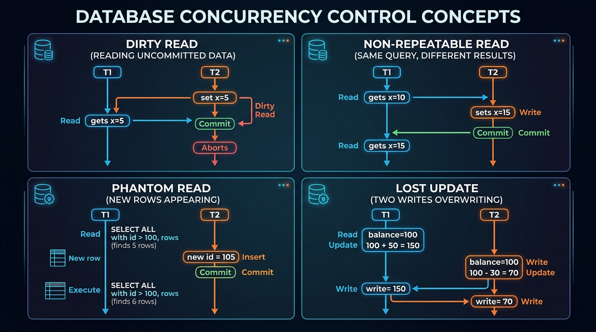

### The 4 Concurrency Anomalies

#### 1. Dirty Read ($G_1$ / Read Uncommitted Data)
* **What happens**: Transaction $T_1$ modifies a row. Transaction $T_2$ reads that uncommitted modified row. $T_1$ subsequently aborts/rolls back.
* **The Danger**: $T_2$ made business decisions or financial calculations based on data that legally never existed.
* **Example**:
  - $T_1$ updates Balance from $100 to $500.
  - $T_2$ reads Balance as $500 and approves a $400 withdrawal.
  - $T_1$ crashes and rolls back. Balance returns to $100, but $T_2$ already disbursed $400!

#### 2. Non-Repeatable Read ($G_{2a}$ / Inconsistent Reads within Same Transaction)
* **What happens**: Transaction $T_1$ reads a row. Transaction $T_2$ updates or deletes that row and **commits**. $T_1$ reads the exact same row again and observes modified values or finds it deleted.
* **The Danger**: Violates transactional read stability within a single transaction.

#### 3. Phantom Read ($A_3$ / Range Query Row Appearance)
* **What happens**: Transaction $T_1$ reads a set of rows satisfying a predicate range query (e.g., `WHERE age > 25`). Transaction $T_2$ inserts a **new row** satisfying the condition (e.g., a person with `age = 30`) and commits. $T_1$ re-executes the exact same query and observes a new "phantom" row that was absent earlier.
* **Key Distinction**: Non-repeatable read is on an *existing single row*; Phantom read is on a *predicate range query* where newly inserted rows appear.

#### 4. Lost Update
* **What happens**: Both $T_1$ and $T_2$ read the same record simultaneously ($Balance = 100$). $T_1$ adds 50 ($150$) and writes back. Meanwhile, $T_2$ subtracts 20 ($80$) and writes back, blindly overwriting $T_1$'s update without incorporating it.
* **Result**: $T_1$'s deposit of $50 is completely lost. Final Balance is $80 instead of $130.

---

### Lock Types & Lock Compatibility Matrix

To prevent data corruption, databases use locks on data items (rows, pages, or tables).

```
Shared Lock (S-Lock)    --> Multiple readers can hold simultaneously
Exclusive Lock (X-Lock) --> Exactly one writer can hold; blocks all readers & writers
```

#### Lock Compatibility Matrix
| Requested \ Current Lock Held | None | Shared (S) | Exclusive (X) |
|---|:---:|:---:|:---:|
| **Shared (S)** | ✅ Granted | ✅ Granted (Shared Reading) | ❌ Blocked (Must Wait) |
| **Exclusive (X)** | ✅ Granted | ❌ Blocked (Must Wait) | ❌ Blocked (Must Wait) |

---

### Two-Phase Locking (2PL), Strict 2PL & Rigorous 2PL

Two-Phase Locking (2PL) is a concurrency control protocol that **guarantees conflict serializability**.

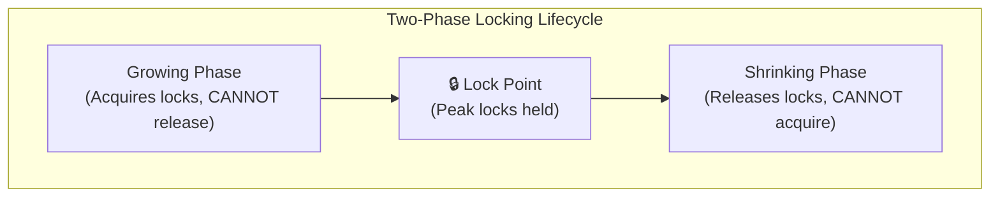

#### The 2 Phases:
1. **Growing Phase**: Transaction acquires all needed locks. No lock can be released.
2. **Shrinking Phase**: Transaction releases locks one by one. Once a single lock is released, **no new lock can ever be acquired**.

#### Variants of 2PL
* **Basic 2PL**: Guarantees serializability, but suffers from **cascading aborts** (if $T_1$ releases a lock in shrinking phase and later aborts, any $T_2$ that read its changes must also be aborted).
* **Strict 2PL (Industry Standard)**:
  - All **Exclusive (X) locks** must be held until the transaction explicitly **COMMITS or ABORTS**.
  - Shared (S) locks can be released during the shrinking phase.
  - **Benefit**: Completely prevents cascading rollbacks and dirty reads.
* **Rigorous 2PL**:
  - **Both Shared (S) and Exclusive (X) locks** are held until transaction commits or aborts.
  - Guarantees strict order of transactions (Commit-order serializability).

---

## 2. Isolation Levels in Practical Detail

### 💡 Quick Revision Anchor (2-3 Words): Consistency vs Concurrency

The SQL-92 standard defines 4 transaction isolation levels. Each level trades off performance/concurrency against data anomalies.

### ANSI SQL-92 Isolation Levels Matrix

| Isolation Level | Dirty Read ($G_1$) | Non-Repeatable Read ($G_{2a}$) | Phantom Read ($A_3$) | Lost Update | Default In |
|---|:---:|:---:|:---:|:---:|---|
| **Read Uncommitted** | ⚠️ Allowed | ⚠️ Allowed | ⚠️ Allowed | ⚠️ Allowed | Rarely used |
| **Read Committed** | 🛡️ **Prevented** | ⚠️ Allowed | ⚠️ Allowed | ⚠️ Allowed | PostgreSQL, Oracle, SQL Server |
| **Repeatable Read** | 🛡️ **Prevented** | 🛡️ **Prevented** | ⚠️ Allowed (Prevented in MySQL InnoDB via Next-Key Locks) | 🛡️ **Prevented** | MySQL InnoDB |
| **Serializable** | 🛡️ **Prevented** | 🛡️ **Prevented** | 🛡️ **Prevented** | 🛡️ **Prevented** | Most Strict |

### How Locking Relates to Isolation

1. **Read Uncommitted**: Reads data without acquiring any S-locks. Writes acquire X-locks. Reads never block writes; writes never block reads.
2. **Read Committed**:
   - Reads acquire **short-term Shared (S) locks** that are released *immediately after the statement finishes* (not held till transaction end).
   - Writes acquire **long-term Exclusive (X) locks** held until `COMMIT`.
   - *Why Non-Repeatable Read happens here*: Because the S-lock was released immediately after query 1, another transaction can modify the row before query 2 executes.
3. **Repeatable Read**:
   - Reads acquire **long-term Shared (S) locks** held until the **entire transaction completes**.
   - Writes acquire long-term Exclusive (X) locks held until transaction completes.
   - *Why Phantom Read can still happen*: Row-level S-locks lock existing rows, but do not prevent another transaction from inserting brand-new rows into the gaps between rows.
4. **Serializable**:
   - Uses **Index-Range Locks (Predicate Locking or Next-Key Locking)** to lock both existing rows and the gaps between rows. No transaction can insert or update rows matching the query range.

---

## 3. Deadlocks: Detection, Prevention & Recovery

### 💡 Quick Revision Anchor (2-3 Words): Circular Wait Resolution

A deadlock occurs when two or more transactions are waiting indefinitely for locks held by each other, creating a circular dependency where neither can proceed.

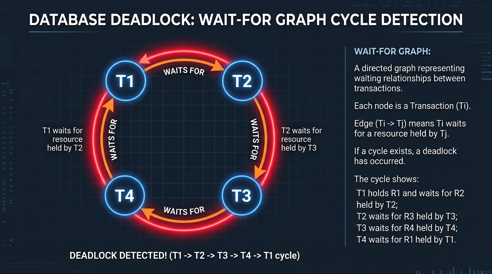

### The 4 Coffman Deadlock Conditions
1. **Mutual Exclusion**: Resources cannot be shared; locks are held exclusively.
2. **Hold and Wait**: A transaction holds at least one lock while requesting additional locks held by others.
3. **No Preemption**: Locks cannot be forcibly confiscated from a transaction; they must be released voluntarily.
4. **Circular Wait**: A closed chain of transactions exists where each waits for a resource held by the next.

---

### Wait-For Graph & Cycle Detection
* **Wait-For Graph ($G = (V, E)$)**:
  - **Vertices ($V$)**: Active transactions ($T_1, T_2, T_3$).
  - **Directed Edge ($T_1 \to T_2$)**: $T_1$ is blocked waiting for a lock held by $T_2$.
* **Cycle Detection**: The database background engine runs a background daemon thread (e.g., every 500ms or 1s) that scans the Wait-For Graph using Depth-First Search (DFS).
* **If a cycle is detected ($T_1 \to T_2 \to T_1$)**: A deadlock exists! The database must intervene and break the cycle.

---

### Deadlock Prevention: Wait-Die vs. Wound-Wait

Rather than detecting deadlocks after they happen, prevention schemes assign a unique, monotonically increasing **timestamp** $TS(T_i)$ to each transaction upon birth.
* Smaller timestamp = **Older transaction** (Higher priority).
* Larger timestamp = **Younger transaction** (Lower priority).

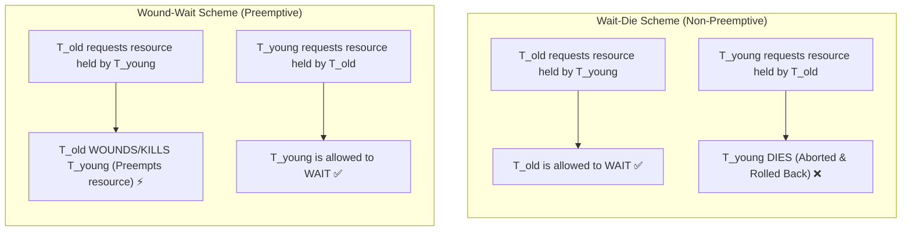

#### Comparison Matrix: Wait-Die vs. Wound-Wait
| Scenario | Wait-Die (Older Waits, Younger Dies) | Wound-Wait (Older Wounds, Younger Waits) |
|---|---|---|
| **Older requests lock held by Younger** | $T_{\text{old}}$ is allowed to **WAIT**. | $T_{\text{old}}$ **WOUNDS** (aborts & preempts) $T_{\text{young}}$. |
| **Younger requests lock held by Older** | $T_{\text{young}}$ **DIES** (aborts & rolls back). | $T_{\text{young}}$ is allowed to **WAIT**. |
| **Preemption Type** | Non-preemptive (Younger is never kicked out while holding a lock). | Preemptive (Older forcibly kicks out Younger). |
| **Starvation Behavior** | When a transaction aborts, it restarts with its **original timestamp**. Over time, it becomes the oldest and is guaranteed to complete without dying. | Minimal rollbacks; younger transactions wait quietly without frequent abortions. |

---

### Deadlock Recovery & Starvation Prevention

Once a cycle is detected, the engine must recover:
1. **Victim Selection**: Choose which transaction to terminate to minimize total cost:
   - How long has the transaction been running?
   - How many rows has it modified?
   - How many locks does it hold?
   - How much CPU/IO has it consumed?
2. **Rollback**:
   - **Total Rollback**: Abort transaction completely and undo all changes.
   - **Partial Rollback**: Roll back transaction only to the savepoint before it requested the deadlocked lock.
3. **Starvation Prevention**:
   - *Trap*: If the victim selection algorithm repeatedly picks the same lightweight transaction, that transaction will starve and never complete.
   - *Fix*: Count how many times a transaction has been aborted. If victim count exceeds a threshold, prioritize it or grant it an older timestamp.

---

## 4. Modern Concurrency Protocols & MVCC

### 💡 Quick Revision Anchor (2-3 Words): Readers Never Block Writers

While 2PL relies on locking, modern high-throughput databases (PostgreSQL, MySQL InnoDB, Oracle) rely on **Multi-Version Concurrency Control (MVCC)** to eliminate read/write lock contention.


### MVCC (Multi-Version Concurrency Control)

#### The Core Problem MVCC Solves:
In traditional lock-based systems:
- Reading rows requires Shared locks, which **blocks writers**.
- Writing rows requires Exclusive locks, which **blocks readers**.
Under high traffic, readers starve writers and writers starve readers.

#### The MVCC Insight:
> **"Readers never block writers, and writers never block readers."**

#### How MVCC Works Internally (PostgreSQL & InnoDB model):
1. **Tuples are Immutable & Versioned**:
   - When a row is updated, the database does **NOT** overwrite the existing row in place.
   - Instead, it marks the existing row with a deletion timestamp and inserts a brand-new physical row version (tuple).
2. **Metadata Headers on Every Row**:
   - `xmin` (PostgreSQL) / `DB_TRX_ID` (InnoDB): The transaction ID that inserted this version.
   - `xmax` / `DB_ROLL_PTR`: The transaction ID that deleted/updated this version (points to Undo Log in InnoDB).
3. **Read Visibility & Snapshot Isolation**:
   - When transaction $T$ begins, it takes an instant in-memory **Snapshot** of all currently active transaction IDs.
   - For any row read, $T$ checks:
     - Is `xmin` committed and was it born *before* my snapshot was taken? $\to$ **Visible**.
     - Is `xmax` present and committed *before* my snapshot was taken? $\to$ **Invisible (Treated as deleted)**.
     - Is `xmin` born *after* my snapshot or currently uncommitted? $\to$ **Invisible**.
4. **Vacuum / Purge Mechanics**:
   - Because updates create new row versions, old dead tuples accumulate (**bloat**).
   - A background process (**PostgreSQL `VACUUM`** or **InnoDB Undo Purge thread**) cleans up dead tuples that are no longer visible to any active transaction snapshot.

---

### Timestamp Ordering (Thomas Write Rule)
Each transaction is assigned a timestamp $TS(T)$ on start. Each data item $Q$ stores:
- $W\text{-timestamp}(Q)$: Largest timestamp of any transaction that successfully executed `write(Q)`.
- $R\text{-timestamp}(Q)$: Largest timestamp of any transaction that successfully executed `read(Q)`.

#### Thomas Write Rule (Optimization):
If transaction $T$ attempts to execute `write(Q)` and $TS(T) < W\text{-timestamp}(Q)$:
- In strict timestamp ordering, $T$ would be aborted.
- **Thomas Write Rule**: Simply **ignore the write** and proceed! Because an even younger transaction has already overwritten $Q$, $T$'s write is obsolete and safely discarded without violating conflict serializability.

---

### Optimistic Concurrency Control (OCC)
Best for read-heavy workloads with near-zero write conflicts:
1. **Read Phase**: Transaction reads data freely without locking, buffering all updates in local workspace memory.
2. **Validation Phase**: Before committing, the engine checks whether any data read by this transaction was modified by another transaction that committed during this time.
3. **Write Phase**: If validation passes, local buffer is flushed to disk. If validation fails, transaction is aborted and restarted.

---

## 5. Indexing Internals: B-Trees vs. B+ Trees

### 💡 Quick Revision Anchor (2-3 Words): Flat Disk-Friendly Balanced Tree

Databases store data on persistent disk (HDD/SSD), where random I/O latency is orders of magnitude slower than CPU memory.

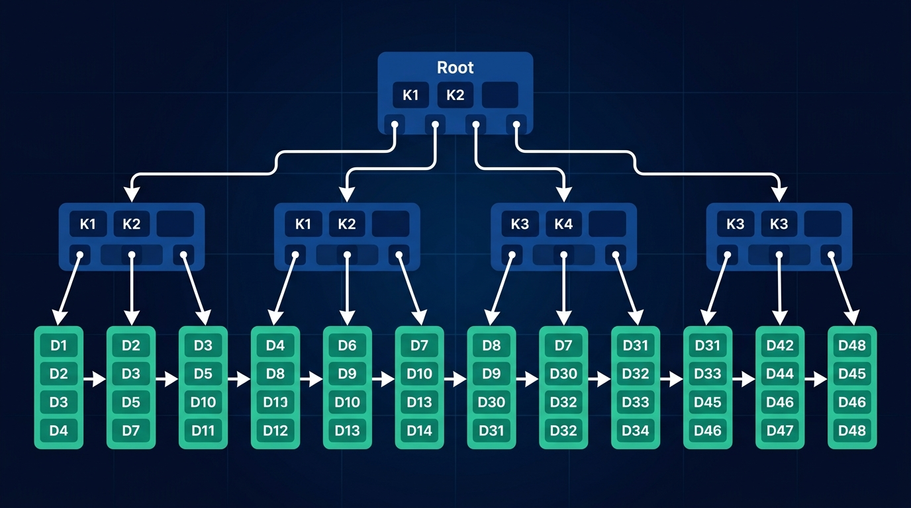

### Why B+ Trees Over Binary Trees & B-Trees

#### 1. Why Not Binary Search Trees (BST / AVL / Red-Black)?
- A Binary Search Tree has a fan-out of only $2$.
- For 10 million rows, tree depth is $\approx \log_2(10^7) \approx 24$.
- Traversing 24 levels requires **24 random disk I/O reads** ($\approx 24 \times 10\text{ms} = 240\text{ms}$ per lookup — unacceptable).

#### 2. Why B+ Trees Over Standard B-Trees?
In a standard B-Tree, both internal nodes and leaf nodes store full data records (keys + row data).
In a **B+ Tree**:
- **Internal Nodes store ONLY Keys + Child Page Pointers** (Zero row data).
- **Leaf Nodes store ALL Keys + Actual Data (or Row Pointers)**.
- **Leaves are linked in a Doubly Linked List** (`prev` / `next`).

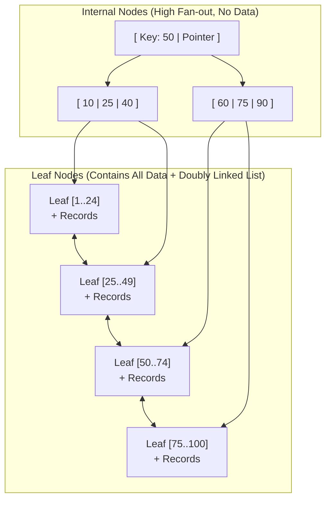

### Key Advantages of B+ Trees for Databases

1. **Massive Fan-out & Shallow Tree Height**:
   - Because internal nodes don't store row payloads, a single 8KB/16KB database page can store **1,000+ key-pointer pairs**.
   - With a fan-out of $B = 1,000$:
     - Level 1 (Root): $1,000$ entries
     - Level 2: $1,000 \times 1,000 = 1,000,000$ entries
     - Level 3: $1,000 \times 1,000,000 = 1,000,000,000$ (1 Billion rows!)
   - **Any record among 1 Billion rows is retrieved in at most 3 to 4 disk page reads!**
2. **Blazing Fast Range Scans ($\mathcal{O}(\log N + K)$)**:
   - For `WHERE age BETWEEN 20 AND 30`:
   - B-Tree: Requires expensive in-order tree traversal jumping up and down parent-child pointers across disk blocks.
   - B+ Tree: Traverses to leaf containing `20` ($\mathcal{O}(\log N)$), then simply **walks linearly along the linked leaf pointers** until `30` is reached ($\mathcal{O}(K)$ sequential scan).
3. **Predictable Query Latency**:
   - Every lookup traverses exactly to the leaf level, guaranteeing uniform $\mathcal{O}(\log N)$ retrieval time.

#### B-Tree vs. B+ Tree Architectural Comparison
| Architectural Dimension | B-Tree | B+ Tree (Database Standard) |
|---|---|---|
| **Data Storage Location** | Stored in both internal nodes and leaf nodes | Stored **strictly in leaf nodes** only |
| **Internal Node Payload** | Key + Child Pointer + Row Data | Key + Child Pointer (Ultra-lightweight) |
| **Fan-out per Page** | Lower (data consumes page space) | **Extremely High** (hundreds to thousands) |
| **Tree Height** | Taller for large datasets | **Ultra-Shallow** (typically 3 to 4 levels) |
| **Range Queries** | Inefficient (in-order tree traversal) | **Hyper-Efficient** (linear leaf linked list scan) |
| **Leaf Linking** | Leaves are isolated | Leaves linked via **Doubly Linked List** |

---

## 6. Database Storage Engine & Buffer Pool Architecture

### 💡 Quick Revision Anchor (2-3 Words): Cached Block Management

### Why Databases Organize Data into Pages
Operating system disks and file systems perform physical I/O at the granularity of **blocks/pages** (typically 4KB, 8KB in PostgreSQL, or 16KB in MySQL InnoDB).
- A database **never reads or writes a single byte or single row directly from disk**.
- When row #42 is queried, the storage engine reads the **entire 8KB page containing row #42** into RAM.

---

### Slotted Page Record Layout
Because rows can be variable-length (e.g., `VARCHAR`, `TEXT`), fixed-offset arrays on disk don't work. Modern engines use the **Slotted Page Architecture**:

```
+----------------------------------------------------------------------+
| Page Header | Slot 1 Offset | Slot 2 Offset | ...                    |
| (Page LSN,  | (points to    | (points to                             |
|  free space)|  Record 1)    |  Record 2)                             |
+-------------+---------------+----------------------------------------+
|                      <---- FREE SPACE ---->                          |
+----------------------------------------------------------------------+
| ... | Record 2 Content (variable) | Record 1 Content (variable)      |
+----------------------------------------------------------------------+
```
- **Slot Directory** grows from **left to right** (top of page).
- **Actual Records** are appended from **right to left** (bottom of page).
- **Free Space** is the gap between them.
- A Row ID (`TID` / `RID`) is simply: `(PageNumber, SlotNumber)`.

---

### Buffer Pool Manager

RAM is $\approx 100,000 \times$ faster than physical disk. The database allocates a dedicated memory cache called the **Buffer Pool**.

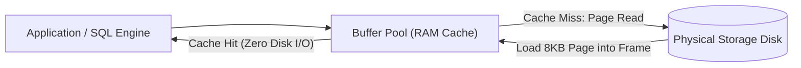

#### Key Buffer Pool Concepts:
1. **Frame**: An in-memory slot that holds exactly one on-disk page.
2. **Page Table**: Hash map mapping `PageID -> FrameID`.
3. **Dirty Page**: A page in RAM that has been updated by transactions but has **not yet been flushed to disk**.
4. **Pin Count (Reference Count)**: Tracks how many active queries are currently reading that memory page. A pinned page (`pin_count > 0`) **cannot be evicted**.
5. **Buffer Eviction Policies**:
   - When the Buffer Pool is full and a new page must be loaded, a victim page must be evicted.
   - **LRU (Least Recently Used)** / **Clock Sweep Algorithm** picks cold, unpinned pages.
   - If the evicted page is *dirty*, it must be flushed to disk before being replaced.

---

## 7. Query Execution & Optimizer Internals

### 💡 Quick Revision Anchor (2-3 Words): Cost-Based Execution Plan

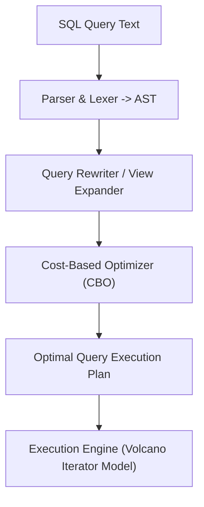

### Scan Types

1. **Sequential Scan (Full Table Scan / Seq Scan)**:
   - Reads every page of the table from disk from start to finish.
   - Ideal when: Table is tiny, or query retrieves $>20-30\%$ of all rows.
2. **Index Scan**:
   - Traverses the B+ Tree index to find row pointers (`PageID, SlotID`), then fetches the actual rows from the heap table pages.
   - Ideal when: Query is highly selective ($<5\%$ of rows).
3. **Index-Only Scan (Covering Index)**:
   - All columns requested in `SELECT` and `WHERE` are already stored inside the index itself.
   - **The database never touches the physical table heap pages at all!** Extremely fast.

---

### Why an Optimizer Might Ignore an Index
Interviewers love asking: *"I created an index on a column, but EXPLAIN shows Postgres is still doing a full table scan! Why?"*

1. **Low Selectivity (High Cardinality of Matches)**:
   - If a table has 1,000,000 employees and 400,000 have `department = 'Engineering'` ($40\%$), using the index would cause 400,000 random I/O seek operations. Sequential scan with bulk sequential I/O is dramatically faster.
2. **Tiny Table**:
   - If the entire table fits within 1 or 2 pages, reading the index page + the table page takes more I/O operations than scanning the table directly.
3. **Function Wrapped Around Column**:
   - `WHERE UPPER(email) = 'ALICE@EXAMPLE.COM'`: The B+ tree index is built on `email`, not `UPPER(email)`. The optimizer cannot use the standard B+ tree without an explicit expression/functional index.
4. **Leading Wildcard LIKE Clause**:
   - `WHERE name LIKE '%smith'`: B+ trees sort lexicographically from the beginning. A leading `%` prevents binary search routing down the tree.
5. **Data Type Mismatch (Implicit Casting)**:
   - Querying a `VARCHAR` column with an unquoted integer `WHERE phone = 9902634351` forces the database to apply `CAST(phone AS integer)` to every single row, invalidating the index.

---

## 8. Transaction Logging & Crash Recovery (WAL & Checkpoints)

### 💡 Quick Revision Anchor (2-3 Words): Log Before Disk Flush

To achieve ACID Durability without incurring the catastrophic latency penalty of writing full 8KB table pages to disk on every commit, databases use **Write-Ahead Logging (WAL)**.

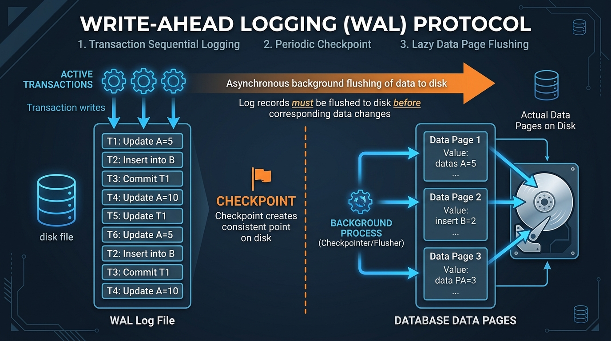

### Write-Ahead Logging (WAL) Protocol

> **The Fundamental WAL Rule**:
> **Log records representing a database update must hit persistent disk storage BEFORE the corresponding dirty table pages are allowed to be written to disk.**

#### Why WAL is Needed:
- Flushing an entire 8KB table page for a 4-byte balance change is slow and creates random I/O.
- WAL writes are **purely sequential append-only writes**, maximizing disk write throughput ($100\times$ faster than random page writes).
- When a transaction runs `COMMIT`, the database only flushes the **lightweight sequential WAL log buffer** to disk. The heavy table pages can stay dirty in RAM!

---

### Checkpoints: Why Needed
Without checkpoints, the WAL log would grow infinitely. After a server crash, recovery would have to replay months of log records from the dawn of time.

#### Checkpoint Mechanics:
1. Periodically (e.g., every 5 minutes or when WAL reaches 1GB), the engine triggers a **Checkpoint**.
2. All dirty buffer pages currently in RAM are written to disk.
3. A special `CHECKPOINT` record is written to the WAL with the Log Sequence Number (LSN).
4. **The Benefit**: During crash recovery, the database knows that all updates prior to the checkpoint are already safely preserved on disk. It only needs to replay logs written **after** the checkpoint!

---

### ARIES Crash Recovery (3 Phases)

Modern enterprise engines (Postgres, MySQL, DB2) follow the **ARIES** recovery algorithm:

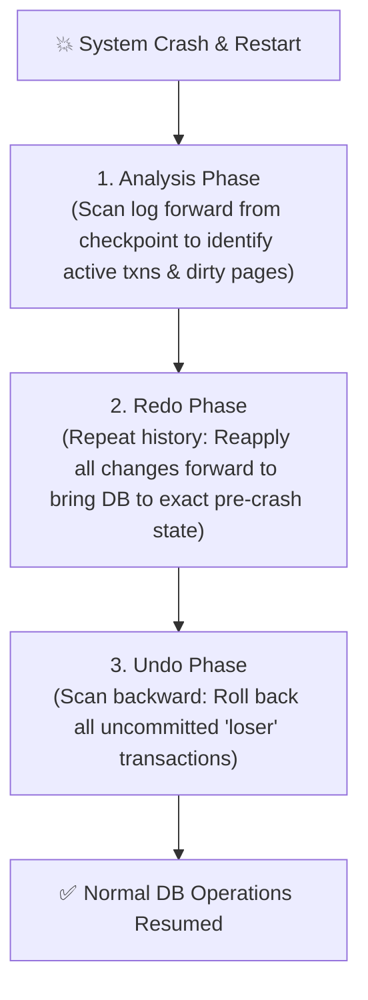

1. **Analysis Phase**: Scans WAL forward starting from the last checkpoint to identify:
   - Which transactions were active at the moment of crash (**Loser transactions**).
   - Which pages in the buffer pool were dirty.
2. **Redo Phase (Repeating History)**:
   - Scans forward from the earliest dirty page LSN and re-applies all logged updates (even for transactions that eventually aborted) to restore the exact physical memory state right before crash.
3. **Undo Phase**:
   - Scans backward and rolls back all operations executed by the **loser transactions** that never committed, restoring atomicity.

---

## 9. Database Anomalies & Functional Dependency Reasoning

### 💡 Quick Revision Anchor (2-3 Words): Decompose Without Data Loss

### Database Anomalies
Consider an unnormalized table: `Employee_Department(emp_id, emp_name, dept_id, dept_name, dept_head)`

| emp_id | emp_name | dept_id | dept_name | dept_head |
|---|---|---|---|---|
| E101 | Alice | D01 | Engineering | Bob |
| E102 | Charlie | D01 | Engineering | Bob |

1. **Insertion Anomaly**: Cannot record a newly created department (`D05`, "Research") until we hire at least one employee into it, because `emp_id` is part of the primary key and cannot be `NULL`.
2. **Update Anomaly**: If the head of Engineering changes from Bob to Dave, we must update multiple rows. If one row update fails, the database has inconsistent data.
3. **Deletion Anomaly**: If employee E102 leaves, and then E101 is deleted, the entire record of the Engineering department's existence is permanently wiped from the company.

---

### Attribute Closure ($X^+$) & Finding Candidate Keys

The **closure** of an attribute set $X$ under a set of Functional Dependencies $F$, denoted $X^+$, is the complete set of attributes that can be functionally determined by $X$.

#### Algorithm to Find Attribute Closure $X^+$:
1. Initialize $\text{Result} = X$.
2. Repeatedly inspect each functional dependency $A \to B$ in $F$:
   - If $A \subseteq \text{Result}$, then add $B$ to $\text{Result}$: $\text{Result} = \text{Result} \cup B$.
3. Repeat until $\text{Result}$ no longer expands.

#### Example Walkthrough:
Given Relation $R(A, B, C, D, E)$ and FDs:
- $F_1: A \to B$
- $F_2: B \to C$
- $F_3: C \to D$
- $F_4: D \to E$

**Calculate $(A)^+$**:
- Step 1: $(A)^+ = \{A\}$
- Using $A \to B \implies (A)^+ = \{A, B\}$
- Using $B \to C \implies (A)^+ = \{A, B, C\}$
- Using $C \to D \implies (A)^+ = \{A, B, C, D\}$
- Using $D \to E \implies (A)^+ = \{A, B, C, D, E\}$
- **Result**: $(A)^+ = \{A, B, C, D, E\}$. Since $(A)^+$ derives all attributes of $R$, **$A$ is a Candidate Key!**

---

### Lossless Join Decomposition & Dependency Preservation

When decomposing relation $R$ into $R_1$ and $R_2$:

#### 1. Lossless Join Test (Non-Additive Join):
A decomposition is strictly **lossless** if and only if the common attributes functionally determine at least one of the decomposed relations:
$$\mathbf{(R_1 \cap R_2) \to R_1} \quad \text{OR} \quad \mathbf{(R_1 \cap R_2) \to R_2}$$
*(The shared attribute must be a Candidate Key in $R_1$ or $R_2$)*.

#### 2. Dependency Preservation Test:
A decomposition preserves dependencies if the union of FDs on $R_1$ and $R_2$ covers all original FDs in $R$:
$$(F_1 \cup F_2)^+ = F^+$$
*Placement Note*: 3NF is guaranteed to achieve **both** Lossless Join and Dependency Preservation. BCNF guarantees Lossless Join, but *cannot always preserve functional dependencies*.

---

## 10. Database Replication & High Availability

### 💡 Quick Revision Anchor (2-3 Words): Leader to Follower Sync

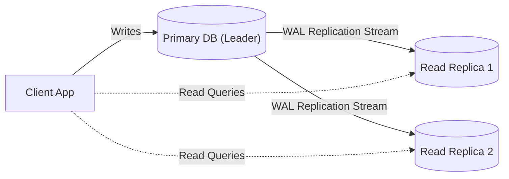

### Synchronous vs. Asynchronous Replication

| Dimension | Synchronous Replication | Asynchronous Replication |
|---|---|---|
| **Write Ack Rule** | Primary waits until replica confirms write | Primary commits & returns to client immediately |
| **Data Loss on Primary Crash** | **Zero Data Loss** ($RPO = 0$) | Risk of losing un-replicated commits |
| **Write Latency** | High (bounded by slowest replica network round-trip) | **Ultra-low latency** |
| **Replica Outage Impact** | Primary write hangs/blocks if replica dies | Primary continues writing uninterrupted |
| **Industry Practice** | Financial transactions (or Semi-sync: 1 sync + N async) | Standard web applications / analytics |

---

### Replication Lag & Read-Your-Own-Writes Consistency
Under asynchronous replication, replicas receive changes with a slight delay (**Replication Lag**).

#### The "Invisible Profile Update" Trap:
1. User updates profile name from "Alice" to "Alice Smith" (Written to Primary).
2. Page refreshes; client issues a read request routed to Read Replica 2.
3. Replica 2 hasn't received the WAL stream yet (200ms lag).
4. Page displays "Alice"! User complains the update didn't work.

#### The Solution: Read-Your-Own-Writes Consistency:
- For 5 seconds after a user performs a write, route all subsequent read queries for that user strictly to the **Primary database**.
- Route all generic public reads (e.g., browse product catalog) to the Read Replicas.

---

### Failover & Split-Brain Mitigation
When the Primary dies, an election elevates a replica to become the new Primary.
- **Split-Brain Disaster**: If network partitions, and both the old primary and new primary believe they are the leader, both accept writes simultaneously, resulting in irreversible conflicting state.
- **Mitigation**: **Quorum consensus** (e.g., Raft/Paxos algorithms requiring $\lfloor N/2 \rfloor + 1$ votes before a node is permitted to accept writes).

---

## 11. Distributed Transactions & Two-Phase Commit (2PC)

### 💡 Quick Revision Anchor (2-3 Words): Atomic Distributed Agreement

In microservice and sharded database architectures, a single business transaction often spans across multiple separate database instances.


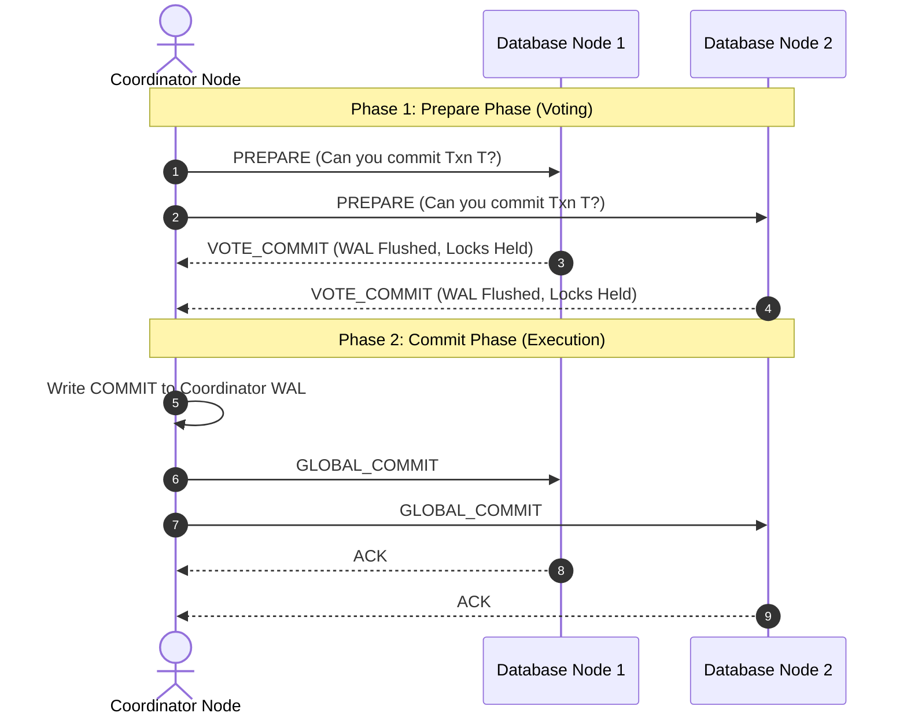

### Two-Phase Commit (2PC) Protocol

#### Phase 1: Prepare Phase (Voting)
1. Coordinator assigns a global transaction ID.
2. Sends `PREPARE` request to all participating nodes.
3. Each participant:
   - Executes transaction locally up to commit point.
   - Writes undo/redo records to local WAL.
   - Holds all required locks.
   - Replies `VOTE_COMMIT` or `VOTE_ABORT`.

#### Phase 2: Commit Phase (Decision)
- **If ALL participants voted `VOTE_COMMIT`**:
  - Coordinator writes `COMMIT` to its local WAL.
  - Sends `GLOBAL_COMMIT` message to all nodes.
  - Participants commit locally, release locks, and return `ACK`.
- **If ANY participant voted `VOTE_ABORT` (or timed out)**:
  - Coordinator writes `ABORT` to its WAL.
  - Sends `GLOBAL_ABORT` to all nodes.
  - Participants roll back and release locks.

#### Critical Flaws of 2PC (Why Modern Systems Avoid It):
1. **Blocking Protocol**: If the coordinator crashes *after* participants voted `YES` but before `GLOBAL_COMMIT` was sent, all participants are left in limbo, holding database locks indefinitely!
2. **High Latency Overhead**: Requires multiple network round-trips and disk sync flushes.
3. **Alternative**: Sagas (Choreography / Orchestration with compensating transactions).

---

### CAP Theorem in Real Database Systems
A distributed system can guarantee at most **two out of three**:

$$\mathbf{C} \text{ (Consistency)} \quad + \quad \mathbf{A} \text{ (Availability)} \quad + \quad \mathbf{P} \text{ (Partition Tolerance)}$$

Because physical networks will *always* experience hardware/network cable cuts and latency partitions ($P$ is mandatory):
- **CP Systems (e.g., PostgreSQL primary-secondary, HBase, Zookeeper)**: During network partition, reject writes on disconnected nodes to guarantee strict single-truth consistency.
- **AP Systems (e.g., Cassandra, DynamoDB, Couchbase)**: During partition, continue accepting writes on all nodes. Data will become eventually consistent once the partition heals.

---

## 12. Database Security & SQL Injection Prevention

### 💡 Quick Revision Anchor (2-3 Words): Parameterized Query Trees

### Authentication vs. Authorization & RBAC
- **Authentication**: Proving *who you are* (Username, password hash via `SCRAM-SHA-256`, TLS client certificates).
- **Authorization**: Proving *what you are permitted to do* (Role-Based Access Control).

```sql
-- Principle of Least Privilege: Never connect app using 'postgres' or 'root' superuser
CREATE ROLE app_user WITH LOGIN PASSWORD 'secure_random_pwd';

-- Grant minimal permissions
GRANT CONNECT ON DATABASE production TO app_user;
GRANT USAGE ON SCHEMA public TO app_user;
GRANT SELECT, INSERT, UPDATE ON TABLE orders, customers TO app_user;

-- Strictly revoke dangerous privileges
REVOKE DROP, TRUNCATE ON ALL TABLES IN SCHEMA public FROM app_user;
```

---

### SQL Injection Under the Hood (AST Poisoning)

Consider a vulnerable dynamic string concatenation:
```java
// ❌ VULNERABLE CODE
String query = "SELECT * FROM users WHERE user = '" + inputUser + "' AND pass = '" + inputPass + "'";
```

If attacker provides: `inputUser = admin' --`:
The SQL becomes:
```sql
SELECT * FROM users WHERE user = 'admin' --' AND pass = '...'
```
`--` comments out the password check. The attacker logs in as `admin`.

#### How Prepared Statements (Parameterized Queries) Physically Prevent SQL Injection:
1. **Compilation Phase**: When using `PreparedStatement`, the SQL text `SELECT * FROM users WHERE user = ? AND pass = ?` is sent to the database parser **first**.
2. **Abstract Syntax Tree (AST) is Frozen**: The database builds and freezes the AST query execution structure.
3. **Data Binding Phase**: The parameters (`admin' --`) are transmitted over the wire in a separate protocol packet.
4. **Result**: The database treats the input strictly as a **literal string value**, never as executable SQL tokens. Even if the parameter contains single quotes, semicolons, or `--`, the frozen syntax tree cannot be altered!

---

## 13. ⚡ 30-Second Rapid Recall Matrix

| Concept / Trap | 🧠 2-3 Word Memory Hook | What to Speak in the Technical Interview |
|---|---|---|
| **Dirty Read** | Read Uncommitted Rollback | Reading data modified by an uncommitted transaction that later aborts. |
| **Non-Repeatable Read** | Row Value Changed | Reading the same row twice inside a transaction and getting different column values. |
| **Phantom Read** | Range Rows Appeared | Running the same range query twice and finding newly inserted matching rows. |
| **Lost Update** | Overwrite Unread Change | Two transactions update the same row simultaneously; one overwrites the other. |
| **2PL (Two-Phase Locking)** | Grow Then Shrink | Acquires locks in growing phase; cannot acquire any lock once shrinking starts. |
| **Strict 2PL** | Hold X-Locks Till Commit | Holds all Exclusive locks until commit/abort to prevent cascading rollbacks. |
| **Wait-Die Scheme** | Older Waits, Younger Dies | Non-preemptive deadlock prevention where younger transactions die on conflict. |
| **Wound-Wait Scheme** | Older Preempts, Younger Waits | Preemptive deadlock prevention where older transactions forcibly kick out younger ones. |
| **MVCC** | Readers Don't Block Writers | Stores immutable versioned tuples with `xmin`/`xmax` to provide snapshot isolation. |
| **B+ Tree Leaf Links** | Sequential Range Traversal | Leaves form a doubly linked list, enabling $\mathcal{O}(\log N + K)$ range queries. |
| **Slotted Page** | Left Slots, Right Records | Page directory grows right; variable-length row records append left. |
| **Buffer Pool** | In-Memory Page Cache | Caches 8KB disk pages in RAM frames; tracks dirty pages and pin counts. |
| **WAL Protocol** | Log Before Page Flush | Log records must hit disk before dirty buffer pages are allowed to flush. |
| **Checkpoint** | Bounds Crash Recovery Time | Periodically flushes all dirty pages to disk so crash replay starts from checkpoint. |
| **Lossless Join** | Shared Must Be Key | Decomposition is lossless if $R_1 \cap R_2$ is a candidate key of $R_1$ or $R_2$. |
| **Two-Phase Commit** | Prepare Vote, Global Decision | Distributed transaction protocol; blocking if coordinator dies during phase 2. |
| **Prepared Statement** | Freezes Query AST | Separates SQL syntax tree compilation from data parameter binding to kill SQL injection. |

---
[⬆ Back to Top](#📑-table-of-contents)
