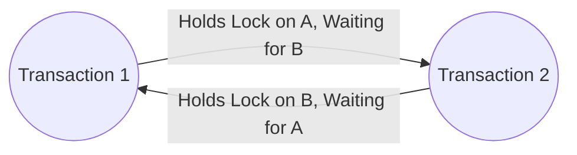
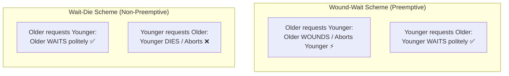
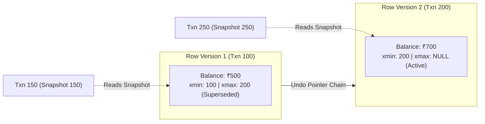
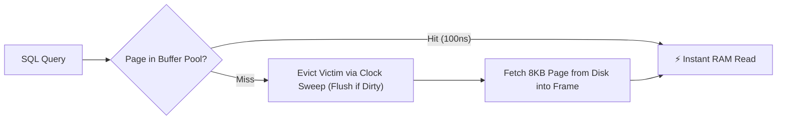
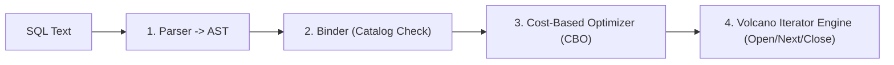
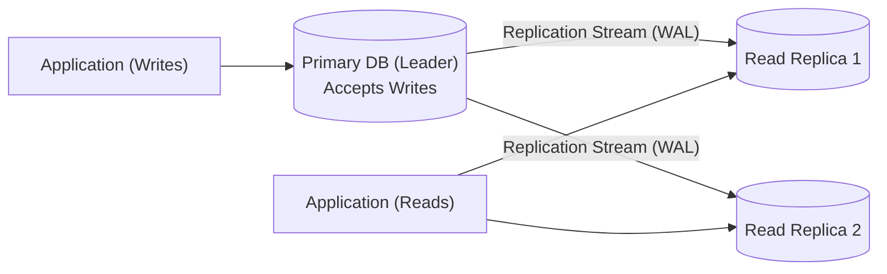
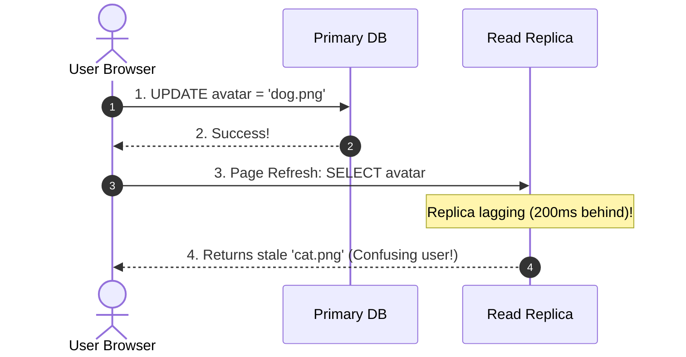
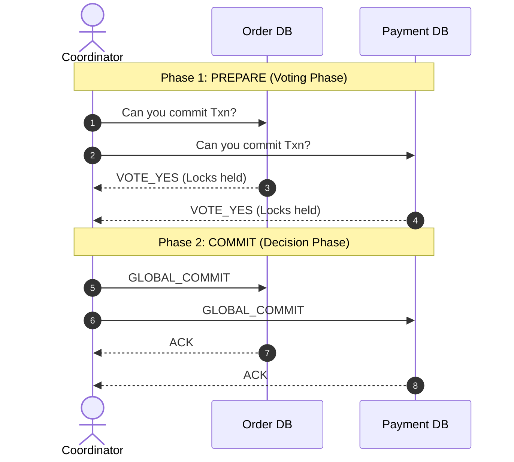
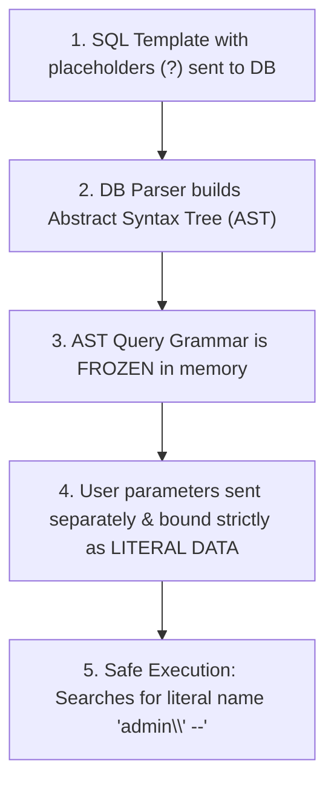

# 🗄️ Database Management Systems (DBMS) — Advanced Concepts & Placement Guide

> **Target Audience**: SDE / Backend Engineering Candidates  
> **Key Focus**: Core Mechanics, Storage Engines, Deadlocks, Query Optimization, Normalization, Replication, and Distributed Transactions.  
> **Structure**: Intuitive Real-World Analogies + Execution Flows (Mermaid 12.0) + Worked Numerical Traces + "What to Speak in the Interview" Answers.

> 📘 **Note on Transactions & Concurrency Control**:  
> Core transaction fundamentals, ACID properties, schedule serializability, 2PL locking protocols, ANSI isolation levels, and crash recovery (WAL/ARIES) are documented in full depth in [Transactions & Concurrency Control Master Guide](file:///c:/Users/rohit/Desktop/study/projects/notes-main/02-DBMS/Transactions-and-Concurrency-Control.md).  
> This guide focuses strictly on **advanced engine architecture, deadlocks, MVCC, B+ tree storage, query optimization, normalization, replication, and distributed 2PC**.

---

## 📑 Table of Contents
1. [Deadlocks: Detection, Prevention (Wait-Die vs. Wound-Wait) & Recovery](#1-deadlocks-detection-prevention-wait-die-vs-wound-wait--recovery)
2. [Modern Concurrency Protocols: MVCC & OCC](#2-modern-concurrency-protocols-mvcc--occ)
3. [Indexing Internals: B-Trees vs. B+ Trees](#3-indexing-internals-b-trees-vs-b-trees)
4. [Database Storage Engine & Buffer Pool Architecture](#4-database-storage-engine--buffer-pool-architecture)
5. [Query Execution & Optimizer Internals](#5-query-execution--optimizer-internals)
6. [Database Schema Anomalies, Attribute Closure ($X^+$) & Normalization](#6-database-schema-anomalies-attribute-closure-x--normalization)
7. [Database Replication & High Availability](#7-database-replication--high-availability)
8. [Distributed Transactions & Two-Phase Commit (2PC)](#8-distributed-transactions--two-phase-commit-2pc)
9. [Database Security & SQL Injection (AST Freezing)](#9-database-security--sql-injection-ast-freezing)
10. [⚡ Master 30-Second Rapid Recall & Placement Matrix](#10--master-30-second-rapid-recall--placement-matrix)

---

## 1. Deadlocks: Detection, Prevention (Wait-Die vs. Wound-Wait) & Recovery

> 💡 **Quick Revision Anchor**: Mutual circular waiting resolved via background graph cycle checks or timestamp seniority.

### The 4 Coffman Deadlock Conditions
A deadlock can occur if and only if all 4 conditions hold simultaneously:
1. **Mutual Exclusion**: Resources cannot be shared concurrently.
2. **Hold and Wait**: A transaction holds at least one lock while waiting to acquire another.
3. **No Preemption**: Locks cannot be forcibly confiscated; they must be released voluntarily.
4. **Circular Wait**: A closed chain of transactions where each waits for a lock held by the next ($T_1 \to T_2 \to T_1$).



- **Deadlock Detection (Wait-For Graph)**: The DBMS engine runs a background daemon (every 500ms–1s). It constructs a directed Wait-For Graph (Nodes = Transactions, Edges = "Waiting for lock held by") and executes a Cycle Detection algorithm (DFS). If a cycle is detected, the engine aborts a **victim transaction** to break the cycle.

---

### Deadlock Prevention: Wait-Die vs. Wound-Wait (The Seniority Model)

Instead of letting deadlocks form, databases assign a unique monotonic birth timestamp $TS(T_i)$ to each transaction:
- **Smaller Timestamp = Older Transaction (Senior Citizen)**.
- **Larger Timestamp = Younger Transaction (Junior Rookie)**.

| Scheme | Type | When Older Wants Lock Held by Younger | When Younger Wants Lock Held by Older | Mental Anchor |
| :--- | :--- | :--- | :--- | :--- |
| **Wait-Die** | Non-preemptive | Older is allowed to **WAIT** ✅ | Younger **DIES** (Aborted & rolled back) ❌ | Older waits politely; younger dies immediately on conflict. |
| **Wound-Wait** | Preemptive | Older **WOUNDS / KILLS** Younger ⚡ | Younger is allowed to **WAIT** ✅ | Older has seniority privilege to preempt; younger waits politely. |



#### Deadlock Recovery & Starvation Prevention
- **Victim Selection**: The engine picks the victim based on lowest rollback cost (fewest updates completed, least CPU time consumed).
- **Starvation Trap**: If the same transaction is repeatedly selected as the victim, it starves. To prevent this, **the engine retains the transaction's original birth timestamp upon restart**, gradually making it the oldest transaction until it executes with priority.

---

## 2. Modern Concurrency Protocols: MVCC & OCC

> 💡 **Quick Revision Anchor**: Readers never block writers, and writers never block readers.

### Multi-Version Concurrency Control (MVCC)
Traditional lock-based concurrency forces readers to wait for writers, and writers to wait for readers. Under high web traffic, this causes catastrophic queueing.
Modern engines (**PostgreSQL, MySQL InnoDB, Oracle**) solve this using **MVCC**:
- When a transaction begins, the database gives it an instant **virtual snapshot (photo)** of data as it existed at that exact moment.
- When an `UPDATE` happens, the engine **does not overwrite the old row in place**. Instead, it writes a brand-new version of the row with updated metadata tags:
  - **`xmin`** (or `DB_TRX_ID`): The transaction ID that inserted this version.
  - **`xmax`** (or `DB_ROLL_PTR`): The transaction ID that deleted or superseded this version.
- **The Result**: Readers read their snapshot version without holding locks; writers append new versions without blocking readers!



- **Vacuum / Undo Purge**: A background daemon (Vacuum in Postgres, Purge Thread in InnoDB) reclaims disk space by physically garbage-collecting dead row versions once no active transaction's snapshot needs them.

---

### Optimistic Concurrency Control (OCC)
Ideal for low-contention environments (like Wikipedia edits or social feeds) across 3 phases:
1. **Read Phase**: Read freely without locks; stage changes in private memory.
2. **Validation Phase**: Check if any records read were modified by another committed transaction.
3. **Write Phase**: If validation passes, commit to disk; if validation fails, abort and retry.

---

## 3. Indexing Internals: B-Trees vs. B+ Trees

> 💡 **Quick Revision Anchor**: Minimizing disk page reads; B+ Tree stores data only in leaves and links them horizontally for range queries.

### The Physical Bottleneck: Why Not Binary Trees?
- RAM access takes $\approx 100\text{ns}$; Disk page reads take $\approx 1\text{ms} - 10\text{ms}$ (roughly **100,000 times slower**!).
- In a balanced Binary Search Tree (AVL / Red-Black Tree), each node has 2 children. For $10^7$ rows, tree height is $\approx \log_2(10^7) \approx 24$. Fetching a record requires **24 random disk seeks** ($\approx 240\text{ms}$), which is unacceptably slow.
- **Multi-Way Search Trees**: Scale fan-out so each node fits an entire 8KB/16KB page, holding hundreds of keys per node. Height drops to 3–4 levels.

---

### B-Tree vs. B+ Tree Architecture

<p align="center">
  
  &nbsp;&nbsp;&nbsp;&nbsp;
  
</p>

#### B-Tree Architecture (Left Diagram):
- **Core Rule**: Both keys AND actual data records (or data pointers) are stored inside **all nodes** (root, internal, and leaves).
- **Flaw 1 (Low Fan-Out)**: Because an 8KB disk page must hold bulky row data alongside each key, fewer keys fit inside one node. Lower fan-out forces the tree to grow **taller**, requiring **more disk reads**.
- **Flaw 2 (Erratic Range Queries)**: To query `WHERE id BETWEEN 3 AND 6`, the engine must visit leaf 3, jump up to root 4, jump down to leaf 5, and jump up to internal node 6. In-order tree traversal causes heavy random disk I/O.

#### B+ Tree Architecture (Right Diagram — Production Standard):
- **Separation of Concerns**:
  - **Internal Nodes**: Store **only search keys and tree pointers** (traffic road signs). Zero actual row data.
  - **Leaf Nodes**: Store **all actual data records / data pointers**.
- **Massive Fan-Out**: Because internal nodes don't store row data, an 8KB page can fit $1,000+$ key-pointer pairs.
  - Level 1 (Root): $1,000$ entries
  - Level 2: $1,000 \times 1,000 = 1,000,000$ entries
  - Level 3 (Leaves): $1,000^3 = \mathbf{1,000,000,000}$ (**1 Billion rows retrieved in just 3 disk page reads!**)
- **Horizontal Leaf Chain ($P_{\text{next}}$)**: Leaf nodes are linked together in a continuous **Linked List**. Range queries simply traverse down to the starting key once, then walk horizontally along $P_{\text{next}}$ pointers with zero jumps back up to parent nodes.

| Feature | B-Tree | B+ Tree (Database Standard) |
| :--- | :--- | :--- |
| **Where is Data Stored?** | In **all nodes** (root, internal, leaf) | **Leaf nodes only** |
| **Internal Node Contents** | Keys + Row Data + Child Pointers | **Keys + Child Pointers only** (road signs) |
| **Fan-Out (Keys/Page)** | **Lower** (data eats up page space) | **Massive** (1,000+ keys per page) |
| **Tree Height** | Taller | **Ultra-Flat** (3–4 levels for billions of rows) |
| **Range Queries (`BETWEEN`)**| **Slow & erratic** (in-order tree traversal jumps) | **Blazing fast** (linear scan along $P_{\text{next}}$ leaf chain) |
| **Search Predictability** | Variable ($\mathcal{O}(1)$ for root, $\mathcal{O}(\log N)$ for leaf) | **Uniform $\mathcal{O}(\log N)$** (always travels to leaf) |

---

### Clustered vs. Non-Clustered (Secondary) Indexes
- **Clustered Index**: The physical order of rows on disk matches the index order (e.g., Primary Key in MySQL InnoDB). A table can have **only one** clustered index. The leaf node contains the actual row columns.
- **Non-Clustered (Secondary) Index**: A separate auxiliary B+ Tree where leaf nodes store the secondary key and a pointer to the clustered primary key.
  - **Double Lookup Trap (InnoDB)**: Looking up by email `WHERE email = 'alice@gmail.com'` traverses the secondary index to find the primary key ID, then performs a second traversal on the Clustered Index to retrieve full row data.
  - **Covering Index Optimization**: If a query selects only columns present in the secondary index (`SELECT id, email FROM users WHERE email = '...'`), the engine never accesses the clustered table pages!

---

## 4. Database Storage Engine & Buffer Pool Architecture

> 💡 **Quick Revision Anchor**: 8KB Slotted Page Architecture (TID pointers) + Buffer Pool with Clock Sweep eviction.

### The "Desk vs. 5-Mile Warehouse" Mental Model
- **RAM (Buffer Pool)**: Your office desk ($\approx 100\text{ns}$ access time).
- **Disk (Physical Storage)**: A warehouse 5 miles away ($\approx 10\text{ms}$ access time, $100,000\times$ slower).
- **Golden Rule**: Databases never read or write a single byte directly to disk. Disks read and write in fixed-size blocks called **Pages** (8KB in Postgres, 16KB in MySQL InnoDB). Querying 1 row fetches the entire 8KB page into RAM.

---

### Inside a Page: Slotted Page Architecture
Fixed-offset arrays don't work because rows contain variable-length strings (`VARCHAR`, `TEXT`). Modern engines use **Slotted Pages**:

```
+-----------------------------------------------------------------------------------+
|  PAGE HEADER  | Slot 0 (Offset 950) | Slot 1 (Offset 800) | Slot 2 (Offset 620)   |
| (LSN, counts) | ========> GROWS DOWNWARDS (Left to Right) =======>               |
+---------------+-------------------------------------------------------------------+
|                               <--- FREE SPACE GAP --->                            |
+-----------------------------------------------------------------------------------+
| <======= APPENDED UPWARDS (Right to Left) <=======================================|
|  Record 2 (Variable)      | Record 1 (Variable)       | Record 0 (Variable)       |
+-----------------------------------------------------------------------------------+
```
- **Slot Directory**: Located at the top of the page; grows downwards (left to right). Stores tiny byte offset pointers to row records.
- **Tuples (Rows)**: Appended from the bottom of the page; grow upwards (right to left).
- **TID / Row ID**: Physical record address is simply `(PageNumber, SlotNumber)`. Even if rows are shifted during defragmentation, external indexes pointing to `Slot 1` never break!

---

### Buffer Pool Management & Clock Sweep Eviction



#### 4 Crucial Buffer Pool Concepts:
1. **Frame**: An in-memory memory slot sized to hold exactly one 8KB page.
2. **Page Table**: Hash map mapping on-disk `PageID -> FrameID`.
3. **Dirty Page**: A page modified in RAM whose changes have **not yet been flushed to disk**.
4. **Pin Count (Holding Finger)**: Tracks active queries reading that memory frame. **A pinned page (`pin_count > 0`) CANNOT be evicted!**
5. **Clock Sweep (Second-Chance) Eviction**:
   - Frames are arranged in a logical circular clock with a moving hand. Each frame has a `UsageBit` (`0` or `1`).
   - If `UsageBit == 1`: Clear bit to `0` (giving it a second chance) and advance hand.
   - If `UsageBit == 0` and unpinned: This is the victim! If dirty, flush to disk; then overwrite with new page.

---

## 5. Query Execution & Optimizer Internals

> 💡 **Quick Revision Anchor**: Cost-Based Optimizer choosing between Sequential Scans, Index Scans, and Covering Indexes.



### The 3 Primary Scan Types

| Scan Type | Mechanism | Telephone Directory Analogy | Optimal When |
| :--- | :--- | :--- | :--- |
| **Sequential Scan (Seq Scan)** | Reads every page of the table from start to finish. | Flipping every page of the directory from page 1 to end. | Table is tiny, or query matches $>20-30\%$ of all rows. |
| **Index Scan** | B+ Tree lookup finds row pointer (`PageID, SlotID`) $\to$ fetches row from heap page. | Looking up name in the index at the back $\to$ turning to page 82. | Query is selective (matches $<5\%$ of rows). |
| **Index-Only Scan (Covering Index)** | All requested columns are stored **inside the index itself**. Zero heap page reads! | The phone number is printed right next to the name in the index. | Massive speedup. Never touches heap tables. |

---

### Top 5 Reasons Why an Optimizer Ignores an Index
1. **Low Selectivity (High Cardinality of Matches)**: If 400,000 out of 1,000,000 rows match `department = 'Sales'`, using the index causes 400,000 random disk seeks. A straight sequential scan with hardware prefetching is dramatically faster.
2. **Tiny Table**: If a table fits into 1 or 2 pages, reading the index page + jumping to data pages takes 3 page reads; scanning the table directly takes only 2.
3. **Function Wrapped Around Column**:
   ```sql
   -- ❌ BAD: Index on `email` is completely IGNORED!
   SELECT * FROM users WHERE UPPER(email) = 'ALICE@GMAIL.COM';
   ```
   *Why?* The index is sorted by `email`, not `UPPER(email)`. The engine cannot binary-search without a functional index (`CREATE INDEX idx_upper ON users(UPPER(email))`).
4. **Leading Wildcard in LIKE**:
   ```sql
   -- ❌ BAD: Index IGNORED!
   SELECT * FROM users WHERE name LIKE '%smith';
   ```
   *Why?* B+ Trees sort lexicographically from left to right. Leading wildcards prevent binary search down the tree.
5. **Implicit Type Casting**:
   ```sql
   -- ❌ BAD: `phone` is VARCHAR, but queried with integer literal!
   SELECT * FROM users WHERE phone = 9902634351;
   ```
   *Why?* Database implicitly converts to `WHERE CAST(phone AS integer) = 9902634351`, invalidating the index.

---

## 6. Database Schema Anomalies, Attribute Closure ($X^+$) & Normalization

> 💡 **Quick Revision Anchor**: Eliminating redundancy without data loss; lossless decomposition test.

### The 3 Classic Schema Anomalies
Consider an unnormalized table: `Emp_Dept(emp_id, emp_name, dept_id, dept_name, dept_head)`:
1. **Insertion Anomaly**: Cannot record a newly formed department (`D05`, "AI Research") before hiring someone into it, because `emp_id` is part of the primary key and cannot be `NULL`.
2. **Update Anomaly**: If the head of Engineering changes, multiple employee rows must be updated. If the query fails halfway, the database claims Engineering has two heads simultaneously.
3. **Deletion Anomaly**: If the only employee working in Marketing resigns, deleting their row permanently wipes all record of the Marketing department's existence.

---

### Attribute Closure ($X^+$) & Finding Candidate Keys
The **closure** $X^+$ is the complete set of attributes that can be functionally deduced starting from attribute set $X$.
- **Algorithm**: Start with $\text{Result} = X$. Repeatedly scan FDs: if left-hand side $\subseteq \text{Result}$, add right-hand side to $\text{Result}$. Repeat until no more attributes can be added.
- **Candidate Key Test**: If $(X)^+$ derives **all attributes** of relation $R$, then $X$ is a superkey. If no proper subset of $X$ is a superkey, **$X$ is a Candidate Key!**

#### Worked Numerical Example:
Given $R(A, B, C, D, E)$ with FDs: $A \to B$, $B \to C$, $C \to D$, $D \to E$.
- $(A)^+ = \{A\} \to \{A, B\} \to \{A, B, C\} \to \{A, B, C, D\} \to \{A, B, C, D, E\}$.
- Since $(A)^+$ derives all attributes, **$A$ is a Candidate Key!**

---

### Lossless Join Decomposition & The "Zombie Data" Trap
When decomposing table $R$ into $R_1$ and $R_2$, we must guarantee that $R_1 \bowtie R_2 = R$.

$$\mathbf{(R_1 \cap R_2) \to R_1} \quad \text{OR} \quad \mathbf{(R_1 \cap R_2) \to R_2}$$
*(The shared column between the two tables MUST be a Candidate Key in at least one of them!)*

#### ⚠️ The Danger of a "Lossy Join" (Generating Spurious Zombie Rows):
Suppose we have doctors and hospitals: `(Dr. Smith, Pediatrics, City Hospital)` and `(Dr. Jones, Pediatrics, Metro Clinic)`.
If decomposed into $R_1(\text{Doctor, Specialty})$ and $R_2(\text{Specialty, Hospital})$:
- The shared column is `Specialty` (not a candidate key!).
- Re-joining on `Specialty` matches `Dr. Smith` with `Metro Clinic` $\implies$ **Fake Zombie Row created!** The database now falsely claims Dr. Smith works at Metro Clinic.

---

## 7. Database Replication & High Availability

> 💡 **Quick Revision Anchor**: Asynchronous vs. Synchronous replication trade-offs (Replication Lag) and Quorum Consensus.

### Master-Replica (Leader-Follower) Topology
- **Primary / Leader**: Handles **all write operations (`INSERT`, `UPDATE`, `DELETE`)**. Appends modifications to its local write log.
- **Read Replicas / Followers**: Stream the replication log from the leader and execute the exact same writes to update their local data pages. Clients can execute **`SELECT` read queries** against replicas to scale throughput horizontally.



---

### Synchronous vs. Asynchronous Replication

| Feature | Synchronous Replication | Asynchronous Replication (Production Default) |
| :--- | :--- | :--- |
| **Commit Guarantee** | Leader waits for replica acknowledgment before returning success. | Leader returns success immediately after local disk flush. |
| **Data Loss on Leader Crash** | **Zero Data Loss** (RPO = 0). | **Risk of Data Loss** (Writes in replication stream lost). |
| **Write Latency** | High (Bounded by slowest replica + network RTT). | **Ultra-low latency** (Local disk write only). |
| **Failure Mode** | If replica goes offline, **all writes freeze**. | Replicas can go down without impacting write availability. |

---

### The "Read-Your-Own-Writes" Anomaly & Solution
- **The Problem**: User changes their avatar to `dog.png` (written to Primary). Page refreshes; client reads from an asynchronous replica lagging by 300ms. Replica returns old `cat.png`! User is confused.
- **The Solution (Read-Your-Own-Writes Consistency)**: For 5–10 seconds after a user performs a write, route all read queries for that user strictly to the **Primary DB**. Route all passive public readers to Read Replicas.



- **Split-Brain & Quorum Consensus**: If an undersea cable breaks and cluster divides into two halves, both old primary and a promoted replica might accept conflicting writes simultaneously. To prevent this, engines use **Quorum Consensus** ($\lfloor N/2 \rfloor + 1$ majority votes). Only the partition with $> 50\%$ votes is allowed to accept writes.

---

## 8. Distributed Transactions & Two-Phase Commit (2PC)

> 💡 **Quick Revision Anchor**: Atomic distributed agreement protocol vulnerable to coordinator blocking.

In microservice architectures, buying an item modifies two separate databases: Order DB and Payment DB.

### The Wedding Ceremony Analogy (2PC Protocol)
- **Phase 1 (Prepare / "Do you take...?"):** Coordinator asks each node: *"Can you commit?"* Nodes execute locally, write WAL records, hold locks, and vote `YES` or `NO`.
- **Phase 2 (Commit / "I now pronounce you..."):** If **ALL** voted `YES`, coordinator flushes `COMMIT` to its log and sends `GLOBAL_COMMIT`. If any node voted `NO` or timed out, coordinator sends `GLOBAL_ABORT`.



> [!CAUTION]
> **The Fatal Flaw of 2PC: The Blocking Trap**
> If the Coordinator crashes *after* nodes voted `YES` but before `GLOBAL_COMMIT` was sent, participating databases are **stuck in limbo holding row locks indefinitely** (they cannot commit or abort unilaterally).
> *Modern Alternative*: Distributed architectures avoid 2PC and use the **Saga Pattern** (eventually consistent local transactions coordinated by events with compensating rollback steps).

---

## 9. Database Security & SQL Injection (AST Freezing)

> 💡 **Quick Revision Anchor**: Pre-compiling the query Abstract Syntax Tree separates executable grammar from literal data strings.

### SQL Injection Under the Hood:
```java
// ❌ VULNERABLE STRING CONCATENATION
String query = "SELECT * FROM users WHERE user = '" + input + "' AND pass = '...';";
```
If an attacker inputs `admin' --`, the SQL becomes:
```sql
SELECT * FROM users WHERE user = 'admin' --' AND pass = '...';
```
The `--` instructs the database parser to treat the rest of the line as a comment, completely erasing the password check!

---

### How Prepared Statements Physically Neutralize SQLi



1. **Compilation Phase**: When using `PreparedStatement`, the SQL text `WHERE user = ?` is compiled and frozen into an **Abstract Syntax Tree (AST)**. The syntactic structure of the query is locked.
2. **Data Binding Phase**: Parameters (`admin' --`) are transmitted over the wire in a separate protocol packet and treated strictly as **literal data strings** inside a data node.
3. Even if the input contains `' OR 1=1; --`, **it is physically impossible for parameter text to modify the frozen grammar tree**.

---

## 10. ⚡ Master 30-Second Rapid Recall & Placement Matrix

| Concept / Trap | 🧠 2-3 Word Hook | What to Speak in the Technical Interview |
| :--- | :--- | :--- |
| **Wait-Die Scheme** | Older Waits, Younger Dies | Non-preemptive deadlock prevention: younger transactions abort and die on conflict. |
| **Wound-Wait Scheme** | Older Preempts, Younger Waits | Preemptive deadlock prevention: older transactions forcibly preempt and kill younger ones. |
| **MVCC** | Readers Don't Block Writers | Stores immutable versioned tuples with `xmin`/`xmax` so readers see consistent snapshots without locking writers. |
| **B+ Tree Leaf Chain** | Sequential Range Traversal | Leaves store all data and form a linked list, enabling blazing fast $\mathcal{O}(\log N + K)$ range queries. |
| **Slotted Page** | Left Slots, Right Records | Page directory grows right; variable-length row records append left; pointer is `(PageID, SlotID)`. |
| **Buffer Pool** | In-Memory Page Cache | Caches 8KB disk pages in RAM frames; tracks dirty pages and pin counts with clock sweep eviction. |
| **Lossless Join** | Shared Must Be Key | Decomposition is lossless if and only if $R_1 \cap R_2$ is a candidate key in $R_1$ or $R_2$. |
| **Two-Phase Commit** | Prepare Vote, Global Decision | Distributed transaction protocol; blocking flaw leaves nodes in limbo if coordinator crashes. |
| **Prepared Statement** | Freezes Query AST | Compiles and freezes the syntax tree grammar first; user inputs are bound strictly as data values. |

---
[⬆ Back to Top](#📑-table-of-contents)
