# 🗄️ Database Management Systems (DBMS) — Advanced Concepts & Internals

> **Target Audience**: SDE / Backend Engineering Candidates  
> **Key Focus**: Core Mechanics, Concurrency Internals, Storage Engines, Crash Recovery, and High-Yield Interview Gotchas.  
> **Standard**: Clean visual architecture, Mermaid execution flows, 2–3 word memory anchors, and verbal interview answers.

---

## 📑 Table of Contents
1. [Concurrency Control & Transaction Anomalies](#1-concurrency-control--transaction-anomalies)
   - [The 4 Concurrency Anomalies](#the-4-concurrency-anomalies)
   - [Lock Types & Lock Compatibility Matrix](#lock-types--lock-compatibility-matrix)
   - [Two-Phase Locking (2PL), Strict 2PL & Rigorous 2PL](#two-phase-locking-2pl-strict-2pl--rigorous-2pl)
2. [Isolation Levels in Practical Detail](#2-isolation-levels-in-practical-detail)
   - [ANSI SQL-92 Isolation Levels Matrix](#ansi-sql-92-isolation-levels-matrix)
   - [How Locking Implements Isolation Levels](#how-locking-implements-isolation-levels)
3. [Deadlocks: Detection, Prevention & Recovery](#3-deadlocks-detection-prevention--recovery)
   - [The 4 Coffman Deadlock Conditions](#the-4-coffman-deadlock-conditions)
   - [Wait-For Graph & Cycle Detection](#wait-for-graph--cycle-detection)
   - [Deadlock Prevention: Wait-Die vs. Wound-Wait](#deadlock-prevention-wait-die-vs-wound-wait)
   - [Deadlock Recovery & Starvation Prevention](#deadlock-recovery--starvation-prevention)
4. [Modern Concurrency Protocols & MVCC](#4-modern-concurrency-protocols--mvcc)
   - [Timestamp Ordering (Thomas Write Rule)](#timestamp-ordering-thomas-write-rule)
   - [Optimistic Concurrency Control (OCC)](#optimistic-concurrency-control-occ)
   - [MVCC (Multi-Version Concurrency Control)](#mvcc-multi-version-concurrency-control)
5. [Indexing Internals: B-Trees vs. B+ Trees](#5-indexing-internals-b-trees-vs-b-trees)
   - [What is a B-Tree?](#1-what-is-a-b-tree)
   - [What is a B+ Tree? (The Modern Database Standard)](#2-what-is-a-b-tree-the-modern-database-standard)
   - [Why B+ Trees Are Far Superior for Databases](#3-why-b-trees-are-far-superior-for-databases)
   - [Summary: B-Tree vs. B+ Tree Side-by-Side](#4-summary-b-tree-vs-b-tree-side-by-side)
6. [Database Storage Engine & Buffer Pool Architecture](#6-database-storage-engine--buffer-pool-architecture)
   - [The Physical Reality: The "Desk vs. Warehouse" Model](#1-the-core-physical-reality-the-desk-vs-warehouse-mental-model)
   - [Inside a Page: Slotted Page Architecture](#2-inside-a-page-slotted-page-architecture)
   - [The Buffer Pool Manager & Clock Sweep Eviction](#3-the-buffer-pool-manager-your-office-desk-in-ram)
7. [Query Execution & Optimizer Internals](#7-query-execution--optimizer-internals)
   - [The Three Primary Scan Types: Telephone Book Analogy](#1-the-three-primary-scan-types-an-everyday-analogy)
   - [Why an Optimizer Might Ignore an Index](#2-the-famous-interview-question-why-is-the-optimizer-ignoring-my-index)
8. [Transaction Logging & Crash Recovery (WAL & Checkpoints)](#8-transaction-logging--crash-recovery-wal--checkpoints)
   - [The Waiter's Notepad Analogy: Why WAL Exists](#1-the-waiters-notepad-analogy-why-wal-exists)
   - [Checkpoints: Why Not Keep Logging Forever?](#2-checkpoints-why-not-keep-logging-forever)
   - [ARIES Crash Recovery: The Crime Scene Detective](#3-aries-crash-recovery-the-crime-scene-detective-in-3-phases)
9. [Database Anomalies & Functional Dependencies](#9-database-anomalies--functional-dependencies)
   - [The 3 Classic Anomalies (Insert, Update, Delete)](#1-the-3-classic-anomalies-why-bad-schema-design-hurts)
   - [Attribute Closure ($X^+$): The Sherlock Holmes Puzzle](#2-attribute-closure-x-the-sherlock-holmes-puzzle)
   - [Lossless Join: How to Chop Tables Without Zombie Data](#3-lossless-join-how-to-chop-tables-without-creating-zombie-data)
10. [Database Replication & High Availability](#10-database-replication--high-availability)
    - [Synchronous vs. Asynchronous Replication](#1-synchronous-vs-asynchronous-replication)
    - [The "Invisible Profile Picture" Trap (Replication Lag)](#2-the-invisible-profile-picture-trap-replication-lag)
    - [Split-Brain Disaster & Quorum Consensus](#3-split-brain-disaster--quorum-consensus)
11. [Distributed Transactions & Two-Phase Commit (2PC)](#11-distributed-transactions--two-phase-commit-2pc)
    - [The Wedding Ceremony Analogy](#1-the-wedding-ceremony-analogy)
    - [2PC Step-by-Step Protocol](#2-2pc-step-by-step-protocol)
    - [The Fatal Flaw of 2PC: The Blocking Problem](#3-the-fatal-flaw-of-2pc-the-blocking-problem)
12. [Database Security & SQL Injection Prevention](#12-database-security--sql-injection-prevention)
    - [The Laminated Recipe Analogy: How SQL Injection Works](#1-the-laminated-recipe-analogy-how-sql-injection-works)
    - [How Prepared Statements Physically Kill SQL Injection](#2-how-prepared-statements-physically-kill-sql-injection)
13. [⚡ 30-Second Rapid Recall Matrix (Master Revision)](#13--30-second-rapid-recall-matrix)

---

## 1. Concurrency Control & Transaction Anomalies

> 💡 **Quick Revision Anchor**: 
> - **Concurrency Control**: Prevents multiple transactions running at the same time from corrupting shared data.
> - **The 4 Clashes**: **Dirty Read** (reading uncommitted data), **Non-Repeatable Read** (value changes mid-transaction), **Phantom Read** (new rows appear in a range), and **Lost Update** (one write blindly overwrites another).

---

### The Real-World Need: Why Do We Need Concurrency Control?
Imagine **IRCTC** or an **ATM network**. If two people try to book the same train seat or withdraw money from the same account at the exact same second:
- Without concurrency control, both transactions would read the same initial balance, proceed simultaneously, and leave the database corrupted.
- To prevent this, databases track how `Read` and `Write` operations interact.

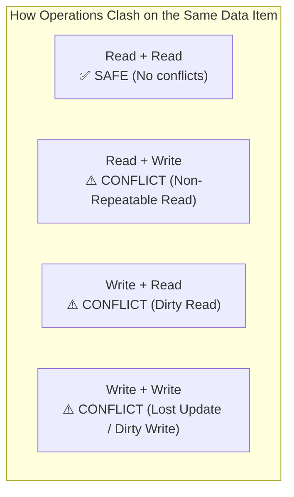

---

### The 4 Concurrency Anomalies Explained Simply

#### 1. Dirty Read (Reading Uncommitted "Ghost" Data)
* **What happens**: Transaction $T_1$ updates a value in memory, but hasn't committed yet. Transaction $T_2$ reads that updated value. Then, $T_1$ encounters an error and **rolls back** (cancels).
* **The Danger**: $T_2$ made real-world decisions based on data that officially never existed!
* **Real-World Story**:
  - You check your bank balance ($T_1$) to deposit ₹400 into an account having ₹100 $\rightarrow$ Balance shows ₹500 in memory.
  - Your landlord ($T_2$) checks the balance, sees ₹500, and approves your rent receipt.
  - Suddenly, the banking server crashes and your deposit transaction $T_1$ **rolls back** to ₹100!
  - The landlord approved the receipt based on a "dirty" ₹500 that never truly got deposited.

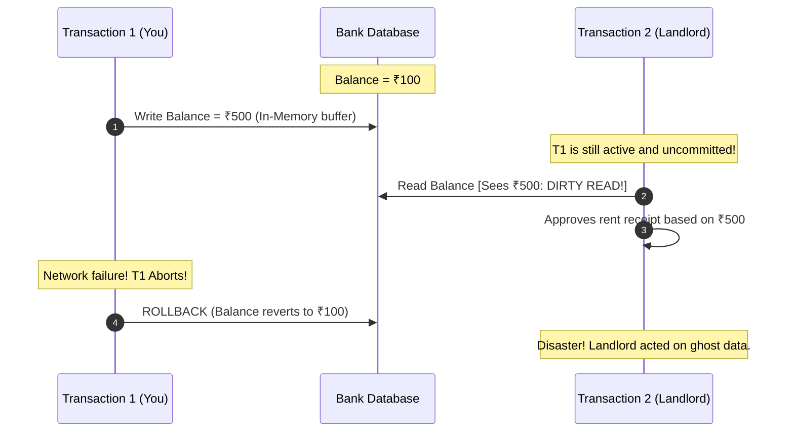

---

#### 2. Non-Repeatable Read (The Changing Value Mid-Transaction)
* **What happens**: You read a row once. While your transaction is still running, another transaction updates that same row and **commits**. When you read the exact same row again, the value has changed!
* **Real-World Story**:
  - You open an e-commerce app to buy sneakers listed at ₹2,000 ($T_1$).
  - While you are typing your address, a flash sale ends: seller updates the price to ₹3,000 and commits ($T_2$).
  - When your transaction $T_1$ proceeds to checkout and re-reads the price, it suddenly sees ₹3,000! Within the *same* checkout session, the price changed under your feet.

---

#### 3. Phantom Read (The Mystery Row Appearance)
* **What happens**: You run a query that searches for a *range* of rows (e.g., `WHERE salary > 50000`). While your transaction is running, another transaction **inserts a brand-new row** matching that range and commits. When you run the same query again, a new "phantom" row appears out of nowhere!
* **Key Difference**:
  - **Non-Repeatable Read**: An *existing row* has its values modified.
  - **Phantom Read**: An entirely *new row* appears (or disappears) inside a range query.

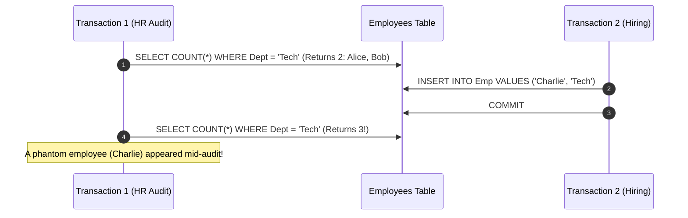

---

#### 4. Lost Update (The Blind Overwrite)
* **What happens**: Two users read the same record at the same time. Both make changes locally and write back. The second user's write blindly overwrites the first user's write, completely wiping it out.
* **Real-World Story**:
  - Bank balance is ₹100.
  - User A reads ₹100 and adds ₹50 (expects ₹150).
  - Simultaneously, User B reads ₹100 and deducts ₹20 (expects ₹80).
  - User A writes ₹150. A millisecond later, User B writes ₹80.
  - **Result**: Final balance is ₹80. User A's ₹50 deposit has vanished into thin air!

---

### Lock Types & The Compatibility Matrix

To prevent these clashes, databases place locks on records before touching them:

1. **Shared Lock (`S-Lock` / Read Lock)**:
   - "I am reading this. Others can read too, but NOBODY can modify it."
   - Multiple transactions can hold Shared Locks on the same item simultaneously.
2. **Exclusive Lock (`X-Lock` / Write Lock)**:
   - "I am writing this. Nobody else can read or write until I am done."
   - Only **one** transaction can hold an Exclusive Lock. All others must wait in line.

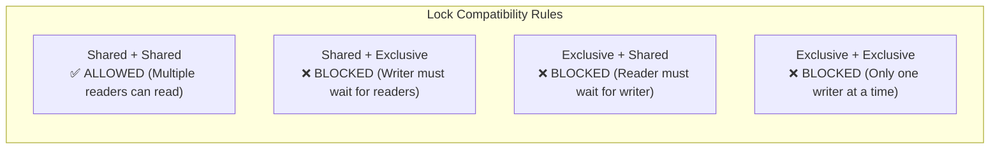

| Requested Lock \ Held Lock | None | Shared (S) | Exclusive (X) |
|---|:---:|:---:|:---:|
| **Shared (S)** | ✅ Granted | ✅ **Granted** (Shared Reading) | ❌ **Blocked** (Must Wait) |
| **Exclusive (X)** | ✅ Granted | ❌ **Blocked** (Must Wait) | ❌ **Blocked** (Must Wait) |

---

### Two-Phase Locking (2PL): The Golden Rule of Serializability

**Two-Phase Locking (2PL)** guarantees that concurrent transactions produce the exact same result as if they ran serially (one after another).

It enforces a simple 2-phase rule on every transaction:

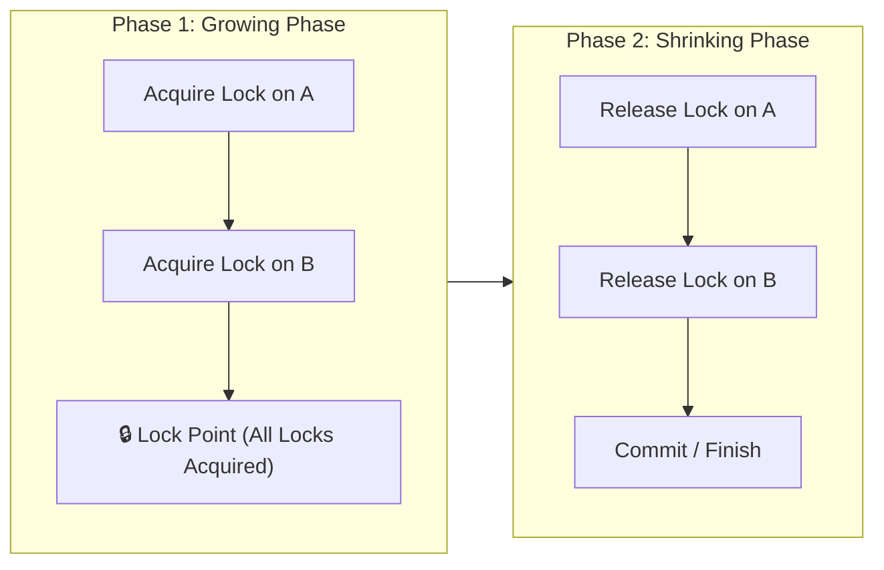

1. **Growing Phase**: The transaction can **only acquire locks**. It is forbidden from releasing any lock.
2. **Lock Point**: The moment the transaction has acquired the very last lock it needs.
3. **Shrinking Phase**: The transaction begins **releasing locks**. Once the first lock is released, **it can NEVER acquire another lock**.

#### The 3 Practical Variants of 2PL:
* **Basic 2PL**: Guarantees serializability, but can cause **cascading aborts** (if $T_1$ unlocks early and then crashes, everyone who read its data must also abort).
* **Strict 2PL (Production Standard in MySQL & Postgres)**:
  - **Rule**: Hold all **Exclusive ($X$) locks** until the transaction officially **COMMITS or ABORTS**.
  - **Benefit**: Completely eliminates cascading rollbacks and dirty reads!
* **Rigorous 2PL**:
  - **Rule**: Hold **ALL locks (both Shared and Exclusive)** until the transaction officially commits or aborts.
  - **Benefit**: Highest safety; easiest crash recovery; lower concurrency.

---

## 2. Isolation Levels in Practical Detail

> 💡 **Quick Revision Anchor**: 
> - **Isolation Level**: The dial that trades off **Speed (Concurrency)** vs. **Safety (Anomaly Protection)**.
> - **Read Committed** = Default in Postgres/Oracle.
> - **Repeatable Read** = Default in MySQL InnoDB.

---

### ANSI SQL-92 Isolation Levels Matrix

| Isolation Level | Dirty Read | Non-Repeatable Read | Phantom Read | Lost Update | Default In |
|---|:---:|:---:|:---:|:---:|---|
| **Read Uncommitted** | ⚠️ Allowed | ⚠️ Allowed | ⚠️ Allowed | ⚠️ Allowed | Rarely used (Telemetry/Logs) |
| **Read Committed** | 🛡️ **Prevented** | ⚠️ Allowed | ⚠️ Allowed | ⚠️ Allowed | **PostgreSQL, Oracle, SQL Server** |
| **Repeatable Read** | 🛡️ **Prevented** | 🛡️ **Prevented** | ⚠️ Allowed* | 🛡️ **Prevented** | **MySQL InnoDB** |
| **Serializable** | 🛡️ **Prevented** | 🛡️ **Prevented** | 🛡️ **Prevented** | 🛡️ **Prevented** | Financial ledgers (Strictest) |

*\*Note: MySQL InnoDB prevents Phantom Reads even under Repeatable Read using MVCC snapshots for standard `SELECT`s and Next-Key Locks for `SELECT ... FOR UPDATE`.*

---

### How Locking Implements These Levels Behind the Scenes:

1. **Read Uncommitted**: Queries read raw data without asking for any locks. Zero waiting, but maximum risk.
2. **Read Committed**:
   - Reads acquire a **short-term Shared (S) lock** that is released *immediately after the single query finishes*.
   - Writes acquire an **Exclusive (X) lock** held until `COMMIT`.
   - *Why Non-Repeatable Reads still happen*: Since the read lock was released right after query 1, another transaction can sneak in and update the row before query 2 runs!
3. **Repeatable Read**:
   - Reads acquire a **long-term Shared (S) lock** held until the **entire transaction completes**.
   - No other transaction can modify that row until you finish.
   - *Why Phantom Reads can still happen in raw locking*: Locking existing rows doesn't stop someone from inserting a *brand new row* in the empty space between existing keys.
4. **Serializable**:
   - Uses **Range Locks (Next-Key Locking)** to lock both the existing rows AND the empty gaps between them. Nobody can insert, update, or delete anything in that range.

---

## 3. Deadlocks: Detection, Prevention & Recovery

> 💡 **Quick Revision Anchor**: 
> - **Deadlock**: Transaction A holds Resource 1 and wants Resource 2; Transaction B holds Resource 2 and wants Resource 1. Both freeze forever.
> - **Wait-Die vs. Wound-Wait**: Timestamp-based rules using Seniority (Older vs. Younger).

---

### The 4 Coffman Deadlock Conditions
A deadlock can ONLY occur if all 4 conditions are true simultaneously:
1. **Mutual Exclusion**: Only one transaction can hold a resource at a time.
2. **Hold and Wait**: A transaction holds a lock while waiting to grab another lock.
3. **No Preemption**: Locks cannot be forcibly stolen; they must be released voluntarily.
4. **Circular Wait**: A closed loop of waiting transactions ($T_1 \to T_2 \to T_1$).

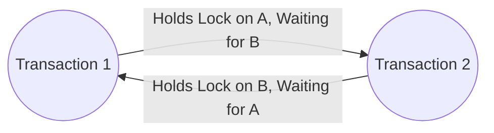

---

### Deadlock Detection: The Wait-For Graph (WFG)
The database engine runs a background detective thread (e.g., every 500ms).
- It draws a **Wait-For Graph**: Nodes = Transactions, Edges = "Waiting for lock held by".
- It runs a Cycle-Finding algorithm (DFS).
- **If a cycle is found ($T_1 \to T_2 \to T_1$)**: A deadlock is proven! The engine picks one transaction as the **victim**, aborts it, and lets the other proceed.

---

### Deadlock Prevention: Wait-Die vs. Wound-Wait (The Senior Citizen Analogy)

Instead of waiting for deadlocks to happen, databases assign a **birth timestamp** $TS(T_i)$ to each transaction.
- **Smaller Timestamp = Older Transaction (Senior Citizen)**.
- **Larger Timestamp = Younger Transaction (Fresh Junior)**.

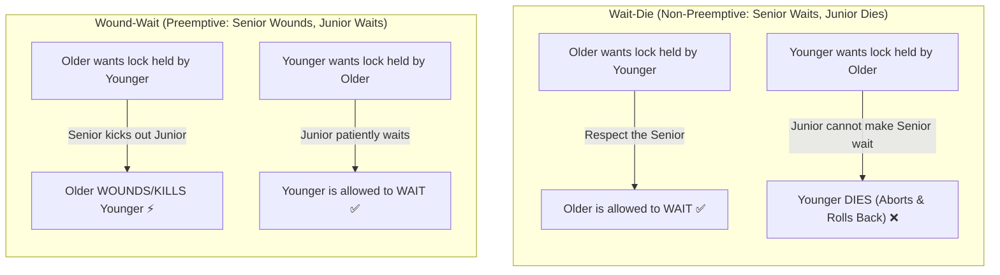

#### The Easy Memory Hook:
| Scheme | Older Requests Younger | Younger Requests Older | Philosophy |
|---|---|---|---|
| **Wait-Die** | Older **WAITS** | Younger **DIES** | Non-preemptive. Nobody is kicked out while holding a lock. |
| **Wound-Wait** | Older **WOUNDS** (Kills) Younger | Younger **WAITS** | Preemptive. Seniors kick out youngsters; youngsters wait politely. |

---

## 4. Modern Concurrency Protocols: MVCC & Snapshot Isolation

> 💡 **Quick Revision Anchor**: 
> - **MVCC (Multi-Version Concurrency Control)**: **"Readers never block writers, and writers never block readers."**
> - Used by: **PostgreSQL, MySQL InnoDB, Oracle**.

---

### The Problem MVCC Solves
In traditional locking systems:
- If someone is writing a report, everyone trying to read is blocked.
- If someone is reading a dashboard, writes are blocked.
Under high traffic, the database grinds to a halt.

### The MVCC Solution: The "Photo Snapshot" Analogy
Instead of locking a row to read it:
1. When your transaction begins, the database gives you an instant **virtual snapshot (a photo)** of the database as it existed at that exact second.
2. If someone else updates a row while you are reading, the database **does NOT overwrite the old row in place**.
3. Instead, it creates a **new version** of the row with a newer timestamp:
   - Older transactions looking at their snapshot continue reading the **old version**.
   - Newer transactions see the **new version**.
4. **Result**: Readers read their snapshot without locks; writers write new versions without waiting for readers!

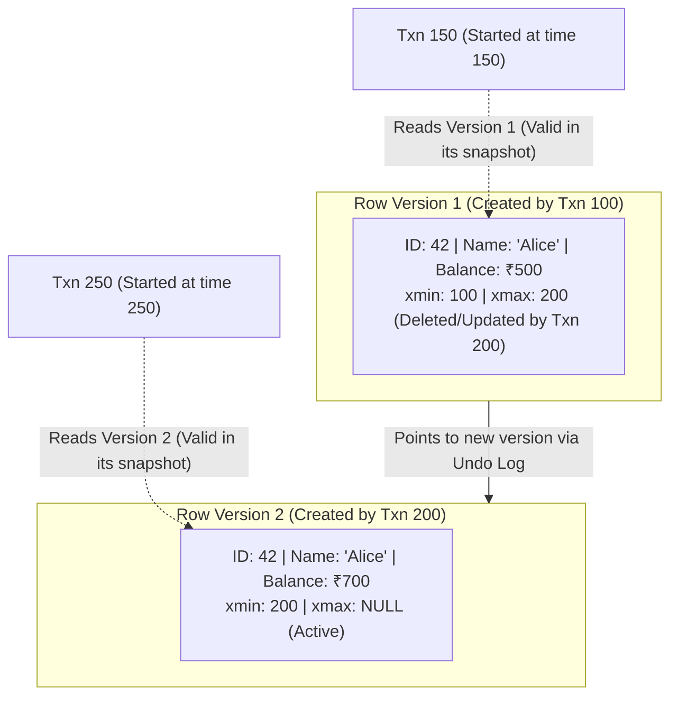

#### Row Metadata Headers:
- `xmin` (or `DB_TRX_ID` in InnoDB): The transaction ID that inserted this version.
- `xmax` (or `DB_ROLL_PTR` in InnoDB): The transaction ID that updated or deleted this version.
- **Vacuum / Undo Purge**: A background cleaner thread automatically deletes old row versions once no active transaction needs them anymore.

---

### Thomas' Write Rule: The "Obsolete Write" Shortcut
If transaction $T$ wants to execute `Write(Q)`, but a **younger transaction has already updated $Q$ with a newer value**:
- Normal timestamp rules would abort $T$.
- **Thomas' Write Rule**: Simply **ignore $T$'s write and move on!** 
- Since the future value is already written, $T$'s update is obsolete. Ignoring it saves $T$ from aborting while preserving mathematical consistency.

---

### Optimistic Concurrency Control (OCC)
Best for read-heavy web apps (like Wikipedia) where two users almost never edit the exact same article at the same second:
1. **Read Phase**: Read freely with zero locks. Stage changes in local private memory.
2. **Validation Phase**: Right before commit, check: *"Did anyone modify the rows I read while I was working?"*
3. **Write Phase**: If no conflict, save changes to disk. If conflict detected, abort and retry.

---

---

## 5. Indexing Internals: B-Trees vs. B+ Trees

> 💡 **Quick Revision Anchor**: 
> - **B-Tree**: Keys and data records are stored in **all nodes** (root, internal, and leaves). Leaves are isolated.
> - **B+ Tree (Database Standard)**: Internal nodes store **only keys and tree pointers (road signs)**. All data lives in **leaf nodes**, which are linked horizontally via **$P_{\text{next}}$ pointers** for blazing-fast sequential range scans.

---

### The Fundamental Problem: Disk I/O Bottleneck

Databases store massive tables on physical disk (HDD or SSD). 
- In **RAM**, jumping to a pointer takes nanoseconds ($\approx 100\text{ns}$).
- On **Disk**, reading a page takes milliseconds ($\approx 1\text{ms} - 10\text{ms}$) — roughly **100,000 times slower**!
- Disks read and write in fixed-size chunks called **Pages / Blocks** (typically 4KB, 8KB, or 16KB).
- Therefore, the golden rule of database index design is simple: **Minimize the number of disk page reads to find a record.**

#### Why Not a Binary Search Tree (BST / AVL / Red-Black Tree)?
In a binary search tree, every node has at most **2 children**. 
For 10 million rows, the tree height is $\approx \log_2(10^7) \approx 24$ levels. Finding just one record would force the database to fetch 24 separate disk pages ($\approx 24 \times 10\text{ms} = 240\text{ms}$), which is unacceptably slow.

To solve this, databases use **multi-way search trees** where each node holds hundreds or thousands of keys per page: **B-Trees** and **B+ Trees**.

---

### 1. What is a B-Tree?

A **B-Tree** (Balanced Tree) is a self-balancing search tree where each node can have multiple keys and multiple children.

<p align="center">
  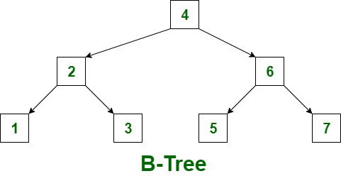
</p>

#### How a B-Tree Works (Looking at the Diagram):
- In the diagram above, the root node contains key `4`.
- Left child contains key `2`, right child contains key `6`.
- Leaf nodes contain `1`, `3`, `5`, and `7`.
- **The Core Rule of B-Tree**: **Both Keys AND actual Data records (or data pointers) are stored inside EVERY node** — root, internal nodes, and leaves alike.

#### Why B-Trees are Inefficient for Databases:
1. **Low Fan-Out (Taller Tree):**
   Because an 8KB disk page must hold bulky row data alongside each key, only a few keys fit inside one node. Fewer keys per node means lower "fan-out" (fewer children per node), forcing the tree to grow **taller**. A taller tree means **more disk reads**.
2. **Slow, Complex Range Queries (`WHERE age BETWEEN 3 AND 6`):**
   To find all keys between 3 and 6 in a B-Tree:
   - Visit leaf node `3`.
   - Jump **UP** to root node `4`.
   - Jump **DOWN** to leaf node `5`.
   - Jump **UP** to internal node `6`.
   Constantly jumping up and down across parent and child disk blocks requires expensive in-order tree traversal, causing severe random disk I/O.

---

### 2. What is a B+ Tree? (The Modern Database Standard)

A **B+ Tree** is an enhanced, database-optimized evolution of the B-Tree used by virtually every relational storage engine (including **MySQL InnoDB** and **PostgreSQL**).

<p align="center">
  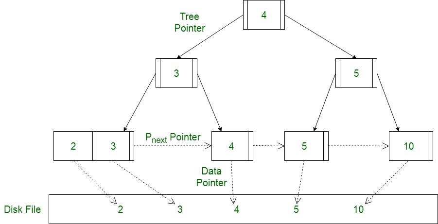
</p>

#### How a B+ Tree Works (Looking at the Diagram):
A B+ Tree makes a clean separation of responsibilities into two distinct tiers:

1. **Internal Nodes (Traffic Guides / Road Signs):**
   - The root node (`4`) and internal nodes (`3`, `5`) contain **only guide keys and `Tree Pointer` references**.
   - They store **ZERO actual row data**. Their only job is to direct search queries to the correct child page below.
2. **Leaf Nodes (Data Repository):**
   - **All actual data records live strictly at the leaf level** (`[2, 3]`, `[4]`, `[5]`, `[10]`).
   - Every key at the leaf level has a **`Data Pointer`** pointing directly to the real row stored in the **Disk File**.
3. **Horizontal Leaf Chain ($P_{\text{next}}$ Pointers):**
   - Notice the dotted horizontal arrows connecting the leaf nodes (`[2, 3] -> [4] -> [5] -> [10]`).
   - All leaf nodes are linked together in a continuous **Linked List** via **$P_{\text{next}}$ pointers**.

---

### 3. Why B+ Trees Are Far Superior for Databases

#### Superpower 1: Massive Fan-Out & Ultra-Flat Trees
- Because internal nodes do not waste space storing bulky data rows, a single 8KB or 16KB index page can hold **1,000+ key-pointer pairs**!
- With a fan-out of $B = 1,000$:
  - **Level 1 (Root):** $1,000$ entries
  - **Level 2 (Internal):** $1,000 \times 1,000 = 1,000,000$ entries
  - **Level 3 (Leaves):** $1,000 \times 1,000 \times 1,000 = 1,000,000,000$ (**1 Billion rows!**)
- **Key Takeaway:** Any record among **1 Billion records** is retrieved in just **3 or 4 disk page reads**!

#### Superpower 2: Lightning-Fast Range Scans (`WHERE id BETWEEN 3 AND 5`)
- In a B+ Tree, finding a range of values is trivial:
  1. The engine traverses down from the root to the leaf node containing the starting key `3` (takes 2–3 disk reads).
  2. Once at leaf `3`, it simply **walks horizontally along the $P_{\text{next}}$ pointers** through `4` and `5`!
  3. It **never jumps back up** to parent or root nodes. This is a clean, sequential, linear scan that operating systems can prefetch into memory.

#### Superpower 3: Uniform, Predictable Latency
- In a standard B-Tree, search time is inconsistent: if you search for a key stored at the root, it takes 1 read; if at a leaf, it takes 3 reads.
- In a B+ Tree, every single search query travels down to the leaf level, guaranteeing **uniform and predictable query latency** across all rows.

---

### 4. Summary: B-Tree vs. B+ Tree Side-by-Side

| Feature | B-Tree | B+ Tree (Database Standard) |
| :--- | :--- | :--- |
| **Where is Data Stored?** | In **all nodes** (root, internal, and leaves) | **Strictly in Leaf nodes** only |
| **What do Internal Nodes hold?** | Keys + Child Pointers + **Row Data** | **Only Keys + Tree Pointers** (road signs) |
| **Fan-Out (Keys per Page)** | **Lower** (bulky data eats up page space) | **Massive** (1,000+ keys per page) |
| **Tree Height** | Taller (requires more disk reads) | **Ultra-Flat** (3 to 4 levels for billions of rows) |
| **Range Queries (`BETWEEN`)** | **Slow & erratic** (jumps up and down tree) | **Blazing fast** (linear scan along $P_{\text{next}}$ leaf chain) |
| **Leaf Node Connections** | Leaves are isolated (no links) | Leaves are linked via **$P_{\text{next}}$ Linked List** |
| **Search Predictability** | Varies (faster for root, slower for leaves) | **Uniform $\mathcal{O}(\log N)$** (always reaches leaf) |

---

## 6. Database Storage Engine & Buffer Pool Architecture

### 💡 Quick Revision Anchor (2-3 Words): Cached Block Management

---

### 1. The Core Physical Reality: The "Desk vs. Warehouse" Mental Model

To understand database storage, you must understand the massive speed gap between **RAM** and **Disk**:

| Memory Type | Access Time | Analogy |
| :--- | :--- | :--- |
| **RAM (Memory)** | $\approx 100 \text{ nanoseconds}$ | Grabbing a document already lying on your **office desk** ($\approx 1\text{ second}$). |
| **Disk (SSD / NVMe)** | $\approx 100 \text{ microseconds} - 1 \text{ ms}$ | Walking down to the basement archive to fetch a folder ($\approx 15\text{ minutes}$). |
| **Disk (Spinning HDD)** | $\approx 10 \text{ milliseconds}$ | Driving 5 miles to a **remote warehouse** in traffic ($\approx 3.5\text{ days}$). |

Because disk I/O is roughly **100,000 times slower** than RAM:
1. **Databases never read or write a single byte directly to disk.**
2. Disks transfer data in fixed-size blocks called **Pages** (typically 4KB in OS, 8KB in PostgreSQL, or 16KB in MySQL InnoDB).
3. If you query `SELECT salary FROM users WHERE id = 42;`, the engine does **not** fetch just 4 bytes of salary. It loads the **entire 8KB page** containing user #42 from the warehouse (Disk) onto your office desk (**Buffer Pool in RAM**).

---

### 2. Inside a Page: Slotted Page Architecture

**The Problem:** Why can't a database page just be a simple array of rows like `page[0], page[1], page[2]`?
Because rows have **variable lengths**! User Alice has a 5-letter name, while user Christopher has a 30-letter bio. If you delete Alice, or update Christopher's bio, everything would have to shift, breaking all pointers!

**The Solution:** Modern databases (Postgres, SQLite, MySQL) use the **Slotted Page Layout**:

```
+-----------------------------------------------------------------------------------+
|  PAGE HEADER  | Slot 0 (Offset 950) | Slot 1 (Offset 800) | Slot 2 (Offset 620)   |
| (LSN, counts) | ========> GROWS DOWNWARDS (Left to Right) =======>               |
+---------------+-------------------------------------------------------------------+
|                                                                                   |
|                               <--- FREE SPACE GAP --->                            |
|                                                                                   |
+-----------------------------------------------------------------------------------+
| <======= APPRENDED UPWARDS (Right to Left) <======================================|
|  Record 2: "Christopher..." (180 B) | Record 1: "Bob..." (150 B) | Record 0: Alice|
+-----------------------------------------------------------------------------------+
```

#### How Slotted Page Works:
- **Slot Directory (The Index Card Drawer):** Located at the **top** of the page. Grows downwards (left to right). Each slot contains only a tiny offset pointer (e.g. "Slot 1 starts at byte 800 and is 150 bytes long").
- **Tuple Storage (The Actual Rows):** Appended at the **bottom** of the page, growing upwards (right to left).
- **Free Space:** The shrinking gap in the middle. When the slot directory meets the data records, the page is full!
- **TID / Row ID:** In SQL engines, a record's physical pointer is simply `(Page_Number, Slot_Number)`.
  - Even if row #1 is moved around inside the page during defragmentation, its **Slot index never changes**! Outside indexes point strictly to `Slot 1`, so outside pointers never break.

---

### 3. The Buffer Pool Manager: Your Office Desk in RAM

The **Buffer Pool** is a large chunk of RAM dedicated to caching pages so queries don't have to touch the slow disk.

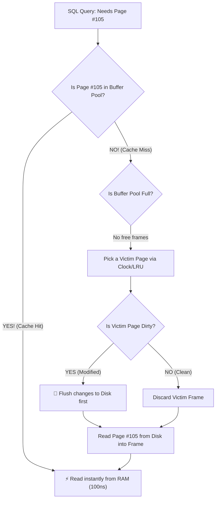

#### 4 Crucial Buffer Pool Concepts:

1. **Frame:** An in-memory slot sized exactly to hold one page (e.g., 8KB).
2. **Page Table:** An in-memory hash map that tracks which on-disk page is currently residing in which memory frame (`PageID -> FrameID`).
3. **Dirty Page (The "Pencil Scribble"):**
   - When an `UPDATE` happens, the database modifies the page **in RAM only** and marks it as **Dirty**.
   - It does **not** immediately write it to disk (that would be too slow!). It leaves it in RAM until a checkpoint or eviction flushes it to disk.
4. **Pin Count / Reference Count (The "Holding Finger"):**
   - When a transaction is reading or updating Page #42, it increments its `pin_count`.
   - **Golden Rule:** A page with `pin_count > 0` **CANNOT be evicted**! It tells the buffer manager: *"I have my finger on this page right now, do not throw it away!"*

#### Buffer Eviction: The Clock Sweep (Second-Chance) Algorithm
When the buffer pool is full and a new page arrives, who gets kicked out?
- Pure LRU (Least Recently Used) is expensive to maintain under heavy concurrency because every read requires updating linked list locks.
- Databases use the **Clock Sweep Algorithm**:
  - Imagine all frames arranged in a circular clock with a moving hand.
  - Each frame has a **Usage Bit** (`0` or `1`).
  - When the clock hand inspects a frame:
    - If `Usage Bit == 1`: The engine gives it a second chance, flips it to `0`, and moves to the next frame.
    - If `Usage Bit == 0` (and `pin_count == 0`): This is the **victim**! Evict this page to disk and load the new page here.

---

## 7. Query Execution & Optimizer Internals

### 💡 Quick Revision Anchor (2-3 Words): Cost-Based Execution Plan

When you type a SQL query, the database does not just blindly execute it. It passes through a multi-stage compilation pipeline:

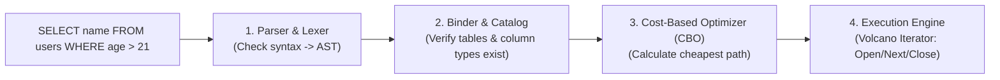

---

### 1. The Three Primary Scan Types: An Everyday Analogy

Imagine looking for a person's phone number in a 1,000-page printed telephone directory:

| Scan Type | How It Works | Real-World Analogy | When Engine Chooses It |
| :--- | :--- | :--- | :--- |
| **Sequential Scan (Seq Scan)** | Reads every page of the table from start to finish. | Flipping through every page from page 1 to 1000. | Table is tiny, or query matches $>20-30\%$ of all rows. |
| **Index Scan** | Traverses the B+ Tree to find row pointers (`PageID, SlotID`), then fetches the actual rows from heap table pages. | Using the alphabetical index at the back to find "Page 82, line 4", then opening Page 82. | Query is selective (matches $<5\%$ of rows). |
| **Index-Only Scan (Covering Index)** | The requested column values are already stored **inside the index itself**! | The index at the back already prints the phone number right next to the name! You **never open the main directory**. | Super fast. Zero table page reads required. |

---

### 2. The Famous Interview Question: *"Why is the Optimizer Ignoring My Index?"*

Every developer faces this: *"I created an index on `status`, but when I run `EXPLAIN`, Postgres is still doing a slow Sequential Scan! Why?"*

Here are the top 5 real-world reasons:

#### Reason 1: Low Selectivity (High Cardinality of Matches)
- **The "Traffic Jam" Scenario:** Imagine a company table with 1,000,000 employees where 600,000 work in `department = 'Sales'` (60%).
- If you use the index, the database must perform **600,000 random I/O disk seeks** jumping back and forth across different table pages.
- A sequential scan reads disk pages continuously in a straight line with hardware prefetching. In this case, **a full table scan is significantly faster than using the index**!

#### Reason 2: The Table is Tiny
- If the entire table fits into 1 or 2 disk pages, reading the index page + jumping to the data page takes **2 or 3 page reads**. A sequential scan takes **only 1 or 2 page reads**. The optimizer chooses the lowest cost.

#### Reason 3: Function Wrapped Around the Column
```sql
-- ❌ BAD: Index on `email` is completely IGNORED!
SELECT * FROM users WHERE UPPER(email) = 'ALICE@GMAIL.COM';
```
- **Why?** The B+ tree index is sorted by `email` (`"alice..."`), not by `UPPER(email)`. The engine cannot use binary search because it doesn't know what `UPPER(...)` produces without evaluating every row.
- **Fix:** Use a Functional Index: `CREATE INDEX idx_users_upper_email ON users (UPPER(email));`

#### Reason 4: Leading Wildcard in `LIKE` Queries
```sql
-- ❌ BAD: Index IGNORED!
SELECT * FROM users WHERE name LIKE '%smith';

-- ✅ GOOD: Index USED!
SELECT * FROM users WHERE name LIKE 'smith%';
```
- **Why?** A B+ Tree is sorted alphabetically from left to right. Searching for `%smith` is like searching a dictionary for words ending in "ing"—you have to read the entire dictionary.

#### Reason 5: Implicit Type Casting
```sql
-- ❌ BAD: `phone_number` is VARCHAR, but queried with an integer literal!
SELECT * FROM users WHERE phone_number = 9902634351;
```
- **Why?** The database automatically converts this to `WHERE CAST(phone_number AS integer) = 9902634351`. Wrapping a column in an implicit cast disables the B+ Tree index! Always pass `'9902634351'` as a string.

---

## 8. Transaction Logging & Crash Recovery (WAL & Checkpoints)

### 💡 Quick Revision Anchor (2-3 Words): Log Before Disk Flush

---

### 1. The Waiter's Notepad Analogy: Why WAL Exists

Imagine a busy restaurant:
- If every time a customer ordered a drink, the waiter had to run to the chef's master leather-bound accounting ledger, unlock the safe, neatly write the entry in calligraphy, and lock it back up, the restaurant would grind to a halt.
- Instead, the waiter scribbles: `"Table 4: 1 Coke"` in 1 second onto a small **pocket notepad** (an append-only log).
- If the restaurant's power suddenly goes out, the master ledger might be missing entries, but the waiter's pocket notepad survived intact! They can easily reconstruct every order.

In databases:
- The **Master Ledger** = Heavy 8KB table pages on disk (slow, random I/O).
- The **Waiter's Notepad** = **Write-Ahead Log (WAL)** (ultra-fast, sequential append-only writes).

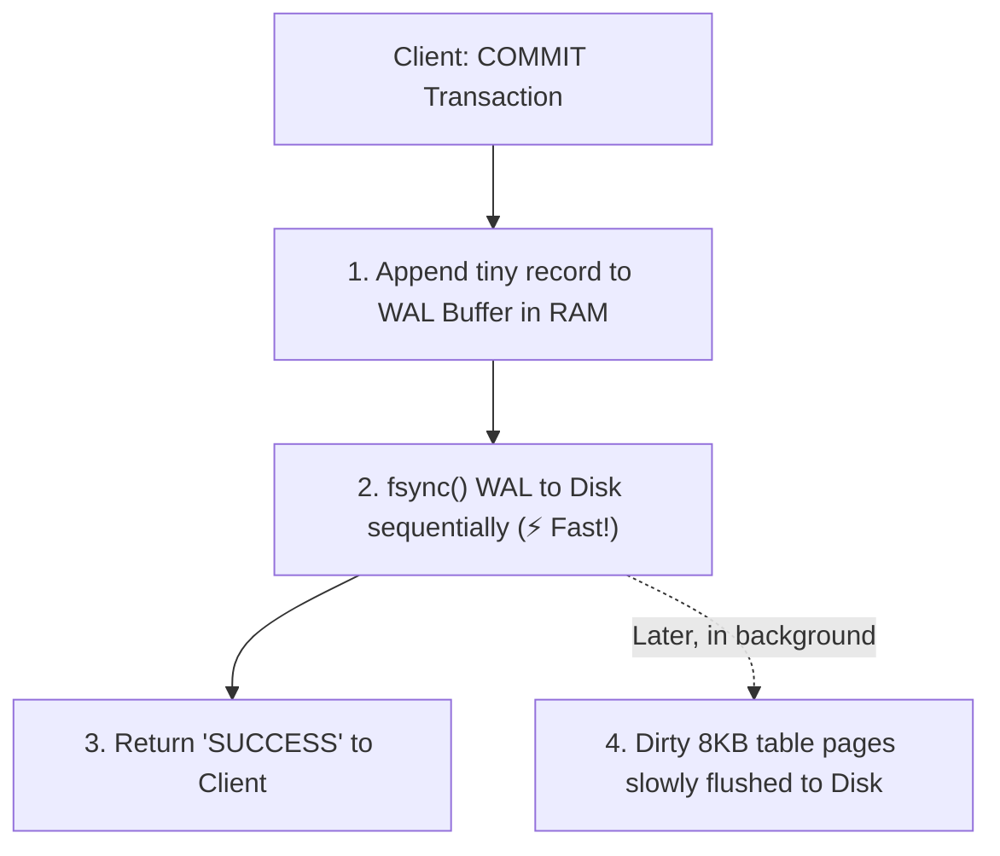

> [!IMPORTANT]
> **The Golden Rule of WAL:**
> The log record describing a change **MUST be written and flushed (`fsync`) to persistent disk storage BEFORE** the corresponding dirty data page in RAM is allowed to be written to disk.

---

### 2. Checkpoints: Why Not Keep Logging Forever?

If you never cleared the WAL notepad, after 6 months the WAL file would be 500 Gigabytes! If the database crashed, recovery would take **8 hours** replaying 6 months of historical logs from scratch.

#### What a Checkpoint Does:
1. Every few minutes (or when WAL reaches e.g. 1GB), the database triggers a **Checkpoint**.
2. It flushes **all dirty memory pages** currently in the Buffer Pool to disk.
3. It writes a special `CHECKPOINT` marker record into the WAL file.
4. **The Benefit:** Any log entries recorded *before* the checkpoint are now safely on disk in the actual table files. If the database crashes, recovery **only needs to replay logs starting from the last checkpoint**! Old log files can be safely deleted or archived.

---

### 3. ARIES Crash Recovery: The "Crime Scene Detective" in 3 Phases

When a database crashes mid-flight (power cord pulled) and restarts, it uses the industry-standard **ARIES** algorithm to recover. Think of it like a detective arriving at a crime scene:

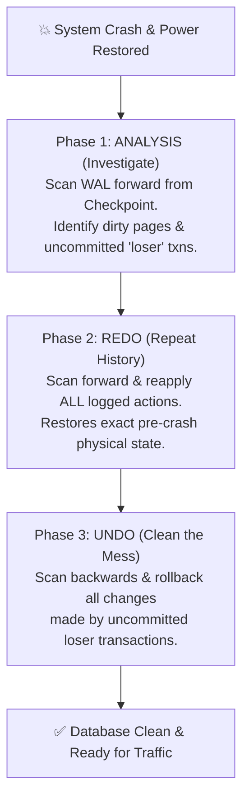

| Phase | What the Detective Does | Technical Action |
| :--- | :--- | :--- |
| **1. Analysis** | Finds out who was in the building when power died. | Scans log forward from the last checkpoint. Discovers which transactions committed and which were still running (**Losers**). |
| **2. Redo (Repeat History)** | Replays the security tape step-by-step. | Re-applies all logged changes forward from the earliest dirty page. Even changes from aborted transactions are reapplied to restore the exact memory state at the moment of crash! |
| **3. Undo** | Removes stolen items left on the floor. | Scans backwards and rolls back every single operation made by the active "loser" transactions that never committed, restoring atomicity. |

---

## 9. Database Anomalies & Functional Dependencies

### 💡 Quick Revision Anchor (2-3 Words): Decompose Without Data Loss

---

### 1. The 3 Classic Anomalies (Why Bad Schema Design Hurts)

Look at this poorly designed, unnormalized table: `Employee_Department`

| emp_id | emp_name | dept_id | dept_name | dept_head |
| :--- | :--- | :--- | :--- | :--- |
| **E101** | Alice | D01 | Engineering | Bob |
| **E102** | Charlie | D01 | Engineering | Bob |
| **E103** | David | D02 | Marketing | Sarah |

1. **Insertion Anomaly (Cannot add a department with no staff):**
   - The company opens a new department: `D05 - AI Research`.
   - But we haven't hired anyone yet! Because `emp_id` is the primary key (cannot be `NULL`), **we cannot record the existence of this new department in the database**!
2. **Update Anomaly (Data inconsistency hazard):**
   - Bob steps down and Eve becomes the new head of Engineering (`D01`).
   - If our query updates row 1 but crashes before updating row 2, the database now claims Engineering has two different heads at the same time!
3. **Deletion Anomaly (Accidental collateral damage):**
   - David (`E103`) is the only person working in Marketing (`D02`).
   - If David resigns and we delete his row, **the entire record that a Marketing department ever existed is permanently wiped from the company**!

---

### 2. Attribute Closure ($X^+$): The Sherlock Holmes Puzzle

A **Functional Dependency** $A \to B$ simply means: *"If you know the value of $A$, there is only ONE possible value of $B$ (like SSN $\to$ Full_Name)."*

The **Attribute Closure** $X^+$ is simply: *"What is the complete list of facts we can deduce if we start with information $X$?"*

#### Example Walkthrough:
Given a table with columns $R(A, B, C, D, E)$ and these rules (FDs):
- Rule 1: $A \to B$ (Knowing $A$ reveals $B$)
- Rule 2: $B \to C$ (Knowing $B$ reveals $C$)
- Rule 3: $C \to D$ (Knowing $C$ reveals $D$)
- Rule 4: $D \to E$ (Knowing $D$ reveals $E$)

**Let's find the closure of $A$, denoted $(A)^+$:**
1. Start with what you know: `Result = {A}`
2. Using Rule 1 ($A \to B$): Since we know $A$, we discover $B$! $\implies \text{Result} = \{A, B\}$
3. Using Rule 2 ($B \to C$): Since we know $B$, we discover $C$! $\implies \text{Result} = \{A, B, C\}$
4. Using Rule 3 ($C \to D$): Since we know $C$, we discover $D$! $\implies \text{Result} = \{A, B, C, D\}$
5. Using Rule 4 ($D \to E$): Since we know $D$, we discover $E$! $\implies \text{Result} = \{A, B, C, D, E\}$

**Conclusion:** Starting with only $A$, we unlocked every single attribute in the table! Therefore, **$A$ is a Candidate Key!**

---

### 3. Lossless Join: How to Chop Tables Without Creating "Zombie" Data

To eliminate anomalies, we decompose (chop) one messy table into two clean tables $R_1$ and $R_2$.
**The Golden Rule:** When you re-join $R_1 \bowtie R_2$, it must produce the **exact original table**—no missing rows, and NO extra fake rows!

#### The Simple Mathematical Test:
A decomposition is **Lossless** if and only if the shared columns ($R_1 \cap R_2$) form a **Candidate Key** in at least one of the tables:
$$\mathbf{(R_1 \cap R_2) \to R_1} \quad \text{OR} \quad \mathbf{(R_1 \cap R_2) \to R_2}$$

#### ⚠️ The Danger of a "Lossy Join" (Creating Fake Zombie Rows):
Suppose we have a table of doctors and hospitals:

| Doctor | Specialty | Hospital |
| :--- | :--- | :--- |
| Dr. Smith | Pediatrics | City Hospital |
| Dr. Jones | Pediatrics | Metro Clinic |

Suppose an engineer recklessly decomposes this into:
- $R_1(\text{Doctor, Specialty})$: `(Smith, Peds)`, `(Jones, Peds)`
- $R_2(\text{Specialty, Hospital})$: `(Peds, City Hospital)`, `(Peds, Metro Clinic)`

Notice the shared column is `Specialty`. But `Specialty` is NOT a unique key! When you perform a `NATURAL JOIN` on `Specialty`:
1. `(Smith, Peds)` joins with `(Peds, City Hospital)` $\implies$ (Smith, Peds, City Hospital) ✅
2. `(Smith, Peds)` joins with `(Peds, Metro Clinic)` $\implies$ **(Smith, Peds, Metro Clinic) ❌ (FAKE ZOMBIE ROW!)**
3. `(Jones, Peds)` joins with `(Peds, City Hospital)` $\implies$ **(Jones, Peds, City Hospital) ❌ (FAKE ZOMBIE ROW!)**
4. `(Jones, Peds)` joins with `(Peds, Metro Clinic)` $\implies$ (Jones, Peds, Metro Clinic) ✅

The database now falsely claims Dr. Smith works at Metro Clinic! **That is why the shared column MUST be a unique key.**

---

## 10. Database Replication & High Availability

### 💡 Quick Revision Anchor (2-3 Words): Leader to Follower Sync

```mermaid
flowchart LR
    App["Application / Clients"] -->|1. All Writes (INSERT/UPDATE)| Primary[("Primary DB (Leader)")]
    Primary -->|2. Stream WAL logs| Rep1[("Read Replica 1")]
    Primary -->|2. Stream WAL logs| Rep2[("Read Replica 2")]
    App -.->|Read Queries| Rep1
    App -.->|Read Queries| Rep2
```

---

### 1. Synchronous vs. Asynchronous Replication

| Dimension | Synchronous Replication | Asynchronous Replication |
| :--- | :--- | :--- |
| **How it Works** | Primary writes locally, sends WAL to replica, and **waits for replica to confirm** before replying "Success" to client. | Primary writes locally, replies "Success" to client immediately, and streams WAL to replica in the background. |
| **Real-World Analogy** | Making a phone call and waiting for the other person to say "I heard you" before hanging up. | Sending a text message and immediately putting your phone in your pocket. |
| **Data Loss Risk** | **Zero Data Loss ($RPO = 0$):** If primary explodes, replica has 100% of data. | **Risk of Data Loss:** If primary dies, updates sent in the last 200ms might be lost forever. |
| **Write Latency** | High (Client waits for network round-trip to replica). | **Ultra-Fast** (Zero network wait time for client). |
| **Replica Failure** | If replica crashes or network lags, **all primary writes freeze/block!** | If replica crashes, primary keeps writing smoothly. |
| **Best Used For** | Core banking ledgers, financial transactions. | High-throughput web applications, social media, e-commerce. |

---

### 2. The "Invisible Profile Picture" Trap (Replication Lag)

**Scenario:** You change your profile avatar on Instagram from a cat to a dog. You hit save, the page reloads, but **your old cat picture is still showing!** You refresh 3 seconds later, and suddenly the dog picture appears.

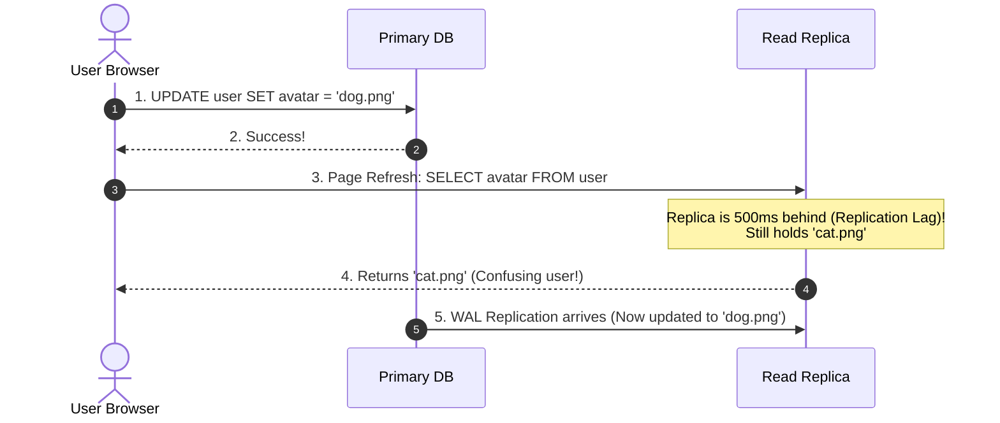

#### The Architecture Solution: Read-Your-Own-Writes Consistency
- **Rule:** For any user who just performed a write, route all their read queries to the **Primary DB** for the next 5 to 10 seconds.
- Route all passive readers (strangers viewing someone else's public profile) to the **Read Replicas**.

---

### 3. Split-Brain Disaster & Quorum Consensus

**The Disaster:**
- Suppose you have two database servers: Node A in New York and Node B in London.
- An undersea cable gets severed (network partition).
- Node B loses connection with Node A. Node B thinks: *"Node A must be dead! I will crown myself the new Primary!"*
- Now **both Node A and Node B think they are the Primary leader**. Both accept conflicting customer writes. When the cable is repaired, merging conflicting database histories is mathematically impossible!

**The Solution: Quorum ($\lfloor N/2 \rfloor + 1$)**
- A node is **never** allowed to declare itself Primary or accept writes unless it can communicate with a **strict majority ($> 50\%$)** of all nodes in the cluster (e.g. 2 out of 3, or 3 out of 5 nodes).
- Because a network partition can only ever have **one** side with a majority, only one node can ever be Primary. Split-brain is impossible.

---

## 11. Distributed Transactions & Two-Phase Commit (2PC)

### 💡 Quick Revision Anchor (2-3 Words): Atomic Distributed Agreement

In microservices or sharded databases, a single user action (e.g., buying an item) requires modifying two completely separate databases:
1. **Order DB:** Insert order record.
2. **Payment DB:** Deduct $50 from customer balance.

How do we ensure **both happen or neither happens**? We use **Two-Phase Commit (2PC)**.

---

### 1. The Wedding Ceremony Analogy

Think of 2PC like an officiant marrying a couple at a wedding:

- **Phase 1 (The Question / Prepare Phase):**
  The officiant asks Partner 1: *"Do you take this person to be your spouse?"* $\implies$ Partner 1 says: *"I do."*
  The officiant asks Partner 2: *"Do you take this person to be your spouse?"* $\implies$ Partner 2 says: *"I do."*
- **Phase 2 (The Pronouncement / Commit Phase):**
  Only after **both** have said "I do", the officiant announces: *"I now pronounce you married!"* (Global Commit).
  If either partner had said *"No"*, the wedding is immediately called off (Global Abort).

---

### 2. 2PC Step-by-Step Protocol

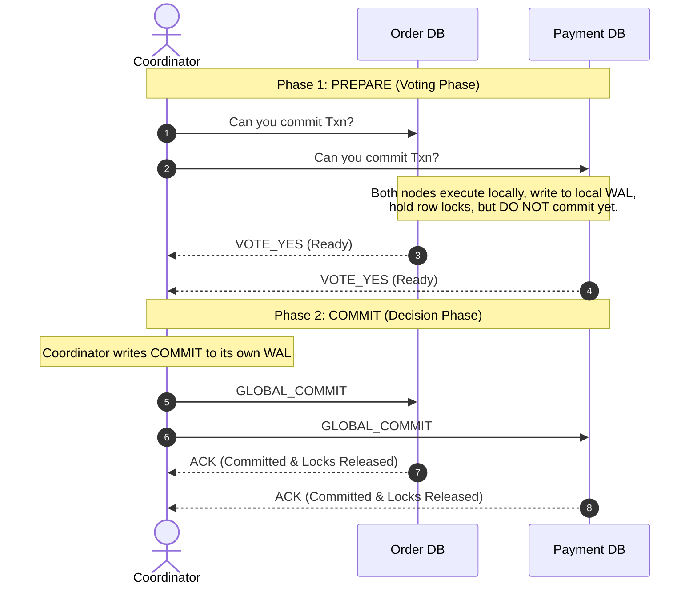

#### What Happens if One Node Votes NO?
If Payment DB responds `VOTE_NO` (e.g., customer has insufficient balance) or fails to respond within a timeout:
1. Coordinator writes `ABORT` to its local log.
2. Sends `GLOBAL_ABORT` to both nodes.
3. Order DB rolls back its pending insert and releases locks.

---

### 3. The Fatal Flaw of 2PC: The Blocking Problem

Why do modern cloud architectures (Netflix, Uber, Amazon) avoid 2PC whenever possible?

> [!CAUTION]
> **The Coordinator Crash Trap:**
> Suppose in Phase 1, both Order DB and Payment DB vote `VOTE_YES`. They are now holding physical row locks on those records.
> Suddenly, the **Coordinator server crashes and catches fire** before sending `GLOBAL_COMMIT`!
> 
> What do Order DB and Payment DB do?
> - They **cannot abort** on their own (the coordinator might have committed!).
> - They **cannot commit** on their own (the other node might have failed!).
> - They are **STUCK IN LIMBO**, holding database locks indefinitely, blocking all other transactions!

**Modern Alternative:** Instead of 2PC, modern microservices use the **Saga Pattern** (eventually consistent local transactions chained together via message queues with compensating rollback steps).

---

## 12. Database Security & SQL Injection Prevention

### 💡 Quick Revision Anchor (2-3 Words): Parameterized Query Trees

---

### 1. The Laminated Recipe Analogy: How SQL Injection Works

Imagine a restaurant kitchen where customers can submit special requests:

#### The Vulnerable Way (String Concatenation):
The customer writes on a paper note: `Add extra cheese; then BURN DOWN THE KITCHEN`.
The server takes the note, pastes it directly onto the head chef's daily instruction board, and the chef blindly executes everything written on the board!

In code:
```java
// ❌ DANGEROUS: String Concatenation
String query = "SELECT * FROM users WHERE user = '" + inputUser + "' AND pass = '" + inputPass + "';";
```
If an attacker inputs `inputUser = admin' --`:
The combined query becomes:
```sql
SELECT * FROM users WHERE user = 'admin' --' AND pass = 'secret';
```
The `--` instructs the database to ignore the rest of the line. The password check is deleted, and the attacker logs into the admin account!

---

### 2. How Prepared Statements Physically Kill SQL Injection

```java
// ✅ SAFE: Prepared Statement (Parameterized Query)
String sql = "SELECT * FROM users WHERE user = ? AND pass = ?;";
PreparedStatement stmt = conn.prepareStatement(sql);
stmt.setString(1, inputUser);
stmt.setString(2, inputPass);
```

#### What Happens Inside the Database Engine:

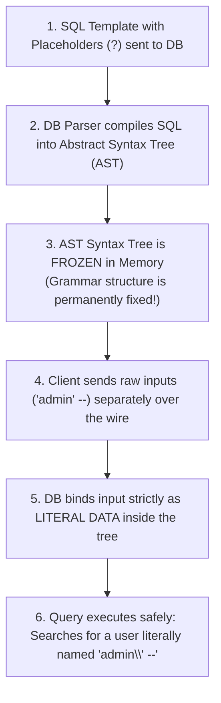

1. **Syntax Tree Freezing:** When the SQL string with `?` placeholders is passed to the database, the parser constructs the **Abstract Syntax Tree (AST)** and freezes its grammar.
2. **Parameters Treated Strictly as Data:** When the parameters (`admin' --`) are transmitted over the wire in a separate network packet, the engine places them directly into the pre-compiled data slots.
3. Even if the parameter contains single quotes, semicolons, or comments, **it is physically impossible for the text to alter the frozen query syntax tree**. It is treated strictly as literal characters.

---

## 13. ⚡ 30-Second Rapid Recall Matrix

| Concept / Trap | 🧠 2-3 Word Memory Hook | What to Speak in the Technical Interview |
| :--- | :--- | :--- |
| **Dirty Read** | Read Uncommitted Rollback | Reading data modified by an uncommitted transaction that later aborts. |
| **Non-Repeatable Read** | Row Value Changed | Reading the same row twice inside a transaction and getting different column values. |
| **Phantom Read** | Range Rows Appeared | Running the same range query twice and finding newly inserted matching rows. |
| **Lost Update** | Overwrite Unread Change | Two transactions update the same row simultaneously; one overwrites the other. |
| **2PL (Two-Phase Locking)** | Grow Then Shrink | Acquires locks in growing phase; cannot acquire any lock once shrinking starts. |
| **Strict 2PL** | Hold X-Locks Till Commit | Holds all Exclusive locks until commit/abort to prevent cascading rollbacks. |
| **Wait-Die Scheme** | Older Waits, Younger Dies | Non-preemptive deadlock prevention where younger transactions die on conflict. |
| **Wound-Wait Scheme** | Older Preempts, Younger Waits | Preemptive deadlock prevention where older transactions forcibly kick out younger ones. |
| **MVCC** | Readers Don't Block Writers | Stores immutable versioned tuples with `xmin`/`xmax` to provide snapshot isolation. |
| **B+ Tree Leaf Links** | Sequential Range Traversal | Leaves form a linked list, enabling fast $\mathcal{O}(\log N + K)$ range queries. |
| **Slotted Page** | Left Slots, Right Records | Page directory grows right; variable-length row records append left. |
| **Buffer Pool** | In-Memory Page Cache | Caches 8KB disk pages in RAM frames; tracks dirty pages and pin counts. |
| **WAL Protocol** | Log Before Page Flush | Log records must hit disk before dirty buffer pages are allowed to flush. |
| **Checkpoint** | Bounds Crash Recovery Time | Periodically flushes dirty pages to disk so crash replay starts from checkpoint. |
| **Lossless Join** | Shared Must Be Key | Decomposition is lossless if $R_1 \cap R_2$ is a candidate key of $R_1$ or $R_2$. |
| **Two-Phase Commit** | Prepare Vote, Global Decision | Distributed transaction protocol; blocking if coordinator dies during phase 2. |
| **Prepared Statement** | Freezes Query AST | Separates SQL syntax tree compilation from data parameter binding to kill SQL injection. |

---
[⬆ Back to Top](#📑-table-of-contents)
