# Transactions & Concurrency Control in DBMS — Master Guide

> 📌 **Quick Revision Anchor**
> - **Transaction:** An indivisible Logical Unit of Work (LUW) comprising `Read`, `Write`, `Commit`, and `Rollback` operations that transitions a database from one consistent state to another.
> - **ACID Guarantee:** **Atomicity** (all-or-nothing via undo logs), **Consistency** (preserves schema constraints and financial invariants), **Isolation** (concurrent transactions execute without interference), and **Durability** (committed updates survive hardware/power crashes via Write-Ahead Logging).
> - **Serializability & Concurrency Control:** While serial execution is safe, it yields poor throughput. Databases interleave transactions concurrently and use **Lock-Based Protocols (Strict 2PL)** or **Timestamp Ordering (BTO / Thomas' Write Rule)** to guarantee that concurrent execution is mathematically equivalent to a serial schedule without incurring anomalies (Dirty Reads, Non-Repeatable Reads, Phantom Reads, Lost Updates).
> - ⏱️ **Interview Speed Run (60-Second Pitch):**
>   *"In multi-user systems like IRCTC or Swiggy, thousands of transactions access shared data concurrently. A transaction executes through six states: Active, Partially Committed, Committed, Failed, Aborted, and Terminated. To avoid anomalies like Dirty Reads and Lost Updates, databases configure ANSI Isolation Levels—Read Uncommitted, Read Committed, Repeatable Read, and Serializable. Under the hood, the engine guarantees Conflict Serializability by maintaining acyclic Precedence Graphs, enforces concurrency through Strict Two-Phase Locking (holding exclusive locks until commit to eliminate cascading aborts) or Timestamp Ordering, and recovers from system crashes using the ARIES three-phase algorithm (Analysis, Redo, Undo) powered by Write-Ahead Logging."*

---

## 📑 Table of Contents
1. [Transaction Fundamentals & Execution Primitives](#1-transaction-fundamentals--execution-primitives)
2. [Real-World Transaction Workflows (Swiggy & Banking)](#2-real-world-transaction-workflows-swiggy--banking)
3. [The 6 Transaction States & Lifecycle State Machine](#3-the-6-transaction-states--lifecycle-state-machine)
4. [ACID Properties Deep Dive & Financial Invariants](#4-acid-properties-deep-dive--financial-invariants)
5. [Concurrency Anomalies & The 4 Operation Combinations](#5-concurrency-anomalies--the-4-operation-combinations)
6. [ANSI SQL-92 Isolation Levels Matrix](#6-ansi-sql-92-isolation-levels-matrix)
7. [Schedules: Classifications & Recoverability Hierarchy](#7-schedules-classifications--recoverability-hierarchy)
8. [Concurrent vs. Parallel Execution Mechanics](#8-concurrent-vs-parallel-execution-mechanics)
9. [Conflict Serializability & Precedence Graph Algorithm](#9-conflict-serializability--precedence-graph-algorithm)
10. [View Serializability & The 3 Equivalence Rules](#10-view-serializability--the-3-equivalence-rules)
11. [Lock-Based Protocols: S/X Locks & Two-Phase Locking (2PL)](#11-lock-based-protocols-sx-locks--two-phase-locking-2pl)
12. [The 4 Variants of 2PL (Strict, Rigorous, Conservative)](#12-the-4-variants-of-2pl-strict-rigorous-conservative)
13. [Timestamp-Based Protocols & Thomas' Write Rule](#13-timestamp-based-protocols--thomas-write-rule)
14. [Crash Recovery Management: WAL, ARIES & Shadow Paging](#14-crash-recovery-management-wal-aries--shadow-paging)
15. [Master Comparison Matrices & High-Yield Interview Traps](#15-master-comparison-matrices--high-yield-interview-traps)

---

## 1. Transaction Fundamentals & Execution Primitives

A **Transaction** is a collection or combination of database operations executed as a single logical unit of work. If any part of the unit fails, the entire transaction is rolled back so the database is never left in a corrupted or partial state.

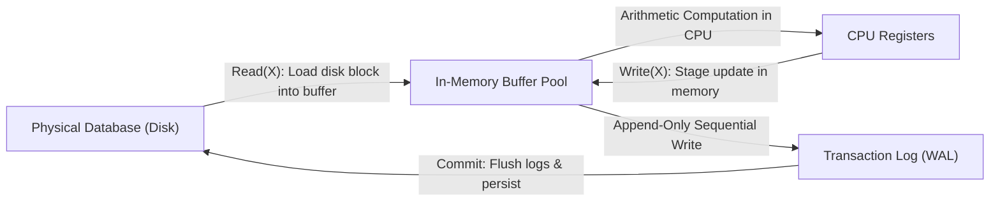

### The 4 Primitive Operations:
- **`Read(X)`**: Retrieves or fetches data item $X$ from the database. It loads the disk page containing $X$ into an in-memory buffer (if not already cached) and assigns its value to a local program variable.
- **`Write(X)`**: Modifies or updates data item $X$ in the database. The modification is applied to the in-memory buffer page, and a log record is appended to the **transaction log**. It is **not** immediately flushed to physical disk.
- **`Commit`**: Signals the successful completion of the entire transaction. All log records are flushed to non-volatile disk (`fsync`), making the modifications permanent and durable.
- **`Rollback` / `Abort`**: Reverts all modifications made by an active or failed transaction using the before-images stored in the transaction logs, returning the database to its pre-transaction state.

---

## 2. Real-World Transaction Workflows (Swiggy & Banking)

### Case Study A: P2P Bank Transfer (Ram to Shyam)
Suppose **Ram** has ₹200 and wants to transfer ₹100 to **Shyam**, who currently has ₹100.

```mermaid
sequenceDiagram
    autonumber
    actor App as Banking Application
    participant Mem as Memory Buffer
    participant Log as Transaction Log (WAL)
    participant DB as Persistent Disk

    App->>Log: BEGIN TRANSACTION T1
    App->>Mem: Read(Ram): Returns 200
    Note over App: Check Funds: Ram balance is at least 100
    Note over App: Compute: Ram_Balance = 200 - 100 = 100
    App->>Mem: Write(Ram, 100)
    App->>Log: Log Entry: [T1, Ram, Old: 200, New: 100]
    App->>Mem: Read(Shyam): Returns 100
    Note over App: Compute: Shyam_Balance = 100 + 100 = 200
    App->>Mem: Write(Shyam, 200)
    App->>Log: Log Entry: [T1, Shyam, Old: 100, New: 200]

    alt All Operations Successful
        App->>Log: COMMIT T1
        Log->>DB: Flush log buffer to disk (Durability guaranteed)
        Note over DB: Ram = 100, Shyam = 200 permanently recorded
    else Network / System Failure Occurs
        App->>Log: ABORT / ROLLBACK T1
        Log->>Mem: Revert Ram to 200, Shyam to 100 using Undo logs
        Note over DB: No partial update persisted; Zero money lost
    end
```

### Case Study B: Food Delivery Checkout (Swiggy / Zomato)
1. **User enters payment details & OTP:**
   - **Scenario 1 (No failure):** Payment gateway captures funds $\rightarrow$ restaurant receives order $\rightarrow$ delivery driver assigned $\rightarrow$ transaction commits.
   - **Scenario 2 (Network failure during OTP validation):**
     - *Case A (Amount not deducted):* Transaction aborts cleanly.
     - *Case B (Amount deducted from bank, but order creation times out):* The transaction rolls back. Swiggy flags the incomplete transaction, triggering an automated refund pipeline crediting the amount back within 24 hours to 7 business days.

---

## 3. The 6 Transaction States & Lifecycle State Machine

A transaction transitions through six well-defined operational states from start to finish:

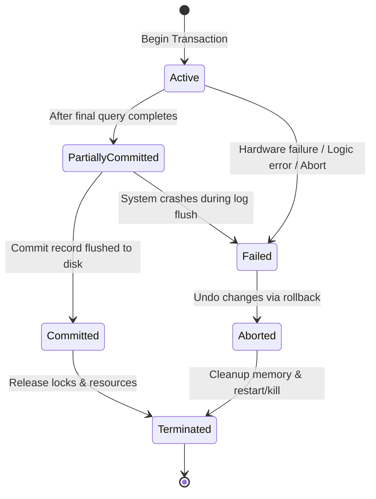

### Operational State Breakdown:
1. **Active:** Initial state upon `BEGIN TRANSACTION`. The transaction executes its `Read` and `Write` operations.
2. **Partially Committed:** Entered immediately after the final statement has executed, but before the commit log record has reached disk. Modifications still reside in volatile memory.
3. **Failed:** Entered when normal execution halts due to hardware failures, constraint violations, divide-by-zero, or deadlock aborts.
4. **Aborted:** The transaction has been rolled back. The database restores modified data to initial values using undo logs. The scheduler may either **restart** the transaction or **discard** it.
5. **Committed:** The transaction has successfully written its commit record to non-volatile disk. Modifications are now permanent and cannot be rolled back.
6. **Terminated:** Final exit state where lock table slots and transaction control blocks are released back to the operating system.

---

## 4. ACID Properties Deep Dive & Financial Invariants

Relational database management systems guarantee data integrity via the four **ACID** properties:

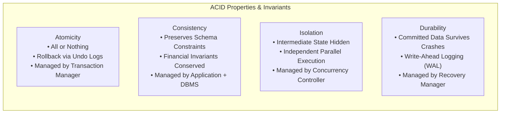

### 1. Atomicity (All-or-Nothing)
- **Rule:** A transaction cannot be partially executed. Either all operations commit successfully, or all changes are rolled back.
- **Enforcement:** The DBMS maintains an **Undo Log**. If a failure occurs before commit, the recovery manager replays the undo logs backward to restore initial values.

### 2. Consistency (Correctness & Invariants)
- **Rule:** A transaction must transition the database from one valid state to another, preserving all declared schema constraints (`PRIMARY KEY`, `FOREIGN KEY`, `CHECK`, `NOT NULL`) and application invariants.
- **Financial Balance Invariant:**
  $$\sum \text{Balances}_{\text{Before}} = \sum \text{Balances}_{\text{After}}$$
  - **Before:** Ram ($₹200$) + Shyam ($₹100$) = **₹300**.
  - **After:** Ram ($₹100$) + Shyam ($₹200$) = **₹300**.
  - System wealth is neither inflated nor destroyed.
- **ATM Cash Analogy:** If you withdraw ₹50 cash, your bank balance decreases by ₹50, and physical cash increases by ₹50. Total net worth remains invariant.

### 3. Isolation (Independent Execution)
- **Rule:** The intermediate operations and uncommitted modifications of transaction $T_1$ must remain completely invisible to concurrent transaction $T_2$ until $T_1$ commits.
- **Enforcement:** Managed by Concurrency Control algorithms (Two-Phase Locking, Timestamp Ordering, MVCC).

### 4. Durability (Survivability of Committed Data)
- **Rule:** Once a transaction commits, its modifications are permanent and will never be lost, even if an immediate hardware crash, operating system failure, or power blackout occurs.
- **Enforcement:** **Write-Ahead Logging (WAL)**. All log records are flushed to non-volatile disk before the user receives a transaction success confirmation.

---

## 5. Concurrency Anomalies & The 4 Operation Combinations

When two concurrent transactions $T_1$ and $T_2$ access the same data item $A$, there are four possible operational combinations:

| Operations ($T_1 \rightarrow T_2$) | Classification | Anomaly Risk | Explanation |
| :--- | :---: | :---: | :--- |
| **Read($A$) followed by Read($A$)** | **Non-Conflicting** | None | Reads never modify data. Order does not impact correctness. |
| **Write($A$) followed by Read($A$)** | **Conflicting** | **Dirty Read** | $T_2$ reads uncommitted data written by $T_1$. If $T_1$ aborts, $T_2$'s data is invalid. |
| **Read($A$) followed by Write($A$)** | **Conflicting** | **Non-Repeatable Read** | $T_1$ reads $A$, then $T_2$ modifies $A$ and commits. $T_1$ re-reads $A$ and observes a changed value. |
| **Write($A$) followed by Write($A$)** | **Conflicting** | **Lost Update / Dirty Write** | $T_2$ blindly overwrites an uncommitted update by $T_1$, destroying $T_1$'s changes. |

---

### Deep Dive: The 5 Concurrency Anomalies

#### A. Dirty Read (Write-Read Anomaly)
Reading data that has been modified by another concurrent transaction that has **not yet committed**.

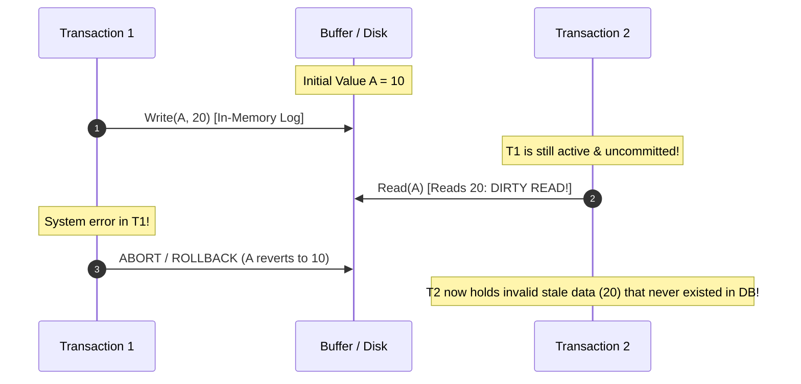

#### B. Non-Repeatable Read / Inconsistent Retrieval (Read-Write-Read)
A transaction reads the exact same row twice and obtains different values because another transaction modified and committed the row between the reads.

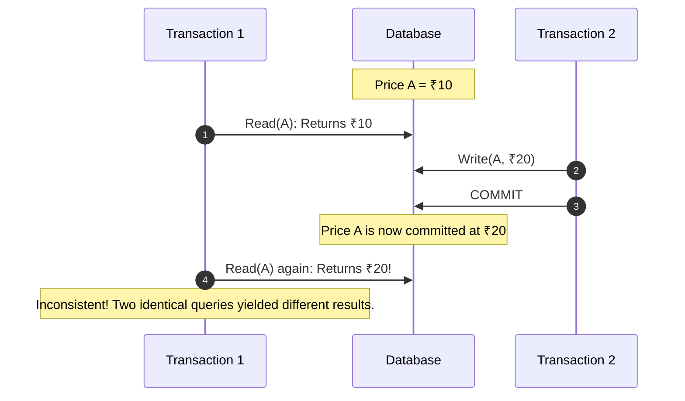

#### C. Phantom Read (Range Query Anomaly)
A transaction re-executes a query returning a set of rows satisfying a condition (`WHERE dept = 10`), but discovers that new rows were inserted or deleted by another committed transaction.

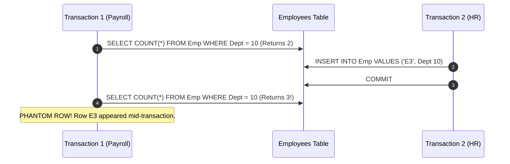

#### D. Lost Update (Write-Write Anomaly)
Two transactions simultaneously read the same record and compute an update. The later commit blindly overwrites the earlier commit, completely losing one transaction's update.

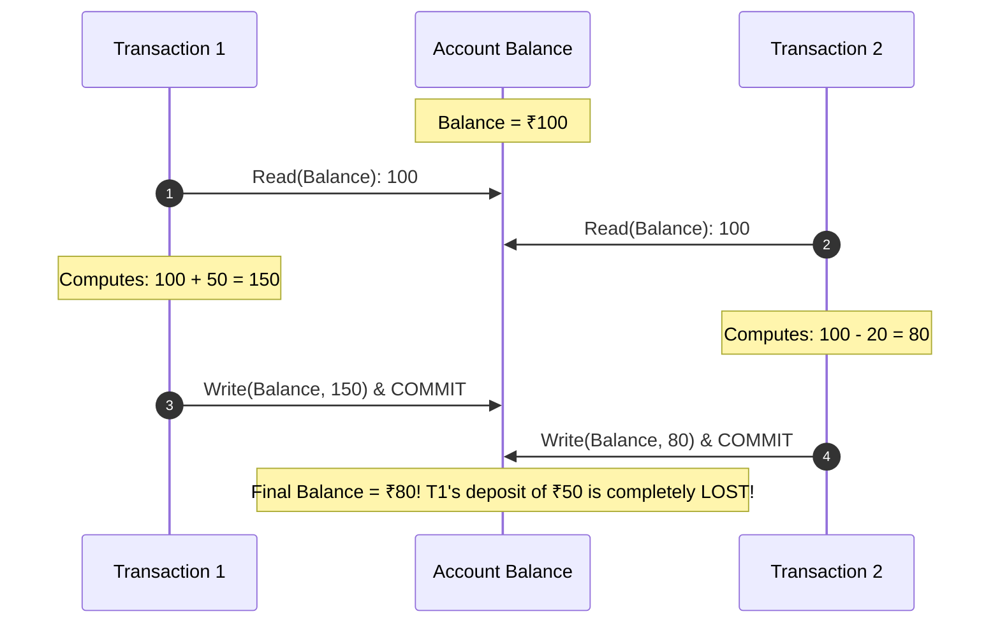

#### E. Dirty Write / Uncommitted Dependency
A transaction overwrites the uncommitted value written by another active transaction. If the first transaction rolls back, it becomes impossible to determine what the correct final value should be.

---

## 6. ANSI SQL-92 Isolation Levels Matrix

ANSI SQL defines four isolation levels offering progressive protection against concurrency anomalies:

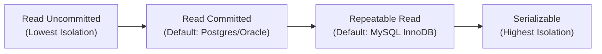

| Isolation Level | Dirty Read | Non-Repeatable Read | Phantom Read | Lost Update | Implementation Mechanism |
| :--- | :---: | :---: | :---: | :---: | :--- |
| **Read Uncommitted** | ❌ Allowed | ❌ Allowed | ❌ Allowed | ❌ Allowed | No S-locks; reads dirty memory pages directly |
| **Read Committed** | ✅ **Prevented** | ❌ Allowed | ❌ Allowed | ❌ Allowed | Short-lived S-locks (released immediately after statement) or per-statement MVCC read view |
| **Repeatable Read** | ✅ **Prevented** | ✅ **Prevented** | ❌ Allowed* | ✅ **Prevented** | Long-lived S-locks held until commit, or transaction-start MVCC snapshot view |
| **Serializable** | ✅ **Prevented** | ✅ **Prevented** | ✅ **Prevented** | ✅ **Prevented** | Strict 2PL + Next-Key/Range Locks or Serializable Snapshot Isolation (SSI) |

*\*Note: MySQL InnoDB prevents Phantom Reads in Repeatable Read for standard `SELECT` queries using MVCC snapshot views, and for locking queries (`SELECT FOR UPDATE`) using Next-Key Locks (Record + Gap Locks).*

---

## 7. Schedules: Classifications & Recoverability Hierarchy

A **Schedule** is the chronological sequence of concurrent operations across multiple transactions.

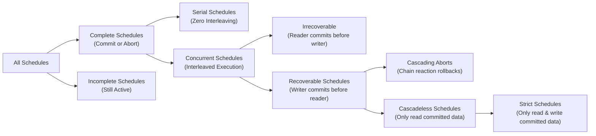

### The Recoverability Hierarchy:
1. **Recoverable Schedule:** If $T_j$ reads data written by $T_i$, then $T_i$ must commit before $T_j$ commits:
   $$\text{Commit}(T_i) < \text{Commit}(T_j)$$
2. **Irrecoverable Schedule:** $T_j$ reads from $T_i$ and commits **before** $T_i$. If $T_i$ subsequently aborts, $T_j$ has already committed based on dirty data. Rolling back $T_j$ is impossible without violating **Durability**.
3. **Cascading Schedule:** One transaction aborts, forcing multiple dependent transactions that read its dirty data to abort in a cascading domino chain reaction.
4. **Cascadeless Schedule:** Transactions are only permitted to read **committed data**. Eliminates cascading aborts entirely!
   $$\forall \text{ Read}_j(A) \text{ after } \text{Write}_i(A) \implies \text{Commit}(T_i) < \text{Read}_j(A)$$
5. **Strict Schedule:** Transactions are prohibited from **Reading OR Writing** a data item until the transaction that previously wrote it has **committed or aborted**. Eliminates both dirty reads and dirty writes.
   $$\forall \text{ Read}_j(A) \text{ or } \text{Write}_j(A) \text{ after } \text{Write}_i(A) \implies \text{Commit/Abort}(T_i) < \text{Op}_j(A)$$

> **Hierarchy Invariant:**
> $$\text{Strict Schedules} \subset \text{Cascadeless Schedules} \subset \text{Recoverable Schedules} \subset \text{All Schedules}$$

---

## 8. Concurrent vs. Parallel Execution Mechanics

A frequent point of interview confusion is distinguishing concurrent scheduling from parallel execution:

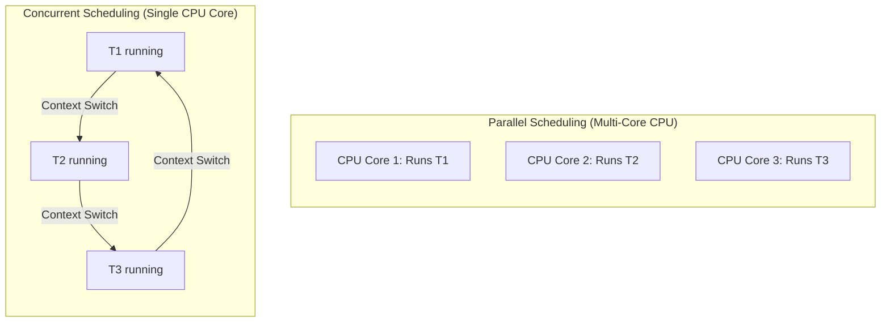

| Dimension | Concurrent Scheduling | Parallel Scheduling |
| :--- | :--- | :--- |
| **Hardware Requirement** | Runs on a single CPU core | Requires a multi-core or multi-processor system |
| **Execution Reality** | Interleaved execution via rapid OS context switching | Truly simultaneous execution at the exact same clock cycle |
| **Illusion vs. Reality** | Creates the *illusion* of simultaneous progress | Physical, hardware-level parallelism |
| **Concurrency Challenges** | Race conditions on shared memory buffers | Cache coherence, bus locking, and race conditions |

---

## 9. Conflict Serializability & Precedence Graph Algorithm

A concurrent schedule is **Conflict Serializable** if it can be transformed into an equivalent serial schedule by iteratively swapping adjacent **non-conflicting operations**.

### Conflicting Operations Definition
Two operations conflict if and only if:
1. They belong to **different transactions** ($T_i \ne T_j$).
2. They operate on the **exact same data item** ($A$).
3. At least one of the operations is a **`Write`**.

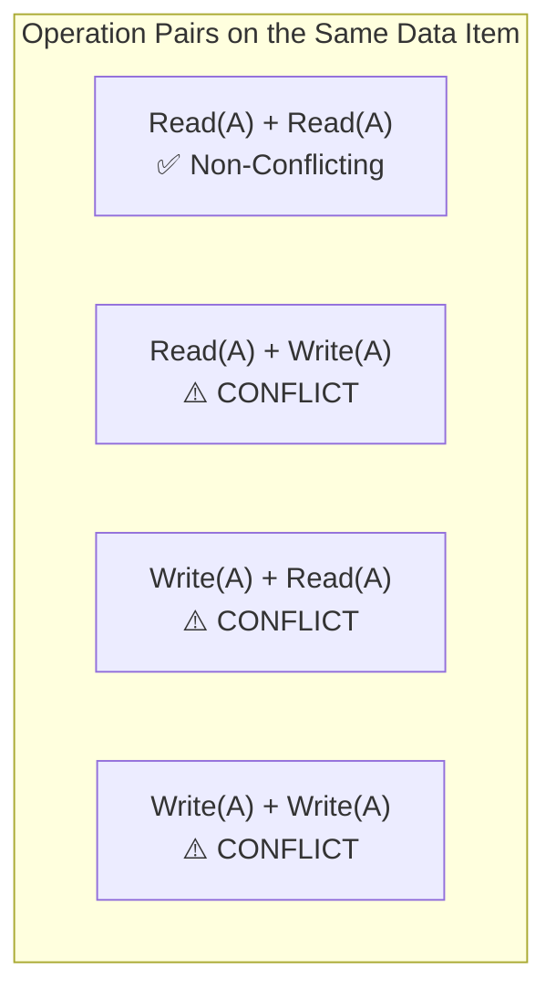

---

### Precedence Graph (Conflict Graph) Construction Algorithm
1. **Vertices ($V$):** Create a node for every transaction $T_i$ in the schedule.
2. **Directed Edges ($E$):** Draw an edge $T_i \rightarrow T_j$ if an operation of $T_i$ executes **before** a conflicting operation of $T_j$ on the same data item.
   - $R_i(A) \rightarrow W_j(A)$
   - $W_i(A) \rightarrow R_j(A)$
   - $W_i(A) \rightarrow W_j(A)$
3. **Cycle Theorem:**
   - **No Cycle (DAG):** The schedule is **Conflict Serializable**.
   - **Cycle Exists:** The schedule is **NOT Conflict Serializable**.
4. **Topological Sort:** Determine the equivalent serial execution order by iteratively removing nodes with **in-degree = 0**.

---

### Step-by-Step Worked Example (From Lecture Transcript)

Consider the schedule $S$ with 3 transactions $\{T_1, T_2, T_3\}$:
```text
S: R1(A) -> R2(A) -> W1(A) -> W3(A) -> W2(B) -> R3(B)
```

#### Step 1: Identify all conflicting pairs across time
- $R_1(A)$ precedes $W_3(A)$ in $T_3$ $\implies$ Edge: $T_1 \rightarrow T_3$
- $R_2(A)$ precedes $W_1(A)$ in $T_1$ $\implies$ Edge: $T_2 \rightarrow T_1$
- $R_2(A)$ precedes $W_3(A)$ in $T_3$ $\implies$ Edge: $T_2 \rightarrow T_3$
- $W_1(A)$ precedes $W_3(A)$ in $T_3$ $\implies$ Edge: $T_1 \rightarrow T_3$ (already present)
- $W_2(B)$ precedes $R_3(B)$ in $T_3$ $\implies$ Edge: $T_2 \rightarrow T_3$ (already present)

#### Step 2: Draw the Precedence Graph

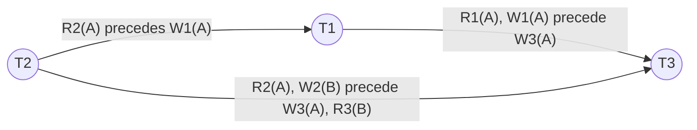

#### Step 3: Check for Cycles & Apply Topological Sort
- **Cycles:** The directed graph is acyclic. Therefore, schedule $S$ is **Conflict Serializable**!
- **In-Degree Calculation:**
  - $\text{In-degree}(T_2) = 0$
  - $\text{In-degree}(T_1) = 1$ (incoming from $T_2$)
  - $\text{In-degree}(T_3) = 2$ (incoming from $T_1, T_2$)
- **Topological Sort Sequence:**
  1. Pick $T_2$ ($\text{in-degree} = 0$). Remove $T_2$ and its outgoing edges.
  2. $\text{In-degree}(T_1)$ becomes $0$. Pick $T_1$. Remove $T_1$ and its outgoing edges.
  3. $\text{In-degree}(T_3)$ becomes $0$. Pick $T_3$.
- **Equivalent Serial Schedule:**
  $$T_2 \longrightarrow T_1 \longrightarrow T_3$$

---

## 10. View Serializability & The 3 Equivalence Rules

When a Precedence Graph contains a directed cycle, the schedule is **not** conflict serializable. However, it may still be **View Serializable** if its final execution view matches some serial schedule.

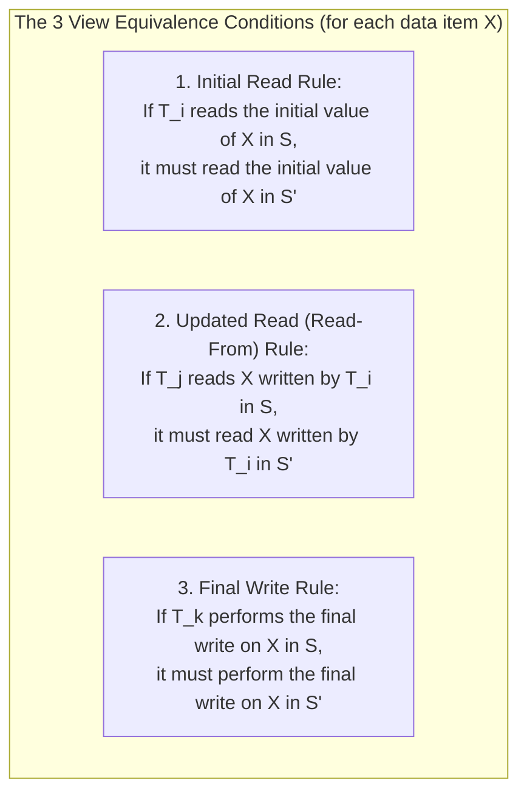

### The Role of Blind Writes
- A **Blind Write** occurs when a transaction executes `Write(X)` without first reading `Read(X)`.
- If a schedule contains **no blind writes** and has a cycle in its precedence graph, it can **never** be View Serializable.
- Blind writes overwrite intermediate values, neutralizing conflicting cycles and making View Serializability possible.

> [!NOTE]
> Testing whether an arbitrary schedule is View Serializable is **NP-Complete**. Production database engines do not test for view serializability at runtime; they enforce Locking or Timestamp protocols that guarantee Conflict Serializability.

---

## 11. Lock-Based Protocols: S/X Locks & Two-Phase Locking (2PL)

To guarantee serializability at runtime without post-execution graph checks, database engines employ **Lock-Based Protocols**.

### Shared ($S$) vs. Exclusive ($X$) Locks:
- **Shared Lock (`Lock-S(A)`):** Acquired for read operations. Multiple transactions can concurrently hold $S$-locks on the same record. Modifications are blocked.
- **Exclusive Lock (`Lock-X(A)`):** Acquired for write operations. Only one transaction can hold an $X$-lock. All other lock requests (Shared or Exclusive) are blocked until released.

| Requested \ Held | Shared ($S$) | Exclusive ($X$) |
| :---: | :---: | :---: |
| **Shared ($S$)** | ✅ **Compatible** | ❌ **Conflict (Wait)** |
| **Exclusive ($X$)** | ❌ **Conflict (Wait)** | ❌ **Conflict (Wait)** |

---

### Two-Phase Locking (2PL) Protocol
2PL guarantees conflict serializability by requiring every transaction to execute in two monotonic phases:

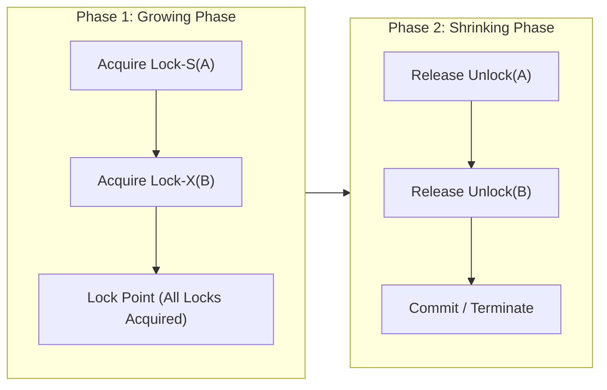

1. **Growing Phase:** A transaction may **acquire** locks, but cannot release any lock.
2. **Lock Point:** The exact timestamp when the transaction acquires its final required lock.
3. **Shrinking Phase:** Once the first lock is released, the transaction enters the shrinking phase. It may **only release** locks; it can **never acquire** a new lock.

---

## 12. The 4 Variants of 2PL (Strict, Rigorous, Conservative)

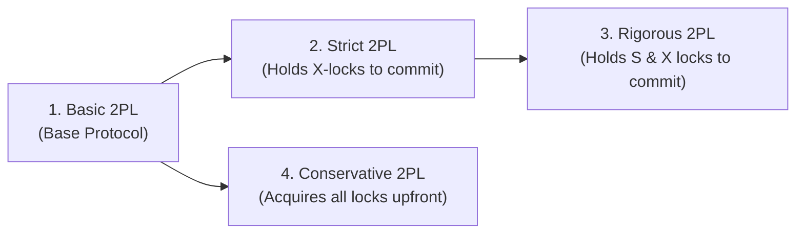

### 1. Basic 2PL
- Can release locks anytime during the shrinking phase before `COMMIT`.
- **Vulnerability:** Vulnerable to cascading rollbacks and deadlocks.

### 2. Strict 2PL (Production RDBMS Standard)
- **Rule:** May release Shared ($S$) locks during shrinking, but must hold **all Exclusive ($X$) locks** until it officially commits or aborts.
- **Benefit:** Completely eliminates **Cascading Aborts** and guarantees **Strict Schedules**.

### 3. Rigorous 2PL
- **Rule:** Must hold **ALL locks (both Shared and Exclusive)** until commit or abort.
- **Benefit:** Guarantees strict serializability and simple crash recovery. Lower concurrency.

### 4. Conservative 2PL (Static 2PL)
- **Rule:** Must declare and acquire **all required locks simultaneously before execution starts**. If any lock is unavailable, it acquires none and waits.
- **Benefit:** **Completely prevents Deadlocks!** (Eliminates Coffman's "Hold and Wait" condition).
- **Drawback:** Impractical for dynamic SQL queries where accessed rows cannot be predicted upfront.

### 2PL Variants Comparison Table

| Property / Guarantee | Basic 2PL | Strict 2PL | Rigorous 2PL | Conservative 2PL |
| :--- | :---: | :---: | :---: | :---: |
| **Conflict Serializability** | ✅ Guaranteed | ✅ Guaranteed | ✅ Guaranteed | ✅ Guaranteed |
| **Cascadeless (No Cascading Aborts)** | ❌ No | ✅ **Guaranteed** | ✅ **Guaranteed** | ❌ No |
| **Strict Schedule Guarantee** | ❌ No | ✅ **Guaranteed** | ✅ **Guaranteed** | ❌ No |
| **Deadlock Free** | ❌ No | ❌ No | ❌ No | ✅ **Guaranteed** |
| **When are $X$-Locks Released?** | Shrinking Phase | At `COMMIT`/`ABORT` | At `COMMIT`/`ABORT` | Shrinking Phase |
| **When are $S$-Locks Released?** | Shrinking Phase | Shrinking Phase | At `COMMIT`/`ABORT` | Shrinking Phase |
| **System Throughput** | High | **Balanced (Production)** | Moderate | Low |

---

## 13. Timestamp-Based Protocols & Thomas' Write Rule

Instead of maintaining lock tables and wait-queues, **Timestamp Ordering** coordinates transactions chronologically according to entry timestamps $TS(T_i)$.

### Data Item Timestamps:
- **$R\text{-}TS(Q)$ (Read Timestamp):** Largest timestamp of any transaction that has successfully executed `Read(Q)`.
- **$W\text{-}TS(Q)$ (Write Timestamp):** Largest timestamp of any transaction that has successfully executed `Write(Q)`.

---

### Basic Timestamp Ordering (BTO) Rules

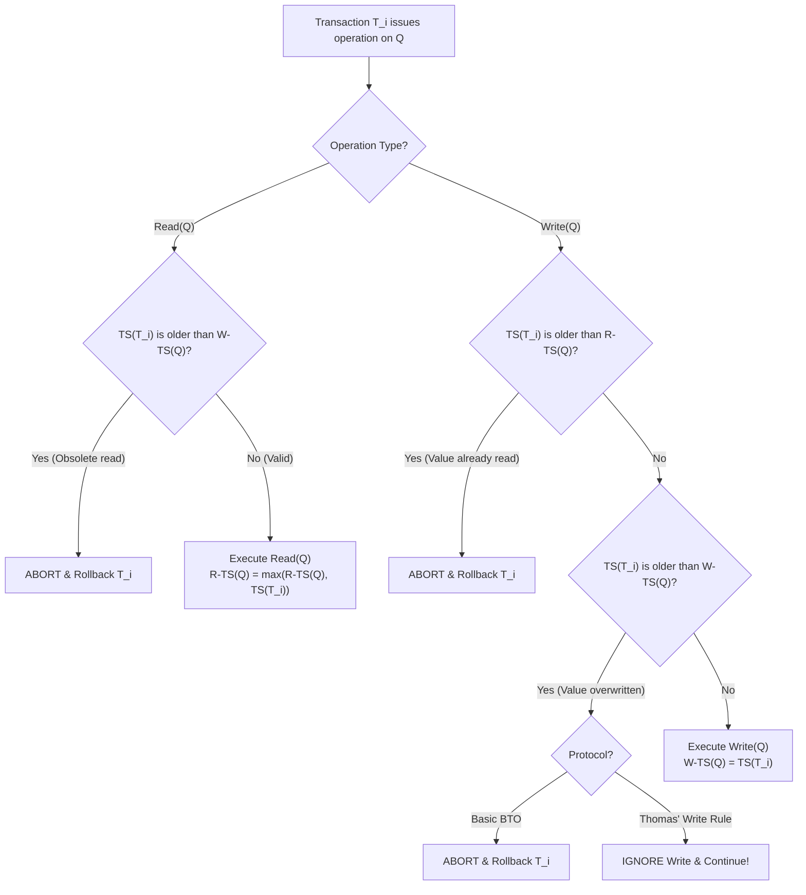

### The Intuition Anchor (Older vs. Younger):
- **Natural Order:** Older transaction executes first $\rightarrow$ Younger transaction executes later. (Valid, no rollback).
- **Temporal Violation:** Younger transaction executes first $\rightarrow$ Older transaction attempts to execute after it. (Older is aborted and rolled back).

### Thomas' Write Rule (View Serializable Optimization)
- In standard BTO, if $TS(T_i) < W\text{-}TS(Q)$, transaction $T_i$ is aborted.
- **Thomas' Write Rule:** If a younger transaction has already overwritten $Q$, then $T_i$'s write is simply **obsolete**. Instead of aborting $T_i$, **ignore the write and continue execution!**
- **Theoretical Impact:** Thomas' Write Rule generates schedules that are **View Serializable** but not conflict serializable, reducing abort frequency.

---

## 14. Crash Recovery Management: WAL, ARIES & Shadow Paging

### The 3 Database Failure Modes:
1. **Transaction Failure:** Logical software error (divide-by-zero, insufficient funds) or deadlock victim selection.
2. **System Crash:** Power outage or OS kernel panic. Volatile memory (RAM buffer pool) is wiped clean; non-volatile disk survives.
3. **Media Failure:** Physical disk head crash or bad sectors. Non-volatile disk is corrupted; requires external backups.

---

### Technique 1: Write-Ahead Logging (WAL)
WAL enforces two golden rules before modifying physical database files:
1. **Undo Rule (Atomicity):** The undo log record (before-image) must be flushed to disk *before* a dirty data page can be written to disk.
2. **Redo Rule (Durability):** All redo log records (after-images) must be flushed to disk *before* `COMMIT` returns success to the client.
- **Buffer Policies:** Enterprise databases use **STEAL** (allows uncommitted dirty pages to flush to disk to free RAM) + **NO-FORCE** (transactions commit without synchronously forcing data pages to disk).

---

### Fast Recovery via Checkpoints
Periodically, the DBMS flushes all dirty buffer pages to disk and writes a `<CHECKPOINT>` record into the log file. During crash recovery, the engine only scans logs written **after the checkpoint**, reducing recovery time from hours to seconds.

---

### The ARIES Recovery Algorithm (3 Phases)

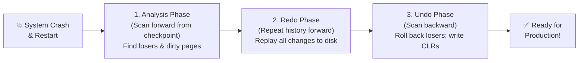

1. **Analysis Phase (Forward Scan):** Reconstructs the Transaction Table (identifying uncommitted "Loser Transactions") and the Dirty Page Table (identifying earliest unwritten pages via `RecLSN`).
2. **Redo Phase ("Repeating History"):** Re-executes the updates of **all transactions** (committed and losers alike) from the minimum `RecLSN` forward to the crash point, restoring physical page consistency.
3. **Undo Phase (Backward Scan):** Reverses all operations executed by Loser Transactions, writing **Compensation Log Records (CLRs)** to ensure idempotency if another crash occurs during recovery.

---

### Technique 2: Shadow Paging
Maintains two page tables: a **Current Page Table** (used by active transactions) and a **Shadow Page Table** (read-only pre-transaction snapshot).
- **On Commit:** Atomically swaps the pointer so the current page table becomes the new shadow page table.
- **On Abort / Crash:** Discards the current page table and reloads the shadow page table pointer. Instantaneous recovery with zero log scanning.
- **Trade-offs:** High disk fragmentation, large page table overhead, and low concurrency.

---

## 15. Master Comparison Matrices & High-Yield Interview Traps

### Concurrency Control Protocols Comparison

| Feature | Lock-Based (Strict 2PL) | Timestamp-Based (BTO) | Shadow Paging |
| :--- | :--- | :--- | :--- |
| **Primary Mechanism** | Shared/Exclusive locks & wait queues | Monotonic transaction timestamps ($TS$) | Copy-on-write page directories |
| **Deadlock Vulnerability** | Vulnerable (requires wait-for graphs) | **Deadlock Free** (no waiting) | **Deadlock Free** |
| **Cascading Aborts** | **Eliminated in Strict 2PL** | Possible (unless combined with strictness)| **Eliminated** |
| **Throughput Under Contention** | High (blocking queues) | Low (frequent rollbacks & restarts) | Low (page-level swapping) |
| **Production Use Case** | PostgreSQL, MySQL, Oracle | Distributed systems (CockroachDB, Spanner)| SQLite (Rollback mode), CouchDB |

---

### High-Yield Placement Traps & FAQs

> [!WARNING]
> **Trap 1: Is a transaction committed as soon as the last SQL statement executes?**
> **No.** It is only in the *Partially Committed* state. It is officially committed only after the commit log record is safely flushed to non-volatile disk via `fsync`.

> [!TIP]
> **Trap 2: How does Thomas' Write Rule achieve View Serializability?**
> By ignoring writes from older transactions when a younger transaction has already overwritten the value ($TS(T_i) < W\text{-}TS(Q)$), Thomas' Write Rule permits blind write schedules that have cycles in their conflict graphs, yet preserve identical final writes and read-from relations.

> [!IMPORTANT]
> **Trap 3: Why do databases use STEAL + NO-FORCE buffer policies?**
> - **STEAL** allows the buffer pool to evict dirty uncommitted pages when RAM is exhausted, maximizing memory utilization.
> - **NO-FORCE** eliminates random synchronous disk writes on every commit by writing only sequential log records to the WAL, boosting write throughput by orders of magnitude.
