# Layers

OSI (Open Systems Interconnection) Model:

*   **_Physical layer_**
*   **_Data layer_**
*   **_Network layer_**
*   **_Transport layer_**
*   **Session layer:**

    - Allows users to establish a session between them.

    *   dialog control: whose turn is to transmit
    *   token management: preventing two parties from attempting the same crucial operation simultaneously
    *   synchronization: checkpointing long transmission to pick up from where they left up off in the event of a crash and subsequent recovery

* **Presentation layer**:
    - Concerned with the syntax and semantics of the information transmitted.
* **_Application layer_**

TCP/IP (Transmission Control Protocol/ Internet Protocol) Reference Model:

*   Link layer (== Data Link layer)
*   Internet layer (== Network layer of OSI)
*   Transport layer 
*   Application layer (= Session + Presentation + Application layer of OSI)

Structure followed in Kurose & Ross, E6 book (_top-down approach_):

*   Application layer
*   Transport layer
*   Network layer
*   Data link layer
*   Physical layer

# Application Layer

## Transport Services Available to Applications

*   Reliable Data Transfer
*   Throughput
*   Timing
*   Security

## TCP Services

- **Connection-oriented Services**: TCP has the client and server exchange
  transport layer control information with each other before the application-level
  messages begin to flow. This so-called handshaking procedure alerts the client
  and server, allowing them to prepare for an onslaught of packets. After the
  handshaking phase, a TCP connection is said to exist between the sockets of the
  two processes. The connection is a full-duplex connection in that the two processes
  can send messages to each other over the connection at the same time. When the
  application finishes sending messages, it must tear down the connection.
- **Reliable data transfer service**: The communicating processes can rely on
  TCP to deliver all data sent without error and in the proper order. When one side
  of the application passes a stream of bytes into a socket, it can count on TCP
  to deliver the same stream of bytes to the receiving socket, with no missing or
  duplicate bytes.

* TCP also includes a congestion-control mechanism.

## UDP Services

* UDP is a no-frills, lightweight transport protocol that provides minimal services.
* UDP is connectionless, so there is no handshaking before communication begins.
* UDP provides an unreliable data transfer service:
  - It does not guarantee that a message will reach the receiving process.
  - Messages that arrive may be out of order.
* UDP does not include congestion control, so the sender can transmit to the network layer at any rate.
* Actual end-to-end throughput may still be lower because of link capacity or network congestion.


## HTTP (HyperText Transfer Protocol)

**_[Hypertext Transfer Protocol (HTTP)](https://www.geeksforgeeks.org/http-non-persistent-persistent-connection/): is an application-level protocol that uses TCP as an underlying transport and typically runs on port 80. HTTP is a stateless protocol i.e. server maintains no information about past client requests._**

* The server sends requested files without storing state about the client.
* If a client requests the same object twice, the server sends the object again because it has forgotten the earlier request.
* HTTP is stateless because the server maintains no information about clients.
* The Web uses the client-server application architecture.
* A Web server is always on, has a fixed IP address, and can service requests from millions of browsers.


### HTTP Message Format

HTTP Request Message


```text
GET /somedir/page.html HTTP/1.1
Host: www.someschool.edu
Connection: close
User-agent: Mozilla/5.0
Accept-language: fr
```

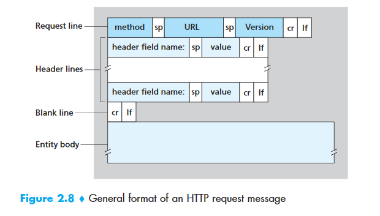


                                Source: Page-105; Kurose & Ross, E6


### HTTP Response Message


```text
HTTP/1.1 200 OK
Connection: close
Date: Tue, 09 Aug 2011 15:44:04 GMT
Server: Apache/2.2.3 (CentOS)
Last-Modified: Tue, 09 Aug 2011 15:11:03 GMT
Content-Length: 6821
Content-Type: text/html

(data data data data data ...)
```


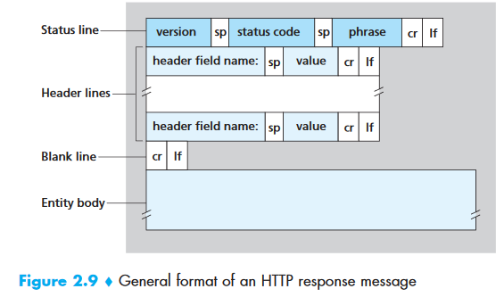

### Common HTTP Status Codes 

* **200 OK**: Request succeeded and the information is returned in the response.

* **301 Moved Permanently**: The object has moved permanently.
  - The new URL is specified in the `Location:` header.
  - The client automatically retrieves the new URL.

* **400 Bad Request**: The request could not be understood by the server.

* **404 Not Found**: The requested document does not exist on the server.

* **505 HTTP Version Not Supported**: The requested HTTP protocol version is not supported by the server.


## File Transfer Protocol (FTP)

**_[File Transfer Protocol (FTP)](https://www.geeksforgeeks.org/computer-network-file-transfer-protocol-ftp/)
: File Transfer Protocol(FTP) is an application layer protocol which moves files
between local and remote file systems. It runs on top of TCP, like HTTP. To transfer
a file, 2 TCP connections are used by FTP in parallel: control connection and data
connection._**


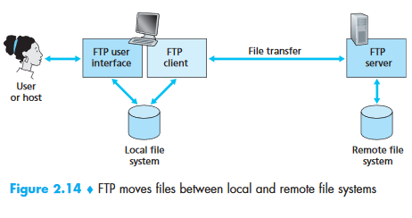


FTP uses two parallel connections to transfer a file:

- control connection
- data connection

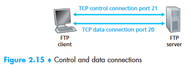


* The control connection sends information such as:
  - User identification and password.
  - Commands to change the remote directory.
  - Commands to put and get files.
* The data connection sends the actual file.

* FTP sends control information **out-of-band** because it uses a separate control connection.
* HTTP sends request and response headers over the same TCP connection as the file, so its control information is **in-band**.
* SMTP also sends control information **in-band**.

* The client initiates a control TCP connection to server port 21.
* The client sends the user identification, password, and directory commands over the control connection.
* When the server receives a file-transfer command, it initiates a TCP data connection to the client.
* FTP sends exactly one file over each data connection and then closes it.
* A new data connection is created for every additional file.
* The control connection remains open for the user session; data connections are non-persistent.

* The FTP server maintains state about each user throughout the session.
* It associates the control connection with a user account.
* It tracks the user’s current directory.
* This per-session state limits the number of simultaneous FTP sessions.
* HTTP is stateless and does not need to track user state.


### FTP Commands and Replies

* `USER username`: Sends the user identification to the server.

* `PASS password`: Sends the user password to the server.

* `LIST`: Requests a list of files in the current remote directory.
  - The list is sent over a new, non-persistent data connection.

* `RETR filename`: Retrieves a file from the remote host’s current directory.
  - The remote host initiates a data connection and sends the file over it.

* `STOR filename`: Stores a file in the remote host’s current directory.


```text
• 331 Username OK, password required
• 125 Data connection already open; transfer starting
• 425 Can't open data connection
• 452 Error writing file
```


## Simple Mail Transfer Protocol (SMTP)

**_[Simple Mail Transfer Protocol (SMTP)](https://www.geeksforgeeks.org/simple-mail-transfer-protocol-smtp/): SMTP is an application layer protocol. The client who wants to send the mail opens a TCP connection to the SMTP server and then sends the mail across the connection. The SMTP server is always on listening mode. As soon as it listens for a TCP connection from any client, the SMTP process initiates a connection on that port (25). After successfully establishing the TCP connection the client process sends the mail instantly._**


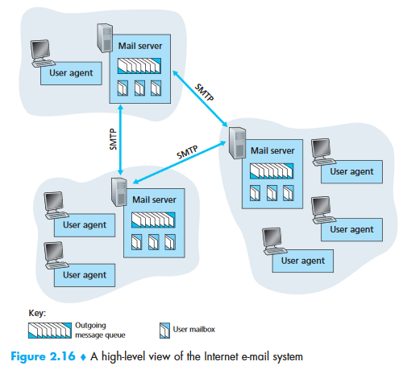

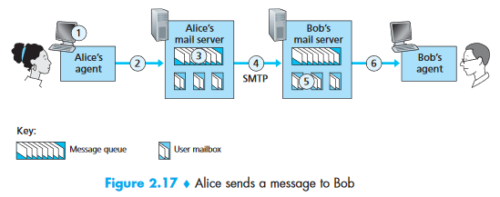


Suppose Alice wants to send Bob a simple message:


1. Alice invokes her user agent for e-mail, provides Bob’s e-mail address (for example, bob@someschool.edu), composes a message, and instructs the user agent to send the message.
2. Alice’s user agent sends the message to her mail server, where it is placed in a message queue.
3. The client side of SMTP, running on Alice’s mail server, sees the message in the message queue. It opens a TCP connection to an SMTP server, running on Bob’s mail server.
4. After some initial SMTP handshaking, the SMTP client sends Alice’s message into the TCP connection.
5. At Bob’s mail server, the server side of SMTP receives the message. Bob’s mail server then places the message in Bob’s mailbox.
6. Bob invokes his user agent to read the message at his convenience.

* SMTP does not generally use intermediate mail servers.
* SMTP uses a persistent connection.

### HTTP vs SMTP

* HTTP is mainly a **pull protocol**:
  - Users pull information from a Web server when needed.
  - The machine receiving the file initiates the TCP connection.
* SMTP is primarily a **push protocol**:
  - The sending mail server pushes the message to the receiving mail server.
  - The machine sending the file initiates the TCP connection.

* SMTP requires each message, including its body, to use 7-bit ASCII.
* Non-ASCII characters and binary data must be encoded into 7-bit ASCII.
* HTTP data does not impose this restriction.

* HTTP encapsulates each object in its own HTTP response message.
* Internet mail places all message objects into **one message**.


### Mail Access Protocols

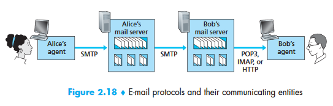


#### POP3 (Post Office Protocol - Version 3)

* POP3 is a simple mail access protocol defined in [RFC 1939].
* Its simple design provides limited functionality.
* The user agent opens a TCP connection to the mail server on port 110.
* POP3 has three phases:
  1. **Authorization**: The user agent sends a username and password in clear text.
  2. **Transaction**: The user retrieves messages, marks or unmarks messages for deletion, and obtains mail statistics.
  3. **Update**: After `quit`, the server deletes messages marked for deletion.

* In a POP3 transaction, the user agent issues commands and the server replies.
* `+OK` indicates that the command succeeded and may be followed by server-to-client data.
* `-ERR` indicates that something was wrong with the command.


#### Internet Mail Access Protocol (IMAP)

* IMAP associates each message with a folder, initially the recipient’s `INBOX`.
* Users can create folders, move messages, read messages, and delete messages.
* IMAP supports searches of remote folders using specific criteria.
* Unlike POP3, IMAP maintains user state across sessions, including folders and message associations.

* IMAP can retrieve individual message components.
* A user agent can request only a message header or one part of a multipart MIME message.
* This is useful over low-bandwidth connections because users can avoid downloading large messages or media files.


#### Web-based E-Mail

* The user agent is an ordinary Web browser that communicates with the mailbox over HTTP.
* A recipient receives messages from the mail server through HTTP rather than POP3 or IMAP.
* A sender submits messages from the browser to the mail server through HTTP rather than SMTP.
* Mail servers still exchange messages with other mail servers using SMTP.


## Domain Name System (DNS)

* DNS translates host names to IP addresses.
* DNS is a distributed database implemented through a hierarchy of name servers.
* DNS is an application-layer protocol for message exchange between clients and servers.

### DNS Services

- Translating host name to IP addresses
- **Host aliasing**: A host with a complicated hostname can have one or more alias names. For example, a hostname such as relay1.west-coast.enterprise.com could have, say, two aliases such as enterprise.com and www.enterprise.com. In this case, the hostname relay1.westcoast.enterprise.com is said to be a canonical hostname.
- **Mail server aliasing**: For obvious reasons, it is highly desirable that e-mail addresses be mnemonic. For example, if Bob has an account with Hotmail, Bob’s e-mail address might be as simple as bob@hotmail.com. However, the hostname of the Hotmail mail server is more complicated and much less mnemonic than simply hotmail.com (for example, the canonical hostname might be something like relay1.west-coast.hotmail.com). DNS can be invoked by a mail application to obtain the canonical hostname for a supplied alias hostname as well as the IP address of the host. In fact, the MX record permits a company’s mail server and Web server to have identical (aliased) hostnames; for example, a company’s Web server and mail server can both be called enterprise.com.
- **Load distribution**: DNS is also used to perform load distribution among replicated servers, such as replicated Web servers. Busy sites, such as cnn.com, are replicated over multiple servers, with each server running on a different end system and each having a different IP address. For replicated Web servers, a set of IP addresses is thus associated with one canonical hostname. The DNS database contains this set of IP addresses. When clients make a DNS query for a name mapped to a set of addresses, the server responds with the entire set of IP addresses, but rotates the ordering of the addresses within each reply. Because a client typically sends its HTTP request message to the IP address that is listed first in the set, DNS rotation distributes the traffic among the replicated servers.

    - DNS rotation is also used for e-mail so that multiple mail servers can share an alias name.
    - Content distribution companies such as Akamai use DNS in more sophisticated ways to provide Web content distribution.


### Overview of How DNS Works

* An application such as a Web browser or mail reader requests translation from the DNS client.
* The request specifies the hostname to translate.
* On many UNIX-based systems, applications use `gethostbyname()` for this lookup.
* DNS sends a query into the network.
* **DNS query and reply messages are sent in UDP datagrams to port 53.**
* After a delay of milliseconds to seconds, DNS returns the requested mapping.
* From the application’s perspective, DNS is a simple translation service.
* Internally, DNS consists of globally distributed servers and an application-layer communication protocol.


## Peer-to-Peer Applications

P2P File Distribution

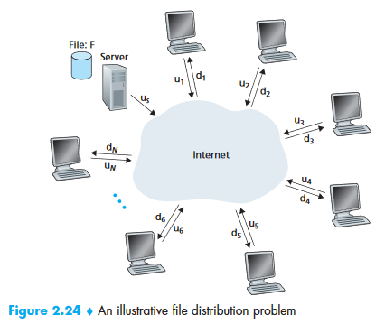


Minimum distribution time:

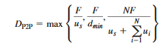


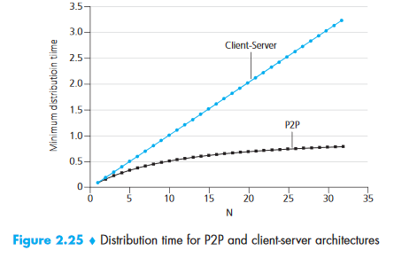


### BitTorrent

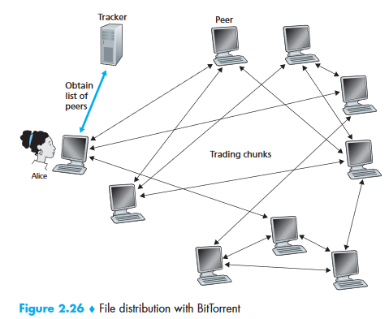


**Decisions**:

_First, which chunks should she request first from her neighbors?_

* Alice uses the **rarest-first** technique when requesting chunks.
* She identifies the chunks she does not have that have the fewest copies among her neighbors.
* She requests those chunks first so they are redistributed quickly.
* This aims to roughly equalize the number of copies of each chunk in the torrent.

_Second, to which of her neighbors should she send requested chunks?_

* Alice prioritizes neighbors that currently supply her data at the highest rate.
* She measures each neighbor’s upload rate and sends chunks to the four fastest peers.
* These four peers are **unchoked**.
* Alice recalculates the rates every 10 seconds.
* Every 30 seconds, she randomly selects one additional neighbor as an **optimistically unchoked** peer.
* Sending data to this peer may cause the peer to send data back to Alice.
* If the exchange is fast enough, both peers may place each other among their top four peers.
* Random selection gives new peers an opportunity to receive chunks and begin trading.
* All other neighbors are **choked** and do not receive chunks from Alice.
* Other BitTorrent mechanisms include pieces, pipelining, random first selection, endgame mode, and anti-snubbing.

The incentive mechanism for trading just described is often referred to as tit-for-tat.


### Distributed Hash-Tables (DHT)

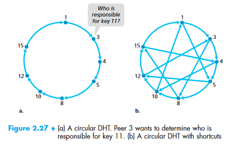


## Socket Programming [KuroseRoss]


## Protocols (Recap)

**[Dynamic Host Configuration Protocol(DHCP)](https://www.geeksforgeeks.org/computer-network-dynamic-host-configuration-protocol-dhcp/)** is an application layer protocol which is used to provide:

Subnet Mask (Option 1 – e.g., 255.255.255.0)

Router Address (Option 3 – e.g., 192.168.1.1)

DNS Address (Option 6 – e.g., 8.8.8.8)

Vendor Class Identifier (Option 43 – e.g., ‘unifi’ = 192.168.1.9 ##where unifi = controller)

**[Simple Network Management Protocol (SNMP)](https://www.geeksforgeeks.org/computer-network-simple-network-management-protocol-snmp/): SNMP is an application layer protocol which uses UDP port number 161/162. SNMP is used to monitor network, detect network faults and sometimes even used to configure remote devices.

**Hypertext Transfer Protocol Secure (HTTPS)**: Cryptographic protocols such as SSL and/or TLS turn _http_ into _https_ i.e. **https** = **http** + **cryptographic protocols**. Also, to achieve this security in _https_, Public Key Infrastructure (PKI) is used because public keys can be used by several Web Browsers while private key can be used by the Web Server of that particular website. The distribution of these public keys is done via Certificates which are maintained by the Browser. You can check these certificates in your Browser settings. Uses port 443.


## UDP Protocols

UDP Header

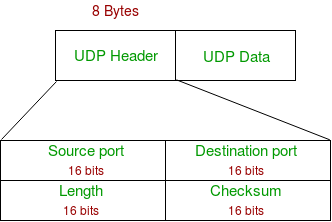

1. **Source Port :** Source Port is 2 Byte long field used to identify port number of source.
2. **Destination Port :** It is 2 Byte long field, used to identify the port of destined packet.
3. **Length :** Length is the length of UDP including header and the data. It is 16-bits field.
4. **Checksum :** Checksum is 2 Bytes long field. It is the 16-bit one’s complement of the one’s complement sum of the UDP header, pseudo header of information from the IP header and the data, padded with zero octets at the end (if necessary) to make a multiple of two octets.

**Notes –** Unlike TCP, Checksum calculation is not mandatory in UDP. No Error control or flow control is provided by UDP. Hence UDP depends on IP and ICMP for error reporting.


*   Following implementation uses UDP as a transport layer protocol:
    *   NTP (Network Time Protocol)
    *   DNS (Domain Name Service)
    *   BOOTP, DHCP.
    *   NNP (Network News Protocol)
    *   Quote of the day protocol
    *   TFTP, RTSP, RIP, OSPF.

**When to use UDP?**

*   Reduce the requirement of computer resources.
*   When using the Multicast or Broadcast to transfer.
*   The transmission of Real-time packets, mainly in multimedia applications.

**NTP (Network Time Protocol)**: The _Network Time Protocol_ (_NTP_) is used to synchronize the time of a computer client or server to another server or reference time source.

RARP

BOOTP

DHCP

Read Protocols from Tanenbaum P465


# Transport Layer

_Source: P185-285 KuroseRossE6_

* The transport layer provides communication services directly to application processes on different hosts.


## Transport Layer Services

* A transport-layer protocol provides **logical communication** between application processes on different hosts.
* From an application’s perspective, the hosts appear to be directly connected.
* In reality, the hosts may be separated by many routers and link types.
* Applications use this logical communication without needing to know the physical infrastructure.
* The transport layer is implemented in end systems, not in intermediate routers.

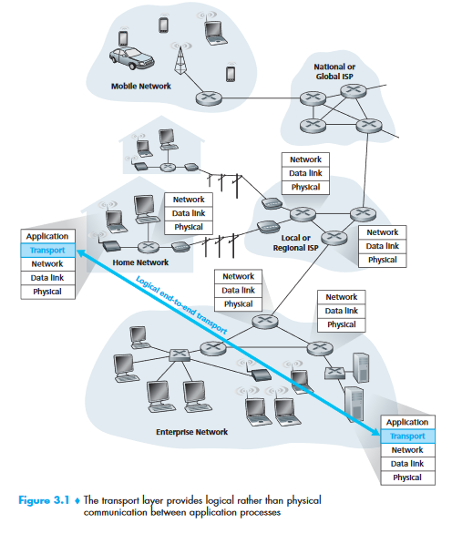


## Relationship Between Transport and Network Layers

application messages = letters in envelopes

processes = cousins

hosts (also called end systems) = houses

transport-layer protocol = Ann and Bill

network-layer protocol = postal service (including mail carriers)


## Overview

* **UDP**: Provides an unreliable, connectionless service to the invoking application.
* **TCP**: Provides a reliable, connection-oriented service to the invoking application.
* In this guide, both TCP and UDP transport-layer packets are called **segments**.
* Internet literature commonly calls a UDP packet a datagram.
* The term **datagram** is reserved here for network-layer packets to avoid ambiguity.

_204_


## Multiplexing and Demultiplexing

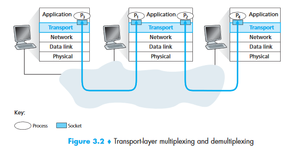


* **Demultiplexing** delivers data from a transport-layer segment to the correct socket.
* **Multiplexing** gathers data from multiple sockets, adds headers, creates segments, and passes them to the network layer.
* Transport-layer multiplexing requires:
  1. Sockets with unique identifiers.
  2. Segment fields that identify the destination socket.
* The source and destination port fields identify the socket.
* Port numbers are 16-bit values ranging from 0 to 65535.
* Ports 0 to 1023 are **well-known port numbers** reserved for protocols such as HTTP (80) and FTP (21).

_What happens if there are two FTP processes running?_

[https://stackoverflow.com/questions/3329641/how-do-multiple-clients-connect-simultaneously-to-one-port-say-80-on-a-server](https://stackoverflow.com/questions/3329641/how-do-multiple-clients-connect-simultaneously-to-one-port-say-80-on-a-server)

[https://superuser.com/questions/1267192/multiple-processes-listening-on-the-same-port-how-is-it-possible](https://superuser.com/questions/1267192/multiple-processes-listening-on-the-same-port-how-is-it-possible) [https://stackoverflow.com/questions/1694144/can-two-applications-listen-to-the-same-port](https://stackoverflow.com/questions/1694144/can-two-applications-listen-to-the-same-port)


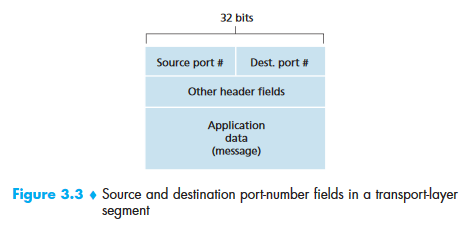


* A TCP socket is identified by a four-tuple:
  - Source IP address.
  - Source port number.
  - Destination IP address.
  - Destination port number.
* A UDP socket is identified by a two-tuple:
  - Destination IP address.
  - Destination port number.


## UDP

* UDP has no handshake between the sending and receiving transport entities.
* UDP is therefore **connectionless**.
* DNS uses UDP.

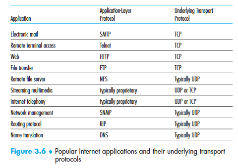


## UDP Segment Structure

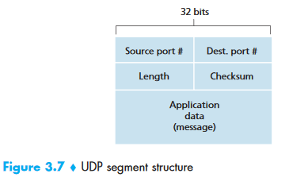


* The length field specifies the number of bytes in the UDP segment, including the header and data.


## UDP Checksum

* The sender computes the one’s complement of the sum of all 16-bit words in the segment.
* Any overflow is wrapped around and added back to the sum.
* Example input words:

0110011001100000

0101010101010101

1000111100001100

The sum of first two of these 16-bit words is

0110011001100000

0101010101010101

Result:

1011101110110101

Adding the third word to the above sum gives

1011101110110101

1000111100001100

Result:

0100101011000010

* Overflow in the final addition is wrapped around.
* The one’s complement changes every 0 to 1 and every 1 to 0.
* The one’s complement of `0100101011000010` is `1011010100111101`, which becomes the checksum.
* The receiver adds all four 16-bit words, including the checksum.
* A result of `1111111111111111` indicates that no error was detected.
* A 0 in the result indicates that an error was introduced.

_What is meant by all 16-bit word segments? => UDP header contents._


## Principles of Reliable Data Transfer

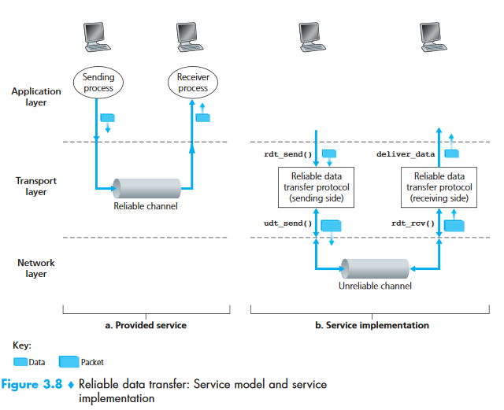


_Study from Kurose & Ross, E6: P204-230_


## TCP


### TCP Connection


*   TCP Connections provides a **full-duplex service.**
*   A TCP connection is also always point-to-point, that is, between a single sender and a single receiver. So-called “multicasting”—the transfer of data from one sender to many receivers in a single send operation—is not possible with TCP. With TCP, two hosts are company and three are a crowd!


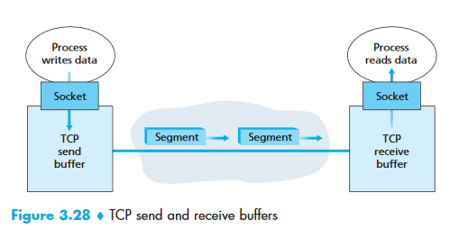


* Each process passes a data stream through its socket to TCP.
* TCP places outgoing data in the connection’s **send buffer**.
* TCP takes chunks from the send buffer and passes them to the network layer.
* TCP may send buffered data in segments at its own convenience.
* The **maximum segment size (MSS)** limits application data in each segment.
* MSS is selected so the TCP segment, IP header, and link-layer header fit within the **maximum transmission unit (MTU)**.
* The typical TCP/IP header overhead is 40 bytes.
* Ethernet and PPP commonly use an MSS of 1,500 bytes.
* MSS is the maximum application data size, not the total TCP segment size.
* TCP adds a header to each data chunk to create a **TCP segment**.
* The network layer encapsulates each segment in an IP datagram.
* At the receiver, TCP places segment data in the connection’s **receive buffer**.
* Each side has its own send buffer and receive buffer.
* A TCP connection consists of buffers, variables, and a process socket at each host.
* Routers, switches, and repeaters do not allocate buffers or variables to the TCP connection.


## TCP Segment Structure

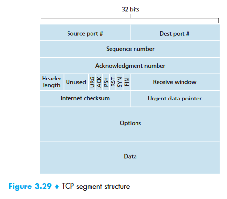


*   **Source and destination port number**: Used for multiplexing/demultiplexing
*   The 32-bit **sequence number field** and the 32-bit **acknowledgment number** field are used by the TCP sender and receiver in implementing a reliable data transfer service
*   The 16-bit **receive window field** is used for flow control.
*   The 4-bit **header length field** specifies the length of the TCP header in 32-bit words. The TCP header can be of variable length due to the TCP options field. (Typically, the options field is empty, so that the length of the typical TCP header is 20 bytes.)
*   The optional and variable-length **options field** is used when a sender and receiver negotiate the maximum segment size (MSS) or as a window scaling factor for use in high-speed networks. A time-stamping option is also defined. See RFC 854 and RFC 1323 for additional details.
*   The **flag field** contains 6 bits.
    *   _The **ACK** bit is used to indicate that the value carried in the acknowledgment field is valid; that is, the segment contains an acknowledgment for a segment that has been successfully received._
    *   _The **RST**, **SYN**, and **FIN** bits are used for connection setup and teardown._
    *   _Setting the **PSH** bit indicates that the receiver should pass the data to the upper layer immediately_.
    *   _Finally, the **URG** bit is used to indicate that there is data in this segment that the sending-side upper-layer entity has marked as “urgent.”_ _The location of the last byte of this urgent data is indicated by the 16-bit urgent data pointer field. TCP must inform the receiving-side upper-layer entity when urgent data exists and pass it a pointer to the end of the urgent data. (In practice, the PSH, URG, and the urgent data pointer are not used.)_


### Sequence Numbers and Acknowledgement Numbers

**Sequence Numbers**

* TCP views data as an unstructured but ordered stream of bytes.
* A segment’s sequence number is the byte-stream number of its first byte.

* TCP implicitly numbers every byte in the data stream.
* For a 500,000-byte file with an MSS of 1,000 bytes and first byte numbered 0:
  - TCP creates 500 segments.
  - The segments receive sequence numbers 0, 1,000, 2,000, and so on.
  - Each sequence number is placed in the corresponding TCP header.

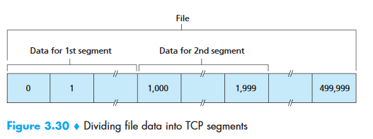


**Acknowledgement Numbers**

* TCP is full-duplex, so each host can send and receive simultaneously.
* The acknowledgment number is the next byte expected from the other host.
* If Host A receives bytes 0 through 535, it acknowledges byte 536.
* If bytes 536 through 899 are missing, Host A still acknowledges byte 536 even after receiving bytes 900 through 1,000.
* TCP therefore provides **cumulative acknowledgments**.
* Both sides randomly choose an initial sequence number to reduce confusion with delayed segments from older connections.
* A sequence number may also be present for a segment without application data.


## Round-Trip Time Estimation and Timeout

* `SampleRTT` is the time between sending a segment to IP and receiving its acknowledgment.
* TCP usually measures one `SampleRTT` at a time, producing approximately one measurement per RTT.
* TCP does not measure `SampleRTT` for retransmitted segments.
* `SampleRTT` varies because of router congestion and end-system load.
* TCP maintains an average called `EstimatedRTT`.


```
EstimatedRTT = (1 – alpha) • EstimatedRTT +  alpha • SampleRTT 
```


* The recommended value of alpha is 0.125.


```
EstimatedRTT = 0.875 • EstimatedRTT +  0.125 • SampleRTT
```


* This average is called an **exponentially weighted moving average (EWMA)**.
* `DevRTT` measures how much `SampleRTT` deviates from `EstimatedRTT`.


```
DevRTT = (1 – β) • DevRTT + β•| SampleRTT – EstimatedRTT |


```


* `DevRTT` is an EWMA of the difference between `SampleRTT` and `EstimatedRTT`.
* Low fluctuation produces a small `DevRTT`; high fluctuation produces a large `DevRTT`.
* The recommended value of beta is 0.25.


```
TimeoutInterval = EstimatedRTT + 4 • DevRTT 
```


* The initial recommended `TimeoutInterval` is 1 second.
* After a timeout, TCP doubles `TimeoutInterval` to avoid premature retransmissions.
* When a segment is acknowledged and `EstimatedRTT` is updated, TCP recomputes `TimeoutInterval` using the formula above.


## Reliable Data Transfer


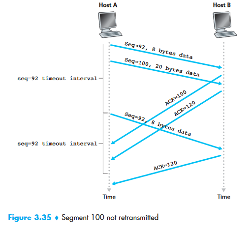

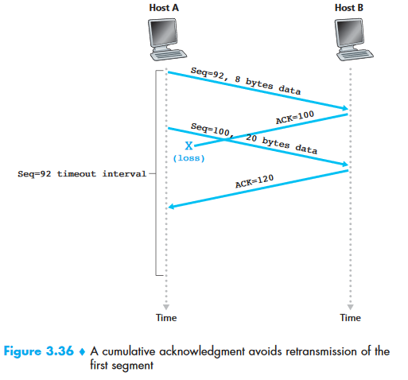

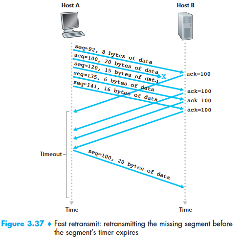


## Flow Control

_Following content is taken from: [https://hpbn.co/building-blocks-of-tcp/](https://hpbn.co/building-blocks-of-tcp/)_

* Flow control prevents a sender from overwhelming a receiver that is busy, overloaded, or using a fixed-size buffer.
* Each side advertises a `receive window (rwnd)` indicating available receive-buffer space.
* Both sides initialize `rwnd` using system defaults.
* For Web downloads, the client’s receive window is often the bottleneck.
* For uploads, the server’s receive window may be the bottleneck.
* A receiver can advertise a smaller window when it cannot keep up.
* A zero window tells the sender to stop until the application clears buffer space.
* ACK packets carry the latest `rwnd`, allowing both sides to adjust their data rate.


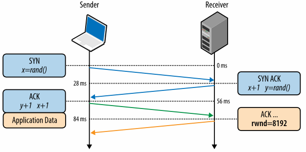


* If Host B advertises `rwnd = 0` and has no data to send, Host A may not learn that space has opened.
* TCP solves this by requiring Host A to send one-byte segments while B’s window is zero.
* B acknowledges these segments.
* Once space is available, an acknowledgment advertises a nonzero `rwnd`.


## TCP Connection Management


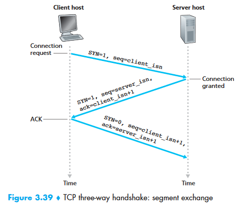


* The client application informs its TCP that it wants to connect to a server process.
* The client and server TCP entities then establish the connection as follows:

_Step 1_:

* The client sends a segment with no application data and `SYN = 1`.
* This is the **SYN segment**.
* The client randomly chooses `client_isn` and places it in the sequence-number field.
* The segment is encapsulated in an IP datagram and sent to the server.
* Randomizing `client_isn` helps prevent security attacks involving delayed segments.

_Step 2:_

* The server extracts the SYN segment and allocates connection buffers and variables.
* The server sends a connection-granted segment with no application data.
* The server sets `SYN = 1`.
* The acknowledgment field is set to `client_isn + 1`.
* The server chooses `server_isn` and places it in the sequence-number field.
* This is the **SYNACK segment**.
* Allocating resources before the handshake completes makes TCP vulnerable to SYN flooding.

_Step 3:_

* The client receives the SYNACK and allocates its connection buffers and variables.
* The client sends an acknowledgment with `server_isn + 1` in the acknowledgment field.
* The client sets `SYN = 0` because the connection is established.
* This third segment may carry client-to-server data.

* After the three steps, both hosts can exchange data segments.
* Future data segments have `SYN = 0`.
* The three packets used to establish the connection are called the **three-way handshake**.


## Principles of Congestion Control


### The Causes and Cost of Congestion

_Kurose & Ross, E6: Page 259-265_


### Approaches to Congestion Control

* **End-to-end congestion control**:
  - The network layer provides no explicit congestion feedback.
  - TCP uses this approach because IP does not provide feedback.
* **Network-assisted congestion control**:
  - Routers provide the sender with explicit feedback about network congestion.

P294


## TCP Congestion Control

`cwnd `= congestion window


```
LastByteSent – LastByteAcked <=  min{cwnd, rwnd} 
```


### Slow Start

TODO

## Recap Before Interview

**TCP Header:**

**	**


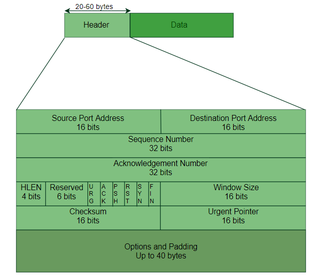


Congestion:

* Congestion is heavy traffic that slows network response time.

Effects of Congestion


*   As delay increases, performance decreases.
*   If the delay increases, retransmission occurs, making the situation worse.

**Congestion control algorithms**

Leaky Bucket Algorithm


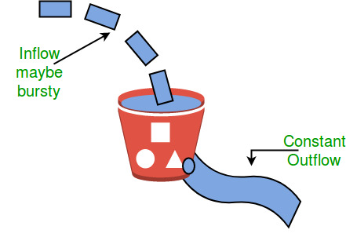


Token Bucket

A different but equivalent formulation is to imagine a network as a bucket that
is being filled. The tap is running at a rate of R, and the bucket has a capacity
of B. To send a packet, we must be able to take out tokens/water from the bucket.

```text

				        Tap

				        | | |
				        | | |       Rate R
				        | | |

			         |		        |   Capacity B
Take out water/tokens|   Bucket	    |
                     |		        |
                     |______________|	
```

### TCP Congestion Policy

1. Slow Start Phase: starts slowly increment is exponential to threshold
2. Congestion Avoidance Phase: After reaching the threshold increment is by 1
3. Congestion Detection Phase: Sender goes back to Slow start phase or Congestion avoidance phase.


### [TCP 3-Way Handshake Process](https://www.geeksforgeeks.org/computer-network-tcp-3-way-handshake-process/)


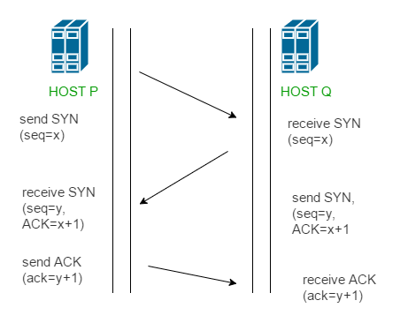


**Step 1 (SYN)** : In the first step, client wants to establish a connection with the server, so it sends a segment with SYN (Synchronize Sequence Number) which informs server that client is likely to start communication and with what sequence number it starts segments with

**Step 2 (SYN + ACK)**: Server responds to the client request with SYN-ACK signal bits set. Acknowledgement(ACK) signifies the response of segment it received and SYN signifies with what sequence number it is likely to start the segments with

**Step 3 (ACK)** : In the final part client acknowledges the response of server and they both establish a reliable connection with which they will start eh actual data transfer.


# Network Layer

_Kurose & Ross, E6: P305-413_


## Forwarding and Routing

* **Forwarding** transfers a packet from an incoming link to an outgoing link within one router.
* **Routing** uses interactions among network routers and routing protocols to determine paths from source to destination.


## Recap Before Interview

* Routing delivers packets from source to destination.

**IPv4**

**IPv6**

**ICMP (Internet Control Message Protocol)**

* IP does not provide a mechanism for sending error and control messages.
* IP depends on ICMP for error control.

	Source quench message

	Parameter problem

	Time exceeded message

	Destination unreachable

* **[Open Shortest Path First (OSPF)](https://www.geeksforgeeks.org/open-shortest-path-first-ospf-router-roles-configuration/)** is a link-state routing protocol.
* OSPF uses its shortest-path-first algorithm to find the best route.

* Designated Router (DR) and Backup Designated Router (BDR) elections occur in broadcast or multi-access networks.

**Criteria for the election:**


1. The Router having the highest router priority will be declared as DR.
2. If there is a tie in router priority then the highest router will be considered. First, the highest loopback address is considered. If no loopback is configured then the highest active IP address on the interface of the router is considered.

* **[Routing Information Protocol (RIP)](https://www.geeksforgeeks.org/computer-network-routing-information-protocol-rip/)** is a dynamic distance-vector routing protocol.
* RIP uses hop count to select a route.
* RIP has an administrative distance of 120.
* RIP operates at the application layer of the OSI model and uses port 520.

**Hop Count **:


1. Hop count is the number of routers occurring in between the source and destination network. The path with the lowest hop count is considered as the best route to reach a network and therefore placed in the routing table.
2. The maximum hop count allowed for RIP is 15 and hop count of 16 is considered as network unreachable.


# Data Link Layer

* The data link layer transforms a raw transmission facility into a link that appears error-free.
* It accomplishes this by dividing transmissions into data frames.


# Physical Layer

* The physical layer transmits raw bits, 0 or 1, over the communication channel.

_Layer topology_

*   Mesh
*   Bus
*   Ring
*   Star

_Transmission Modes_

*   Simplex
*   Half-duplex
*   Full-duplex


<!-- # Structure of Units of Different Layers [TODO] -->


# What happens when google.com is typed into browser?

[https://github.com/alex/what-happens-when](https://github.com/alex/what-happens-when) 


# Others

* A **port** is a communication endpoint.
* Physical and wireless connections terminate at hardware ports.
* In an operating system, a port is a logical construct identifying a process or network service.
* Ports are identified for each protocol and address combination by 16-bit unsigned numbers.
* TCP and UDP are the most common protocols that use port numbers.


# Credits

* Part of this note is based on the Kurose & Ross, E6 book.
* Part of this note is based on the GeeksforGeeks website.
* Part of this note is based on the hpbn.co website.
