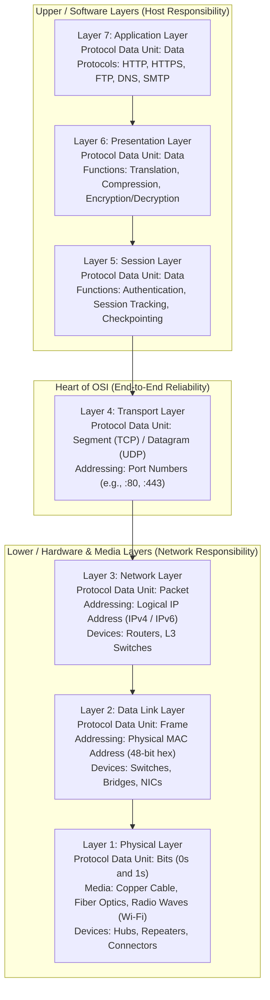
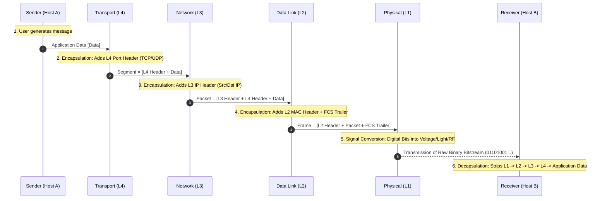
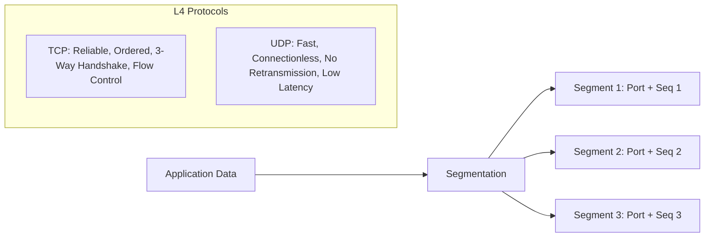
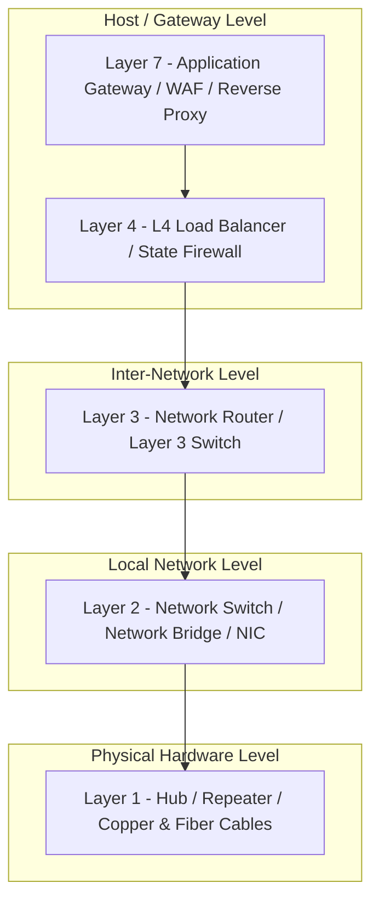
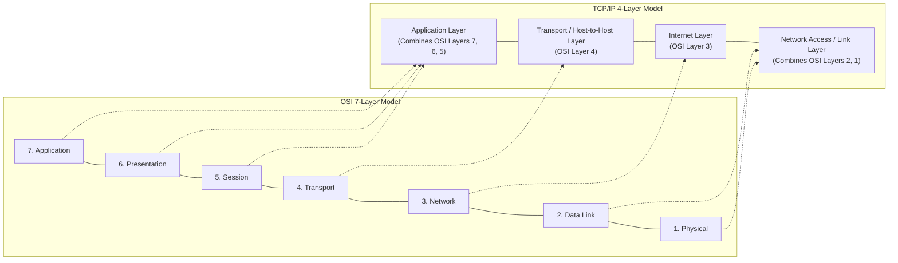

# 🌐 The 7 Layers of the OSI Model — Complete Reference & Visual Guide

> **Reference:** ISO/IEC 7498-1 Standard & TechTerms Networking Reference  
> **Topic:** Open Systems Interconnection (OSI) Reference Model  
> **Scope:** Architecture, Protocol Data Units (PDUs), Encapsulation/Decapsulation, Protocols, Devices & Interview Concepts  

---

## 📌 Executive Overview

The **Open Systems Interconnection (OSI) model** was established by the **International Organization for Standardization (ISO)** in 1984 to standardize computer network communications. It breaks the complex task of network data transmission into **7 distinct logical layers** — ranging from high-level **software application interactions (Layer 7)** down to **physical hardware transmission of raw signals (Layer 1)**.

### 🧠 Core Memory Aids (Mnemonics)

* **Top-Down (Layer 7 → Layer 1):**  
  👉 **A**ll **P**eople **S**eem **T**o **N**eed **D**ata **P**rocessing  
  *(**A**pplication → **P**resentation → **S**ession → **T**ransport → **N**etwork → **D**ata Link → **P**hysical)*

* **Bottom-Up (Layer 1 → Layer 7):**  
  👉 **P**lease **D**o **N**ot **T**hrow **S**ausage **P**izza **A**way  
  *(**P**hysical → **D**ata Link → **N**etwork → **T**ransport → **S**ession → **P**resentation → **A**pplication)*

* **PDU Memory Aid (Layer 7/5 → Layer 1):**  
  👉 **D**on't **S**pill **P**epper on **F**ried **B**acon  
  *(**D**ata → **S**egment → **P**acket → **F**rame → **B**its)*

---

## 🏗️ Visual Architecture: The 7 Layers & PDUs

---

## 🔄 End-to-End Data Encapsulation & Decapsulation

When a client sends data across a network, each layer appends its own control header (and in Layer 2, a trailer). Upon arrival at the receiving host, the reverse process unpacks the headers.

---

## 🔍 Layer-by-Layer Detailed Breakdown

---

### 🌐 Layer 7: Application Layer

* **Primary Role:** Serves as the direct window for **software applications** to access **network services**.
* **Key Concept:** It does **not** refer to the user software GUI application itself (such as **Google Chrome**, **Mozilla Firefox**, or **Microsoft Outlook**), but rather to the **network communication protocols** those applications invoke to exchange information across the network.
* **Common Protocols:**
  * **HTTP / HTTPS (Port 80 / 443):** **Web browsing** and secure REST API communication.
  * **FTP (Port 20 / 21):** **File transfers** for client-server file uploads and downloads.
  * **SMTP (Port 25 / 587):** Outgoing **email transmission** between mail transfer agents.
  * **IMAP (Port 143 / 993) / POP3 (Port 110 / 995):** Protocols for retrieving **email messages** from remote mail servers.
  * **DNS (Port 53):** **Domain name resolution** translating human-readable hostnames (`google.com`) into routable **IP addresses**.
  * **SSH (Port 22):** Secure cryptographic protocol for **remote terminal access** and command execution.
  * **DHCP (Port 67 / 68):** **Dynamic host configuration** for automated **IP address allocation**.

---

### 🎨 Layer 6: Presentation Layer

* **Primary Role:** **Standardizes**, **formats**, **serializes**, and **prepares data** so the **Application Layer** on either end can interpret it regardless of differing internal operating system architectures.
* **Core Functions:**
  1. **Translation & Data Formatting:** Converts disparate character and binary encoding representations (e.g., **ASCII to EBCDIC**, **Unicode / UTF-8 conversion**, and endianness conversions to **Big-Endian Network Byte Order**).
  2. **Data Compression:** Reduces raw data payload size to optimize **bandwidth utilization** and speed up transfers (e.g., **gzip**, **Brotli**, **JPEG**, **MP4**).
  3. **Encryption & Decryption:** Enforces end-to-end data **confidentiality and integrity** by encrypting outgoing application data (e.g., **SSL/TLS handshake**, **AES-256**) and decrypting incoming payloads before presentation.

---

### 🤝 Layer 5: Session Layer

* **Primary Role:** **Opens**, **maintains**, **synchronizes**, and **closes communication sessions** and dialogues between two communicating end systems.
* **Core Functions:**
  1. **Authentication & Authorization:** Verifies **user identity**, manages credentials, and establishes **security permissions** before permitting network communication.
  2. **Session Tracking & Dialogue Separation:** Keeps individual application data streams **isolated and separated** so multiple concurrently executing network applications do not mix up packets; coordinates **half-duplex** or **full-duplex** dialogues.
  3. **Checkpoints & Recovery (Synchronization):** Inserts **synchronization checkpoints** into long-running data streams. If a connection drops unexpectedly mid-transfer (e.g., an 800 MB file drops at 650 MB), the transfer **resumes from the last validated checkpoint** without restarting from the beginning.
* **Representative Technologies:** **RPC (Remote Procedure Call)**, **NetBIOS**, **PPTP**, **SOCKS5** proxy sessions.

---

### 🚚 Layer 4: Transport Layer

* **Primary Role:** Coordinates reliable or best-effort **end-to-end communication**, **segment delivery**, **process-to-process multiplexing**, and **transmission reliability** between host applications.
* **Addressing:** **Port Numbers** (16-bit addressing, ranges 0 to 65535) used to distinguish and route network traffic to specific running **processes and services**.
* **Core Functions:**
  * **Segmentation & Reassembly:** Slices data blocks received from upper layers into smaller, manageable **Segments** and stamps each with **sequence numbers** and **port numbers** so the receiving host can reassemble them in exact order.
  * **Flow Control:** Employs windowing algorithms (e.g., **TCP Sliding Window**) to dynamically throttle transmission speeds to match **receiver buffer capacity**, preventing **buffer overflow**.
  * **Error Control:** Utilizes mathematical **checksums** to detect missing, out-of-order, or damaged segments, triggering **automatic retransmissions (ARQ)** when packets are lost.
* **Core Protocols:**
  * **TCP (Transmission Control Protocol):** **Connection-oriented** (requires a **3-way handshake: SYN, SYN-ACK, ACK**), provides **guaranteed delivery**, **in-order segment sequencing**, **retransmissions**, **flow control**, and **congestion control**.
  * **UDP (User Datagram Protocol):** **Connectionless**, **low-overhead**, **lightweight**, and **high-speed delivery** with no connection establishment, ordering, or retransmissions. Ideal for latency-sensitive applications like **live video streaming**, **DNS queries**, **VoIP**, and **multiplayer gaming**.

---

### 🗺️ Layer 3: Network Layer

* **Primary Role:** Manages **logical addressing** and determines the optimal physical path (**routing**) to transport data packets across different interconnected networks, subnets, and autonomous systems.
* **Protocol Data Unit (PDU):** **Packet**
* **Addressing:** **Logical IP Addresses** (**IPv4:** 32-bit dotted-decimal, e.g., `192.168.1.1`; **IPv6:** 128-bit hexadecimal notation).
* **Core Functions:**
  * **Logical Addressing:** Encapsulates transport segments into **Packets** stamped with **source and destination IP addresses**.
  * **Routing:** Determines the optimal, lowest-cost forwarding path across routers using dynamic **routing protocols** (**OSPF**, **BGP**, **RIP**, **EIGRP**).
  * **Subnetting & Network Segmentation:** Divides contiguous networks into discrete logical subnets using **subnet masks** (such as **255.255.255.0** or **/24** CIDR notation).
  * **Packet Fragmentation & Reassembly:** Breaks oversized packets exceeding the link's **Maximum Transmission Unit (MTU)** (commonly 1500 bytes for Ethernet) into smaller fragments.
* **Key Devices:** **Network Routers** and **Layer 3 Switches**.
* **Key Protocols:** **IPv4**, **IPv6**, **ICMP (ping / traceroute)**, **IGMP**, **IPsec**, **ARP / RARP**.

---

### 🔗 Layer 2: Data Link Layer

* **Primary Role:** Handles error-free, hop-by-hop **node-to-node frame delivery** across the immediate **local network segment (LAN)** over physical transmission media.
* **Protocol Data Unit (PDU):** **Frame**
* **Addressing:** **Physical MAC Addresses** (**Media Access Control**, 48-bit hexadecimal hardware identifier permanently burned into the **NIC**, e.g., `00:1A:2B:3C:4D:5E`).
* **Sub-layers:**
  1. **LLC (Logical Link Control):** Manages **link synchronization**, multiplexes network-layer protocols, and handles flow control.
  2. **MAC (Media Access Control):** Manages hardware addressing and regulates **channel access control**.
* **Core Functions:**
  * **Physical Addressing & Framing:** Wraps network layer packets into discrete **Frames** containing **Source and Destination MAC addresses**, protocol type indicators, and payload data.
  * **Media Access Control (MAC):** Regulates how competing devices gain transmission access to shared physical media to avoid collisions (e.g., **CSMA/CD** for half-duplex Ethernet, **CSMA/CA** for 802.11 Wi-Fi).
  * **Error Detection:** Appends a **Frame Check Sequence (FCS)** trailer computed using **Cyclic Redundancy Check (CRC)**; if checksum mismatch occurs upon arrival, the damaged frame is **silently discarded**.
* **Key Devices:** **Network Switches**, **Network Bridges**, and **Network Interface Cards (NICs)**.
* **Key Protocols:** **Ethernet (IEEE 802.3)**, **Wi-Fi (IEEE 802.11)**, **Point-to-Point Protocol (PPP)**, **VLAN Tagging (IEEE 802.1Q)**.

---

### ⚡ Layer 1: Physical Layer

* **Primary Role:** Transmits and receives raw, unstructured **binary bitstreams (1s and 0s)** over physical hardware transmission media.
* **Protocol Data Unit (PDU):** **Bits**
* **Core Functions:**
  * **Signal Conversion & Encoding:** Converts digital bit patterns into physical signals: **electrical voltage pulses** (copper wire), **optical light pulses** (fiber-optic glass strands), or **modulated radio frequency (RF) waves** (Wi-Fi, Bluetooth, cellular).
  * **Bit Synchronization:** Synchronizes clocks between transmitter and receiver to maintain exact **bit timing and boundaries**.
  * **Transmission Rate & Topology:** Defines transmission speed (**bit/baud rate**) and physical cable topologies (**Star**, **Mesh**, **Bus**, **Ring**).
  * **Duplex Modes:** Determines transmission directionality: **Simplex** (unidirectional), **Half-Duplex** (bidirectional, alternating), or **Full-Duplex** (simultaneous bidirectional).
* **Transmission Media:**
  * **Twisted-Pair Copper:** **Cat5e**, **Cat6**, **Cat6a**, **Cat8 Ethernet cables** terminated with **RJ-45 connectors**.
  * **Fiber-Optic Cables:** **Single-mode fiber (long-haul)** and **multi-mode fiber (LAN)** with **LC / SC connectors**.
  * **Wireless Radio Frequencies:** **2.4 GHz**, **5 GHz**, **6 GHz RF spectra**.
* **Key Hardware:** **Ethernet cables**, **Repeaters**, **Hubs**, **Modems**, **Optical Transceivers (SFP/SFP+)**, and **Physical Connectors**.

---

## 📊 Master Comparison Matrix

| Layer # | Layer Name | PDU | Primary Addressing | Key Protocols | Hardware / Devices | Core Purpose |
|:---:|:---|:---:|:---|:---|:---|:---|
| **7** | **Application** | **Data** | Service Name / Port Mapping | **HTTP, HTTPS, FTP, DNS, SMTP, SSH** | Application Gateway, WAF, Reverse Proxies | User-facing network communication interface |
| **6** | **Presentation** | **Data** | Syntax / Encoding Context | **SSL/TLS, ASCII, UTF-8, JPEG, gzip** | Gateway / Operating System | Data translation, compression, encryption |
| **5** | **Session** | **Data** | Session ID / Token | **RPC, NetBIOS, SOCKS5, PPTP** | Gateway / Host Software | Session establishment, sync & checkpointing |
| **4** | **Transport** | **Segment** (TCP) / **Datagram** (UDP) | **Port Numbers** (16-bit) | **TCP, UDP, SCTP, QUIC** | Layer 4 Load Balancer (HAProxy, Envoy) | Process-to-process delivery & flow control |
| **3** | **Network** | **Packet** | **Logical IP Address** (IPv4 / IPv6) | **IPv4, IPv6, ICMP, BGP, OSPF** | **Routers**, **Layer 3 Switches** | Routing & cross-network logical addressing |
| **2** | **Data Link** | **Frame** | **Physical MAC Address** (48-bit hex) | **Ethernet (802.3), Wi-Fi (802.11), PPP** | **Network Switches**, **Bridges**, **NICs** | Hop-by-hop local frame delivery & CRC error check |
| **1** | **Physical** | **Bits** (0s & 1s) | Physical Signals | **1000BASE-T, RS-232, 802.11 PHY** | **Hubs, Repeaters, Cables, Connectors** | Raw bitstream transmission over hardware media |

---

## 🛠️ Network Devices by Layer

---

## 🎯 Top Interview Questions & Clarifications

### 1. What is the fundamental difference between Layer 2 and Layer 3 devices?
* **Layer 2 Switch:** Operates on **Frames** using **physical MAC addresses**. It builds and inspects a **MAC address table (CAM table)** to forward frames within the **same local subnet / VLAN**. It does not inspect or understand IP addresses.
* **Layer 3 Router (or L3 Switch):** Operates on **Packets** using **logical IP addresses**. It inspects the destination IP and uses a **Routing Table** to forward packets across **different subnets and independent networks**.

### 2. How does the OSI 7-Layer model map to the practical TCP/IP 4-Layer model?
The modern Internet operates on the practical **TCP/IP model** (RFC 1122), which collapses several OSI layers for operational simplicity:

### 3. What is the difference between Flow Control and Congestion Control at Layer 4?
* **Flow Control (End-to-End):** Prevents the **sender from overwhelming the specific receiver**. Governed by the receiver's advertised **receive window (`rwnd`)**.
* **Congestion Control (Network-Wide):** Prevents **all senders combined from overwhelming the intermediate network infrastructure** (routers, switches, buffers). Governed by the sender's calculated **congestion window (`cwnd`)** using algorithms like **Slow Start**, **Congestion Avoidance**, **Fast Retransmit**, and **Fast Recovery**.

### 4. What is a Subnet Mask and why is it used at Layer 3?
* A **Subnet Mask** (e.g., **`255.255.255.0`** or **/24** in CIDR notation) is a 32-bit value that splits an IP address into two distinct portions:
  1. **Network ID:** Identifies the specific logical network or subnet.
  2. **Host ID:** Identifies the specific device or interface on that subnet.
* **Why it matters:** It enables network routers and hosts to immediately determine whether a destination IP address is inside the **local subnet** (delivered directly via **Layer 2 ARP and MAC frame**) or on a **remote network** (forwarded to the **Default Gateway router**).
