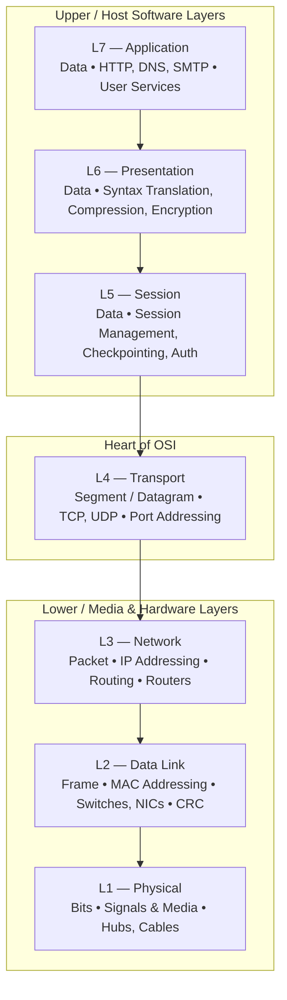
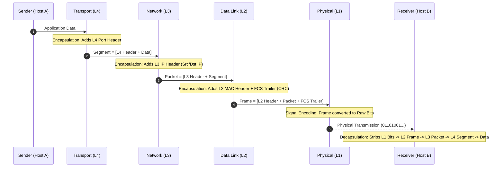
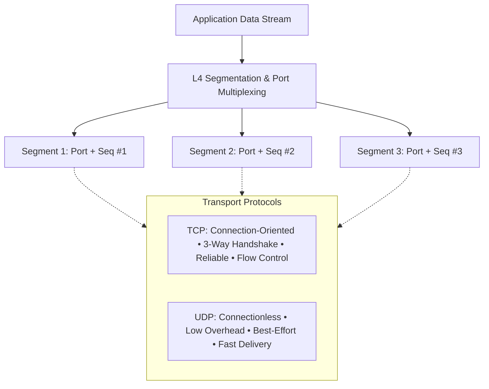
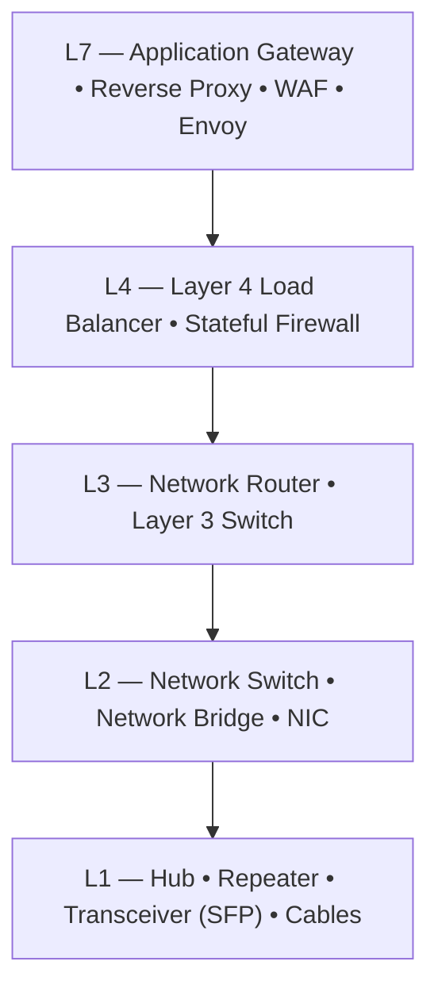
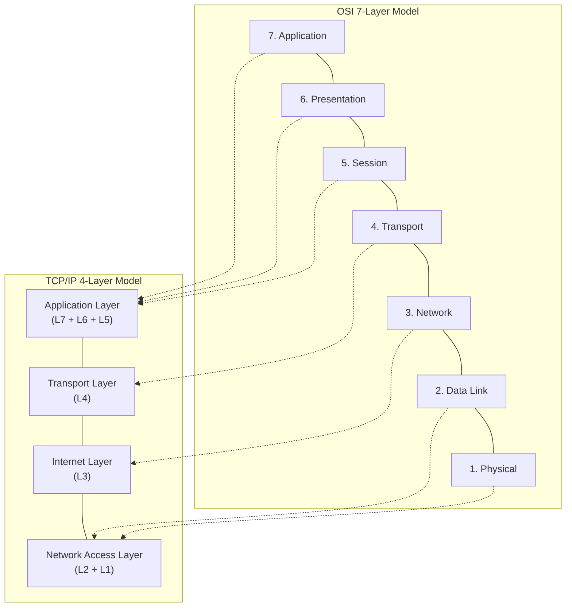

# 🌐 The 7 Layers of the OSI Model — Complete Reference & Visual Guide

> **Reference:** ISO/IEC 7498-1 Standard & TechTerms Networking Reference  
> **Topic:** Open Systems Interconnection (OSI) Reference Model  
> **Target Audience:** 7th-Semester CSE / Tech Placements / Core Networking Interviews  

---

## 📌 Executive Overview

The **Open Systems Interconnection (OSI) model** is a theoretical, modular framework established by the **International Organization for Standardization (ISO)** in 1984 to standardize computer network communications.

It partitions network communications into **7 distinct, logical layers** structured hierarchically:
* **Upper / Software Layers (Layers 7–5):** Handled entirely by the host operating system and application software.
* **Heart of OSI (Layer 4):** Bridges software applications with underlying network hardware; guarantees end-to-end transport integrity.
* **Lower / Media & Hardware Layers (Layers 3–1):** Governed by networking hardware, routers, switches, and physical transmission media.

### 🧠 Core Memory Aids (Mnemonics)

* **Top-Down (Layer 7 → Layer 1):**  
  👉 **A**ll **P**eople **S**eem **T**o **N**eed **D**ata **P**rocessing  
  *(**A**pplication → **P**resentation → **S**ession → **T**ransport → **N**etwork → **D**ata Link → **P**hysical)*

* **Bottom-Up (Layer 1 → Layer 7):**  
  👉 **P**lease **D**o **N**ot **T**hrow **S**ausage **P**izza **A**way  
  *(**P**hysical → **D**ata Link → **N**etwork → **T**ransport → **S**ession → **P**resentation → **A**pplication)*

* **Protocol Data Unit (PDU) Mnemonic (L7/5 → L1):**  
  👉 **D**on't **S**pill **P**epper on **F**ried **B**acon  
  *(**D**ata → **S**egment → **P**acket → **F**rame → **B**its)*

---

## 🏗️ Visual Architecture: The 7 Layers & PDUs

---

## 🔄 End-to-End Data Encapsulation & Decapsulation

When a host transmits data, each layer encapsulates the payload by prepending a protocol header (and appending a trailer at Layer 2). The receiving host decapsulates the headers in reverse order.

---

## 🔍 Layer-by-Layer Detailed Breakdown

---

### Layer 7: Application Layer

**Primary Role**
* Serves as the direct interface between user software applications and network services.
* Does **not** represent the end-user GUI application itself (e.g., Chrome, Outlook), but rather the **application-level network protocols** invoked by that software.

**Protocol Data Unit (PDU)**
* **Data**

**Addressing**
* Service Name / URL / Fully Qualified Domain Name (FQDN) mapped to port numbers.

**Core Functions**
* **Application Service Interface:** Provides standardized network APIs for file exchange, web access, and messaging.
* **Resource Identification & Location:** Identifies remote communication partners and validates service availability.
* **User Authentication:** Validates user identity and application credentials at the entry gateway.

**Key Protocols & Port Numbers**
* **HTTP (Port 80) / HTTPS (Port 443):** Web communication and stateless REST API transport over TLS.
* **DNS (Port 53):** Resolves human-readable domain names into machine-routable IP addresses (UDP for queries, TCP for zone transfers).
* **FTP (Port 20 / 21):** Client-server file transfer (Port 21 for control/commands, Port 20 for data).
* **SMTP (Port 25 / 587):** Push protocol for outgoing email transfer between Mail Transfer Agents (MTAs).
* **IMAP (Port 143 / 993) / POP3 (Port 110 / 995):** Pull protocols for retrieving stored email messages from remote mail servers.
* **SSH (Port 22):** Encrypted cryptographic protocol for remote terminal administration and secure file copy (SFTP/SCP).
* **DHCP (Port 67 / 68):** Automated client configuration protocol dynamically assigning IP addresses, subnet masks, and default gateways.

**Key Devices**
* **Application Gateways**, **Web Application Firewalls (WAF)**, and **Reverse Proxies** (NGINX, Envoy).

---

### Layer 6: Presentation Layer

**Primary Role**
* Standardizes, serializes, and formats data syntax between disparate operating systems.
* Ensures application data sent from one host is completely interpretable by the receiving host's application layer.

**Protocol Data Unit (PDU)**
* **Data**

**Addressing**
* Data format schemas, MIME types, character encoding schemes.

**Core Functions**
* **Data Translation & Formatting:** Translates between different character encodings and machine formats (e.g., **ASCII to EBCDIC**, **Unicode / UTF-8**, and host endianness to **Big-Endian Network Byte Order**).
* **Data Compression:** Minimizes payload byte sizes to optimize bandwidth utilization and lower latency (e.g., **gzip**, **Brotli**, **zlib**, **JPEG**, **MP4**).
* **Encryption & Decryption:** Manages cryptographic transformations for confidentiality, integrity, and non-repudiation (e.g., **TLS/SSL cryptographic negotiation**, **AES-256**, **RSA/ECC key exchange**).

**Key Standards & Formats**
* **Text / Serialized Data:** JSON, XML, Protocol Buffers (Protobuf), ASN.1.
* **Media Formats:** JPEG, PNG, MP4, H.264, MP3.
* **Security Standards:** TLS 1.3 / SSL, X.509 Digital Certificates.

---

### Layer 5: Session Layer

**Primary Role**
* Establishes, maintains, coordinates, and terminates dialogues (sessions) between communicating applications.

**Protocol Data Unit (PDU)**
* **Data**

**Addressing**
* Session IDs, Connection Tokens, RPC channel descriptors.

**Core Functions**
* **Session Establishment & Teardown:** Manages the full lifecycle of a logical communication session between endpoints.
* **Authentication & Authorization:** Validates user identity and session permissions prior to accepting ongoing data streams.
* **Session Tracking & Dialogue Separation:** Isolates data streams belonging to different concurrent application threads, preventing packet crossover.
* **Dialogue Control:** Regulates conversation directionality:
  * **Simplex:** One-way communication only (e.g., sensor telemetry).
  * **Half-Duplex:** Two-way communication, but only one party transmits at a time (e.g., walkie-talkie).
  * **Full-Duplex:** Simultaneous bidirectional communication (e.g., telephone call).
* **Synchronization & Checkpointing (Recovery):** Injects checkpoints into long data streams; if a transmission drops, transfer resumes from the last confirmed checkpoint rather than restarting from byte zero.

**Representative Technologies & Protocols**
* **RPC (Remote Procedure Call):** Executes procedures across separate address spaces.
* **NetBIOS:** Network Basic Input/Output System session management in legacy Windows environments.
* **PPTP (Point-to-Point Tunneling Protocol):** VPN tunnel management.
* **SOCKS5:** Proxy protocol facilitating secure client-server socket handshakes.

---

### Layer 4: Transport Layer

**Primary Role**
* Manages **end-to-end communication**, **process-to-process multiplexing**, **segmentation**, and **transmission reliability** between host applications.

**Protocol Data Unit (PDU)**
* **Segment** (TCP) / **Datagram** (UDP)

**Addressing**
* **Port Numbers** (16-bit unsigned integers: `0` to `65535`):
  * **Well-Known Ports:** `0 – 1023` (HTTP 80, HTTPS 443, SSH 22).
  * **Registered Ports:** `1024 – 49151` (MySQL 3306, PostgreSQL 5432).
  * **Dynamic / Ephemeral Ports:** `49152 – 65535` (client source ports assigned by OS).

**Core Functions**
* **Process-to-Process Multiplexing & Demultiplexing:** Uses source and destination port numbers combined with IP addresses (forming a **Socket: `IP:Port`**) to direct incoming packets to the exact target process.
* **Segmentation & Reassembly:** Splits large application data blocks into smaller segments conforming to the network **Maximum Transmission Unit (MTU)**; assigns sequence numbers so the receiver can reconstruct the stream in exact order.
* **Flow Control (End-to-End):** Implements dynamic sliding-window mechanisms (e.g., **TCP Sliding Window**) to match transmission speed to receiver buffer capacity, preventing receiver buffer overflow.
* **Error Control & Reliability:** Uses 16-bit **checksums** for corruption detection and **Automatic Repeat Request (ARQ)** for selective or cumulative retransmission of dropped segments.
* **Congestion Control (Network-Wide):** Dynamically adjusts sending rates to prevent overloading intermediate network routers and switches (e.g., Slow Start, Congestion Avoidance, Fast Retransmit, Fast Recovery).

**Core Protocols: TCP vs. UDP**

* **TCP (Transmission Control Protocol):**
  * **Connection-Oriented:** Requires a **3-Way Handshake (SYN → SYN-ACK → ACK)** before data transfer and a **4-Way Handshake (FIN → ACK → FIN → ACK)** for clean termination.
  * **Reliable:** Guarantees delivery via positive ACKs and retransmissions.
  * **Ordered:** Sequence numbers guarantee packets are reassembled in original order.
  * **Use Cases:** Web (HTTP/HTTPS), File Transfer (FTP), Email (SMTP), Remote Login (SSH).
* **UDP (User Datagram Protocol):**
  * **Connectionless:** No handshake, no state maintenance, zero connection overhead.
  * **Unreliable / Best-Effort:** No retransmission, no sequence numbers, no flow or congestion control.
  * **Low Latency & High Speed:** 8-byte fixed header (versus TCP's 20–60 byte header).
  * **Use Cases:** DNS lookups, VoIP, Live Video Streaming (RTP/WebRTC), Online Multiplayer Gaming.

**Key Devices**
* **Layer 4 Load Balancers** (HAProxy in TCP mode, AWS NLB), **Stateful Packet Inspection Firewalls**.

---

### Layer 3: Network Layer

**Primary Role**
* Handles **logical addressing**, **packet forwarding**, and **routing** across distinct, interconnected networks and subnets.

**Protocol Data Unit (PDU)**
* **Packet**

**Addressing**
* **Logical IP Addresses:**
  * **IPv4:** 32-bit dotted-decimal notation (e.g., `192.168.1.1`), providing $\approx 4.3 \times 10^9$ addresses.
  * **IPv6:** 128-bit hexadecimal notation (e.g., `2001:0db8:85a3::8a2e:0370:7334`), providing $3.4 \times 10^{38}$ addresses.

**Core Functions**
* **Logical Addressing:** Encapsulates transport segments into Packets, stamping source and destination IP addresses.
* **Routing:** Evaluates network topology via routing protocols to compute the optimal, lowest-cost forwarding path across autonomous systems.
* **Packet Forwarding:** Inspects the destination IP of incoming packets and matches it against a local **Routing Table** to forward the packet out the appropriate egress interface.
* **Subnetting & Network Segmentation:** Divides contiguous networks into smaller, isolated logical subnets using **subnet masks** (e.g., `255.255.255.0` or `/24` in CIDR notation).
* **Packet Fragmentation & Reassembly:** Splits oversized packets exceeding the egress link's **Maximum Transmission Unit (MTU)** (typically 1500 bytes for standard Ethernet); includes Fragment Offset and Flags (`DF` - Don't Fragment, `MF` - More Fragments).

**Key Protocols**
* **Routed Protocols:** **IPv4**, **IPv6**.
* **Control & Diagnostics:** **ICMP** (Internet Control Message Protocol: `ping`, `traceroute`), **IGMP** (multicast group management).
* **Routing Protocols (Interior):** **OSPF** (Open Shortest Path First - link-state), **RIP** (Routing Information Protocol - distance-vector), **EIGRP**.
* **Routing Protocols (Exterior):** **BGP** (Border Gateway Protocol - path-vector protocol powering Internet inter-AS routing).
* **Address Resolution:** **ARP** (Address Resolution Protocol: resolves IPv4 address to Layer 2 MAC address), **RARP** (Reverse ARP).
* **Security:** **IPsec** (Authentication Header `AH`, Encapsulating Security Payload `ESP`).

**Key Devices**
* **Routers**, **Layer 3 Switches**, **BGP Edge Gateways**.

---

### Layer 2: Data Link Layer

**Primary Role**
* Guarantees error-free, hop-by-hop **node-to-node frame delivery** across the immediate **local network segment (LAN)** over physical communication media.

**Protocol Data Unit (PDU)**
* **Frame**

**Addressing**
* **Physical MAC Addresses (Media Access Control):** 48-bit hexadecimal hardware identifier permanently burned into the Network Interface Card (NIC) by the manufacturer (e.g., `00:1A:2B:3C:4D:5E`):
  * **First 24 bits:** Organizationally Unique Identifier (OUI, vendor code assigned by IEEE).
  * **Last 24 bits:** Device-specific Network Interface Controller serial number.

**Sub-layers**
1. **LLC (Logical Link Control - IEEE 802.2):**
   * Acts as the interface between the hardware MAC sub-layer and the software Network layer.
   * Manages flow control, frame synchronization, and protocol multiplexing (EtherType field).
2. **MAC (Media Access Control - IEEE 802.3 / 802.11):**
   * Regulates physical access to the transmission medium.
   * Handles physical addressing, frame delimiting, and collision detection/avoidance.

**Core Functions**
* **Framing:** Encapsulates network layer IP packets into discrete frames by adding a **Frame Header** (Preamble, Source/Dest MAC, EtherType) and a **Frame Trailer**.
* **Media Access Regulation:** Manages access to shared transmission channels to prevent and resolve packet collisions:
  * **CSMA/CD (Carrier Sense Multiple Access with Collision Detection):** Used in legacy half-duplex Ethernet; aborts transmission upon collision and waits a random backoff time.
  * **CSMA/CA (Carrier Sense Multiple Access with Collision Avoidance):** Used in 802.11 Wi-Fi networks; utilizes RTS/CTS handshakes before transmission to avoid collisions.
* **Error Detection:** Appends a 4-byte **Frame Check Sequence (FCS)** trailer computed using **Cyclic Redundancy Check (CRC-32)**; if a mathematical mismatch occurs upon reception, the corrupted frame is **silently dropped** (retransmission is left to Layer 4 TCP).
* **VLAN Tagging:** Inserts **IEEE 802.1Q tags** into Ethernet frames for virtual LAN isolation.

**Key Protocols**
* **Ethernet (IEEE 802.3)**, **Wi-Fi (IEEE 802.11)**, **Point-to-Point Protocol (PPP)**, **HDLC**, **Frame Relay**, **Spanning Tree Protocol (STP / RSTP - IEEE 802.1D/w)**.

**Key Devices**
* **Layer 2 Network Switches**, **Network Bridges**, **Network Interface Cards (NICs)**.

---

### Layer 1: Physical Layer

**Primary Role**
* Transmits and receives raw, unstructured **binary bitstreams (1s and 0s)** over physical hardware transmission media.

**Protocol Data Unit (PDU)**
* **Bits**

**Addressing**
* None (operates purely on physical electrical, optical, and radio signals).

**Core Functions**
* **Signal Encoding & Modulation:** Converts digital bits into physical phenomena:
  * **Electrical Voltage Pulses:** Across copper wires (e.g., Manchester encoding, PAM-4).
  * **Optical Light Pulses:** Across fiber-optic strands (e.g., laser pulses, LED modulations).
  * **Modulated Radio Frequency (RF) Waves:** Across air (e.g., QAM, OFDM, spread spectrum).
* **Bit Synchronization:** Synchronizes sender and receiver internal oscillator clocks using preambles to ensure correct bit boundary sampling.
* **Data Transmission Rates:** Defines bit rate, baud rate, and signal bandwidth (e.g., 100 Mbps Fast Ethernet, 1 Gbps Gigabit Ethernet, 10/40/100 Gbps).
* **Physical Topologies:** Dictates how network nodes are physically wired together:
  * **Star Topology:** Nodes connect to a central switch/hub (modern standard).
  * **Mesh Topology:** Redundant interconnects between all critical nodes.
  * **Bus & Ring Topologies:** Shared linear or circular media (legacy).
* **Transmission Duplex Modes:**
  * **Simplex:** Unidirectional data transmission (e.g., broadcast television).
  * **Half-Duplex:** Bidirectional, but alternating one party at a time (e.g., legacy hub Ethernet).
  * **Full-Duplex:** Simultaneous bidirectional transmission (e.g., modern switched Ethernet with dedicated transmit/receive pairs).

**Physical Transmission Media**
* **Twisted-Pair Copper Cables:** Cat5e (1 Gbps), Cat6 (10 Gbps up to 55m), Cat6a (10 Gbps up to 100m), Cat8 (40 Gbps) terminated with **RJ-45 connectors**.
* **Fiber-Optic Cables:** Single-Mode Fiber (SMF - long-distance high-bandwidth laser) and Multi-Mode Fiber (MMF - short-distance LED) terminated with **LC / SC connectors**.
* **Wireless RF Bands:** 2.4 GHz, 5 GHz, and 6 GHz spectrum allocations.

**Key Hardware**
* **Network Hubs**, **Signal Repeaters**, **Modems**, **Optical Transceivers (SFP / SFP+ / QSFP)**, **Patch Panels**, and **Physical Cabling**.

---

## 📊 Master Comparison Matrix

| Layer # | Layer Name | PDU | Addressing | Key Protocols | Hardware / Devices | Core Purpose |
|:---:|:---|:---:|:---|:---|:---|:---|
| **7** | **Application** | **Data** | URL / Port / FQDN | HTTP, HTTPS, FTP, DNS, SMTP, SSH, DHCP | Application Gateway, WAF, Proxies | User-facing application network services |
| **6** | **Presentation** | **Data** | MIME / Encoding Schemas | TLS/SSL, UTF-8, ASCII, gzip, Brotli, JSON | Host OS / Cryptographic Libraries | Syntax translation, compression, encryption |
| **5** | **Session** | **Data** | Session ID / Tokens | RPC, NetBIOS, PPTP, SOCKS5 | Host OS / Middleware | Session lifecycle, dialogue sync & checkpoints |
| **4** | **Transport** | **Segment** (TCP) / **Datagram** (UDP) | Port Numbers (16-bit: `0–65535`) | TCP, UDP, SCTP, QUIC | L4 Load Balancer (HAProxy), Stateful Firewall | End-to-end reliability, multiplexing & flow control |
| **3** | **Network** | **Packet** | IP Address (IPv4: 32b, IPv6: 128b) | IPv4, IPv6, ICMP, OSPF, BGP, IPsec | Routers, Layer 3 Switches | Routing, packet forwarding & logical addressing |
| **2** | **Data Link** | **Frame** | MAC Address (48-bit hex) | Ethernet (802.3), Wi-Fi (802.11), PPP, STP | Layer 2 Switches, Bridges, NICs | Node-to-node frame delivery, MAC & CRC error check |
| **1** | **Physical** | **Bits** (0s & 1s) | None (Physical Signals) | 1000BASE-T, 10GBASE-SR, 802.11 PHY | Hubs, Repeaters, Cables, Transceivers | Raw bitstream transmission over hardware media |

---

## 🛠️ Network Devices by Layer

---

## 🎯 Top Interview Questions & Clarifications

### 1. What is the fundamental difference between Layer 2 and Layer 3 devices?

* **Layer 2 Switch:**
  * **Operates on:** **Frames**.
  * **Addressing:** Physical **MAC addresses**.
  * **Mechanism:** Maintains a **MAC Address Table (CAM Table)** mapping MAC addresses to physical switch ports.
  * **Scope:** Forwards traffic exclusively within the **same local subnet or VLAN**. Floods broadcasts (FF:FF:FF:FF:FF:FF) to all ports.
  * **Does NOT:** Inspect or understand IP addresses.

* **Layer 3 Router (or Layer 3 Switch):**
  * **Operates on:** **Packets**.
  * **Addressing:** Logical **IP addresses**.
  * **Mechanism:** Maintains a **Routing Table** populated by routing protocols (OSPF, BGP).
  * **Scope:** Forwards traffic across **different subnets and independent networks**.
  * **Key Behavior:** Strips the incoming Layer 2 frame header/trailer, decrements the IP **TTL (Time to Live)**, re-encapsulates the packet into a new Layer 2 frame with the next-hop MAC, and transmits it.

---

### 2. How does the OSI 7-Layer model map to the TCP/IP 4-Layer model?

The practical Internet operates on the **TCP/IP model** (RFC 1122), which consolidates several OSI layers for operational simplicity:

* **Application Layer (TCP/IP):** Combines OSI **Layers 7, 6, and 5** (HTTP, DNS, TLS, and session handling are all implemented directly in user-space applications or application-level runtimes).
* **Transport Layer (TCP/IP):** Directly maps to OSI **Layer 4** (TCP, UDP).
* **Internet Layer (TCP/IP):** Directly maps to OSI **Layer 3** (IP, ICMP, ARP).
* **Network Access / Link Layer (TCP/IP):** Combines OSI **Layers 2 and 1** (Ethernet hardware, MAC framing, physical cables).

---

### 3. What is the difference between Flow Control and Congestion Control at Layer 4?

* **Flow Control (End-to-End: Sender → Receiver):**
  * **Objective:** Prevents a high-speed sender from overflowing a slower receiver's internal buffer.
  * **Governed By:** The receiver's advertised **Receive Window (`rwnd`)** in the TCP header.
  * **Mechanism:** Receiver notifies sender of available buffer space; when `rwnd = 0`, sender halts transmission until a window update arrives.

* **Congestion Control (Network-Wide: Senders → Intermediate Routers):**
  * **Objective:** Prevents all active senders combined from overwhelming intermediate router queues and switches on the network path.
  * **Governed By:** The sender's calculated **Congestion Window (`cwnd`)**.
  * **Effective Window:** $\text{Window} = \min(\text{rwnd}, \text{cwnd})$.
  * **Algorithms:**
    * **Slow Start:** Exponential growth of `cwnd` per RTT until `ssthresh` (Slow Start Threshold).
    * **Congestion Avoidance:** Linear additive growth (`AIMD`) of `cwnd` per RTT once past `ssthresh`.
    * **Fast Retransmit & Fast Recovery:** Triggered by 3 duplicate ACKs; halves `cwnd` and retransmits missing segment without waiting for full RTO timeout.

---

### 4. What is a Subnet Mask and why is it essential at Layer 3?

* **Definition:** A **Subnet Mask** (e.g., `255.255.255.0` or `/24` in CIDR notation) is a 32-bit bitmask that partitions an IP address into two distinct segments:
  1. **Network ID:** Identifies the specific network or subnet segment.
  2. **Host ID:** Identifies the unique host interface on that subnet.

* **Binary Example (`192.168.1.45 / 24`):**
  $$\begin{aligned}
  \text{IP Address:} & \quad \texttt{11000000 . 10101000 . 00000001 . 00101101} \quad (192.168.1.45) \\
  \text{Subnet Mask:} & \quad \texttt{11000000 . 11111111 . 11111111 . 00000000} \quad (255.255.255.0) \\
  \hline
  \text{Network ID (Bitwise AND):} & \quad \texttt{11000000 . 10101000 . 00000001 . 00000000} \quad (192.168.1.0) \\
  \text{Host ID (Host Portion):} & \quad \texttt{00000000 . 00000000 . 00000000 . 00101101} \quad (.45)
  \end{aligned}$$

* **Why Routers Depend On It:**
  * When a host or router prepares to send a packet, it performs a bitwise `AND` operation between the destination IP and the subnet mask.
  * **If destination Network ID == local Network ID:** The destination is on the **same local subnet**; the host uses **Layer 2 ARP** to find the destination MAC address and transmits the frame directly.
  * **If destination Network ID != local Network ID:** The destination is on a **remote network**; the host forwards the packet to the **Default Gateway router**, which evaluates its routing table to forward the packet across hops.
