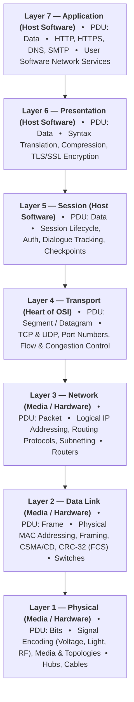
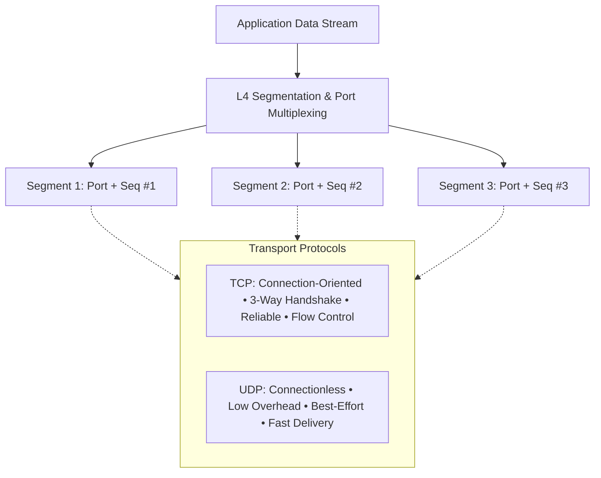
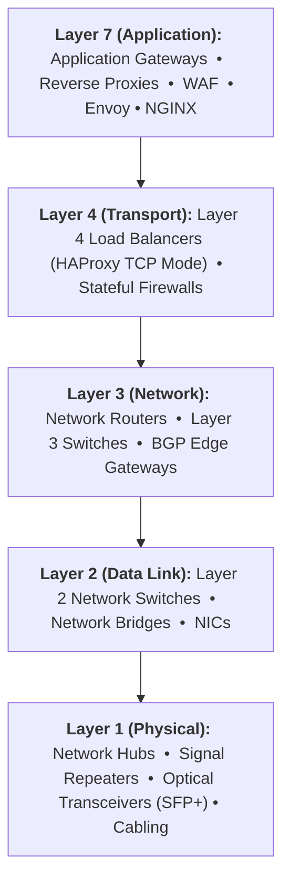
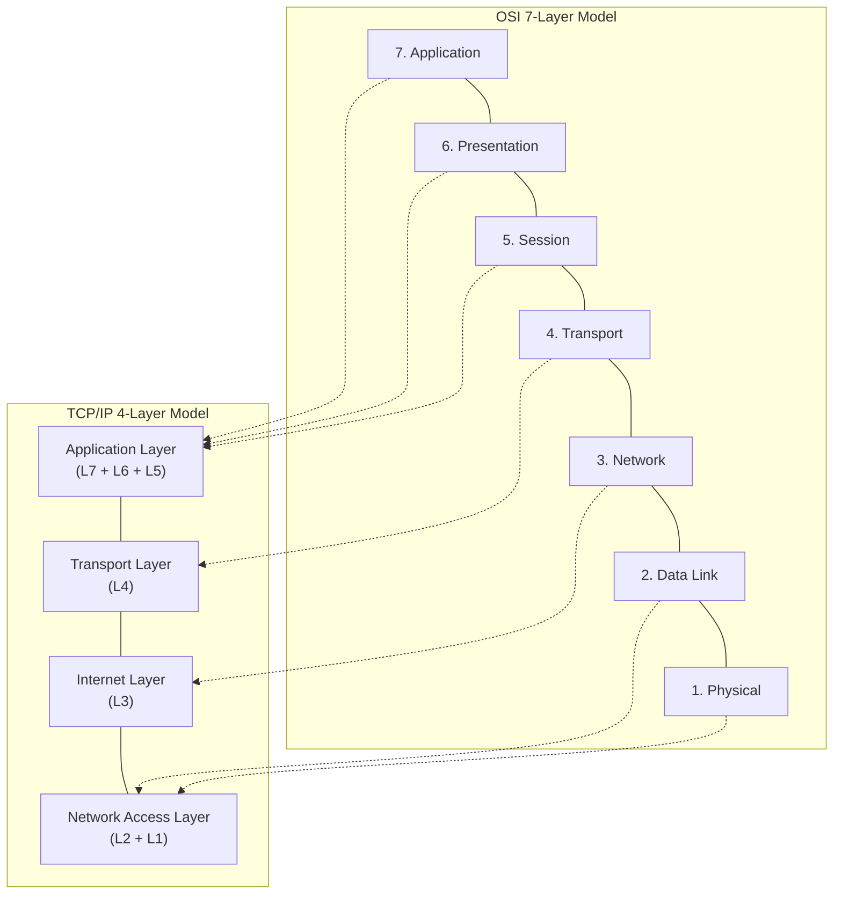

# 🌐 The 7 Layers of the OSI Model — Complete Reference & Visual Guide

> **Reference:** ISO/IEC 7498-1 Standard & TechTerms Networking Reference  
> **Topic:** Open Systems Interconnection (OSI) Reference Model  
> **Target Audience:** 7th-Semester CSE / Tech Placements / Core Networking Interviews  

---

## 📌 Executive Overview

The **Open Systems Interconnection (OSI) model** is a theoretical, modular framework established by the **International Organization for Standardization (ISO)** in 1984 to standardize computer network communications.

It partitions network communications into **7 distinct, logical layers** structured hierarchically:
* **Upper / Software Layers (Layers 7–5):** Handled entirely by the host operating system and application software.
* **Heart of OSI (Layer 4):** Bridges software applications with underlying network hardware; guarantees end-to-end transport integrity.
* **Lower / Media & Hardware Layers (Layers 3–1):** Governed by networking hardware, routers, switches, and physical transmission media.

### 🧠 Core Memory Aids (Mnemonics)

* **Top-Down (Layer 7 → Layer 1):**  
  👉 **A**ll **P**eople **S**eem **T**o **N**eed **D**ata **P**rocessing  
  *(**A**pplication → **P**resentation → **S**ession → **T**ransport → **N**etwork → **D**ata Link → **P**hysical)*

* **Bottom-Up (Layer 1 → Layer 7):**  
  👉 **P**lease **D**o **N**ot **T**hrow **S**ausage **P**izza **A**way  
  *(**P**hysical → **D**ata Link → **N**etwork → **T**ransport → **S**ession → **P**resentation → **A**pplication)*

* **Protocol Data Unit (PDU) Mnemonic (L7/5 → L1):**  
  👉 **D**on't **S**pill **P**epper on **F**ried **B**acon  
  *(**D**ata → **S**egment → **P**acket → **F**rame → **B**its)*

---

## 🏗️ Visual Architecture: The 7 Layers & PDUs



---

## 🔄 End-to-End Data Encapsulation & Decapsulation

When a host transmits data, each layer encapsulates the payload by prepending a protocol header (and appending a trailer at Layer 2). The receiving host decapsulates the headers in reverse order.

```mermaid
flowchart TD
    subgraph Sender["Host A (Sender) — Data Encapsulation (Top-Down)"]
        direction TB
        E1["<b>1. Application Layer (L7)</b><br/>User Payload Data: <b>( User Data )</b>"]
        E2["<b>2. Transport Layer (L4)</b><br/>Prepends Port Header &bull; <b>Segment = ( L4 Header + Data )</b>"]
        E3["<b>3. Network Layer (L3)</b><br/>Prepends IP Header &bull; <b>Packet = ( L3 Header + L4 Header + Data )</b>"]
        E4["<b>4. Data Link Layer (L2)</b><br/>Prepends MAC + Appends CRC &bull; <b>Frame = ( L2 Header + Packet + FCS Trailer )</b>"]
        E5["<b>5. Physical Layer (L1)</b><br/>Encodes Frame into Physical Signals &bull; <b>Raw Bits: 01101001...</b>"]
        E1 --> E2 --> E3 --> E4 --> E5
    end

    subgraph Channel["Physical Transmission Media"]
        Cable["⚡ <b>Physical Transmission Medium (Ethernet Copper / Fiber / Wi-Fi)</b><br/>Continuous Unstructured Bitstream: 01101001 01110010 01100001..."]
    end

    subgraph Receiver["Host B (Receiver) — Data Decapsulation (Bottom-Up)"]
        direction TB
        D5["<b>5. Physical Layer (L1)</b><br/>Receives Physical Signals &bull; Reconstructs <b>Frame Bits</b>"]
        D4["<b>4. Data Link Layer (L2)</b><br/>Verifies CRC Checksum (FCS) &bull; Strips MAC & Trailer &bull; Extracts <b>Packet</b>"]
        D3["<b>3. Network Layer (L3)</b><br/>Validates Destination IP &bull; Strips IP Header &bull; Extracts <b>Segment</b>"]
        D2["<b>2. Transport Layer (L4)</b><br/>Inspects Port & Sequence &bull; Strips L4 Header &bull; Extracts <b>Data</b>"]
        D1["<b>1. Application Layer (L7)</b><br/>Delivers Original Payload: <b>( User Data )</b> to Target Application"]
        D5 --> D4 --> D3 --> D2 --> D1
    end

    Sender --> Channel --> Receiver
```



---

## 🔍 Layer-by-Layer Detailed Breakdown

---

### Layer 7: Application Layer

**Primary Role**
* Serves as the direct window for user software applications to access network services.
* Does **not** refer to the GUI application itself (e.g., Chrome, Outlook), but to the **network communication protocols** those applications invoke.

**Protocol Data Unit (PDU)**
* **Data**

**Addressing**
* Service Name / URL / Fully Qualified Domain Name (FQDN) mapped to port numbers (e.g., `https://google.com` → Port 443).

**Core Functions**
* **Application Interface:** Provides standard APIs for applications to exchange data across the network.
* **Service Identification:** Identifies remote communication endpoints and verifies if network services are reachable.
* **User Authentication:** Validates user identity and application credentials at the application gateway.

**Key Protocols (What They Actually Do)**
* **HTTP (Port 80) / HTTPS (Port 443):** Transfers web pages and REST API payloads (**HTTPS = HTTP + TLS/SSL encryption**).
* **DNS (Port 53):** Resolves human-readable domain names into IP addresses (**Domain → IP**, e.g., `google.com` → `142.250.190.46`). Uses UDP for quick lookups, TCP for large zone transfers.
* **FTP (Port 20 / 21):** Client-server file transfer (**Port 21 = Commands/Control**, **Port 20 = Data transfer**).
* **SMTP (Port 25 / 587):** **Pushes / sends** outgoing emails from clients to mail servers, and between mail servers.
* **IMAP (Port 143 / 993) / POP3 (Port 110 / 995):** **Pulls / retrieves** emails from a mail server (**IMAP syncs across multiple devices**, **POP3 downloads and deletes locally**).
* **SSH (Port 22):** Secure, encrypted remote terminal login and command execution (**Encrypted replacement for insecure Telnet**).
* **DHCP (Port 67 / 68):** Automatically assigns IP addresses, subnet masks, and default gateways to devices joining a network (**Automates network setup**).

**Key Devices**
* **Application Gateways**, **Web Application Firewalls (WAF)**, and **Reverse Proxies / Load Balancers** (NGINX, Envoy).

---

### Layer 6: Presentation Layer

**Primary Role**
* Standardizes, formats, serializes, and prepares data syntax so that both sender and receiver operating systems understand the payload.

**Protocol Data Unit (PDU)**
* **Data**

**Addressing**
* MIME Types, data format schemas (e.g., `application/json`, `text/html`), character encoding headers.

**Core Functions (What It Actually Does)**
* **Translation (Data Formatting):** Converts data between different system encodings so different operating systems can communicate (**ASCII ↔ EBCDIC**, **Unicode / UTF-8**, **Host Byte Order ↔ Big-Endian Network Byte Order**).
* **Data Compression (Bandwidth Savings):** Reduces raw payload size to optimize bandwidth usage and speed up transfers (**gzip**, **Brotli**, **JPEG**, **MP4**).
* **Encryption & Decryption (Security):** Encrypts outgoing data at the sender for confidentiality and decrypts incoming data at the receiver (**SSL / TLS**, **AES-256**, **RSA / ECC**).

**Key Standards & Formats**
* **Data Serialization:** JSON, XML, Protocol Buffers (Protobuf), ASN.1.
* **Media Formats:** JPEG, PNG, MP4, H.264, MP3.
* **Security Standards:** TLS 1.3, SSL, X.509 Digital Certificates.

---

### Layer 5: Session Layer

**Primary Role**
* Establishes, maintains, coordinates, and terminates communication dialogues (sessions) between two communicating systems.

**Protocol Data Unit (PDU)**
* **Data**

**Addressing**
* Session IDs, Connection Tokens, RPC channel descriptors.

**Core Functions (What It Actually Does)**
* **Session Lifecycle:** Opens, maintains, and cleanly closes communication sessions between two endpoints.
* **Authentication & Authorization:** Checks who you are (**Authentication**) and what permissions you have (**Authorization**) before accepting ongoing data streams.
* **Dialogue Separation & Tracking:** Keeps data streams of concurrent applications isolated so packets from different browser tabs or programs never get mixed up.
* **Dialogue Modes (Directionality):**
  * **Simplex:** One-way transmission only (e.g., sensor telemetry, broadcast TV).
  * **Half-Duplex:** Two-way transmission, but only one party transmits at a time (e.g., walkie-talkie).
  * **Full-Duplex:** Simultaneous two-way transmission (e.g., telephone call, modern switched Ethernet).
* **Checkpoints & Recovery (Synchronization):** Inserts recovery markers into long data streams; if the network drops mid-flight (e.g., an 800 MB file drops at 650 MB), the transfer **resumes from the last confirmed checkpoint** instead of restarting from 0%.

**Representative Technologies & Protocols**
* **RPC (Remote Procedure Call):** Invokes functions on a remote server as if calling them locally.
* **NetBIOS:** Session management in legacy Windows networks.
* **PPTP (Point-to-Point Tunneling Protocol):** Manages VPN tunnel connections.
* **SOCKS5:** Proxy protocol facilitating secure client-server socket handshakes.

---

### Layer 4: Transport Layer

**Primary Role**
* Manages **end-to-end communication**, **process-to-process delivery**, **segmentation**, and **transmission reliability** between host applications.

**Protocol Data Unit (PDU)**
* **Segment** (TCP) / **Datagram** (UDP)

**Addressing**
* **Port Numbers** (16-bit unsigned integers: `0` to `65535`):
  * **Well-Known Ports (`0 – 1023`):** Reserved for standard system services (HTTP 80, HTTPS 443, SSH 22, DNS 53).
  * **Registered Ports (`1024 – 49151`):** User processes and third-party apps (MySQL 3306, PostgreSQL 5432, Redis 6379).
  * **Dynamic / Ephemeral Ports (`49152 – 65535`):** Temporary client source ports assigned dynamically by the host OS.

**Core Functions (What It Actually Does)**
* **Process-to-Process Delivery (Multiplexing / Demultiplexing):** Uses **Port Numbers** combined with IP addresses (**Socket = `IP:Port`**) to direct incoming packets to the exact running program/process.
* **Segmentation & Reassembly:** Slices large application data into smaller **Segments** stamped with **sequence numbers** at the sender, and reassembles them in exact order at the receiver.
* **Flow Control (Sender → Receiver):** Prevents a fast sender from overflowing a slower receiver's internal buffer (**TCP Sliding Window / `rwnd`**).
* **Error Control (Reliability):** Uses 16-bit **checksums** to detect corrupted packets and **ARQ (Automatic Repeat Request)** to automatically retransmit missing or damaged segments.
* **Congestion Control (Senders → Network Routers):** Dynamically throttles sending speed to prevent intermediate network routers and switches from getting choked with traffic (**`cwnd`**, **Slow Start**, **AIMD**).

**Core Protocols: TCP vs. UDP**



* **TCP (Transmission Control Protocol):**
  * **Connection-Oriented:** Establishes connection via **3-Way Handshake (SYN → SYN-ACK → ACK)** before sending data; terminates cleanly via **4-Way Handshake (FIN → ACK → FIN → ACK)**.
  * **Reliable:** Guarantees delivery via acknowledgments (ACKs) and automatic retransmissions.
  * **In-Order Delivery:** Uses sequence numbers so out-of-order packets are reordered correctly.
  * **Flow & Congestion Controlled:** Dynamically adapts transmission rate to network and receiver limits.
  * **Best For:** Web browsing (HTTP/HTTPS), file transfers (FTP), email (SMTP), remote shells (SSH).
* **UDP (User Datagram Protocol):**
  * **Connectionless:** No handshake, no session state, zero startup latency.
  * **Unreliable / Best-Effort:** No ACKs, no retransmissions, no packet ordering.
  * **Lightweight & Fast:** Minimal 8-byte fixed header (versus TCP's 20–60 byte header).
  * **Best For:** Real-time applications where speed beats reliability: DNS queries, VoIP calls, live video streaming (RTP), online multiplayer gaming.

**Key Devices**
* **Layer 4 Load Balancers** (HAProxy in TCP mode, AWS Network Load Balancer), **Stateful Firewalls**.

---

### Layer 3: Network Layer

**Primary Role**
* Handles **logical addressing**, **packet forwarding**, and **routing** across distinct, interconnected networks and subnets.

**Protocol Data Unit (PDU)**
* **Packet**

**Addressing**
* **Logical IP Addresses:**
  * **IPv4:** 32-bit dotted-decimal notation (e.g., `192.168.1.1`), providing ~4.3 billion addresses (`2^32`).
  * **IPv6:** 128-bit hexadecimal notation (e.g., `2001:0db8:85a3::8a2e:0370:7334`), providing ~340 undecillion addresses (`2^128`).

**Core Functions (What It Actually Does)**
* **Logical Addressing:** Stamps transport segments into **Packets** with source and destination **IP addresses** (globally routable addresses).
* **Routing:** Evaluates network topology via routing protocols to calculate the best, lowest-cost end-to-end path across intermediate routers.
* **Packet Forwarding:** Reads a packet's destination IP, checks the local **Routing Table**, and forwards it out the appropriate network interface.
* **Subnetting:** Splits a large network into smaller logical subnets using a **Subnet Mask** (e.g., `255.255.255.0` or `/24` in CIDR notation) to isolate broadcast traffic and conserve IP space.
* **Fragmentation & Reassembly:** Slices oversized packets exceeding the egress link's **Maximum Transmission Unit (MTU)** (typically 1500 bytes for standard Ethernet) into smaller fragments, and reassembles them at the destination host.

**Key Protocols (What They Actually Do)**
* **IPv4 / IPv6:** Core routed protocols that encapsulate data and deliver packets across the Internet.
* **ICMP (Internet Control Message Protocol):** Network diagnostic tool for error reporting and connectivity checks:
  * **`ping`:** Uses ICMP Echo Request / Echo Reply to verify host reachability and round-trip time.
  * **`traceroute`:** Uses ICMP Time Exceeded (TTL expiration) to trace every router hop along a path.
* **IGMP (Internet Group Management Protocol):** Manages multicast group memberships (allows one sender to broadcast audio/video to multiple subscribers simultaneously).
* **ARP (Address Resolution Protocol):** Resolves an IP address to a physical MAC address (**IP → MAC**).
* **RARP (Reverse ARP):** Resolves a physical MAC address to an IP address (**MAC → IP**).
* **OSPF (Open Shortest Path First):** Interior routing protocol that finds the shortest path within an organization using Dijkstra's Link-State algorithm.
* **BGP (Border Gateway Protocol):** Exterior routing protocol that connects independent Internet Service Providers (ASes) and routes traffic across the global Internet.
* **IPsec:** Secures IP communications via authentication (**AH**) and payload encryption (**ESP**).

**Key Devices**
* **Network Routers**, **Layer 3 Switches**, **BGP Edge Gateways**.

---

### Layer 2: Data Link Layer

**Primary Role**
* Handles error-free, hop-by-hop **node-to-node frame delivery** across the immediate **local network segment (LAN)** over physical communication links.

**Protocol Data Unit (PDU)**
* **Frame**

**Addressing**
* **Physical MAC Addresses (Media Access Control):** 48-bit hexadecimal hardware identifier permanently burned into the Network Interface Card (NIC) (e.g., `00:1A:2B:3C:4D:5E`):
  * **First 24 bits:** Organizationally Unique Identifier (OUI, vendor code assigned by IEEE).
  * **Last 24 bits:** Unique device serial number assigned by the hardware manufacturer.

**Sub-layers**
1. **LLC (Logical Link Control - IEEE 802.2):**
   * Acts as the bridge between hardware MAC addressing and upper-layer Network protocols.
   * Handles protocol multiplexing via the EtherType field (identifies whether the payload is IPv4, IPv6, or ARP).
2. **MAC (Media Access Control - IEEE 802.3 / 802.11):**
   * Regulates physical access to the transmission medium and controls channel access to avoid collisions.

**Core Functions (What It Actually Does)**
* **Framing:** Wraps network layer IP packets into **Frames** by adding a **Frame Header** (Preamble, Source MAC, Destination MAC, EtherType) and an **FCS Trailer**.
* **Physical Addressing:** Uses local **MAC addresses** to forward frames directly from one device interface to the next hop on the local subnet.
* **Media Access Control (Collision Management on Shared Channels):**
  * **CSMA/CD (Carrier Sense Multiple Access with Collision Detection):** Listens before transmitting; if two devices transmit at the same time and a collision occurs, both stop, send a jam signal, and wait a random exponential backoff time before retrying (**Used in wired half-duplex Ethernet**).
  * **CSMA/CA (Carrier Sense Multiple Access with Collision Avoidance):** Listens before transmitting and uses RTS/CTS (Request to Send / Clear to Send) handshakes to prevent collisions before they can happen (**Used in 802.11 Wi-Fi**).
* **Error Detection (CRC / FCS):** Calculates a 32-bit **Cyclic Redundancy Check (CRC)** stored in the **Frame Check Sequence (FCS)** trailer. If physical noise corrupts any bit during transit, the receiver's CRC recalculation fails and the frame is **silently discarded** (Layer 4 TCP handles retransmission).
* **VLAN Tagging (IEEE 802.1Q):** Inserts a 4-byte VLAN tag into Ethernet frames to logically partition a single physical switch into multiple isolated virtual LANs.

**Key Protocols**
* **Ethernet (IEEE 802.3)**, **Wi-Fi (IEEE 802.11)**, **Point-to-Point Protocol (PPP)**, **Spanning Tree Protocol (STP - IEEE 802.1D)** (prevents bridge loops on redundant switch paths).

**Key Devices**
* **Layer 2 Network Switches**, **Network Bridges**, **Network Interface Cards (NICs)**.

---

### Layer 1: Physical Layer

**Primary Role**
* Transmits and receives raw, unstructured **binary bitstreams (1s and 0s)** over physical hardware transmission media.

**Protocol Data Unit (PDU)**
* **Bits**

**Addressing**
* None (operates purely at the physical signal and hardware level).

**Core Functions (What It Actually Does)**
* **Signal Encoding (Bits → Physical Signals):** Converts digital 1s and 0s into physical phenomena:
  * **Electrical Voltage Pulses:** Across copper Ethernet cables (e.g., Manchester encoding, PAM-4).
  * **Light Pulses:** Across fiber-optic glass cables (e.g., laser / LED pulses).
  * **Radio Frequency (RF) Waves:** Across wireless air (e.g., 2.4 GHz, 5 GHz, 6 GHz Wi-Fi frequencies).
* **Bit Synchronization:** Synchronizes sender and receiver internal oscillator clocks using preambles so bits are sampled at the exact right microsecond intervals.
* **Data Transmission Rates:** Determines transmission speed (**bit/baud rate**) and physical bandwidth (e.g., 100 Mbps Fast Ethernet, 1 Gbps Gigabit Ethernet, 10/40/100 Gbps).
* **Physical Network Topologies:** Dictates how cables physically connect nodes:
  * **Star Topology:** All devices connect to a central switch/hub (modern standard; single link failure doesn't affect others).
  * **Mesh Topology:** Redundant direct links between critical nodes (highest fault tolerance).
  * **Bus & Ring Topologies:** Shared linear cable or circular loop (legacy; break in cable brings down entire network).
* **Transmission Duplex Modes:**
  * **Simplex:** One-way only (e.g., TV / radio broadcast).
  * **Half-Duplex:** Two-way, but alternating one party at a time (e.g., walkie-talkie, legacy hub Ethernet).
  * **Full-Duplex:** Simultaneous bidirectional transmission (e.g., modern switched Ethernet with dedicated transmit and receive wire pairs).

**Physical Transmission Media**
* **Twisted-Pair Copper Cables:** Cat5e (1 Gbps), Cat6 (10 Gbps up to 55m), Cat6a (10 Gbps up to 100m), Cat8 (40 Gbps) terminated with **RJ-45 connectors**.
* **Fiber-Optic Cables:** Single-Mode Fiber (SMF - long-distance laser transmission) and Multi-Mode Fiber (MMF - short-distance LED transmission) terminated with **LC / SC connectors**.
* **Wireless RF Spectra:** 2.4 GHz (longer range, more interference), 5 GHz (higher speed, less range), 6 GHz (Wi-Fi 6E/7 wide channels).

**Key Hardware**
* **Network Hubs** (multiport repeaters that broadcast incoming bits to all ports), **Signal Repeaters** (amplify signals over long distances), **Modems**, **Optical Transceivers (SFP / SFP+)**, and **Cables**.

---

## 📊 Master Comparison Matrix

| Layer # | Layer Name | PDU | Addressing | Key Protocols | Hardware / Devices | Core Purpose |
|:---:|:---|:---:|:---|:---|:---|:---|
| **7** | **Application** | **Data** | URL / Port / FQDN | HTTP, HTTPS, FTP, DNS, SMTP, SSH, DHCP | Application Gateway, WAF, Proxies | User-facing application network services |
| **6** | **Presentation** | **Data** | MIME / Encoding Schemas | TLS/SSL, UTF-8, ASCII, gzip, Brotli, JSON | Host OS / Cryptographic Libraries | Syntax translation, compression, encryption |
| **5** | **Session** | **Data** | Session ID / Tokens | RPC, NetBIOS, PPTP, SOCKS5 | Host OS / Middleware | Session lifecycle, dialogue sync & checkpoints |
| **4** | **Transport** | **Segment** (TCP) / **Datagram** (UDP) | Port Numbers (16-bit: `0–65535`) | TCP, UDP, SCTP, QUIC | L4 Load Balancer (HAProxy), Stateful Firewall | End-to-end reliability, multiplexing & flow control |
| **3** | **Network** | **Packet** | IP Address (IPv4: 32b, IPv6: 128b) | IPv4, IPv6, ICMP, OSPF, BGP, IPsec | Routers, Layer 3 Switches | Routing, packet forwarding & logical addressing |
| **2** | **Data Link** | **Frame** | MAC Address (48-bit hex) | Ethernet (802.3), Wi-Fi (802.11), PPP, STP | Layer 2 Switches, Bridges, NICs | Node-to-node frame delivery, MAC & CRC error check |
| **1** | **Physical** | **Bits** (0s & 1s) | None (Physical Signals) | 1000BASE-T, 10GBASE-SR, 802.11 PHY | Hubs, Repeaters, Cables, Transceivers | Raw bitstream transmission over hardware media |

---

## 🛠️ Network Devices by Layer



---

## 🎯 Top Interview Questions & Clarifications

### 1. What is the fundamental difference between Layer 2 and Layer 3 devices?

* **Layer 2 Switch:**
  * **Operates on:** **Frames**.
  * **Addressing:** Physical **MAC addresses** (48-bit).
  * **Mechanism:** Maintains a **MAC Address Table (CAM Table)** mapping device MAC addresses to physical switch ports.
  * **Scope:** Forwards traffic exclusively within the **same local subnet or VLAN**. Floods unknown unicasts and broadcasts (`FF:FF:FF:FF:FF:FF`) to all ports.
  * **Does NOT:** Understand or inspect IP addresses.

* **Layer 3 Router (or Layer 3 Switch):**
  * **Operates on:** **Packets**.
  * **Addressing:** Logical **IP addresses** (32-bit IPv4 / 128-bit IPv6).
  * **Mechanism:** Maintains a **Routing Table** populated by routing protocols (OSPF, BGP).
  * **Scope:** Forwards traffic across **different subnets and independent networks**.
  * **Key Behavior:** Strips the incoming Layer 2 frame header/trailer, decrements the IP **TTL (Time to Live)**, re-encapsulates the packet into a brand new Layer 2 frame with the next-hop MAC, and transmits it.

---

### 2. How does the OSI 7-Layer model map to the TCP/IP 4-Layer model?

The practical Internet operates on the **TCP/IP model** (RFC 1122), which consolidates several OSI layers for operational simplicity:



* **Application Layer (TCP/IP):** Combines OSI **Layers 7, 6, and 5** (HTTP, DNS, TLS encryption, and session handling are all implemented directly in user-space software and application runtimes).
* **Transport Layer (TCP/IP):** Directly maps to OSI **Layer 4** (TCP, UDP).
* **Internet Layer (TCP/IP):** Directly maps to OSI **Layer 3** (IP, ICMP, ARP).
* **Network Access / Link Layer (TCP/IP):** Combines OSI **Layers 2 and 1** (Ethernet framing, MAC addressing, network cables, physical bit signaling).

---

### 3. What is the difference between Flow Control and Congestion Control at Layer 4?

* **Flow Control (End-to-End: Sender → Receiver):**
  * **Objective:** Prevents a high-speed sender from overflowing a slower receiver's internal buffer.
  * **Governed By:** The receiver's advertised **Receive Window (`rwnd`)** in the TCP header.
  * **Mechanism:** Receiver tells sender how much free buffer space it has; when `rwnd = 0`, the sender stops transmitting until buffer space frees up.

* **Congestion Control (Network-Wide: Senders → Intermediate Routers):**
  * **Objective:** Prevents all active senders combined from overwhelming intermediate router queues and switches on the network path.
  * **Governed By:** The sender's calculated **Congestion Window (`cwnd`)**.
  * **Effective Sending Window:** `Effective Window = min(rwnd, cwnd)` (sender transmits only as much as the smaller limit allows).
  * **Algorithms:**
    * **Slow Start:** Exponential growth of `cwnd` per RTT until `ssthresh` (Slow Start Threshold).
    * **Congestion Avoidance:** Linear additive growth (`AIMD`) of `cwnd` per RTT once past `ssthresh`.
    * **Fast Retransmit & Fast Recovery:** Triggered by 3 duplicate ACKs; halves `cwnd` and immediately retransmits the missing segment without waiting for the full RTO timeout.

---

### 4. What is a Subnet Mask and why is it essential at Layer 3?

* **Definition:** A **Subnet Mask** (e.g., `255.255.255.0` or `/24` in CIDR notation) is a 32-bit bitmask that splits an IP address into two distinct parts:
  * **Network ID:** Identifies which subnet / network segment the device belongs to.
  * **Host ID:** Identifies the unique host interface on that subnet.

* **Binary Bitwise AND Operation (`192.168.1.45 / 24`):**

```text
IP Address:    192.168.1.45   -->  11000000 . 10101000 . 00000001 . 00101101
Subnet Mask:   255.255.255.0  -->  11111111 . 11111111 . 11111111 . 00000000  (/24 = 24 ones)
------------------------------------------------------------------------------------------------
Bitwise AND:   192.168.1.0    -->  11000000 . 10101000 . 00000001 . 00000000  (Network ID)
Host Portion:  .45            -->  00000000 . 00000000 . 00000000 . 00101101  (Host ID)
```

| Component | Decimal Notation | 32-Bit Binary Representation | Function |
|:---|:---|:---|:---|
| **IP Address** | `192.168.1.45` | `11000000 . 10101000 . 00000001 . 00101101` | Host machine's unique logical IP |
| **Subnet Mask** | `255.255.255.0` (`/24`) | `11111111 . 11111111 . 11111111 . 00000000` | 24 Network bits (`1`s) + 8 Host bits (`0`s) |
| **Network ID** | `192.168.1.0` | `11000000 . 10101000 . 00000001 . 00000000` | Local subnet identifier (result of bitwise `AND`) |
| **Host ID** | `.45` | `00000000 . 00000000 . 00000000 . 00101101` | Specific device on the `192.168.1.0` subnet |

* **Why Routers & Hosts Depend On It (Routing Decision in 2 Steps):**
  * **Step 1 — Bitwise AND Check:** When sending a packet, the host does `Destination IP AND Subnet Mask` to extract the destination's Network ID.
  * **Step 2 — Destination Routing Decision:**
    * **Same Subnet (Local Delivery):** If `Destination Network ID == Local Network ID`, the target device is on the **same local LAN**. The host uses **ARP** (`IP → MAC`) to find the destination MAC address and transmits the frame directly via the Layer 2 switch.
    * **Different Subnet (Remote Delivery):** If `Destination Network ID != Local Network ID`, the target device is on a **remote network or the Internet**. The host forwards the packet to its **Default Gateway router** (using the router's MAC address), which checks its routing table to forward the packet across intermediate hops.
