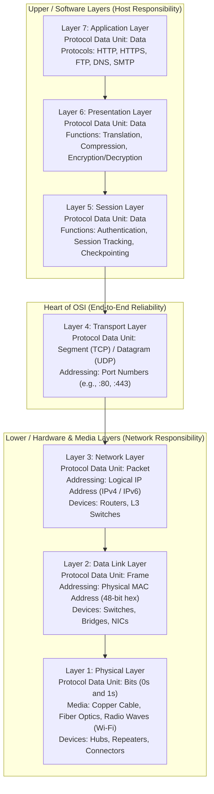
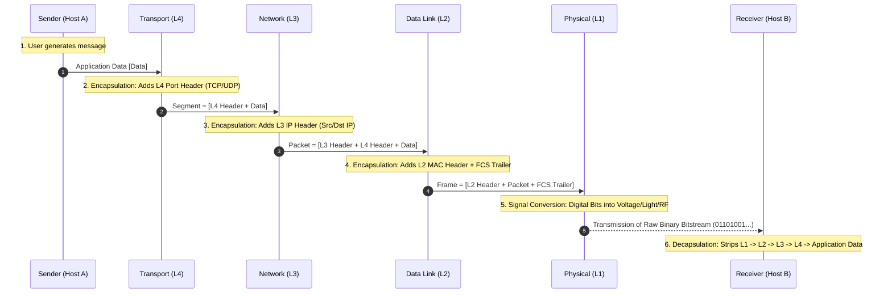
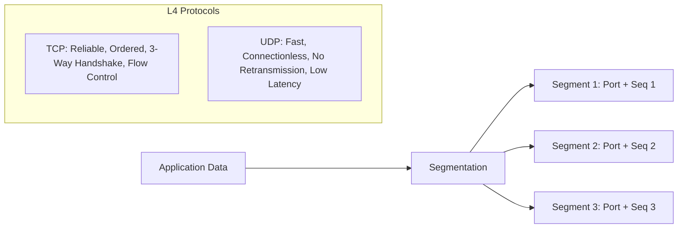
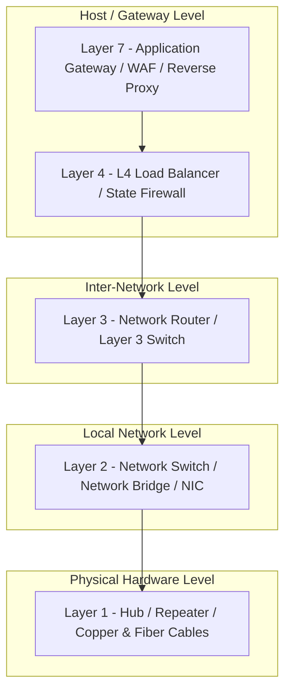
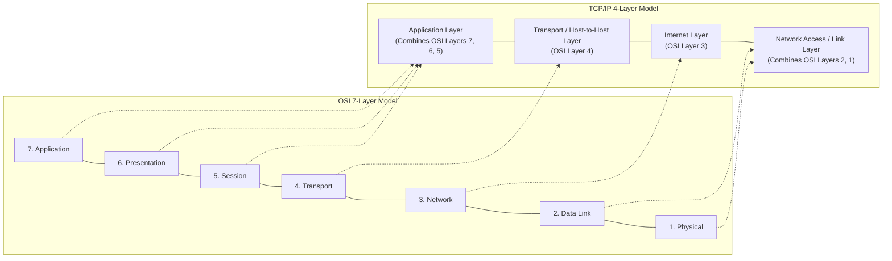

# 🌐 The 7 Layers of the OSI Model — Complete Reference & Visual Guide

> **Reference:** ISO/IEC 7498-1 Standard & TechTerms Networking Reference  
> **Topic:** Open Systems Interconnection (OSI) Reference Model  
> **Scope:** Architecture, Protocol Data Units (PDUs), Encapsulation/Decapsulation, Protocols, Devices & Interview Concepts  

---

## 📌 Executive Overview

The **Open Systems Interconnection (OSI) model** was established by the **International Organization for Standardization (ISO)** in 1984 to standardize computer network communications. It breaks the complex task of network data transmission into **7 logical, self-contained layers** — ranging from high-level software application interactions (Layer 7) down to physical hardware transmission of electrical or optical signals (Layer 1).

### 🧠 Core Memory Aids (Mnemonics)

* **Top-Down (Layer 7 → Layer 1):**  
  👉 **A**ll **P**eople **S**eem **T**o **N**eed **D**ata **P**rocessing  
  *(Application → Presentation → Session → Transport → Network → Data Link → Physical)*

* **Bottom-Up (Layer 1 → Layer 7):**  
  👉 **P**lease **D**o **N**ot **T**hrow **S**ausage **P**izza **A**way  
  *(Physical → Data Link → Network → Transport → Session → Presentation → Application)*

* **PDU Memory Aid (Layer 7/5 → Layer 1):**  
  👉 **D**on't **S**pill **P**epper on **F**ried **B**acon  
  *(Data → Segment → Packet → Frame → Bits)*

---

## 🏗️ Visual Architecture: The 7 Layers & PDUs

---

## 🔄 End-to-End Data Encapsulation & Decapsulation

When a client sends data across a network, each layer appends its own control header (and in Layer 2, a trailer). Upon arrival at the receiving host, the reverse process unpacks the headers.

---

## 🔍 Layer-by-Layer Detailed Breakdown

---

### 🌐 Layer 7: Application Layer

* **Primary Role:** Serves as the direct window for end-user software applications to access network services.
* **Key Concept:** It does **not** refer to the user software GUI application itself (e.g., Google Chrome, Mozilla Firefox, or Microsoft Outlook), but rather to the **network communication protocols** those applications invoke to exchange information over the network.
* **Common Protocols:**
  * **HTTP / HTTPS (Port 80 / 443):** Hypertext Transfer Protocol for web browsing.
  * **FTP (Port 20 / 21):** File Transfer Protocol for client-server file uploads/downloads.
  * **SMTP (Port 25 / 587):** Simple Mail Transfer Protocol for outgoing email delivery.
  * **IMAP (Port 143 / 993) / POP3 (Port 110 / 995):** Protocols for retrieving email from mail servers.
  * **DNS (Port 53):** Domain Name System for resolving human-readable domain names (e.g., `google.com`) into IP addresses.
  * **SSH (Port 22):** Secure Shell for encrypted remote terminal access.
  * **DHCP (Port 67 / 68):** Dynamic Host Configuration Protocol for dynamic IP address allocation.

---

### 🎨 Layer 6: Presentation Layer

* **Primary Role:** Standardizes, formats, serializes, and prepares data so the Application Layer on either end can interpret it regardless of differing internal operating system representations.
* **Core Functions:**
  1. **Translation & Formatting:** Converts disparate data encoding representations (e.g., EBCDIC to ASCII, Unicode/UTF-8 conversion, little-endian to big-endian network byte order).
  2. **Data Compression:** Compresses payloads to reduce transmission byte volume and conserve bandwidth (e.g., gzip, Brotli, JPEG, MP4).
  3. **Encryption & Decryption:** Handles cryptographic transformations for confidentiality and integrity (e.g., SSL/TLS handshakes, AES encryption) before sending down to the session or up to the application.

---

### 🤝 Layer 5: Session Layer

* **Primary Role:** Establishes, manages, synchronizes, maintains, and terminates communication sessions and dialogues between two end systems.
* **Core Functions:**
  1. **Authentication & Authorization:** Validates client identity and establishes security privileges before session traffic is accepted.
  2. **Session Tracking & Dialogue Separation:** Manages half-duplex or full-duplex conversations, keeping individual application communication streams isolated so concurrent applications don't cross-contaminate packets.
  3. **Checkpoints & Synchronization (Recovery):** Injects synchronization markers/checkpoints into long data streams. If a transfer fails mid-flight (e.g., a 2GB file transfer fails at 1.5GB), the session resumes from the last confirmed checkpoint rather than restarting from zero.
* **Representative Technologies:** RPC (Remote Procedure Call), NetBIOS, PPTP, SOCKS5 socket sessions.

---

### 🚚 Layer 4: Transport Layer

* **Primary Role:** Coordinates reliable or best-effort end-to-end communication, segment delivery, process-level multiplexing, and transmission integrity between host applications.
* **Addressing:** **Port Numbers** (16-bit identifiers, e.g., 0 to 65535) to route traffic to the exact running process/service on the machine.
* **Core Functions:**
  * **Segmentation & Reassembly:** Splits large blocks of data from Layer 5 into smaller, MTU-compatible **Segments**, stamping each with sequence numbers so the receiving host can reconstruct the original stream in exact order.
  * **Flow Control:** Implements mechanisms (like TCP Sliding Window) to dynamically adjust data transmission rates according to the receiver's available buffer capacity, preventing receiver buffer overflow.
  * **Error Control:** Calculates mathematical checksums to detect corrupted or missing segments, requesting automatic retransmission (ARQ) when packets drop.
* **Core Protocols:**
  * **TCP (Transmission Control Protocol):** Connection-oriented (requires 3-way handshake: SYN, SYN-ACK, ACK), guarantees in-order delivery, reliable retransmissions, flow and congestion control.
  * **UDP (User Datagram Protocol):** Connectionless, lightweight, zero connection establishment overhead, no guaranteed delivery or retransmissions. Ideal for real-time video streaming, DNS lookups, VoIP, and multiplayer gaming.

---

### 🗺️ Layer 3: Network Layer

* **Primary Role:** Manages logical addressing and determines the optimal path (routing) to transport packets across distinct, interconnected networks and subnets.
* **Protocol Data Unit (PDU):** **Packet**
* **Addressing:** **Logical IP Addresses** (IPv4: 32-bit e.g., `192.168.1.1`; IPv6: 128-bit hexadecimal).
* **Core Functions:**
  * **Logical Addressing:** Encapsulates transport segments into Packets, appending source and destination IP addresses.
  * **Routing:** Evaluates network topology via routing protocols (OSPF, BGP, RIP) to select the optimal physical route across intermediary routers.
  * **Subnetting & Network Segmentation:** Divides large networks into logical subnets using subnet masks (e.g., `255.255.255.0` or `/24`).
  * **Packet Fragmentation:** Slices oversized packets that exceed the Maximum Transmission Unit (MTU, typically 1500 bytes for standard Ethernet).
* **Key Devices:** **Routers** and Layer 3 Switches.
* **Key Protocols:** IPv4, IPv6, ICMP (ping / traceroute), IGMP, IPsec, ARP/RARP.

---

### 🔗 Layer 2: Data Link Layer

* **Primary Role:** Handles error-free node-to-node frame transfer across the immediate local network segment (LAN) over physical communication links.
* **Protocol Data Unit (PDU):** **Frame**
* **Addressing:** **Physical MAC Addresses** (Media Access Control, 48-bit hexadecimal hardware identifier burned into the NIC, e.g., `00:1A:2B:3C:4D:5E`).
* **Sub-layers:**
  1. **LLC (Logical Link Control):** Manages link synchronization, multiplexing protocols, and flow control.
  2. **MAC (Media Access Control):** Manages physical device addressing and channel access control.
* **Core Functions:**
  * **Framing:** Encapsulates network layer packets into discrete frames by adding a header (Source & Destination MAC) and a trailer.
  * **Media Access Regulation:** Governs how devices share the transmission channel to prevent data collisions (e.g., CSMA/CD for Ethernet, CSMA/CA for 802.11 Wi-Fi).
  * **Error Detection:** Appends a **Frame Check Sequence (FCS)** trailer using **Cyclic Redundancy Check (CRC)** to identify frames corrupted during physical transmission; corrupted frames are discarded.
* **Key Devices:** **Network Switches**, Bridges, and Network Interface Cards (NICs).
* **Key Protocols:** Ethernet (IEEE 802.3), Wi-Fi (IEEE 802.11), PPP, VLAN (802.1Q).

---

### ⚡ Layer 1: Physical Layer

* **Primary Role:** Converts and transmits raw, unstructured binary bitstreams (digital 1s and 0s) across physical hardware transmission media.
* **Protocol Data Unit (PDU):** **Bits**
* **Core Functions:**
  * **Signal Conversion & Encoding:** Converts digital bit patterns into physical phenomena: electrical voltage levels (copper cables), optical light pulses (fiber-optic cables), or modulated radio frequency waves (Wi-Fi/cellular).
  * **Bit Synchronization:** Synchronizes clocks between sender and receiver to maintain exact bit boundaries.
  * **Transmission Rate & Topology:** Defines baud/bit rates and physical cabling topologies (Star, Mesh, Bus, Ring).
  * **Duplex Modes:** Determines data directionality — Simplex (one-way), Half-Duplex (two-way but one at a time), or Full-Duplex (simultaneous bidirectional).
* **Transmission Media:**
  * **Twisted-Pair Copper:** Cat5e, Cat6, Cat6a, Cat8 Ethernet cables with RJ-45 connectors.
  * **Fiber-Optic Cables:** Single-mode and multi-mode fiber with LC/SC connectors.
  * **Wireless Radio Frequencies:** 2.4 GHz, 5 GHz, 6 GHz RF spectra.
* **Key Hardware:** Network cables, Repeaters, Hubs, Modems, Transceivers (SFP/SFP+), and Pin Connectors.

---

## 📊 Master Comparison Matrix

| Layer # | Layer Name | PDU | Primary Addressing | Key Protocols | Hardware / Devices | Core Purpose |
|:---:|:---|:---:|:---|:---|:---|:---|
| **7** | **Application** | Data | Service Name / Port Mapping | HTTP, HTTPS, FTP, DNS, SMTP, SSH | Application Gateway, WAF, Proxies | User-facing network communication interface |
| **6** | **Presentation** | Data | Context / Syntax | SSL/TLS, ASCII, UTF-8, JPEG, gzip | Gateway / Host Software | Data translation, compression, encryption |
| **5** | **Session** | Data | Session ID / Token | RPC, NetBIOS, SOCKS, PPTP | Gateway / Host Software | Session setup, synchronization & checkpointing |
| **4** | **Transport** | Segment (TCP) / Datagram (UDP) | Port Numbers (16-bit) | TCP, UDP, SCTP, QUIC | Layer 4 Load Balancer (HAProxy, Envoy) | Process-to-process delivery & flow control |
| **3** | **Network** | Packet | IP Address (IPv4 / IPv6) | IPv4, IPv6, ICMP, BGP, OSPF | Routers, Layer 3 Switches | Routing & logical cross-network addressing |
| **2** | **Data Link** | Frame | MAC Address (48-bit hex) | Ethernet (802.3), Wi-Fi (802.11), PPP | Network Switches, Bridges, NICs | Node-to-node local hop frame delivery & CRC |
| **1** | **Physical** | Bits (0s & 1s) | Physical Signals | 1000BASE-T, RS-232, 802.11 PHY | Hubs, Repeaters, Cables, Connectors | Raw bit transmission over physical media |

---

## 🛠️ Network Devices by Layer

---

## 🎯 Top Interview Questions & Clarifications

### 1. What is the fundamental difference between Layer 2 and Layer 3 devices?
* **Layer 2 Switch:** Operates on **Frames** using physical **MAC addresses**. It maintains a MAC address table to forward frames within the **same local subnet/VLAN**. It does not know or inspect IP addresses.
* **Layer 3 Router (or L3 Switch):** Operates on **Packets** using logical **IP addresses**. It maintains a routing table to forward packets across **different subnets and independent networks**.

### 2. How does the OSI 7-Layer model map to the practical TCP/IP 4-Layer model?
The practical Internet runs on the **TCP/IP model** (RFC 1122), which collapses OSI layers for operational simplicity:

### 3. What is the difference between Flow Control and Congestion Control in Layer 4?
* **Flow Control (End-to-End):** Prevents the **sender from overwhelming the receiver**. Controlled via TCP receive window (`rwnd`).
* **Congestion Control (Network-Wide):** Prevents **all senders combined from overwhelming the network infrastructure** (routers and switches). Controlled via TCP congestion window (`cwnd`) with algorithms like Slow Start, Congestion Avoidance, Fast Retransmit, and Fast Recovery.

### 4. What is a Subnet Mask and why is it used at Layer 3?
* A **Subnet Mask** (e.g., `255.255.255.0` or `/24` in CIDR) is a 32-bit number that divides an IP address into two portions:
  1. **Network ID:** Identifies the specific network segment.
  2. **Host ID:** Identifies the specific device/host on that network segment.
* It enables routers to immediately determine whether a destination IP is inside the **same local subnet** (sent directly via Layer 2 ARP and frame delivery) or in a **remote network** (sent to the Default Gateway router).
