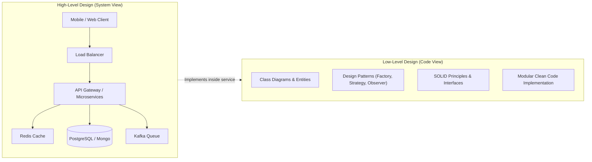
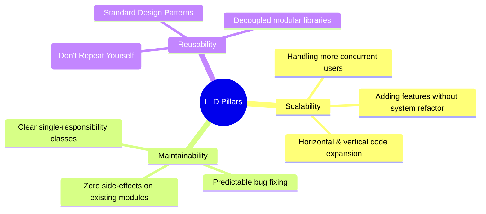
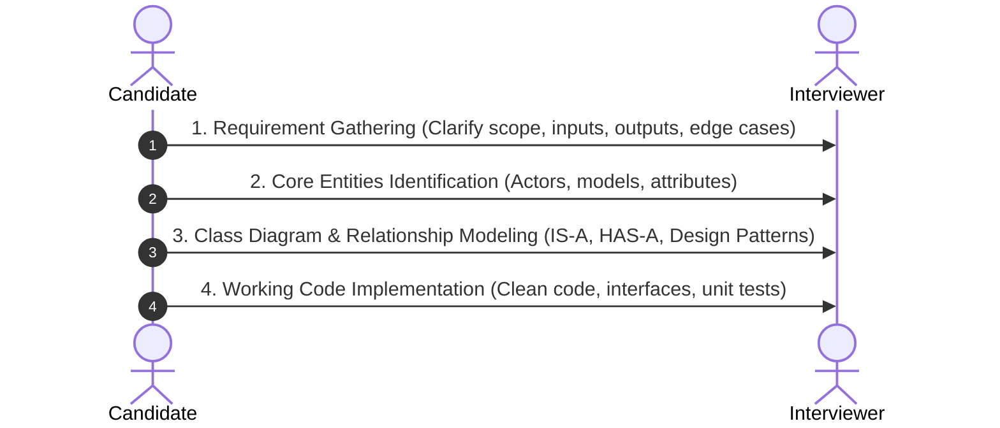

# 01. Introduction To System Design & LLD Foundations

> 💡 **Quick Revision Anchor**: `Scalability, Maintainability, Reusability`

---

## 1. Why System Design? (DSA vs. LLD)

When preparing for software engineering roles, most engineers spend months mastering **Data Structures & Algorithms (DSA)** on platforms like LeetCode. While DSA teaches algorithmic efficiency (time and space complexity), it only solves isolated, algorithmic micro-problems.

In real-world production engineering, no customer uses a standalone binary search or priority queue. Instead, millions of users interact with distributed, multi-component platforms like **Swiggy, Zomato, Uber, and Netflix**.

### The Tale of Two Engineers
- **The Junior Dev (Isolated DSA Mindset)**: Writes monolithic scripts with tight coupling, hardcoded conditionals, and bloated functions. Adding a new payment method breaks 4 existing features.
- **The Senior Dev (System Architecture Mindset)**: Designs clear class boundaries, adheres to OOP & SOLID principles, chooses decoupled design patterns, and writes code that easily scales when user traffic surges 100x.

---

## 2. High-Level Design (HLD) vs. Low-Level Design (LLD)

| Dimension | High-Level Design (HLD) | Low-Level Design (LLD) |
| :--- | :--- | :--- |
| **Focus** | Macro Architecture & Infrastructure | Micro Architecture & Code Organization |
| **Key Questions** | Which DB? SQL or NoSQL? How to balance load? Do we need Kafka? | What classes exist? Who inherits what? How are objects created? |
| **Core Artifacts** | System Architecture Diagrams, Data Flow, Network Topologies | UML Class Diagrams, Sequence Diagrams, Schema & Interfaces |
| **Principles** | CAP Theorem, PACELC, Sharding, Replication, Caching | OOP Principles, SOLID Principles, GoF Design Patterns |
| **Target Scale** | Requests Per Second (RPS), Throughput, Latency, Bandwidth | Clean Code, Extensibility, Loose Coupling, Testability |

---

## 3. The Three Pillars of Low-Level Design

Whenever designing a software system, an engineer must optimize for three core attributes:

### 1. Scalability (Code & Feature Scalability)
- Can you introduce a new feature (e.g., adding `CryptoPayment` alongside `CreditCard` and `UPI`) without modifying 20 different files?
- A scalable LLD isolates changes behind clean interfaces so the system expands horizontally.

### 2. Maintainability
- Code is read 10x more often than it is written.
- In poorly designed systems, fixing a bug in `OrderCalculation` inadvertently breaks `InvoiceGeneration`.
- Maintainable code separates concerns so each module has one reason to change.

### 3. Reusability
- Avoid reinventing the wheel.
- Common behaviors (logging, caching, notification dispatching, retry logic) should be written as modular, reusable components or design patterns rather than duplicated across classes.

---

## 4. The 4-Stage LLD Interview Framework

In top tech companies (FAANG, Tier-1 Startups), LLD interviews (Machine Coding rounds) test how you translate ambiguity into working code:

1. **Clarify Requirements**: Define functional requirements (what the system must do) and non-functional requirements (extensibility, concurrency).
2. **Identify Core Entities**: Extract domain objects from the problem statement (e.g., in a Parking Lot: `Vehicle`, `ParkingSpot`, `Ticket`, `Payment`).
3. **Establish Relationships & Patterns**: Determine inheritance (`Car IS-A Vehicle`), composition (`ParkingLot HAS-A ParkingFloor`), and applicable patterns (`Strategy` for pricing, `Factory` for spot assignment).
4. **Write Clean, Executable Code**: Structure code with proper access modifiers, descriptive naming, dependency injection, and edge-case handling.

---

## 5. Summary & Key Takeaways

- **DSA provides the algorithmic engine**, but **LLD provides the chassis and transmission** that allows an application to run in production.
- Great LLD prioritizes **loose coupling** and **high cohesion**.
- Software design is iterative: start with clear interfaces, identify variation points, and apply patterns only where flexibility is required.
