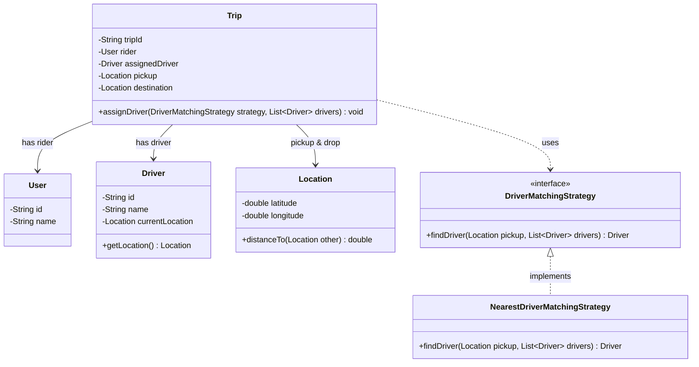

# 01. Introduction To System Design (LLD vs HLD vs DSA)

> 💡 **Quick Revision Anchor**
> - **The Core Metaphor:** *"If DSA is the Brain of an application, LLD is its Skeleton, and HLD is the City Infrastructure it lives in."*
> - **LLD (Low-Level Design):** Focuses on code architecture, classes, interfaces, OOP principles, design patterns, modularity, and extensibility.
> - **HLD (High-Level Design):** Focuses on system architecture, microservices, databases (SQL vs NoSQL), caching, load balancing, server scaling, and infrastructure cost.
> - **DSA (Data Structures & Algorithms):** Focuses on computational efficiency (time and space complexity) within specific operations.

---

## 1. What Problem Are We Solving?

Many developers complete DSA and LeetCode problems, yet struggle when asked to build an actual real-world application. 

DSA teaches how to write an optimal algorithmic function, but real-world engineering requires answering:
- What entities and objects exist in the system?
- How do classes interact and maintain state?
- How do we keep the system extensible when business requirements change?
- Where do notifications, payments, and background tasks plug in?

Without **Low-Level Design (LLD)**, even the most optimal algorithms become trapped inside rigid, unmaintainable code that collapses under feature additions.

---

## 2. Initial / Naive Approach: Anurag's DSA-Only Mindset

To demonstrate this distinction, the lecture presents the story of building **QuickRide** (a ride-sharing application like Uber / Ola).

Two engineers are asked to build the system:

### Anurag's Solution:
Anurag immediately treats QuickRide as two standalone algorithmic problems:
1. **Finding the Shortest Route:** He jumps straight to **Dijkstra's Algorithm** or BFS on a road graph to compute the shortest path between pickup and drop locations.
2. **Matching the Nearest Driver:** He models nearby drivers around a user coordinates and immediately creates a **Min-Heap (PriorityQueue)** to pop the closest driver.

```text
Anurag's Mental Model:
Input: Coordinates (A, B) ──▶ Dijkstra's Algorithm ──▶ Path
Input: Driver Locations   ──▶ Min-Heap (PriorityQueue) ──▶ Closest Driver
```

### Why Does It Become a Problem?
When Anurag presents this to his Engineering Manager, the manager points out critical missing foundations:
- **No Domain Model:** Where are the `User`, `Driver`, `Trip`, and `Vehicle` entities?
- **No Object Interaction:** How do objects communicate and hold lifecycle states (e.g., requested, accepted, in-progress, completed)?
- **No Extensibility:** What happens if the driver matching criteria changes from "closest distance" to "driver rating" or "batch auctioning"?
- **No Integration Points:** Where do notifications (SMS, WhatsApp) or payment processing (UPI, Card) fit in?
- **Zero Software Architecture:** Anurag solved two isolated mathematical problems, but has not built a software application.

---

## 3. Key Design Idea: Maurya's LLD + DSA Approach

Maurya understands algorithms, but recognizes that **LLD must build the skeleton first**, inside which DSA algorithms live as pluggable tools:

1. **Identifies Domain Entities:** Extracts the core business nouns: `User`, `Driver`, `Trip`, `Location`.
2. **Defines Class Relationships & Cardinalities:**
   - A `User` initiates a `Trip`.
   - A `Trip` associates a rider, an assigned driver, pickup/destination locations, and trip status.
3. **Decouples Algorithms via Abstractions (Interfaces):**
   - Defines a `DriverMatchingStrategy` interface.
   - Anurag's Min-Heap logic is encapsulated inside an implementation (`NearestDriverMatchingStrategy`).
   - If business logic switches tomorrow to a different matching algorithm, the `Trip` and `User` classes remain untouched.

---

## 4. Visual Architecture



---

## 5. Concise Java Implementation

Notice how concise the primary code is: it focuses on class responsibilities, clean interfaces, and pluggable algorithms without unnecessary enterprise boilerplate.

```java
import java.util.*;

// 1. Domain Entities
class Location {
    private final double lat, lon;

    public Location(double lat, double lon) {
        this.lat = lat;
        this.lon = lon;
    }

    public double distanceTo(Location other) {
        return Math.hypot(this.lat - other.lat, this.lon - other.lon);
    }
}

class User {
    private final String name;
    public User(String name) { this.name = name; }
    public String getName() { return name; }
}

class Driver {
    private final String name;
    private final Location location;

    public Driver(String name, Location location) {
        this.name = name;
        this.location = location;
    }
    public String getName() { return name; }
    public Location getLocation() { return location; }
}

// 2. Abstraction for the Algorithmic Strategy (LLD)
interface DriverMatchingStrategy {
    Driver findDriver(Location pickup, List<Driver> drivers);
}

// 3. Concrete Implementation using DSA (Min-Heap / PriorityQueue)
class NearestDriverMatchingStrategy implements DriverMatchingStrategy {
    @Override
    public Driver findDriver(Location pickup, List<Driver> drivers) {
        if (drivers == null || drivers.isEmpty()) return null;

        PriorityQueue<Driver> minHeap = new PriorityQueue<>(
            Comparator.comparingDouble(d -> d.getLocation().distanceTo(pickup))
        );
        minHeap.addAll(drivers);
        return minHeap.poll(); // O(log N) extraction of nearest driver
    }
}

// 4. Trip Aggregate Entity
class Trip {
    private final String tripId;
    private final User rider;
    private Driver assignedDriver;
    private final Location pickup;
    private final Location drop;

    public Trip(String tripId, User rider, Location pickup, Location drop) {
        this.tripId = tripId;
        this.rider = rider;
        this.pickup = pickup;
        this.drop = drop;
    }

    public void assignDriver(DriverMatchingStrategy strategy, List<Driver> drivers) {
        this.assignedDriver = strategy.findDriver(this.pickup, drivers);
        if (assignedDriver != null) {
            System.out.println("Trip " + tripId + ": Assigned " + assignedDriver.getName() + " to " + rider.getName());
        } else {
            System.out.println("Trip " + tripId + ": No drivers available.");
        }
    }
}

// Driver Execution
public class QuickRideApp {
    public static void main(String[] args) {
        User rider = new User("Aditya");
        Location pickup = new Location(12.97, 77.59);
        Location drop = new Location(12.93, 77.62);

        List<Driver> drivers = List.of(
            new Driver("Ramesh", new Location(12.98, 77.60)),
            new Driver("Suresh", new Location(12.971, 77.591)) // Closest
        );

        Trip trip = new Trip("TRIP-101", rider, pickup, drop);
        trip.assignDriver(new NearestDriverMatchingStrategy(), drivers);
    }
}
```

---

## 6. What is NOT LLD? (Comparing LLD vs HLD vs DSA)

The lecture draws a sharp distinction between High-Level Design, Low-Level Design, and DSA:

| Dimension | High-Level Design (HLD) | Low-Level Design (LLD) | Data Structures & Algorithms (DSA) |
| :--- | :--- | :--- | :--- |
| **Primary Focus** | System architecture, distributed scaling, infrastructure | Code structure, classes, interfaces, OOP, design patterns | Optimal time/space computation inside a single function |
| **Key Questions** | SQL vs NoSQL? Monolith vs Microservices? Server scaling? Cloud cost? | What classes exist? Who owns what responsibility? How do objects interact? | Min-Heap or Binary Search? What is the Big-O complexity? |
| **Deliverables** | Architecture diagrams, VPCs, CDN, Load Balancers, Queues | Class diagrams, interfaces, clean maintainable code | Algorithmic logic, data structures |
| **Coding in Interview** | Almost zero code (whiteboard architecture) | Real, functional, well-structured code | Functions and test cases |
| **Metaphor** | **The City Infrastructure** (Roads, Water grid, Power lines) | **The Building Skeleton** (Pillars, Beams, Room floor plan) | **The Engine Wiring** (Optimal electrical components) |

### High-Level Design (HLD) in QuickRide:
If this were an HLD discussion for QuickRide, questions would be:
- Which database: PostgreSQL, MongoDB, or a Hybrid model?
- How to scale servers when user traffic surges at peak hours?
- How to minimize AWS / cloud infrastructure costs while maintaining 99.99% availability?

---

## 7. The 5 Core Pillars of LLD

1. **Modularity:** Breaking a massive monolithic script into small, focused classes with distinct single responsibilities.
2. **Maintainability:** Localizing changes so fixing a bug or updating logic in one place doesn't break unrelated features.
3. **Extensibility:** Easily adding new behaviors (e.g., adding a `BikeMatchingStrategy` or a new payment method) without modifying existing, tested classes.
4. **Reusability:** Cleanly decoupled components (like `DriverMatchingStrategy`) can be reused across different services (e.g., food delivery or package courier matching).
5. **Readability & Collaboration:** Consistent naming and standard design patterns enable multiple developers to understand and contribute to the same codebase seamlessly.

---

## 8. Interview Questions & Key Discussion Points

1. **Why do tech companies conduct separate LLD rounds if candidates already know DSA?**
   - *Answer*: DSA assesses problem-solving speed and algorithmic complexity. However, writing an optimal algorithm is useless if it's placed inside spaghetti code that breaks whenever business requirements change. LLD tests whether an engineer can write clean, extensible, modular, and maintainable object-oriented code.
2. **What is the fundamental mistake candidates make in an LLD interview?**
   - *Answer*: Jumping directly into algorithms or writing helper methods without first clarifying requirements, identifying the domain entities, and establishing class relationships and abstractions.
3. **How do LLD and DSA interact in a real project?**
   - *Answer*: LLD defines the structural contracts and abstractions (e.g., `DriverMatchingStrategy`), while DSA implements the computational logic inside those contracts (e.g., Min-Heap distance ordering).

---

## 9. Quick Revision

### Core Idea
LLD builds the structural skeleton of an application using OOP principles and design patterns so that business logic remains clean, modular, and extensible.

### Remember
- **Anurag's Mistake:** Solved isolated algorithms (Dijkstra, Min-Heap) but forgot entities, relationships, state management, and extensibility.
- **Maurya's Approach:** Designed the entities (`User`, `Driver`, `Trip`), separated algorithmic variability behind interfaces (`DriverMatchingStrategy`), and plugged in DSA where needed.
- **The Golden Metaphor:** *DSA is the Brain, LLD is the Skeleton, and HLD is the City Infrastructure.*
