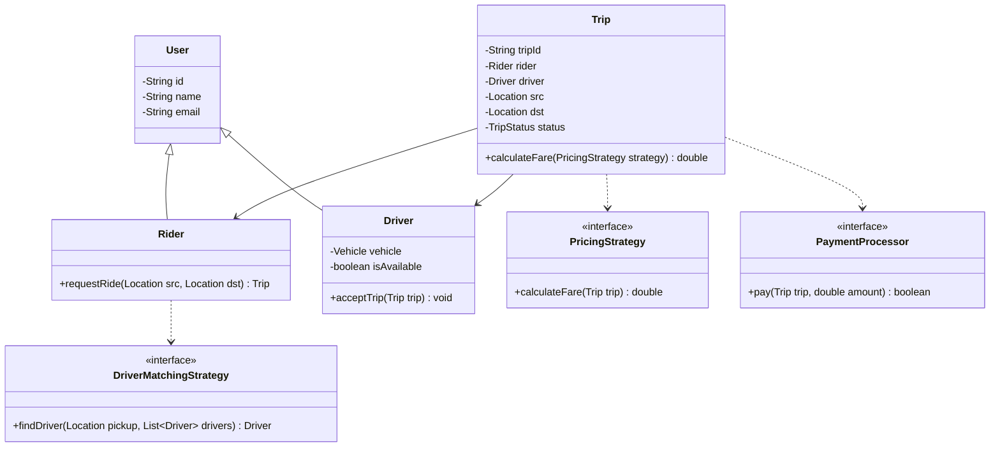

# 01. Introduction To System Design (LLD vs HLD vs DSA)

> 💡 **Quick Revision Anchor**
> - **The Core Metaphor:** *"If DSA is the Brain of an application, LLD is its Skeleton, and HLD is the City Infrastructure it lives in."*
> - **LLD (Low-Level Design):** Focuses on code architecture, classes, interfaces, OOP principles, design patterns, modularity, and extensibility.
> - **HLD (High-Level Design):** Focuses on system architecture, microservices, databases (SQL vs NoSQL), caching, load balancing, server scaling, and infrastructure cost.
> - **DSA (Data Structures & Algorithms):** Focuses on internal computational efficiency (time and space complexity) within specific operations.

---

## 1. The Story of Two Engineers: Anurag vs. Maurya

To illustrate why Low-Level Design (LLD) is essential, the instructor presents the classic story of building **"QuickRide"** (a ride-hailing platform like Uber / Ola).

Two software engineers are tasked with designing QuickRide:

### 1. Anurag's Approach (The Pure DSA Mindset)
Anurag is a competitive programmer who immediately views the system exclusively through algorithmic lenses:
1. **Finding the Shortest Route:** Jumps directly to **Dijkstra’s Algorithm** or BFS on a road graph to compute the shortest path from source to destination.
2. **Matching the Nearest Driver:** Models the user's coordinate location surrounded by nearby drivers ($R_1, R_2, R_3, R_4$) and immediately sets up a **Min-Heap / PriorityQueue** to pop the driver with minimum Euclidean distance.

Anurag presents his solution to his Engineering Manager, expecting praise.

**The Engineering Manager's Critique:**
> *"Anurag, you solved two algorithms. But where is the actual software system?*
> - *What are the core classes and domain entities in the application?*
> - *How do these objects communicate and maintain state?*
> - *How is customer data encapsulated and protected?*
> - *How will we plug in a Notification Engine (SMS, WhatsApp, Push Notifications)?*
> - *How will we integrate different Payment Gateways (Stripe, Razorpay, UPI)?*
> - *When business rules change next week (e.g., surge pricing, bike rides, ride pooling), will our code adapt or collapse like a house of cards?"*

Anurag's design had algorithms, but **zero software architecture**.

---

### 2. Maurya's Approach (The LLD + DSA Mindset)
Maurya knows algorithms, but he starts by building the **structural skeleton (LLD)**:
1. **Identifies Domain Entities:** `User`, `Driver`, `Trip`, `Vehicle`, `Location`, `Payment`, `Notification`.
2. **Defines Class Relationships & Cardinalities:**
   - A `User` can request multiple `Trips` ($1 : N$).
   - A `Trip` has exactly one `Rider` and one `Driver`.
   - A `Trip` holds a source `Location` and destination `Location`.
3. **Introduces Clean Abstractions & Interfaces:**
   - `DriverMatchingStrategy` interface: Today we can use Anurag's Min-Heap; tomorrow we can switch to Geohash or Batch Auction matching without breaking the `Trip` class!
   - `PricingStrategy` interface: Cleanly decouples standard pricing from surge pricing.
   - `PaymentProcessor` interface: Decouples trip completion from payment aggregators.
4. **Applies OOP & SOLID Principles:**
   - Encapsulation hides internal vehicle coordinates.
   - Dependency Inversion ensures high-level business rules depend on abstractions, not concrete driver classes.



**Result:** Maurya's system is clean, testable, maintainable, and production-ready.

---

## 2. What is Low-Level Design (LLD)?

**Low-Level Design (LLD)** (also called Object-Oriented Design) is the phase of software engineering that transforms abstract business requirements into clean, scalable, maintainable, and robust class structures.

```
Business Requirements ──▶ LLD (Classes, Interfaces, OOP, Patterns) ──▶ Modular, Maintainable Code
```

### The 5 Core Pillars of LLD:

1. **Modularity:**
   - Splitting a massive monolithic script into small, discrete, focused classes where each class has a Single Responsibility.
2. **Maintainability:**
   - When a bug occurs or logic needs updating, changes are localized to a single class rather than triggering domino-effect failures across the codebase.
3. **Extensibility (Open-Closed Principle):**
   - New features (e.g., introducing a `Bike` option or a `CryptoPaymentGateway`) can be added by writing new classes without modifying existing, tested code.
4. **Reusability:**
   - Components like the `DriverMatchingStrategy` can be extracted and reused in other applications (e.g., a food delivery app matching delivery riders).
5. **Readability & Developer Experience:**
   - Clear naming conventions, intuitive UML relationships, and adherence to standard design patterns make it seamless for new team members to onboard and collaborate.

---

## 3. What is NOT LLD? (Comparing LLD vs. HLD vs. DSA)

Many engineers confuse LLD with High-Level Design (HLD) or believe DSA is sufficient. The instructor clearly delineates their boundaries:

```
┌────────────────────────────────────────────────────────────────────────┐
│                        Complete Software System                        │
├───────────────────┬───────────────────────────────┬────────────────────┤
│ High-Level Design │       Low-Level Design        │  Data Structures   │
│      (HLD)        │            (LLD)              │ & Algorithms (DSA) │
├───────────────────┼───────────────────────────────┼────────────────────┤
│ System Architects │ Software / Product Engineers  │ Core Logic / Math  │
│ Macro Perspective │ Micro Code Architecture       │ Execution Speed    │
│ "City Blueprint"  │ "Building Skeleton & Anatomy" │ "Internal Wiring"  │
└───────────────────┴───────────────────────────────┴────────────────────┘
```

### 1. High-Level Design (HLD)
- Focuses on the **macro architecture** of distributed systems.
- Questions asked in HLD:
  - What tech stack will we use? (Java Spring Boot vs Node.js vs Go)
  - Which database fits best? (Relational PostgreSQL vs NoSQL MongoDB vs Hybrid)
  - How do we horizontally scale servers to support 10 million concurrent users?
  - How do we configure Load Balancers, Redis Caching, CDN, and Kafka message brokers?
  - How do we optimize cloud infrastructure costs (AWS/GCP)?
- In an HLD interview, you write almost **zero lines of code**; you draw system architecture diagrams with servers, databases, and message queues.

### 2. Low-Level Design (LLD)
- Focuses on the **micro code structure** inside the application repository.
- Questions asked in LLD:
  - What classes, interfaces, and abstractions are needed?
  - How do objects maintain state and interact polymorphically?
  - Which Design Patterns (Strategy, Factory, Observer, Decorator) should be applied?
  - How are SOLID principles enforced in code?
- In an LLD interview, you draw **UML Class Diagrams** and write **actual, clean, compile-ready Java code**.

### 3. Data Structures & Algorithms (DSA)
- The localized algorithmic tool used inside class methods.
- Answers: *"How do I compute this specific operation with optimal time and space complexity?"* (e.g., using a Min-Heap for $O(\log N)$ priority retrieval).

---

## 4. The QuickRide Example: LLD Skeleton in Java

To see Maurya's LLD approach in simple Java, observe how domain entities, interfaces, and strategies collaborate without tight coupling:

### Step 1: Domain Entities & Locations
```java
public class Location {
    private final double latitude;
    private final double longitude;

    public Location(double latitude, double longitude) {
        this.latitude = latitude;
        this.longitude = longitude;
    }

    public double distanceTo(Location other) {
        // Euclidean / Haversine distance
        return Math.sqrt(Math.pow(this.latitude - other.latitude, 2) + Math.pow(this.longitude - other.longitude, 2));
    }
}

public class User {
    private final String id;
    private final String name;

    public User(String id, String name) {
        this.id = id;
        this.name = name;
    }
    public String getName() { return name; }
}

public class Driver {
    private final String id;
    private final String name;
    private Location currentLocation;

    public Driver(String id, String name, Location currentLocation) {
        this.id = id;
        this.name = name;
        this.currentLocation = currentLocation;
    }
    public Location getLocation() { return currentLocation; }
    public String getName() { return name; }
}
```

---

### Step 2: Algorithmic Abstraction via Strategy Pattern (Decoupling DSA from LLD)
Notice how Anurag's Min-Heap algorithm is neatly encapsulated behind an interface, allowing alternative matching algorithms to be swapped in effortlessly:

```java
import java.util.*;

// Interface: The LLD abstraction
public interface DriverMatchingStrategy {
    Driver findDriver(Location pickup, List<Driver> availableDrivers);
}

// Concrete Strategy: Uses Anurag's Min-Heap DSA under the hood!
public class NearestDriverMatchingStrategy implements DriverMatchingStrategy {
    @Override
    public Driver findDriver(Location pickup, List<Driver> availableDrivers) {
        if (availableDrivers == null || availableDrivers.isEmpty()) return null;

        // Min-Heap ordered by distance to pickup location
        PriorityQueue<Driver> minHeap = new PriorityQueue<>(
            Comparator.comparingDouble(d -> d.getLocation().distanceTo(pickup))
        );

        minHeap.addAll(availableDrivers);
        return minHeap.poll(); // Returns the nearest driver in O(log N)
    }
}
```

---

### Step 3: Trip Orchestrator Entity
```java
public class Trip {
    private final String tripId;
    private final User rider;
    private Driver assignedDriver;
    private final Location pickup;
    private final Location destination;
    private boolean isCompleted = false;

    public Trip(String tripId, User rider, Location pickup, Location destination) {
        this.tripId = tripId;
        this.rider = rider;
        this.pickup = pickup;
        this.destination = destination;
    }

    public void assignDriver(DriverMatchingStrategy matchingStrategy, List<Driver> drivers) {
        this.assignedDriver = matchingStrategy.findDriver(pickup, drivers);
        if (assignedDriver != null) {
            System.out.println("Trip " + tripId + ": Assigned Driver " + assignedDriver.getName() + " to Rider " + rider.getName());
        } else {
            System.out.println("Trip " + tripId + ": No drivers available nearby.");
        }
    }
}
```

---

### Step 4: Client Execution
```java
public class QuickRideApp {
    public static void main(String[] args) {
        User rider = new User("U1", "Aditya");
        Location pickup = new Location(12.9716, 77.5946); // Bangalore
        Location drop = new Location(12.9352, 77.6245);   // Koramangala

        List<Driver> drivers = List.of(
            new Driver("D1", "Ramesh", new Location(12.9800, 77.6000)),
            new Driver("D2", "Suresh", new Location(12.9720, 77.5950)) // Closest
        );

        Trip trip = new Trip("TRIP-101", rider, pickup, drop);

        // We plug in the Nearest Driver Matching Strategy
        DriverMatchingStrategy strategy = new NearestDriverMatchingStrategy();
        trip.assignDriver(strategy, drivers);
    }
}
```

### Execution Output:
```text
Trip TRIP-101: Assigned Driver Suresh to Rider Aditya
```

---

## 5. Architectural Summary: The Trinity of Software Engineering

| Aspect | HLD | LLD | DSA |
| :--- | :--- | :--- | :--- |
| **Question Answered** | *How do servers and databases scale globally?* | *How is the codebase structured for maintainability and growth?* | *How does this specific algorithm compute its answer fastest?* |
| **Artifacts Produced** | Cloud Architecture Diagrams, VPCs, DB Schemas, Message Queues | UML Class Diagrams, Interfaces, Design Patterns, Java Classes | Functions, Arrays, Graphs, Trees, Heaps |
| **Evaluation Metrics** | Latency, Throughput (QPS), High Availability (99.99%), Cloud Cost | Modularity, Extensibility, Reusability, Testability, Clean Code | Time Complexity ($O(N)$), Space Complexity ($O(1)$) |
| **Metaphor** | **The City Infrastructure** (Highways, Power Grids, Water Pipelines) | **The Building Skeleton & Anatomy** (Steel Beams, Doorways, Room Layout) | **The Engine / Wiring** (Internal electricity, motors) |

---

## 6. Interview Perspective

- **Q: Why do top tech companies (Google, Uber, Amazon) emphasize LLD interviews?**
  *A: Writing an optimal algorithm is useless if the surrounding codebase is an unmaintainable monolith where changing one line breaks ten features. Companies need engineers who write clean, decoupled, extensible OOP code that survives 5+ years of feature updates.*
- **Q: What is the biggest mistake candidates make in LLD rounds?**
  *A: Jumping immediately into writing algorithmic helper functions (like Anurag) instead of clarifying requirements, identifying domain entities, and drawing the class relationships and contracts first.*
- **Q: How does LLD interact with DSA in practice?**
  *A: LLD creates the clean interface contract (e.g. `DriverMatchingStrategy`), and DSA implements the concrete algorithm inside that contract (e.g. `MinHeapDriverMatchingStrategy`).*

---

## 7. Quick Revision

```text
Anurag (DSA-only): Jumped to Dijkstra & PriorityQueue; had no classes, entities, or extensible structure.
Maurya (LLD + DSA): Created User, Driver, Trip domain entities; decoupled matching logic via Strategy.
Golden Takeaway: If DSA is the Brain of an application, LLD is its Skeleton.
```
