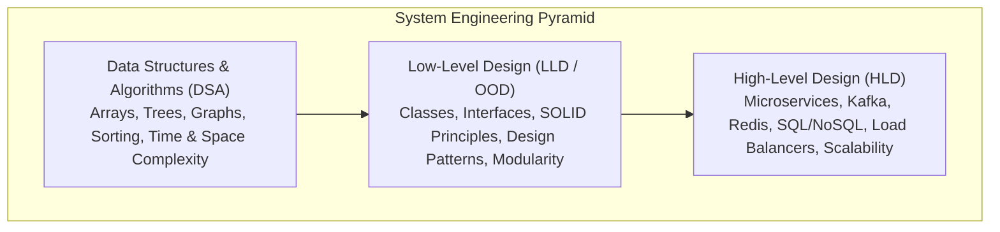
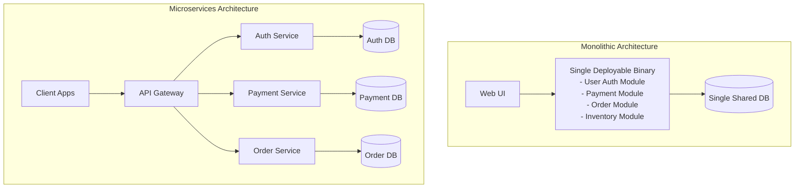
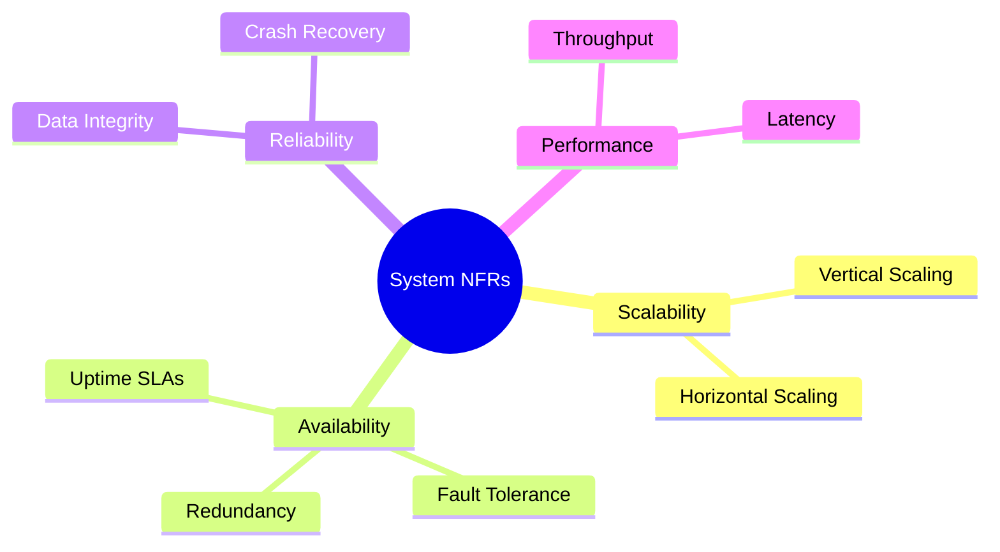
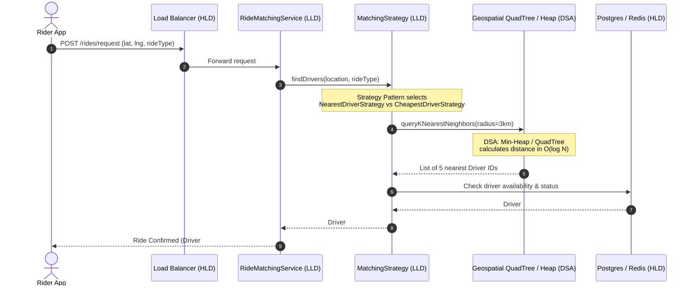

# 01. Introduction To System Design (LLD vs. HLD)

> 💡 **Quick Revision Anchor**: 
> - **DSA**: Optimizes algorithms & data structures (single problem / function level: *"Find shortest path"*).
> - **LLD**: Optimizes code modularity, design patterns, classes, interfaces, maintainability, and clean architecture (*"How Rider, Driver, Trip, and FareStrategy interact"*).
> - **HLD**: Optimizes distributed systems, scalability, databases, load balancing, caching, and network architecture (*"How to handle 10M requests across multi-region data centers"*).

---

## 1. Why System Design? (The Transition from DSA to Real Systems)

In competitive programming and Data Structures & Algorithms (DSA), problems have well-defined inputs and expected outputs:
- *"Given an array of $N$ integers, find two numbers that sum up to $K$."*
- *"Find the shortest path in a weighted graph using Dijkstra's algorithm."*

However, knowing Dijkstra's algorithm does **not** give you the architectural capability to build Google Maps or Uber. Why?
Because in production engineering:
1. **Requirements evolve constantly**: Marketing asks for a new discount coupon model, a new vehicle tier (Uber Auto, Uber Moto), or an alternate payment gateway (UPI, Stripe, Apple Pay).
2. **Multiple engineers collaborate**: 50+ developers touch the same codebase simultaneously. Poorly structured code causes merge conflicts, regression bugs, and codebase collapse.
3. **Systems must scale and run 24/7**: The code must not only compute the result, but must also be testable, extensible, readable, and resilient to failure.

---

## 2. DSA vs. LLD vs. HLD: Detailed Comparison

| Parameter | DSA | Low-Level Design (LLD) | High-Level Design (HLD) |
| :--- | :--- | :--- | :--- |
| **Scope** | Function / In-memory algorithm | Component / Class / Object relationships | Whole system / Cluster / Network architecture |
| **Primary Goal** | Minimize Time & Space complexity ($O(N)$, $O(\log N)$) | Maximize Code Readability, Extensibility, Reusability, Testability | Maximize Throughput, Availability, Reliability, Fault Tolerance |
| **Key Questions Answered** | *"Which data structure gives $O(1)$ lookup?"* | *"Which design pattern prevents `if-else` explosion when adding new ride types?"* | *"Should we use PostgreSQL or Cassandra? Do we need a message queue like Kafka?"* |
| **Artifacts Produced** | Functions, algorithmic logic, unit test cases | Class diagrams, Sequence diagrams, Interfaces, Design Patterns, SOLID code | Architecture diagrams, Database schemas, API contracts, Network topologies |
| **Interview Format** | 45 min live coding on LeetCode-style problem | 60 min machine coding / object modeling of real app (e.g. Splitwise, TicTacToe) | 45-60 min system architecture whiteboard discussion (e.g. Design Netflix) |

---

## 3. Monolithic vs. Microservices Architecture

During High-Level Design, architects choose how components are deployed and scaled:

| Parameter | Monolithic Architecture | Microservices Architecture |
| :--- | :--- | :--- |
| **Deployment** | Single unified war/jar binary | Independent containerized services (Docker/K8s) |
| **Scaling** | Scale the whole application | Scale only bottleneck services (e.g. scale Payment during Black Friday) |
| **Blast Radius** | A memory leak in one module crashes the entire system | Isolated failure; service mesh circuit breakers prevent cascade |
| **Complexity** | Simple debugging & transactional ACID consistency | Distributed data, eventual consistency, network latency, saga patterns |

---

## 4. Understanding Non-Functional Requirements (NFRs)

When an interviewer asks you to design a system, they evaluate whether you understand both **Functional Requirements** (what the system does) and **Non-Functional Requirements** (how the system behaves under load, failures, and growth).

### 1. Scalability (Vertical vs. Horizontal)
- **Vertical Scaling (Scale-Up)**: Adding more CPU cores, RAM, or SSD storage to a single server instance.
  - *Pros*: Simple, no distributed synchronization needed.
  - *Cons*: Hard hardware ceiling; expensive; single point of failure (SPOF).
- **Horizontal Scaling (Scale-Out)**: Adding more commodity server instances behind a Load Balancer.
  - *Pros*: Virtually unlimited growth; high availability.
  - *Cons*: Requires stateless application layers, distributed databases, network coordination.

### 2. Availability vs. Reliability
- **Availability**: The percentage of time a system remains operational and accessible to process requests.
  $$\text{Availability} = \frac{\text{Total Uptime}}{\text{Total Uptime} + \text{Total Downtime}}$$
  - *High Availability Target*: **99.999% ("Five Nines")** $\approx$ under 5.26 minutes of downtime per entire year!
- **Reliability**: The probability that a system performs its intended function correctly without errors or data loss over a specified interval.
  - *Key Takeaway*: A system can be **available** (responding with HTTP 500 errors quickly) but **unreliable** (failing to complete bookings). Reliability requires correct execution.

### 3. Latency vs. Throughput
- **Latency**: The time taken to process a single request from the moment it is sent until the response is received (measured in milliseconds, e.g., $p99 < 50\text{ ms}$).
- **Throughput**: The number of requests the system can process per unit of time (measured in Requests Per Second - RPS, or Transactions Per Second - TPS).
- *Analogy*: Think of a highway.
  - **Latency** is how long it takes one car to travel from point A to point B (speed).
  - **Throughput** is how many cars pass through a toll booth per minute (capacity).

---

## 5. The Real-World LLD Example: Ride-Hailing App (Uber / Ola)

Let's illustrate how DSA, LLD, and HLD collaborate in a single feature: **Matching a rider with the nearest driver**.

1. **DSA Component**: A Geospatial QuadTree or Min-Heap calculates the closest drivers in $O(\log N)$ time.
2. **LLD Component**:
   - `Rider` and `Driver` classes inherit from a base `User` class.
   - `MatchingStrategy` interface with implementations `NearestDriverStrategy`, `SurgeOptimizedStrategy`, and `SharedRideStrategy`.
   - `Trip` class tracks lifecycle states (`REQUESTED`, `ACCEPTED`, `IN_TRANSIT`, `COMPLETED`).
3. **HLD Component**:
   - Microservices communicate over gRPC / REST.
   - WebSocket servers stream driver GPS updates every 4 seconds.
   - Redis stores real-time driver coordinates with TTL.

---

## 6. Interview Preparation Roadmap

When approaching an LLD / Machine Coding interview:
1. **Clarify Requirements (First 5–10 mins)**: Identify actors, functional use cases, constraints, and out-of-scope items.
2. **Identify Core Entities & Relationships (Next 5–10 mins)**: Identify nouns (Classes) and verbs (Methods). Determine `IS-A` (Inheritance) vs `HAS-A` (Composition) relationships.
3. **Apply Design Patterns Judiciously**: Do not force patterns. Use **Strategy** for interchangeable behaviors, **Factory** for object creation, **Observer** for event-driven updates, and **State** for complex status lifecycles.
4. **Adhere to SOLID Principles**: Single responsibility classes, interface-driven programming, and dependency injection.
5. **Implement Extensible, Compilable Code**: Write clean Java code with proper access modifiers, validation, error handling, and thread safety.
