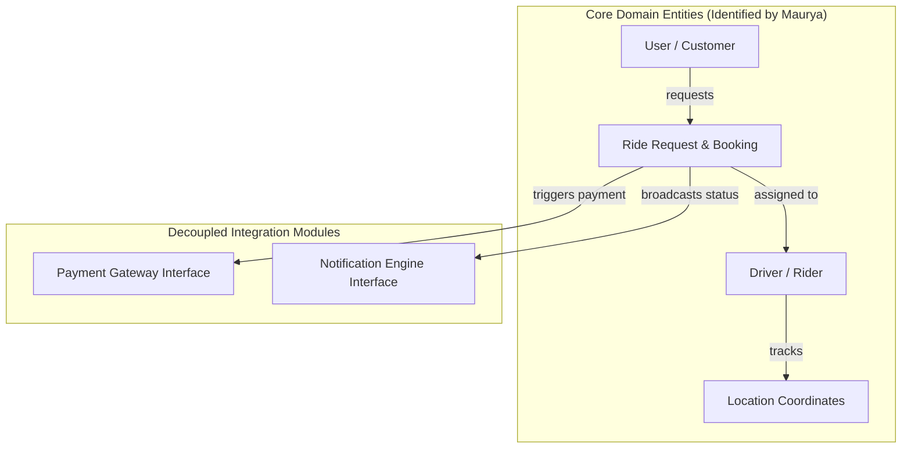
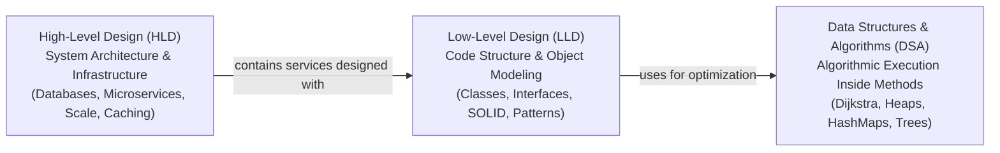

# 01. Introduction To System Design (LLD vs HLD vs DSA)

> 💡 **Quick Revision Anchor**: A comprehensive foundational guide distinguishing **DSA**, **LLD (Low-Level Design)**, and **HLD (High-Level Design)** through the lecture's story of **Anurag & Maurya at QuickRide**. Demonstrates why algorithms alone cannot build an application, why code structure, entity relationships, data security, and plug-and-play modularity matter, and why **"If DSA is the brain of an application, LLD is its skeleton."**

---

## 1. What This Lecture Covers

1. What is System Design and why does it exist?
2. The isolated nature of DSA (Data Structures & Algorithms) vs building a complete software system.
3. The Tale of Two Engineers at **QuickRide**: **Anurag** (DSA expert, 0 LLD) vs **Maurya** (DSA + LLD practitioner).
4. Why jumping directly to algorithms (e.g., Dijkstra on city graphs) fails in real-world application design.
5. What LLD actually solves:
   - Identifying Entities and Objects
   - Establishing Object Relationships and Interactions
   - Enforcing Data Security & Encapsulation (e.g., masking phone numbers)
   - Decoupling third-party integrations (Notification, Payment Gateways)
   - Plug-and-Play Reusability (Rider Mapping in QuickRide vs Food Delivery in Zomato/Swiggy vs Courier Delivery in Amazon/Blinkit)
   - Code Maintainability, Extensibility, and minimizing bugs.
6. The exact distinction between **HLD**, **LLD**, and **DSA**.
7. The Golden Metaphor: Brain vs Skeleton vs Infrastructure.

---

## 2. DSA vs Real-World Software Applications

In competitive programming or computer science coursework, problems are isolated:
- *"Given an unsorted array, sort it in $O(N \log N)$ time."* (Solution: QuickSort, MergeSort, InsertionSort).
- *"Find the shortest path in a weighted graph."* (Solution: Dijkstra's Algorithm).

```text
       Isolated Problem (DSA)                 Complete Software Application (LLD)
   ┌─────────────────────────────┐        ┌──────────────────────────────────────────────┐
   │ Sort an array / find path   │   VS   │  User books ride, Driver gets matched,       │
   │ Input -> Algorithm -> Output│        │  Live GPS tracking, Payment handled,         │
   └─────────────────────────────┘        │  SMS/Push notified, Phone numbers masked     │
                                          └──────────────────────────────────────────────┘
```

When you build a full production application around these algorithmic cores, you encounter **Low-Level Design (LLD)**. LLD is the discipline of structuring the code, objects, responsibilities, and interactions that bring algorithms to life inside a sustainable system.

---

## 3. The Story of Two Engineers at QuickRide

To clearly understand why LLD is necessary, the instructor introduces two college graduates joining a ride-booking startup called **QuickRide** (an Ola/Uber clone):

```text
┌────────────────────────────────────────────────────────────────────────┐
│                               QUICKRIDE                                │
│                     (Ride-Hailing Startup Platform)                    │
└───────────────────────────────────┬────────────────────────────────────┘
                                    │
                  ┌─────────────────┴─────────────────┐
                  ▼                                   ▼
        ┌───────────────────┐               ┌───────────────────┐
        │      ANURAG       │               │      MAURYA       │
        ├───────────────────┤               ├───────────────────┤
        │ • DSA Expert      │               │ • DSA Expert      │
        │ • Knows 0 LLD     │               │ • Strong in LLD   │
        └───────────────────┘               └───────────────────┘
```

Their engineering manager presents the challenge:
> *"We need to design and build our core QuickRide ride-booking application. Figure out the problems and design the architecture."*

---

### Anurag's Perspective (The Naive / Pure DSA Approach)

Because Anurag only knows DSA, he equates **"building an application"** with **"writing an algorithm"**. He immediately dives into algorithmic subproblems:

1. **Problem 1 — How to take a user from Source to Destination?**
   - Anurag thinks: *"I will model the entire city as a Graph where intersections are nodes and roads are weighted edges (weights representing distance and traffic). I'll run Dijkstra's shortest-path algorithm to navigate the cab."*
2. **Problem 2 — How to map a user to a nearby driver?**
   - Anurag thinks: *"I will represent all drivers on a 2D coordinate grid, calculate Euclidean distances, and use a Min-Heap to find the nearest driver."*

Anurag presents this to his engineering manager, confident he has "designed" QuickRide.

---

### The Manager's Critique of Anurag's Design

The manager rejects Anurag's design because it is **an algorithm without an application**. The manager points out critical missing fundamentals:

```text
                           ANURAG'S BLIND SPOTS
  ┌───────────────────────────────────────────────────────────────────────┐
  │ 1. Where are the domain Objects / Entities?                          │
  │ 2. What are the Relationships and Interactions between these objects? │
  │ 3. How is Data Security enforced?                                     │
  │    (e.g., Rider & User phone numbers MUST be masked once ride ends)   │
  │ 4. How do we integrate Notifications (Push, SMS, In-App)?            │
  │ 5. How do we integrate third-party Payment Gateways (Razorpay/Paytm)? │
  │ 6. What happens when the app scales to millions of users?             │
  └───────────────────────────────────────────────────────────────────────┘
```

Anurag has no answers because algorithms do not dictate object contracts, data boundaries, or external system integrations.

---

### Maurya's Perspective (The LLD Approach)

Maurya understands that algorithms come *later*. The first priority is building the **structural skeleton** of the application.



Maurya addresses each foundational design dimension:

#### 1. Entity Identification & Relationships
- Defines core objects: `User`, `Driver` (or Rider), `Ride`, `Location`, `Payment`, and `Notification`.
- Models how a `User` interacts with a `Ride`, how a `Driver` accepts a `Ride`, and how locations update dynamically.

#### 2. Data Security & Encapsulation
- Protects sensitive data: `User` and `Driver` phone numbers must be encapsulated.
- While a ride is active, a proxy or masked communication channel is used.
- Once the ride transitions to `COMPLETED`, the driver must no longer have access to the user's personal details.

#### 3. Plug-and-Play Reusability (Loose Coupling)
- `Notification` and `Payment` must **not** be tightly coupled to the QuickRide business logic.
- They must be independent, plug-and-play modules:
  - If tomorrow the company builds a food delivery app (**Zomato / Swiggy clone**) or e-commerce platform, the same `NotificationEngine` and `PaymentGateway` abstractions must plug in seamlessly without rewriting.

#### 4. Generic Matching Engines
- The driver-allocation logic is not hardcoded into the ride class.
- It is designed as an interchangeable **Matching Strategy**:
  - In **QuickRide**: Matches passenger to closest available cab driver.
  - In **Zomato / Swiggy**: Matches restaurant order to closest delivery partner.
  - In **Amazon / Blinkit**: Matches warehouse parcel to delivery agent.
- Same underlying architectural contract, adapted cleanly across domains.

---

## 4. Why Good LLD is Vital for Enterprise Systems

The instructor highlights four major goals achieved by clean Low-Level Design:

| Goal | Why It Matters | Consequence of Failure |
| :--- | :--- | :--- |
| **Maintainability** | Code is readable, well-structured, and easy for any engineer to understand. | Spaghetti code; nobody understands who changes what; high onboarding friction. |
| **Extensibility** | New features (e.g., EV cab category, UPI payment, coupon discounts) can be added without modifying existing code. | Modifying old code breaks existing features (violates Open/Closed Principle). |
| **Testability & Minimal Bugs** | Loosely coupled classes with clear interfaces allow isolated unit testing. | Untestable monolith; fixing one bug creates three new regression bugs. |
| **Reusability** | Modular components can be shared across multiple systems via plug-and-play interfaces. | Duplicate copy-paste code throughout different repositories. |

---

## 5. The Three Dimensions: HLD vs LLD vs DSA



### Detailed Comparison Table

| Aspect | High-Level Design (HLD) | Low-Level Design (LLD) | Data Structures & Algorithms (DSA) |
| :--- | :--- | :--- | :--- |
| **Primary Focus** | **System Architecture** | **Code Structure** | **Algorithmic Efficiency** |
| **Scope** | Macro / Global (Inter-system) | Micro / Service-level (Intra-service) | Local / Function-level (In-memory) |
| **Key Questions** | • What tech stack to use?<br/>• SQL vs NoSQL vs Hybrid?<br/>• How to scale to millions of requests?<br/>• Load balancers, caches, CDN, cloud cost? | • What classes and interfaces to create?<br/>• What design patterns to apply?<br/>• How to decouple modules?<br/>• How to adhere to SOLID principles? | • Which data structure minimizes space?<br/>• How to achieve $O(N \log N)$ or $O(1)$ lookup?<br/>• How to find shortest path or topological sort? |
| **Key Deliverables** | Architecture diagrams, network topologies, data schema, scale strategy. | Class diagrams, sequence diagrams, design pattern implementations, Java code. | Time and space complexity analysis, algorithmic proof, function code. |

---

## 6. The Golden Metaphor

The instructor summarizes the relationship between all three disciplines in one unforgettable sentence:

> 🧠 **"If DSA is the BRAIN of an application, LLD is its SKELETON, and HLD is the INFRASTRUCTURE it lives in."**

```text
┌────────────────────────────────────────────────────────────────────────┐
│ HLD: The City & Roads (Cloud infrastructure, servers, network, DB)     │
│                                                                        │
│   ┌────────────────────────────────────────────────────────────────┐   │
│   │ LLD: The Human Skeleton (Bones, joints, structure, interfaces) │   │
│   │                                                                │   │
│   │   ┌────────────────────────────────────────────────────────┐   │   │
│   │   │ DSA: The Brain (Thinking, calculation, logic, formulas)│   │   │
│   │   └────────────────────────────────────────────────────────┘   │   │
│   └────────────────────────────────────────────────────────────────┘   │
└────────────────────────────────────────────────────────────────────────┘
```

Without a skeleton (LLD), the brain (DSA) collapses into a heap of flesh and cannot move. Without an environment (HLD), the body has nowhere to function.

---

## 7. Java Representation: Maurya's QuickRide Architecture

Here is the clean Java structure illustrating how Maurya models QuickRide with loose coupling, data security, and plug-and-play modules:

```java
import java.util.*;

// 1. Data Security & Encapsulation: User and Driver Entities
class User {
    private final String userId;
    private final String name;
    private final String phoneNumber; // Sensitive data

    public User(String userId, String name, String phoneNumber) {
        this.userId = userId;
        this.name = name;
        this.phoneNumber = phoneNumber;
    }

    public String getUserId() { return userId; }
    public String getName() { return name; }
    // Masked phone number prevents exposing personal info
    public String getMaskedPhone() {
        return "XXXXX-" + phoneNumber.substring(Math.max(0, phoneNumber.length() - 4));
    }
}

class Driver {
    private final String driverId;
    private final String name;
    private double currentLatitude;
    private double currentLongitude;
    private boolean isAvailable;

    public Driver(String driverId, String name, double lat, double lon) {
        this.driverId = driverId;
        this.name = name;
        this.currentLatitude = lat;
        this.currentLongitude = lon;
        this.isAvailable = true;
    }

    public String getDriverId() { return driverId; }
    public String getName() { return name; }
    public double getLatitude() { return currentLatitude; }
    public double getLongitude() { return currentLongitude; }
    public boolean isAvailable() { return isAvailable; }
    public void setAvailable(boolean available) { isAvailable = available; }
}

// 2. Reusable Matching Strategy (Used in QuickRide, Zomato, Blinkit)
interface MatchingStrategy {
    Driver matchDriver(double pickupLat, double pickupLon, List<Driver> availableDrivers);
}

// Nearest driver selection using Euclidean distance
class NearestDriverStrategy implements MatchingStrategy {
    @Override
    public Driver matchDriver(double pickupLat, double pickupLon, List<Driver> availableDrivers) {
        Driver bestMatch = null;
        double minDistance = Double.MAX_VALUE;

        for (Driver driver : availableDrivers) {
            if (!driver.isAvailable()) continue;
            double dist = Math.hypot(driver.getLatitude() - pickupLat, driver.getLongitude() - pickupLon);
            if (dist < minDistance) {
                minDistance = dist;
                bestMatch = driver;
            }
        }
        return bestMatch;
    }
}

// 3. Plug-and-Play Third-Party Integrations (Open/Closed Principle)
interface NotificationService {
    void sendNotification(String recipient, String message);
}

class PushNotificationService implements NotificationService {
    @Override
    public void sendNotification(String recipient, String message) {
        System.out.println("[Push Notification -> " + recipient + "]: " + message);
    }
}

interface PaymentService {
    boolean processPayment(String userId, double amount);
}

class ThirdPartyPaymentService implements PaymentService {
    @Override
    public boolean processPayment(String userId, double amount) {
        System.out.println("[Payment Gateway]: Successfully debited ₹" + amount + " from user " + userId);
        return true;
    }
}

// 4. Core Orchestrator: QuickRide Service
class QuickRideService {
    private final List<Driver> drivers = new ArrayList<>();
    private final MatchingStrategy matchingStrategy;
    private final NotificationService notificationService;
    private final PaymentService paymentService;

    public QuickRideService(MatchingStrategy matchingStrategy,
                            NotificationService notificationService,
                            PaymentService paymentService) {
        this.matchingStrategy = matchingStrategy;
        this.notificationService = notificationService;
        this.paymentService = paymentService;
    }

    public void registerDriver(Driver driver) {
        drivers.add(driver);
    }

    public void bookRide(User user, double pickupLat, double pickupLon, double dropLat, double dropLon) {
        System.out.println("\n[QuickRide]: Booking ride for " + user.getName() + " (Phone: " + user.getMaskedPhone() + ")");

        // Step 1: Algorithmic matching delegated to strategy
        Driver assignedDriver = matchingStrategy.matchDriver(pickupLat, pickupLon, drivers);
        if (assignedDriver == null) {
            notificationService.sendNotification(user.getName(), "No drivers available nearby. Please try again.");
            return;
        }

        assignedDriver.setAvailable(false);
        notificationService.sendNotification(user.getName(), "Driver " + assignedDriver.getName() + " assigned to your ride!");

        // Step 2: Trip lifecycle
        System.out.println("[QuickRide]: Trip in progress from (" + pickupLat + "," + pickupLon + ") to (" + dropLat + "," + dropLon + ")");

        // Step 3: Payment & Completion
        double fare = 250.00;
        paymentService.processPayment(user.getUserId(), fare);
        assignedDriver.setAvailable(true);

        notificationService.sendNotification(user.getName(), "Ride completed! Masked receipt generated.");
    }
}

// 5. Test Driver
public class Main {
    public static void main(String[] args) {
        MatchingStrategy strategy = new NearestDriverStrategy();
        NotificationService notification = new PushNotificationService();
        PaymentService payment = new ThirdPartyPaymentService();

        QuickRideService quickRide = new QuickRideService(strategy, notification, payment);

        // Register Drivers
        quickRide.registerDriver(new Driver("D1", "Ramesh", 12.9716, 77.5946));
        quickRide.registerDriver(new Driver("D2", "Suresh", 12.9352, 77.6245));

        // User books a ride
        User user = new User("U101", "Pooja", "9876543210");
        quickRide.bookRide(user, 12.9720, 77.5950, 12.9279, 77.6271);
    }
}
```

---

## Quick Revision

### Core Idea
System design transforms isolated algorithms (DSA) into complete, scalable, and resilient software applications. While DSA optimizes individual operations in-memory, **LLD (Low-Level Design)** architects the modular code structure, class hierarchies, SOLID principles, and data boundaries inside a service, and **HLD (High-Level Design)** orchestrates distributed system topology, caching, and databases across the network.

### Remember
* The Story of QuickRide: Anurag jumped straight to Dijkstra graph traversal and failed because an application requires entities, relationships, privacy, and modular integrations. Maurya succeeded by designing the object skeleton first.
* Data security matters at the LLD level: Customer and driver phone numbers must be masked to protect privacy after ride completion.
* Reusability: Notification, Payment, and Matching abstractions should be plug-and-play across QuickRide, Zomato, Swiggy, Amazon, and Blinkit.

### Java Implementation Idea
* Define interfaces for cross-cutting capabilities (`MatchingStrategy`, `NotificationService`, `PaymentService`) so concrete implementations can be swapped without modifying the core business orchestrator (`QuickRideService`).
* Encapsulate sensitive fields within private access modifiers and expose only masked views (`getMaskedPhone()`).

### Most Important Interview Point
* Always explain the hierarchy: *"If DSA is the brain of an application, LLD is its skeleton, and HLD is the environment/infrastructure it lives in."*
* Never begin an LLD interview by writing algorithmic loops. Start by clarifying requirements, identifying domain entities, establishing relationships, and defining interfaces.

### Common Trap
* Confusing LLD with writing an algorithm. (e.g., spending the entire interview coding Dijkstra's algorithm instead of modeling `User`, `Driver`, `Ride`, and `Payment` abstractions).
* Hardcoding third-party dependencies (like SMS or Razorpay) directly inside business logic classes rather than programming to interfaces.
