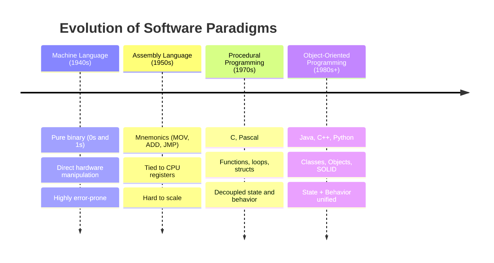
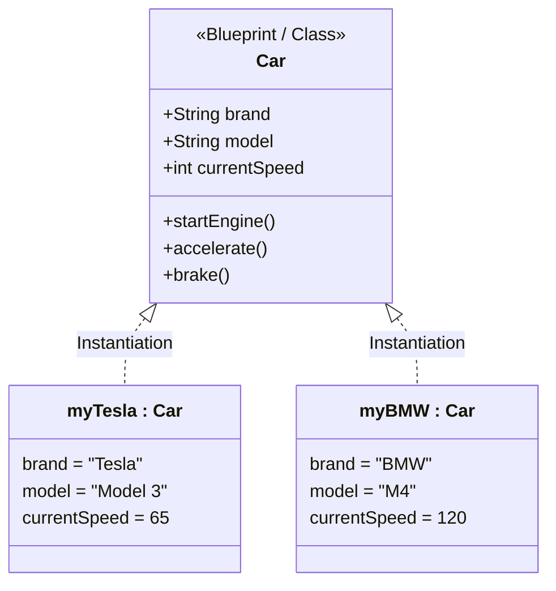
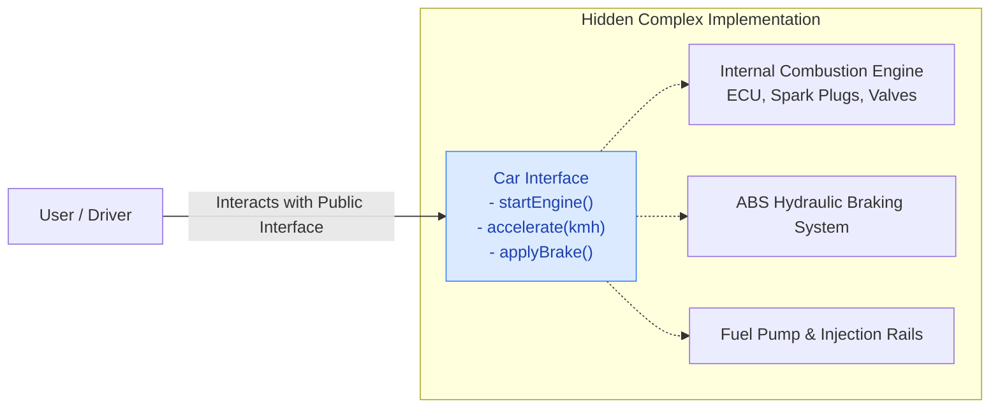
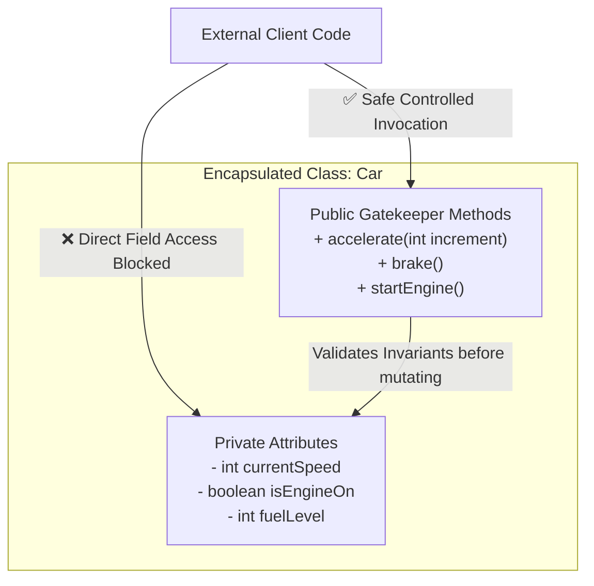

# 02. OOPs Real-World Examples, Abstraction & Encapsulation

> 💡 **Quick Revision Anchor**: 
> - **Abstraction**: *Design-level*. Hides complexity and implementation details; exposes **"WHAT"** an object does via interfaces/abstract classes.
> - **Encapsulation**: *Implementation-level*. Bundles state + behavior into a single boundary and restricts direct access to enforce invariants; controls **"HOW"** data is accessed and modified.

---

## 1. The Evolution of Programming Paradigms

To truly understand why Object-Oriented Programming (OOP) dominates enterprise software, we must trace how software engineering evolved:



### The Procedural Anti-Pattern: Unbound Data & Missing Boundaries
In procedural languages (like C), data is defined inside `structs` while independent functions operate on them from anywhere in the codebase:

```c
// Procedural C approach
struct Car {
    char brand[32];
    int currentSpeed;
    bool isEngineOn;
};

void accelerate(struct Car* car, int speedIncrease) {
    car->currentSpeed += speedIncrease;
}
```

#### What goes wrong in Procedural Code?
1. **No Data Protection**: Any external developer can write `car->currentSpeed = -500;` or `car->isEngineOn = false;` while moving at 120 km/h. The struct cannot protect its own internal integrity.
2. **Scattered Business Rules**: Validation logic (e.g., checking if speed is within limits) must be repeated in every function that modifies `car`. If a developer forgets the check, corrupt state enters the system.
3. **High Coupling, Low Cohesion**: Changing one variable name in the struct breaks hundreds of unrelated external functions.

OOP solves this by uniting **data (attributes)** and the **methods (behavior)** that operate on that data inside a protected **Class boundary**.

---

## 2. Core Concepts: Class vs. Object

- **Class**: The architectural blueprint, template, or custom data type that defines the attributes (state) and methods (behavior). It occupies no runtime heap memory by itself.
- **Object**: A concrete runtime instance of a class allocated in memory (Heap). Multiple independent objects can be instantiated from a single class blueprint.



---

## 3. Abstraction: Hiding Complexity ("WHAT" vs "HOW")

> **Definition**: Abstraction is the process of exposing only the essential, high-level features of an entity to the outside world while completely hiding internal implementation details and complex background mechanics.

### Real-World Analogy: Driving an Automobile
When you drive a car:
- You interact with a clean, intuitive abstraction: the **steering wheel**, the **accelerator pedal**, the **brake pedal**, and the **gear lever**.
- You do **not** need to manually calculate air-fuel mixture ratios, trigger ECU fuel injector timings, monitor camshaft revolutions, or regulate brake fluid hydraulic pressure.
- If the manufacturer replaces a traditional gasoline engine with an electric motor (e.g., Tesla), your interface (pedals and steering) remains identical! The underlying implementation changed, but the abstraction remained stable.



### Implementing Abstraction in Java
In Java, abstraction is achieved via **Abstract Classes** (partial abstraction) and **Interfaces** (100% pure contractual abstraction):

```java
// Contract / Abstraction
public interface Vehicle {
    void startEngine();
    void accelerate(int targetSpeed);
    void applyBrakes();
    int getCurrentSpeed();
}
```

---

## 4. Encapsulation: Information Hiding & State Integrity

> **Definition**: Encapsulation is the mechanism of bundling data members (attributes) and member functions into a single logical unit (class) AND restricting direct access to the internal state using access modifiers (`private`). 

### Why is Encapsulation Vital? (The Guarded Gatekeeper)
Encapsulation ensures that an object always remains in a **valid state**. The object acts as its own gatekeeper, validating all mutations against strict business invariants before altering memory.



### Access Modifiers Matrix

| Access Modifier | Within Same Class | Within Same Package | Subclass (Different Package) | Entire World (Any Package) |
| :--- | :---: | :---: | :---: | :---: |
| `private` | ✅ | ❌ | ❌ | ❌ |
| `default` (no modifier) | ✅ | ✅ | ❌ | ❌ |
| `protected` | ✅ | ✅ | ✅ (via inheritance) | ❌ |
| `public` | ✅ | ✅ | ✅ | ✅ |

---

## 5. Abstraction vs. Encapsulation: The Key Interview Distinction

Candidates frequently confuse these two foundational pillars. Here is how to distinguish them in technical interviews:

| Parameter | Abstraction | Encapsulation |
| :--- | :--- | :--- |
| **Focus** | **Hiding Complexity** (Focuses on the outside view: *"What does this object do?"*) | **Hiding Internal State / Data Protection** (Focuses on the inside view: *"How is data safely stored and modified?"*) |
| **Implementation** | Achieved using **Interfaces** and **Abstract Classes**. | Achieved using **Access Modifiers (`private`)** + **Getters / Setters with validation**. |
| **Design Level** | High-level architectural design decision. | Low-level class implementation detail. |
| **Real-World Metaphor** | The dashboard, pedals, and steering wheel of a car. | The metallic hood and lock covering the engine and fuel tank to prevent tampering. |

---

## 6. Complete Production-Grade Java Implementation

Let's look at a fully encapsulated and abstracted `Automobile` class with invariant validation:

```java
// Abstraction contract
public interface Drivable {
    void startEngine();
    void stopEngine();
    void accelerate(int kmh);
    void applyBrakes(int kmh);
}

// Encapsulated concrete implementation
public class Car implements Drivable {
    // Encapsulation: All fields are private
    private final String brand;
    private final String model;
    private boolean isEngineOn;
    private int currentSpeed;
    private int fuelLevel; // 0 to 100%

    private static final int MAX_SPEED = 240;

    public Car(String brand, String model, int initialFuel) {
        if (brand == null || brand.isBlank()) throw new IllegalArgumentException("Brand cannot be empty");
        if (model == null || model.isBlank()) throw new IllegalArgumentException("Model cannot be empty");
        this.brand = brand;
        this.model = model;
        this.fuelLevel = Math.max(0, Math.min(100, initialFuel));
        this.isEngineOn = false;
        this.currentSpeed = 0;
    }

    @Override
    public void startEngine() {
        if (fuelLevel <= 0) {
            System.out.println("❌ Cannot start engine: Fuel tank is empty!");
            return;
        }
        this.isEngineOn = true;
        System.out.println("✅ " + brand + " " + model + " engine started.");
    }

    @Override
    public void stopEngine() {
        if (currentSpeed > 0) {
            System.out.println("⚠️ Cannot turn off engine while car is moving at " + currentSpeed + " km/h! Bring car to stop first.");
            return;
        }
        this.isEngineOn = false;
        System.out.println("🛑 Engine turned off.");
    }

    @Override
    public void accelerate(int kmh) {
        if (!isEngineOn) {
            System.out.println("❌ Cannot accelerate: Engine is OFF. Start the engine first!");
            return;
        }
        if (kmh <= 0) {
            System.out.println("⚠️ Acceleration increment must be positive.");
            return;
        }

        // Invariant: Speed cannot exceed MAX_SPEED
        this.currentSpeed = Math.min(this.currentSpeed + kmh, MAX_SPEED);
        this.fuelLevel = Math.max(0, this.fuelLevel - 1);
        System.out.println("🚀 Accelerated by " + kmh + " km/h. Current Speed: " + this.currentSpeed + " km/h | Fuel: " + this.fuelLevel + "%");
    }

    @Override
    public void applyBrakes(int kmh) {
        if (kmh <= 0) return;
        // Invariant: Speed cannot be negative
        this.currentSpeed = Math.max(0, this.currentSpeed - kmh);
        System.out.println("🛑 Brakes applied. Current Speed: " + this.currentSpeed + " km/h");
    }

    // Read-only getters maintaining encapsulation
    public String getBrand() { return brand; }
    public String getModel() { return model; }
    public int getCurrentSpeed() { return currentSpeed; }
    public boolean isEngineOn() { return isEngineOn; }
    public int getFuelLevel() { return fuelLevel; }
}
```

---

## 7. Common Interview Pitfalls & Traps

1. **"Are Getters and Setters always a violation of Encapsulation?"**
   - *Answer*: Blindly generating IDE getters and setters for every private field turns your class into an anemic data holder (essentially a struct with extra syntax). True encapsulation means exposing domain actions (`car.accelerate(20)`) rather than raw setters (`car.setSpeed(car.getSpeed() + 20)`). This is known as the **"Tell, Don't Ask"** principle.
2. **"Can we have Encapsulation without Abstraction?"**
   - *Answer*: Yes. You can have a single class with private variables and validation methods (encapsulation) without defining any abstract class or interface (abstraction). However, combining both yields decoupled, robust software.
