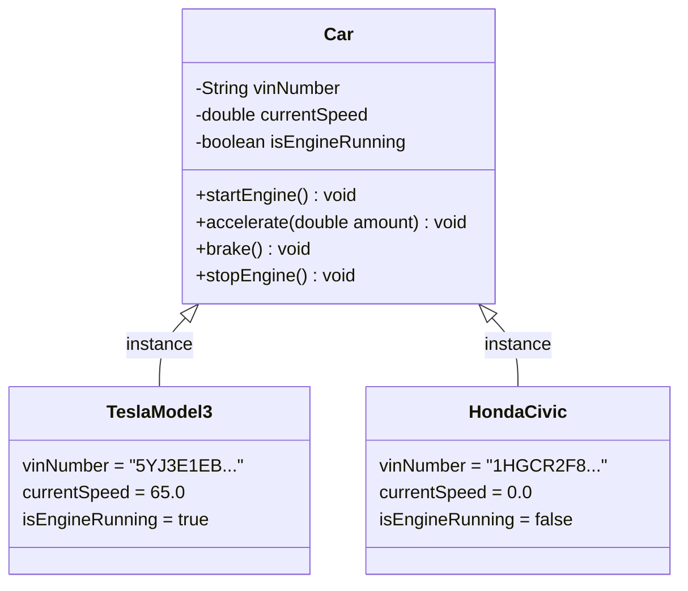
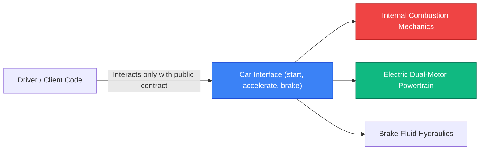
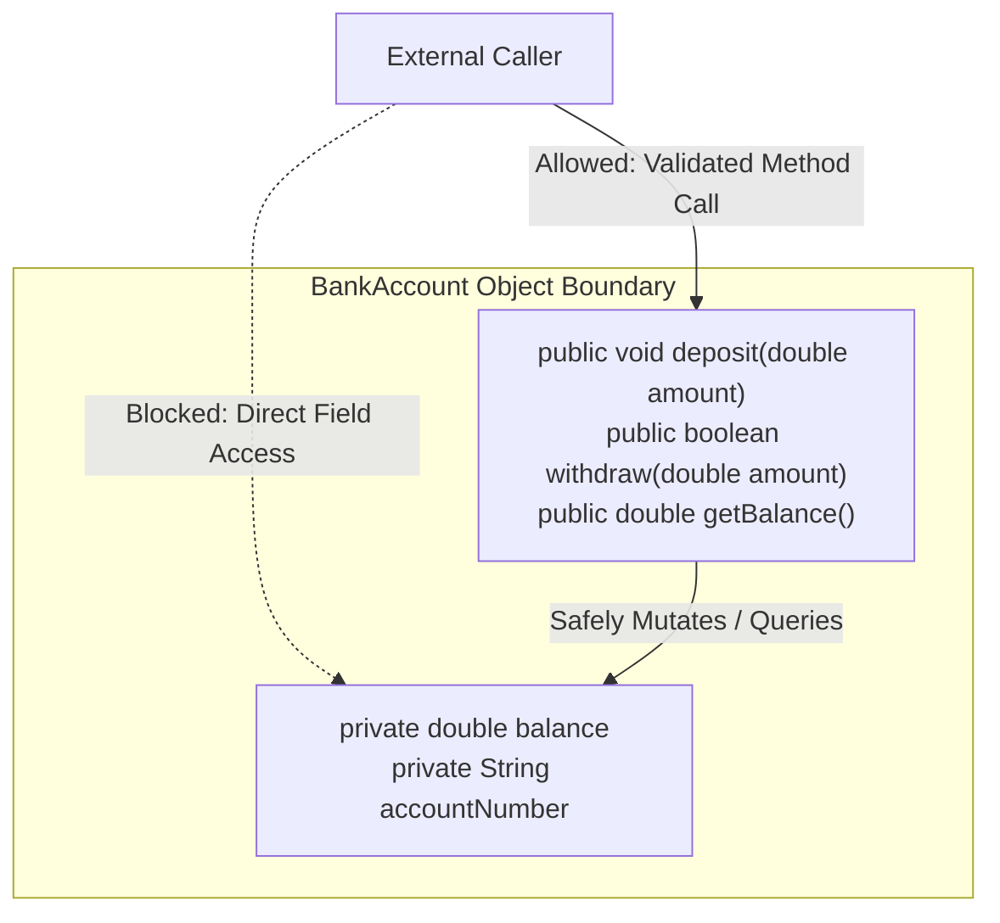

# 02. OOPs Real-World Examples: Abstraction & Encapsulation

> 💡 **Quick Revision Anchor**: `Abstraction = What (Contract), Encapsulation = How (Data Hiding)`

---

## 1. Core OOP Foundations: Classes & Objects

At its foundation, **Object-Oriented Programming (OOP)** models real-world entities into software structures composed of **State** (attributes/variables) and **Behavior** (methods/functions).

- **Class**: The abstract blueprint or template (e.g., `Car` blueprint specifying that cars have an engine, wheels, and speed).
- **Object**: A concrete instance created in memory (e.g., your red `Tesla Model 3` or a `Honda Civic`).



---

## 2. Abstraction: Hiding Complexity behind Interfaces

### Definition
**Abstraction** is the process of hiding internal implementation complexity and exposing only the essential features, actions, and interfaces to the outside world.

### Real-World Mental Model: Driving a Car
When you drive a car, you interact with standard controls:
1. Push the Start button.
2. Press the Accelerator to speed up.
3. Press the Brake to slow down.

You do **not** need to know:
- The electrical firing order of spark plugs.
- The chemical air-to-fuel injection ratio.
- The hydraulic fluid pressure distribution inside the brake calipers.

If the manufacturer replaces an internal combustion engine with an electric battery motor, the driver's interface (`accelerate()`, `brake()`) remains identical.



### Java Code Walkthrough
```java
// Abstraction: Defines WHAT a Car can do without revealing HOW
public interface Car {
    void startEngine();
    void accelerate(int speedIncrease);
    void applyBrakes();
    void stopEngine();
}

// Concrete Implementation 1: Electric Vehicle
public class ElectricCar implements Car {
    private int batteryPercentage = 100;
    private int currentSpeed = 0;

    @Override
    public void startEngine() {
        System.out.println("Electric inverter initialized silently.");
    }

    @Override
    public void accelerate(int speedIncrease) {
        currentSpeed += speedIncrease;
        batteryPercentage -= 1;
        System.out.println("Electric motor accelerating: " + currentSpeed + " km/h");
    }

    @Override
    public void applyBrakes() {
        currentSpeed = Math.max(0, currentSpeed - 15);
        System.out.println("Regenerative braking active. Speed: " + currentSpeed + " km/h");
    }

    @Override
    public void stopEngine() {
        System.out.println("High voltage contactors open. Vehicle stopped.");
    }
}
```

---

## 3. Encapsulation: Packaging & Data Protection

### Definition
**Encapsulation** is the mechanism of binding together the data (fields) and the functions that manipulate them into a single unit (class), while **restricting direct external access** to internal state using access specifiers (`private`, `protected`).

### Real-World Mental Model: Bank Account
Consider a bank account:
- If `balance` was `public`, any rogue code could execute `account.balance = -1000000;` or withdraw money without checking if funds exist.
- With encapsulation, `balance` is strictly `private`. External callers must invoke `deposit()` and `withdraw()`, where security, validation, and business invariants are verified.



### Java Code Walkthrough
```java
public class BankAccount {
    private final String accountNumber;
    private double balance; // Protected from unauthorized direct mutation

    public BankAccount(String accountNumber, double initialDeposit) {
        if (initialDeposit < 0) {
            throw new IllegalArgumentException("Initial deposit cannot be negative.");
        }
        this.accountNumber = accountNumber;
        this.balance = initialDeposit;
    }

    // Controlled mutation with business rules
    public synchronized void deposit(double amount) {
        if (amount <= 0) {
            throw new IllegalArgumentException("Deposit amount must be strictly positive.");
        }
        this.balance += amount;
    }

    public synchronized boolean withdraw(double amount) {
        if (amount <= 0) {
            throw new IllegalArgumentException("Withdrawal amount must be positive.");
        }
        if (amount > this.balance) {
            System.out.println("Insufficient funds for account: " + accountNumber);
            return false;
        }
        this.balance -= amount;
        return true;
    }

    // Read-only accessor
    public double getBalance() {
        return this.balance;
    }
}
```

---

## 4. Abstraction vs. Encapsulation: The Core Comparison

| Dimension | Abstraction | Encapsulation |
| :--- | :--- | :--- |
| **Primary Goal** | Hiding implementation complexity | Hiding internal data and state integrity |
| **Key Question** | **WHAT** does the object do? | **HOW** does the object protect its internal fields? |
| **Mechanism** | Abstract Classes & Interfaces | Access Modifiers (`private`, `protected`, `public`) + Getters/Setters |
| **Focus Level** | Design / Architectural level (external contract) | Implementation level (internal class boundary) |
| **Example** | `Car` interface with `accelerate()` and `brake()` | Making `balance` private and validating `withdraw()` |

---

## 5. Interview Traps & Best Practices

1. **Trap: Exposing Mutable Internal State**: Returning a direct reference to a mutable internal collection (e.g., `return this.orders;`) violates encapsulation. Callers can clear or tamper with it. Always return an unmodifiable view: `Collections.unmodifiableList(this.orders);`.
2. **Getter/Setter Abuse**: Generating blind getters and setters for every single field destroys encapsulation and turns classes into glorified structs. Only expose mutations that represent real business operations.
3. **Program to Interfaces, Not Implementations**: High-level classes should depend on abstractions (e.g., `PaymentProcessor`), never concrete types (e.g., `StripePaymentProcessor`).
