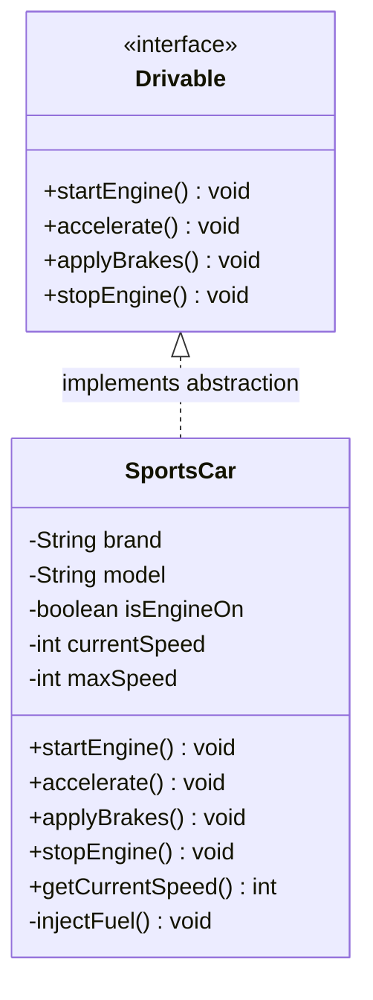

# 02. OOPs Real-World Examples: Abstraction & Encapsulation

> 💡 **Quick Revision Anchor**
> - **Class vs Object:** A class is the conceptual blueprint defining characteristics (data) and behaviors (methods); an object is an actual instance created in memory.
> - **Encapsulation:** Packaging data and methods together inside a class while **restricting direct access** (`private`) to ensure data integrity and prevent illegal state mutations.
> - **Abstraction:** **Hiding internal execution complexity** and exposing only the essential interface to the outside world (e.g., pressing a car accelerator without knowing fuel injection mechanics).

---

## 1. Procedural vs. Object-Oriented Programming

Before introducing OOP pillars, the instructor contrasts how entities (like a **SportsCar**) are represented in **Procedural Programming** versus **Object-Oriented Programming**.

### The Procedural Approach
In procedural programming (e.g., C), data and functions exist independently:
```c
// Loose variables without unified ownership
string car1_brand = "Ferrari";
int car1_speed = 0;
bool car1_engineOn = false;

void accelerateCar1() { car1_speed += 10; }
```
- Variables and functions are scattered globally.
- As the application grows to hundreds of entities, managing which function operates on which variable leads to unmanageable code.

### The Object-Oriented Paradigm
OOP models real-world entities naturally by recognizing that every entity has:
1. **Characteristics (State / Data):** `brand`, `model`, `currentSpeed`, `currentGear`, `isEngineOn`.
2. **Behaviors (Methods / Functions):** `startEngine()`, `accelerate()`, `applyBrakes()`, `stopEngine()`.

We bind characteristics and behaviors into a single unit called a **Class**.

---

## 2. Pillar 1: Encapsulation (Data Protection & Integrity)

### What Problem Does Encapsulation Solve?
Suppose all attributes in our `SportsCar` class are declared `public`:
```java
// ❌ Dangerous: Public fields allow arbitrary external corruption
SportsCar myCar = new SportsCar();
myCar.isEngineOn = false;
myCar.currentSpeed = 500; // Directly altering speed while engine is OFF!
myCar.currentGear = -10;  // Illegal gear value!
```
When fields are exposed publicly, outside code can bypass business rules and physical logic, corrupting the object's internal state.

### The Encapsulation Solution
1. **Declare fields `private`:** Direct manipulation from outside the class is blocked.
2. **Expose controlled public methods:** All state mutations must pass through methods containing boundary validations and checks.

```
       Outside World (Client)
                 │
                 ▼  (Calls public accelerate())
      ┌────────────────────────────────────────────────────────┐
      │                     SportsCar Object                   │
      │                                                        │
      │  public void accelerate() {                            │
      │      if (!isEngineOn) return;                          │
      │      if (speed + 20 <= maxSpeed) speed += 20;          │
      │  }                                                     │
      │                                                        │
      │  [Encapsulated State: private int speed; (Protected!)] │
      └────────────────────────────────────────────────────────┘
```

### Why Getters & Setters?
If fields are private, how does an outside client read or modify values when needed?
- **Getters:** Provide controlled read-only access (e.g., `getCurrentSpeed()`).
- **Setters:** Provide controlled write access with validation guards (e.g., validating tyre brands against approved manufacturers before assigning).
- *Warning:* Blindly generating public setters for every private field recreates the public-field problem. Only expose setters when mutation is valid.

---

## 3. Pillar 2: Abstraction (Complexity Hiding)

### Real-World Analogy: Driving a Car
When you drive a car:
- You interact with a simple, high-level interface: **steering wheel, accelerator pedal, brake pedal, ignition key**.
- You do **not** need to know:
  - Fuel-to-air combustion ratios in the cylinders.
  - Spark plug firing sequences.
  - Hydraulic pressure transmission in the brake calipers.
- All internal mechanical complexity is **abstracted away** behind pedals and buttons.

```
[Driver] ──▶ Calls accelerate() ──▶ [Speed increases]
                    │
   (Hidden Internal Complex Execution)
                    ▼
     [injectFuel() ➔ increaseRpm() ➔ adjustTransmission()]
```

### Abstraction in Code
Abstraction means exposing **what an object does** while hiding **how it achieves it**:
- **At the class level:** Hiding helper routines as `private` methods.
- **At the architectural level:** Exposing pure behavioral contracts via **Interfaces** and **Abstract Classes**.

---

## 4. Visual Architecture



---

## 5. Concise Java Implementation

```java
// 1. Abstraction Contract
interface Drivable {
    void startEngine();
    void accelerate();
    void applyBrakes();
    void stopEngine();
}

// 2. Concrete Implementation with Encapsulation & Abstraction
public class SportsCar implements Drivable {
    // Encapsulation: State is strictly private
    private final String brand;
    private final String model;
    private boolean isEngineOn;
    private int currentSpeed;
    private final int maxSpeed;

    public SportsCar(String brand, String model, int maxSpeed) {
        this.brand = brand;
        this.model = model;
        this.maxSpeed = maxSpeed;
        this.isEngineOn = false;
        this.currentSpeed = 0;
    }

    @Override
    public void startEngine() {
        this.isEngineOn = true;
        System.out.println(brand + " " + model + ": Engine started.");
    }

    @Override
    public void accelerate() {
        // Validation check preserving integrity
        if (!isEngineOn) {
            System.out.println("❌ Cannot accelerate! Engine is OFF.");
            return;
        }

        // Complex execution hidden behind abstraction
        injectFuel();
        currentSpeed = Math.min(maxSpeed, currentSpeed + 20);
        System.out.println("Speed increased to: " + currentSpeed + " km/h");
    }

    @Override
    public void applyBrakes() {
        currentSpeed = Math.max(0, currentSpeed - 20);
        System.out.println("Speed reduced to: " + currentSpeed + " km/h");
    }

    @Override
    public void stopEngine() {
        if (currentSpeed > 0) {
            System.out.println("❌ Cannot stop engine while vehicle is in motion!");
            return;
        }
        this.isEngineOn = false;
        System.out.println(brand + " " + model + ": Engine stopped safely.");
    }

    // Abstraction: internal implementation detail
    private void injectFuel() {
        // Internal combustion / fuel injection physics
    }

    // Encapsulated read-only access
    public int getCurrentSpeed() { return currentSpeed; }
    public boolean isEngineOn() { return isEngineOn; }
}

// 3. Client Demonstration
class Main {
    public static void main(String[] args) {
        Drivable car = new SportsCar("Porsche", "911 Carrera", 260);

        // Attempting to drive without starting engine
        car.accelerate(); // Validation prevents invalid state!

        // Correct workflow
        car.startEngine();
        car.accelerate();
        car.accelerate();
        car.applyBrakes();
        car.stopEngine(); // Fails if still moving
        car.applyBrakes();
        car.stopEngine(); // Succeeds
    }
}
```

---

## 6. Comparison: Encapsulation vs. Abstraction

| Dimension | Encapsulation | Abstraction |
| :--- | :--- | :--- |
| **Primary Goal** | **Data Protection & State Integrity** | **Complexity Hiding & Interface Simplification** |
| **Core Question** | *"How do I protect internal state from unauthorized external tampering?"* | *"What essential capabilities should be presented to the outside caller?"* |
| **How It Is Implemented** | Access modifiers (`private`, `protected`), getters/setters with validation | Interfaces, Abstract classes, high-level method APIs |
| **Real-World Analogy** | A medical capsule protecting the medicine inside from external contamination | The steering wheel and pedals of a car hiding internal engine mechanics |

---

## 7. Interview Questions & Key Discussion Points

1. **What is the difference between Abstraction and Encapsulation?**
   - *Answer*: Encapsulation bundles data with behavior and hides the internal data to ensure state integrity (security/integrity). Abstraction hides the internal implementation complexity and only exposes the public interface (usability/design).
2. **Can you have Abstraction without Encapsulation?**
   - *Answer*: Technically yes (e.g., defining an interface with methods), but it is dangerous. If the implementing class leaves its internal state variables `public`, callers can bypass the public methods and mutate state directly, undermining the abstraction.
3. **Why is blindly adding getters and setters for all fields an anti-pattern?**
   - *Answer*: Automatically generating setters for every private field is equivalent to making fields public. It turns classes into passive data holders (anemic domain model) and allows external callers to manipulate state without business validation.

---

## 8. Quick Revision

### Core Idea
- **Encapsulation:** Protect data integrity by keeping fields private and exposing validated public methods.
- **Abstraction:** Simplify usage by hiding internal mechanical complexity behind clean interfaces.

### Remember
- Do not expose fields publicly; always expose domain behaviors (`accelerate()`, `applyBrakes()`).
- Encapsulation is about **protection and security**; Abstraction is about **simplicity and complexity hiding**.
