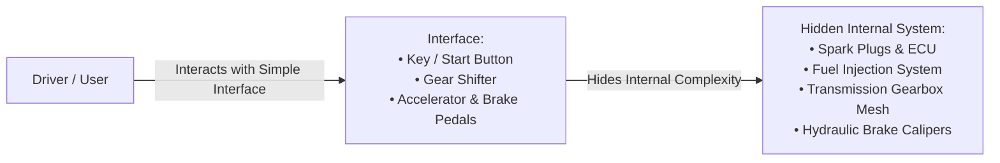
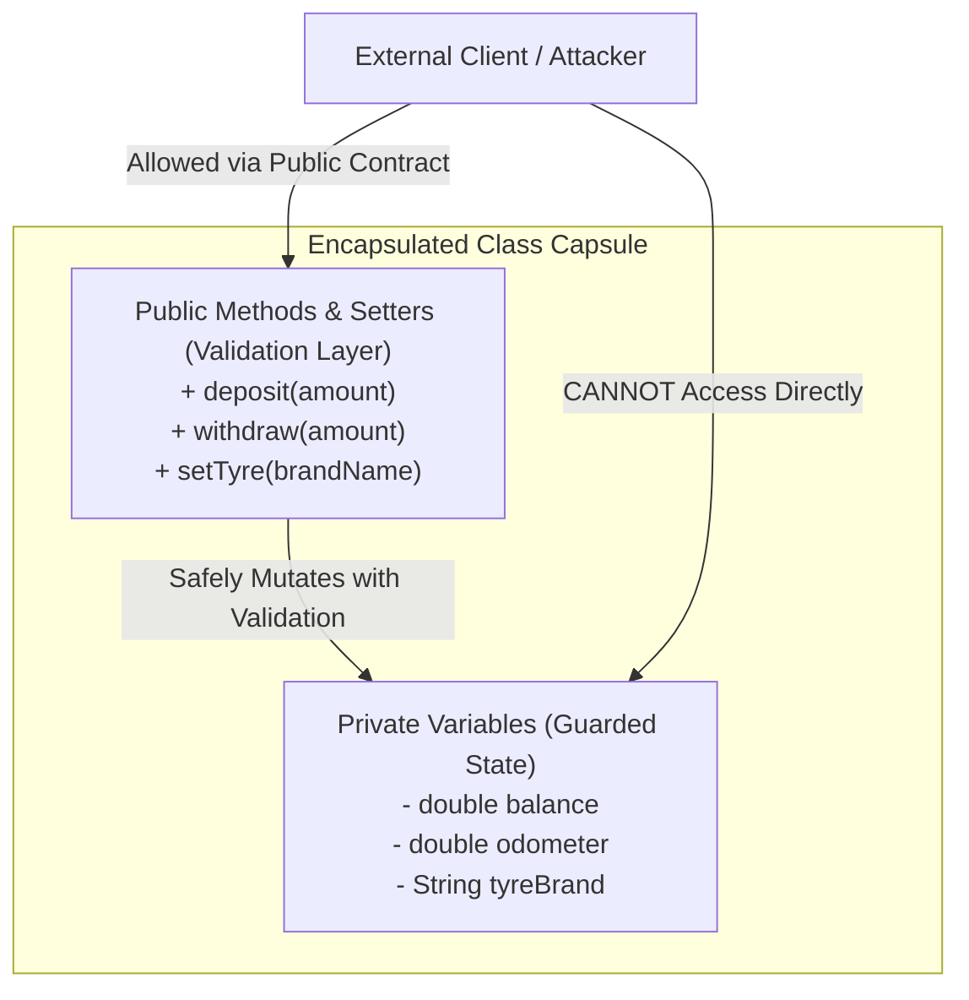

# 02. OOPs Real-World Examples: Abstraction & Encapsulation

> 💡 **Quick Revision Anchor**: A comprehensive study guide exploring the evolutionary necessity of Object-Oriented Programming (from Machine Language and Assembly to Procedural C), how real-world entities are modeled as objects (State + Behavior), and a deep dive into the first two pillars of OOP: **Abstraction** (complexity hiding via interfaces) and **Encapsulation** (data bundling and security via access modifiers & validation). Includes the lecture's canonical examples: **Ford Mustang SportsCar**, **Car Odometer / Tyre validation**, and the fundamental distinction: **Abstraction is Data Hiding, Encapsulation is Data Security.**

---

## 1. The Evolution of Programming Paradigms

To understand why Object-Oriented Programming (OOP) exists, the instructor traces the historical evolution of programming paradigms:

```text
    Machine Language (1st Gen)
    • Binary (0s and 1s), Punch cards
    • Tightly bound to physical hardware; impossible to scale.
               ↓
    Assembly Language (2nd Gen)
    • Introduced mnemonics: MOV A, 61H (move value into register A)
    • Still hardware-dependent; error-prone; lack of structured loops.
               ↓
    Procedural Programming (3rd Gen - e.g., C)
    • "Recipe-book" paradigm: Step-by-step instructions (do this, then do that).
    • Introduced functions, loops, and conditional blocks (if-else, switch).
    • Fails for large-scale enterprise systems: Data is disconnected from functions.
               ↓
    Object-Oriented Programming (OOP)
    • Real-world modeling: Bundles State (Characteristics) + Behavior (Functions).
    • Reusability, modularity, maintainability, and clean architecture.
```

---

## 2. Why Procedural Programming Fails for Real-World Systems

In procedural programming, data structures (variables) and functions live separately. Consider modeling an owner driving a car:

```c
// Procedural Approach (Naive C-style)
char* brand1 = "Ford";
char* model1 = "Mustang";
bool isEngineOn1 = false;
int currentSpeed1 = 0;

void startCar(bool* isEngineOn) { *isEngineOn = true; }
void accelerate(int* speed) { *speed += 20; }
void drive(bool* engine, int* speed) {
    startCar(engine);
    accelerate(speed);
}
```

### Problems with this Approach:
1. **Disconnected Data & Logic**: Variables are global or passed through endless pointers. Anyone can write `isEngineOn1 = true` or `currentSpeed1 = 150` without starting the car or pressing the accelerator.
2. **Duplication & Scalability Collapse**: Introducing a second car requires `brand2`, `model2`, `isEngineOn2`, `speed2`. Introducing multiple owners requires separate driving functions.
3. **Absence of Real-World Modeling**: In reality, a car is not a loose collection of disparate variables; it is a unified entity with defined behaviors.

---

## 3. The Core Concept of an Object & Class

In OOP, real-world entities are modeled as **Objects**:

$$\text{Object} = \text{Characteristics (State / Data)} + \text{Behaviors (Methods / Functions)}$$

```text
┌─────────────────────────────────────────────────────────────┐
│                           CAR                               │
├──────────────────────────────┬──────────────────────────────┤
│ Characteristics (State)      │ Behaviors (Methods)          │
│ • brand (e.g., "Ford")       │ • startEngine()              │
│ • model (e.g., "Mustang")    │ • shiftGear(gearNumber)      │
│ • isEngineOn (true/false)    │ • accelerate()               │
│ • currentSpeed (km/h)        │ • applyBrakes()              │
│ • odometer (km driven)       │ • stopEngine()               │
└──────────────────────────────┴──────────────────────────────┘
```

A **Class** is the blueprint/factory from which individual object instances are created:
```java
Car myCar = new SportsCar("Ford", "Mustang");
```

---

## 4. Pillar 1: Abstraction (Data Hiding & Complexity Reduction)

### Definition
> **Abstraction** is the technique of hiding complex internal implementation details and exposing only the essential features/interfaces necessary for the outside world to interact with the object.



### Real-World Analogies from the Lecture
1. **Driving a Car**:
   - The driver interacts with pedals, steering wheel, and gear stick.
   - The driver **does not need to know** how internal combustion, camshaft rotations, or hydraulic brake fluid pressures work. Knowing these details is completely unnecessary to drive safely.
2. **Television & Remote Control**:
   - The remote control is the **interface**.
   - Buttons (`Power`, `Volume`, `Channel`) trigger behaviors. The viewer does not need to understand circuit boards, cathode rays, or wireless infrared modulation.
3. **Laptop / Smartphone Screen**:
   - The display screen and operating system UI provide an interactive interface hiding microprocessors, buses, and transistor physics.

### Lecture Java Implementation: Car Abstraction

```java
// Abstract representation of a Car exposing only external controls
abstract class Car {
    protected String brand;
    protected String model;
    protected boolean isEngineOn;
    protected int currentGear;
    protected int currentSpeed;

    public Car(String brand, String model) {
        this.brand = brand;
        this.model = model;
        this.isEngineOn = false;
        this.currentGear = 0;
        this.currentSpeed = 0;
    }

    // Public Abstraction Interface (What the driver sees)
    public abstract void startEngine();
    public abstract void shiftGear(int gear);
    public abstract void accelerate();
    public abstract void brake();
    public abstract void stopEngine();
}

// Concrete SportsCar hiding complex internal state handling
class SportsCar extends Car {
    public SportsCar(String brand, String model) {
        super(brand, model);
    }

    @Override
    public void startEngine() {
        this.isEngineOn = true;
        System.out.println(brand + " " + model + " engine starts with a roar!");
    }

    @Override
    public void shiftGear(int gear) {
        if (!isEngineOn) {
            System.out.println("Cannot shift gear. Engine is turned off!");
            return;
        }
        this.currentGear = gear;
        System.out.println(brand + " " + model + " shifted to Gear " + gear);
    }

    @Override
    public void accelerate() {
        if (!isEngineOn) {
            System.out.println("Cannot accelerate. Engine is off!");
            return;
        }
        this.currentSpeed += 20;
        System.out.println(brand + " " + model + " accelerated to " + currentSpeed + " km/h");
    }

    @Override
    public void brake() {
        this.currentSpeed = Math.max(0, this.currentSpeed - 20);
        System.out.println(brand + " " + model + " braking... Speed reduced to " + currentSpeed + " km/h");
    }

    @Override
    public void stopEngine() {
        this.isEngineOn = false;
        this.currentGear = 0;
        this.currentSpeed = 0;
        System.out.println(brand + " " + model + " engine turned off.");
    }
}
```

---

## 5. Pillar 2: Encapsulation (Data Bundling & Data Security)

### Definition
> **Encapsulation** consists of two interconnected principles:
> 1. **Bundling**: Packaging related fields (state) and methods (behaviors) into a single self-contained unit (class).
> 2. **Data Security / Information Hiding**: Restricting direct external access to internal state using access modifiers (`private`, `protected`), forcing all mutations to pass through controlled public methods with strict validation rules.



### Real-World Analogies from the Lecture
1. **The Car Odometer**:
   - The odometer displays kilometers driven (e.g., $15,000\text{ km}$).
   - A driver **cannot directly twist a knob to change the odometer** from $25,000\text{ km}$ to $5,000\text{ km}$ to make the car look new.
   - The odometer increases *only as a validated side-effect* of driving and accelerating.
2. **Car Speed**:
   - You cannot set `car.speed = 120`. You must depress the accelerator, allowing internal fuel flow to increase speed gradually.
3. **Car Tyres (Setter with Business Validation)**:
   - When replacing a tyre (`setTyre(brand)`), the setter validates whether the tyre brand exists in an approved catalogue (`MRF`, `Michelin`, `Apollo`) rather than accepting arbitrary invalid strings.
4. **Bank Account**:
   - You cannot write `account.balance = 10000000`. You must invoke `deposit()` or `withdraw()`, validating positive amounts, identity checks, and overdraft limits.

### Lecture Java Implementation: Encapsulated Car & Validation

```java
import java.util.*;

class EncapsulatedCar {
    private final String brand;
    private final String model;
    // Sensitive/Protected fields
    private double odometer;
    private double speed;
    private String tyreBrand;

    // Approved tyre manufacturer catalogue for validation
    private static final Set<String> APPROVED_TYRES = Set.of("MRF", "Michelin", "Apollo", "Goodyear");

    public EncapsulatedCar(String brand, String model) {
        this.brand = brand;
        this.model = model;
        this.odometer = 0.0;
        this.speed = 0.0;
        this.tyreBrand = "MRF";
    }

    // Read-only getter for Odometer: Client can observe, but NEVER directly modify!
    public double getOdometer() {
        return odometer;
    }

    public double getSpeed() {
        return speed;
    }

    // Controlled mutation: Odometer increments naturally when car drives
    public void drive(double distanceKm) {
        if (distanceKm <= 0) {
            System.out.println("Invalid distance driven.");
            return;
        }
        this.odometer += distanceKm;
        System.out.printf("[%s %s] Drove %.1f km. Total Odometer: %.1f km\n", brand, model, distanceKm, odometer);
    }

    public String getTyreBrand() {
        return tyreBrand;
    }

    // Setter with strict business validation
    public void setTyreBrand(String newTyre) {
        if (newTyre == null || !APPROVED_TYRES.contains(newTyre)) {
            System.out.println("[REJECTED] Cannot install tyre '" + newTyre + "'. Not in approved manufacturer list!");
            return;
        }
        this.tyreBrand = newTyre;
        System.out.println("[APPROVED] Successfully installed " + newTyre + " tyres on " + brand + " " + model);
    }
}
```

---

## 6. Critical Distinction: Abstraction vs Encapsulation

This is one of the most frequently asked questions in software engineering interviews. The instructor provides the ultimate definitive clarification:

| Aspect | Abstraction | Encapsulation |
| :--- | :--- | :--- |
| **Core Intent** | **Data / Complexity Hiding** | **Data Security & State Protection** |
| **Perspective** | **Outside View** ("What does this object do?") | **Inside View** ("How does this object safeguard its data?") |
| **Primary Question** | *"What features does the client need to use this object without being overwhelmed by internals?"* | *"How do we prevent clients from putting this object into an invalid, corrupted, or dangerous state?"* |
| **Mechanism** | Abstract classes, Interfaces. | Private access modifiers, getters/setters with validation. |
| **Security Impact** | If a driver learns how an internal combustion engine works, it causes **no harm/threat** to the car—it is simply unnecessary complexity. | If a driver can directly rewrite the odometer or set bank balance to ₹10,00,000, it causes a **catastrophic security threat**. |
| **Lecture Analogy** | The steering wheel, pedals, and TV remote. | The car odometer, speed governor, and bank balance ledger. |

---

## 7. Execution Trace

```java
public class Main {
    public static void main(String[] args) {
        System.out.println("=== 1. Abstraction in Action ===");
        Car mustang = new SportsCar("Ford", "Mustang");
        mustang.startEngine();
        mustang.shiftGear(1);
        mustang.accelerate();
        mustang.shiftGear(2);
        mustang.accelerate();
        mustang.brake();
        mustang.stopEngine();

        System.out.println("\n=== 2. Encapsulation & Data Security in Action ===");
        EncapsulatedCar myCar = new EncapsulatedCar("Ford", "Mustang");
        myCar.drive(120.5);
        myCar.drive(85.0);

        // Attempt invalid tyre installation
        myCar.setTyreBrand("CheapLocalRubber");

        // Valid tyre installation
        myCar.setTyreBrand("Michelin");
    }
}
```

```text
=== 1. Abstraction in Action ===
Ford Mustang engine starts with a roar!
Ford Mustang shifted to Gear 1
Ford Mustang accelerated to 20 km/h
Ford Mustang shifted to Gear 2
Ford Mustang accelerated to 40 km/h
Ford Mustang braking... Speed reduced to 20 km/h
Ford Mustang engine turned off.

=== 2. Encapsulation & Data Security in Action ===
[Ford Mustang] Drove 120.5 km. Total Odometer: 120.5 km
[Ford Mustang] Drove 85.0 km. Total Odometer: 205.5 km
[REJECTED] Cannot install tyre 'CheapLocalRubber'. Not in approved manufacturer list!
[APPROVED] Successfully installed Michelin tyres on Ford Mustang
```

---

## Quick Revision

### Core Idea
OOP evolved because procedural code isolates data from functions, resulting in unscalable global variables. Real-world modeling bundles state and behavior into classes. **Abstraction** manages complexity by hiding internal mechanisms behind clean interfaces ("What it does"). **Encapsulation** secures data by bundling state and methods inside classes and enforcing validation boundaries through private access modifiers ("How state is protected").

### Remember
* Historical evolution: Machine Language $\to$ Assembly (registers, mnemonics like `MOV A, 61H`) $\to$ Procedural (C, recipe-book paradigm) $\to$ OOP.
* The Ford Mustang SportsCar example: Driver uses `startEngine()`, `shiftGear()`, `accelerate()`, `brake()`, and `stopEngine()` without knowing internal combustion physics.
* The Car Odometer example: You cannot manually set odometer mileage; it increments only via validated driving side-effects.
* Setters are not just boilerplate—they act as invariant validation guards (e.g. checking approved tyre manufacturers).

### Java Implementation Idea
* Use `abstract class` or `interface` to define the public contract for Abstraction.
* Mark internal state fields as `private` (Encapsulation). Provide read-only getters where modification is disallowed (like odometer), and embed validation guards within setters.

### Most Important Interview Point
* **Abstraction vs Encapsulation**:
  * Abstraction = Data / Complexity Hiding (Outside-in perspective: simple interfaces hiding complex machinery).
  * Encapsulation = Data Security & Integrity (Inside-out perspective: guarding internal fields against illegal state mutations).

### Common Trap
* Claiming Encapsulation is just "writing getters and setters". If a setter blindly reassigns `this.field = field` without validation or invariants, it provides zero encapsulation security over a public field.
* Confusing Abstraction with Encapsulation by asserting that private variables represent abstraction. (Private variables represent Encapsulation; the interface methods represent Abstraction).
