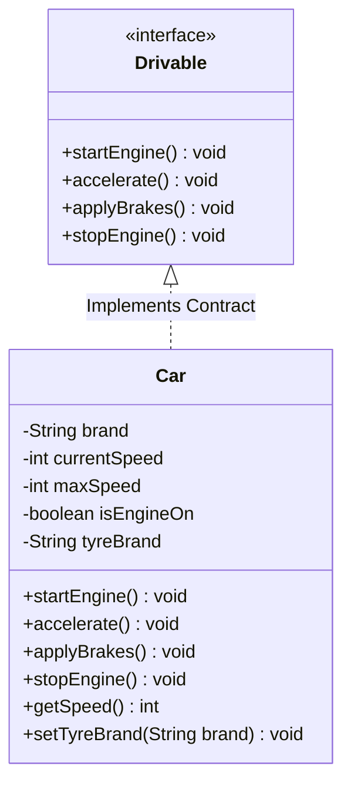

# 02. OOPs Real-World Examples: Abstraction & Encapsulation

> 💡 **Quick Revision Anchor**
> - **Class:** A blueprint defining characteristics (attributes) and behaviors (methods).
> - **Object:** A concrete instance of a class allocated in memory.
> - **Encapsulation:** Packaging data and methods together while **hiding internal state** via `private` access modifiers to preserve data integrity and prevent illegal states.
> - **Abstraction:** **Hiding internal complexity** and exposing only essential interfaces to the outside world (e.g., driving a car with pedals without knowing fuel injection physics).

---

## 1. Procedural vs. Object-Oriented Paradigm

Before diving into OOP pillars, the instructor contrasts how a real-world entity (like a **Car**) is modeled in **Procedural Programming** versus **Object-Oriented Programming**.

### The Procedural Nightmare
In procedural programming (e.g., C), data and functions exist independently:
```c
// Loose global variables
string car1_brand = "Toyota";
int car1_speed = 0;
bool car1_isEngineOn = false;

string car2_brand = "Ferrari";
int car2_speed = 0;
bool car2_isEngineOn = false;

void accelerateCar1() { car1_speed += 10; }
void accelerateCar2() { car2_speed += 20; }
```
- Data is scattered across unlinked global variables.
- As the system grows to hundreds of cars, keeping track of which function operates on which variable causes unmaintainable chaos.

### The Object-Oriented Solution
OOP models the world naturally by recognizing that every entity has:
1. **Characteristics (State / Attributes):** Brand, Model, Current Speed, Current Gear, IsEngineOn.
2. **Behaviors (Methods / Functions):** `startEngine()`, `stopEngine()`, `shiftGear()`, `accelerate()`, `applyBrakes()`.

We package both together into a single blueprint called a **Class**:

```
+-------------------------------------------------------------+
|                          Class: Car                         |
+-------------------------------------------------------------+
| [Characteristics / State]                                   |
| - brand: String                                             |
| - model: String                                             |
| - currentSpeed: int                                         |
| - isEngineOn: boolean                                       |
+-------------------------------------------------------------+
| [Behaviors / Methods]                                       |
| + startEngine(): void                                       |
| + accelerate(): void                                        |
| + applyBrakes(): void                                       |
+-------------------------------------------------------------+
```

---

## 2. Pillar 1: Encapsulation (Data Hiding & State Integrity)

### The Problem: Public Access Ruining State Integrity
Suppose all variables of our `Car` class are declared `public`:
```java
// ❌ Disaster Waiting to Happen: Public Fields
Car myCar = new Car();
myCar.isEngineOn = false;
myCar.currentSpeed = 500; // Directly altering speed without turning on the engine!
myCar.currentGear = -10;  // Illegal gear state!
```
When fields are public, outside code can bypass physics and business logic, corrupting object state.

### The Encapsulation Solution
Encapsulation solves this by:
1. **Marking fields `private`:** Direct access from outside the class is forbidden.
2. **Exposing public controlled methods:** State transitions must pass through authorized methods that enforce validation rules.

```
       Outside World (Client)
                 │
                 ▼  (Calls public accelerate())
      ┌────────────────────────────────────────────────────────┐
      │                      Car Object                        │
      │                                                        │
      │  public void accelerate() {                            │
      │      if (!isEngineOn) { "Turn engine on first!" }      │
      │      if (speed + 10 > maxSpeed) { speed = maxSpeed; }  │
      │      else { speed += 10; }                             │
      │  }                                                     │
      │                                                        │
      │  [Encapsulated State: private int speed; (Protected!)] │
      └────────────────────────────────────────────────────────┘
```

### Why Use Getters & Setters Instead of Public Fields?
Beginners often ask: *"If we create `getSpeed()` and `setSpeed()`, aren't we doing the same thing as public fields?"*
**No!** A setter provides a protective validation gatekeeper:
```java
public void setTyreBrand(String brand) {
    // Validation control: verify brand exists in approved vendor list
    if (brand == null || !ApprovedVendors.isValid(brand)) {
        throw new IllegalArgumentException("Invalid or counterfeit tyre brand!");
    }
    this.tyreBrand = brand;
}
```

---

## 3. Pillar 2: Abstraction (Complexity Hiding)

### The Real-World Car Analogy:
When you drive a car:
- You interact with a **simple, intuitive interface**: Steering wheel, Accelerator pedal, Brake pedal, and Key ignition.
- You **do NOT need to know**:
  - How the ECU calculates the fuel-to-air combustion ratio.
  - When the spark plugs fire in the cylinder sequence.
  - How hydraulic brake fluid pressure transfers through the calipers.
- All internal mechanical complexity is **abstracted away** behind pedals and a steering wheel.

```
[Driver (Client)] ──▶ Presses Accelerator Pedal ──▶ [Car accelerates smoothly]
                             │
            (Hidden Internal Mechanical Complexity)
                             ▼
         [Fuel Pump ➔ Air Intake ➔ Spark Plugs ➔ Transmission]
```

### Abstraction in Software:
Abstraction means exposing **what an object does** while completely concealing **how it does it**.

In Java, abstraction is achieved through:
1. **Methods:** Calling `car.accelerate()` hides internal checks and physical engine operations.
2. **Interfaces & Abstract Classes:** Declaring pure behavioral contracts without exposing internal state.



---

## 4. Java Implementation (Primary Lecture Example)

### Step 1: Drivable Interface (The Abstraction Contract)
```java
// Abstraction: Defines what actions can be performed on any vehicle
public interface Drivable {
    void startEngine();
    void accelerate();
    void applyBrakes();
    void stopEngine();
}
```

---

### Step 2: Car Implementation (Encapsulation + Abstraction)
```java
public class Car implements Drivable {
    // Encapsulation: State is kept strictly private
    private final String brand;
    private final String model;
    private boolean isEngineOn;
    private int currentSpeed;
    private int currentGear;
    private static final int MAX_SPEED = 240;

    public Car(String brand, String model) {
        this.brand = brand;
        this.model = model;
        this.isEngineOn = false;
        this.currentSpeed = 0;
        this.currentGear = 0;
    }

    // Abstraction & Controlled State Transition
    @Override
    public void startEngine() {
        if (isEngineOn) {
            System.out.println(brand + " " + model + ": Engine is already running.");
            return;
        }
        this.isEngineOn = true;
        this.currentGear = 1;
        System.out.println(brand + " " + model + ": Engine started. Ready to drive.");
    }

    @Override
    public void accelerate() {
        // Validation: Cannot accelerate with engine turned off
        if (!isEngineOn) {
            System.out.println("❌ Error: Cannot accelerate. Start the engine first!");
            return;
        }

        // Internal complex logic hidden from driver (Abstraction)
        injectFuel();
        increaseRpm();

        if (currentSpeed + 20 <= MAX_SPEED) {
            currentSpeed += 20;
        } else {
            currentSpeed = MAX_SPEED;
        }
        System.out.println("Accelerating... Current Speed: " + currentSpeed + " km/h");
    }

    @Override
    public void applyBrakes() {
        if (currentSpeed > 0) {
            currentSpeed = Math.max(0, currentSpeed - 20);
            System.out.println("Braking... Current Speed reduced to: " + currentSpeed + " km/h");
        } else {
            System.out.println("Car is already at a complete standstill.");
        }
    }

    @Override
    public void stopEngine() {
        if (currentSpeed > 0) {
            System.out.println("❌ Safety Alert: Cannot stop engine while car is moving!");
            return;
        }
        this.isEngineOn = false;
        this.currentGear = 0;
        System.out.println(brand + " " + model + ": Engine stopped safely.");
    }

    // Private helper methods hidden via Abstraction
    private void injectFuel() {
        // Low-level combustion mechanics
    }

    private void increaseRpm() {
        // Internal engine mechanics
    }

    // Read-only getters maintaining encapsulation
    public int getCurrentSpeed() { return currentSpeed; }
    public boolean isEngineOn() { return isEngineOn; }
}
```

---

### Step 3: Client Execution
```java
public class Main {
    public static void main(String[] args) {
        // Client interacts with the Car via its clean Drivable abstraction
        Drivable sportsCar = new Car("Porsche", "911 Carrera");

        // Attempting to accelerate without starting engine
        sportsCar.accelerate(); // Handled safely by validation!

        // Correct workflow
        sportsCar.startEngine();
        sportsCar.accelerate();
        sportsCar.accelerate();
        sportsCar.applyBrakes();
        sportsCar.applyBrakes();
        sportsCar.stopEngine();
    }
}
```

### Execution Output:
```text
❌ Error: Cannot accelerate. Start the engine first!
Porsche 911 Carrera: Engine started. Ready to drive.
Accelerating... Current Speed: 20 km/h
Accelerating... Current Speed: 40 km/h
Braking... Current Speed reduced to: 20 km/h
Braking... Current Speed reduced to: 0 km/h
Porsche 911 Carrera: Engine stopped safely.
```

---

## 5. Comparison: Abstraction vs. Encapsulation

| Comparison Point | Encapsulation | Abstraction |
| :--- | :--- | :--- |
| **Focus** | **Information Hiding / Protection** | **Detail / Complexity Hiding** |
| **Core Question** | *"How do I protect internal state from unauthorized external tampering?"* | *"What essential capabilities should be presented to the user without overwhelming them?"* |
| **Primary Tool** | `private`, `protected`, getters/setters, validation gates | `interface`, `abstract class`, high-level method APIs |
| **Analogy** | A medical capsule containing medicine (protecting ingredients inside). | The dashboard and pedals of a car (exposing simple controls). |

---

## 6. Interview Perspective

- **Q: How does Encapsulation prevent bugs in multi-developer teams?**
  *A: By making fields private and restricting mutations to public methods with boundary validations, other developers cannot put the object into an invalid or corrupt state.*
- **Q: Can you have Abstraction without Encapsulation?**
  *A: Technically yes (e.g. an interface exposing a method), but it is dangerous. If the underlying class leaves its state variables public, anyone can bypass the abstraction and corrupt the internal state directly.*
- **Q: What is the downside of generating automatic getters and setters for all fields?**
  *A: Blindly creating setters for every field destroys encapsulation. It turns a class into an anemic data holder (JavaBean) where external callers manipulate fields arbitrarily instead of invoking meaningful domain behaviors.*

---

## 7. Quick Revision

```text
Class: Blueprint defining attributes (state) and methods (behavior).
Encapsulation: Bundles data + behavior, keeps fields private to protect state integrity.
Abstraction: Hides internal execution complexity behind clean interfaces (like car pedals).
Rule of Thumb: Never make fields public; expose behaviors, not raw data.
```
