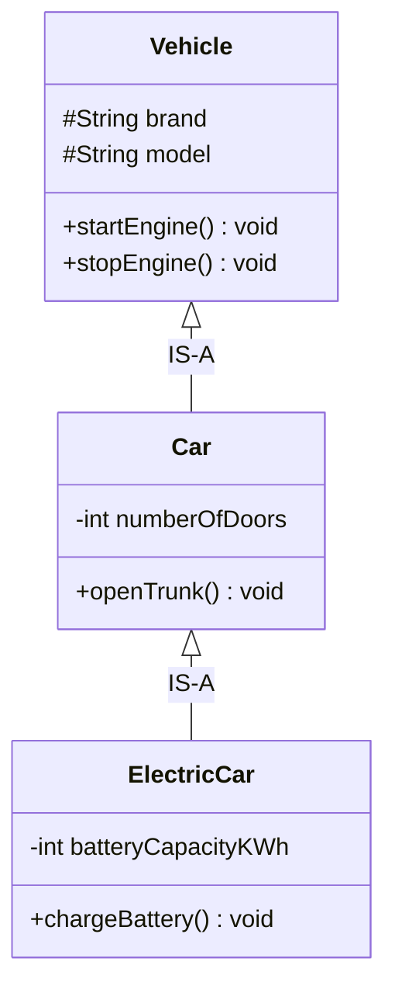
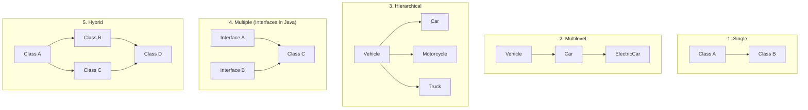
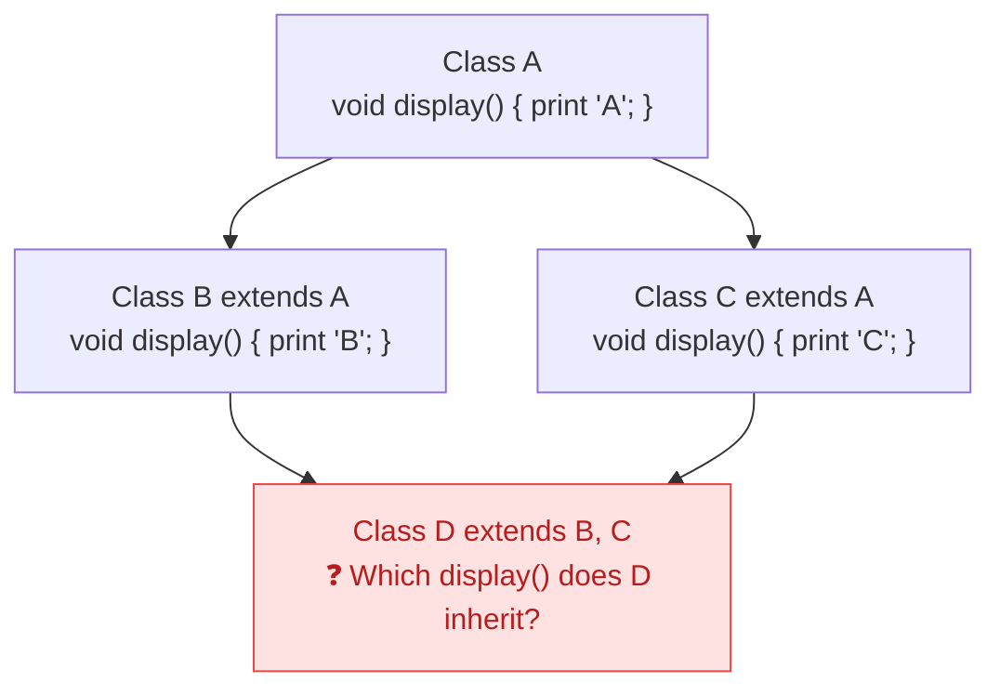
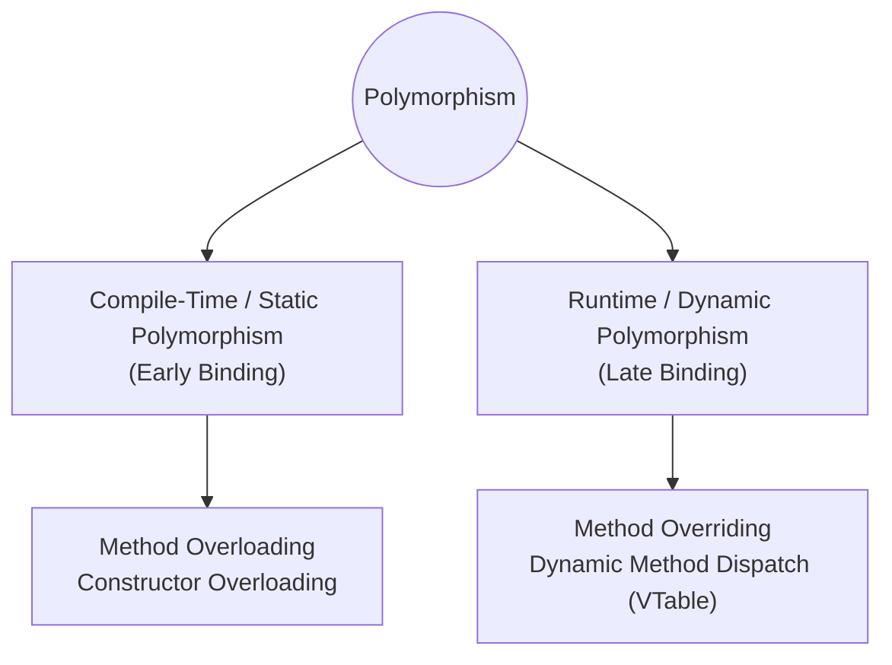
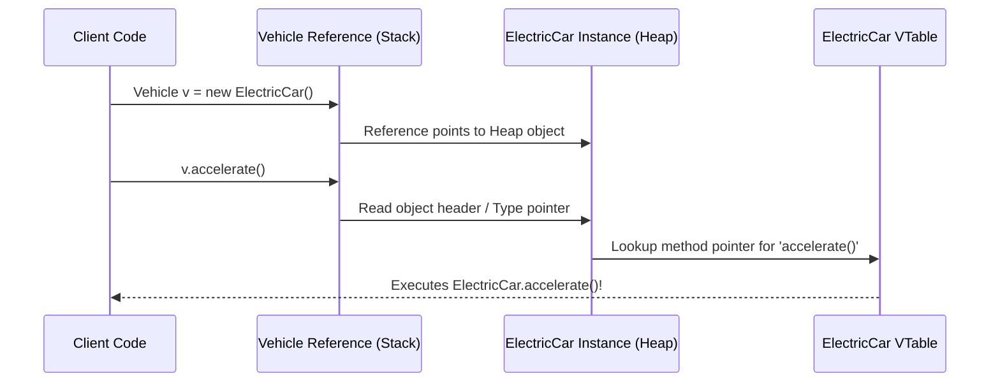

# 03. Inheritance & Polymorphism in OOPs

> 💡 **Quick Revision Anchor**: 
> - **Inheritance (`IS-A`)**: Enables code reuse and hierarchical type extension.
> - **Compile-Time Polymorphism**: Method Overloading (Static Binding resolved at compile time).
> - **Runtime Polymorphism**: Method Overriding (Dynamic Method Dispatch via VTable resolved at runtime).

---

## 1. Inheritance: Concepts & Mechanics

Inheritance is a fundamental OOP mechanism where a new class (known as the **Subclass / Derived / Child Class**) acquires the attributes and methods of an existing class (known as the **Superclass / Base / Parent Class**).



### Key Advantages of Inheritance:
1. **Code Reusability**: Eliminates boilerplate duplication across related domains.
2. **Polymorphic Base Contract**: Subclasses can be treated uniformly as instances of their superclass.
3. **Extensibility**: Specialized child behaviors can be introduced without modifying the superclass.

---

## 2. The 5 Types of Inheritance



### The Diamond Problem in Multiple Inheritance
Why doesn't Java support multiple class inheritance?



- If `Class D` instantiates and calls `d.display()`, the compiler cannot determine whether to execute `B`'s version or `C`'s version. This is the **Diamond Problem**.
- In C++, this is resolved using `virtual inheritance`.
- **Java's Solution**: Java bans multiple inheritance of **classes** (state & implementation ambiguity), but allows multiple inheritance of **interfaces** (contract realization), because until Java 8, interfaces had no implementation, and default methods require explicit override resolution (`B.super.display()`).

---

## 3. Polymorphism: Static vs. Dynamic

The word **Polymorphism** comes from the Greek: *Poly* (Many) + *Morph* (Forms). In programming, it represents the ability of an entity (method, object, or operator) to exhibit different behaviors under different execution contexts.



---

## 4. Method Overloading (Compile-Time Polymorphism)

Method Overloading occurs when two or more methods in the **same class** share the **same method name**, but have **different parameter lists**.

### Rules for Method Overloading:
1. **Must differ in**:
   - Number of arguments (`foo(int)` vs `foo(int, int)`), OR
   - Types of arguments (`foo(int)` vs `foo(String)`), OR
   - Order of argument types (`foo(int, String)` vs `foo(String, int)`).
2. **Changing return type alone is NOT valid**:
   ```java
   int calculate(int a) { return a; }
   double calculate(int a) { return (double)a; } // ❌ COMPILE ERROR: Duplicate method!
   ```
   *Why?* When a client calls `calculate(10);`, the compiler has no way to infer which method you intended to call from the call site alone.

```java
public class NavigationSystem {
    // 1. Basic route
    public void navigate(String destination) {
        System.out.println("Navigating to " + destination + " via default fastest route.");
    }

    // 2. Overloaded: With avoiding tolls
    public void navigate(String destination, boolean avoidTolls) {
        System.out.println("Navigating to " + destination + " | Avoid Tolls: " + avoidTolls);
    }

    // 3. Overloaded: With intermediate waypoints
    public void navigate(String destination, List<String> waypoints, boolean avoidTolls) {
        System.out.println("Navigating to " + destination + " via " + waypoints.size() + " stops | Avoid Tolls: " + avoidTolls);
    }
}
```

---

## 5. Method Overriding & Dynamic Dispatch (Runtime Polymorphism)

Method Overriding occurs when a subclass provides a **specific implementation** of a method that is already declared in its superclass.

### Dynamic Method Dispatch (The VTable)
At runtime, when a superclass reference variable points to a subclass object:
```java
Vehicle myVehicle = new ElectricCar(); // Upcasting
myVehicle.accelerate();                // Calls ElectricCar's accelerate()!
```
The JVM uses the **Virtual Method Table (VTable)** associated with the concrete heap object to dynamically dispatch the call to `ElectricCar.accelerate()`.



---

## 6. Overloading vs. Overriding: Comprehensive Comparison

| Feature | Method Overloading | Method Overriding |
| :--- | :--- | :--- |
| **Binding Type** | **Static / Early Binding** (Resolved at compile time) | **Dynamic / Late Binding** (Resolved at runtime via VTable) |
| **Location** | Within the **same class** | Across **Parent-Child class hierarchy** |
| **Method Signature** | **Must be different** (parameters must differ) | **Must be strictly identical** (name, parameter list, order) |
| **Return Type** | Can be anything (independent of parameters) | Must be same or **Covariant** (subtype of parent's return type) |
| **Private / Static Methods** | Can be overloaded freely | **Cannot be overridden** (static methods are hidden, not overridden) |
| **Performance** | Faster (no runtime lookup penalty) | Minor runtime dispatch overhead |

---

## 7. Production Code: Complete Vehicle Hierarchy

```java
// Base Superclass
public class Vehicle {
    protected final String brand;
    protected final String model;
    protected int currentSpeed;

    public Vehicle(String brand, String model) {
        this.brand = brand;
        this.model = model;
        this.currentSpeed = 0;
    }

    public void start() {
        System.out.println(brand + " " + model + " engine started.");
    }

    // Overridable method
    public void accelerate(int kmh) {
        this.currentSpeed += kmh;
        System.out.println(brand + " vehicle accelerating to " + currentSpeed + " km/h.");
    }
}

// Subclass 1: Manual Combustion Car
public class ManualCar extends Vehicle {
    private int currentGear;

    public ManualCar(String brand, String model) {
        super(brand, model);
        this.currentGear = 1;
    }

    public void shiftGear(int gear) {
        this.currentGear = gear;
        System.out.println("Shifted to gear: " + currentGear);
    }

    // Method Overriding: Specialized combustion acceleration with clutch
    @Override
    public void accelerate(int kmh) {
        System.out.print("[Manual Car Gear " + currentGear + "] ");
        super.accelerate(kmh);
    }
}

// Subclass 2: Electric Vehicle
public class ElectricCar extends Vehicle {
    private int batteryPercentage;

    public ElectricCar(String brand, String model, int initialBattery) {
        super(brand, model);
        this.batteryPercentage = initialBattery;
    }

    // Method Overriding: Instant torque delivery
    @Override
    public void accelerate(int kmh) {
        if (batteryPercentage <= 0) {
            System.out.println("❌ Battery depleted! Cannot accelerate.");
            return;
        }
        this.currentSpeed += (kmh + 10); // Instant electric torque boost
        this.batteryPercentage = Math.max(0, this.batteryPercentage - 2);
        System.out.println("⚡ [Electric Instant Torque] " + brand + " reached " + currentSpeed + " km/h | Battery: " + batteryPercentage + "%");
    }

    public void chargeBattery() {
        this.batteryPercentage = 100;
        System.out.println("🔋 Battery fully recharged to 100%.");
    }
}
```

### Execution & Dynamic Dispatch in Action
```java
public class Main {
    public static void main(String[] args) {
        // Polymorphic collection
        List<Vehicle> fleet = new ArrayList<>();
        fleet.add(new ManualCar("Ford", "Mustang"));
        fleet.add(new ElectricCar("Tesla", "Model S", 85));

        // Uniform invocation: Dynamic Dispatch routes to specific overrides!
        for (Vehicle v : fleet) {
            v.start();
            v.accelerate(50);
        }
    }
}
```

---

## 8. Common Interview Traps & Questions

1. **"Can we override `static` methods in Java?"**
   - *Answer*: **No**. Static methods are associated with the class, not with any object instance. If a subclass declares a static method with the same signature, it is called **Method Hiding**, not overriding. The method called depends on the reference type at compile time, not the runtime object.
2. **"Can constructors be inherited or overridden?"**
   - *Answer*: **No**. Constructors are not members of a class and have the class's exact name, so they cannot be inherited or overridden. However, a child constructor must invoke a superclass constructor (`super()`) on its first line.
3. **"What is Covariant Return Type?"**
   - *Answer*: When overriding a method, the subclass method can return a subtype of the class returned by the superclass method:
     ```java
     class VehicleFactory {
         public Vehicle createVehicle() { return new Vehicle("Base", "1"); }
     }
     class ElectricCarFactory extends VehicleFactory {
         @Override
         public ElectricCar createVehicle() { return new ElectricCar("Tesla", "3", 100); } // ✅ Covariant return
     }
     ```
