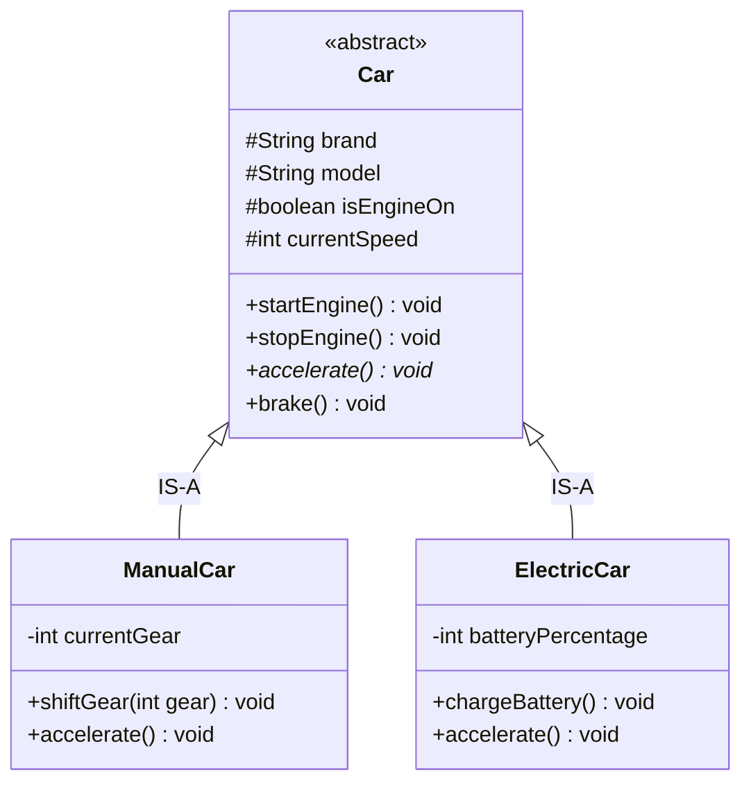

# 03. Inheritance & Polymorphism in OOPs

> 💡 **Quick Revision Anchor**: A comprehensive study guide exploring **Inheritance** (code reuse, parent-child hierarchies, access specifiers, and the Diamond Problem) and **Polymorphism** (Compile-time Method Overloading vs Runtime Method Overriding / Dynamic Method Dispatch). Features the lecture's canonical car hierarchy (**Suzuki WagonR ManualCar** vs **Tesla Model S ElectricCar**), the **Dog & Cat Animal sound** analogy, and the unified capstone code uniting all 4 OOP pillars (Abstraction, Encapsulation, Inheritance, Polymorphism).

---

## 1. What This Lecture Covers

1. **Inheritance**:
   - Why duplicate common state and behavior when classes share an "IS-A" relationship?
   - Parent (Base) Class vs Child (Derived) Class.
   - The role of `protected` vs `private` vs `public` access specifiers during inheritance.
   - Forms of Inheritance: Single, Multi-level, Hierarchical, Multiple (and the Diamond Problem), and Hybrid.
   - Why Java prohibits multiple class inheritance and uses interfaces instead.
2. **Polymorphism ("Many Forms")**:
   - Real-world analogies: Animal sounds (`Dog` barks vs `Cat` meows), human roles (teacher, parent, customer).
   - **Compile-Time (Static) Polymorphism**: Method Overloading (same name, distinct signatures).
   - **Runtime (Dynamic) Polymorphism**: Method Overriding & Dynamic Method Dispatch (virtual functions, parent reference pointing to child instance).
3. **Unified Capstone Example**:
   - A single cohesive Java program uniting all 4 pillars of OOP using **Suzuki WagonR** and **Tesla Model S**.

---

## 2. Pillar 3: Inheritance (Code Reuse & Hierarchical Modeling)

### Problem: Code Duplication Across Car Variants
Imagine creating a `ManualCar` and an `ElectricCar`. Both vehicles possess:
- Characteristics: `brand`, `model`, `isEngineOn`, `currentSpeed`.
- Behaviors: `startEngine()`, `stopEngine()`, `accelerate()`, `brake()`.

Without inheritance, every new vehicle type duplicates dozens of lines of identical fields and methods. 

### Solution: Base Class Extraction
We extract common attributes into a parent `Car` class. Subclasses inherit these features and introduce only their **specialized** properties:
- `ManualCar` adds: `currentGear` and `shiftGear(int gear)`.
- `ElectricCar` adds: `batteryPercentage` and `chargeBattery()`.



---

## 3. Access Specifiers in Inheritance

How access modifiers govern inheritance visibility:

| Modifier | Inside Same Class | Derived / Child Class | Outside World / Client |
| :--- | :---: | :---: | :---: |
| **`private`** | Yes | **No** (Hidden completely) | **No** |
| **`protected`** | Yes | **Yes** (Inherited & accessible) | **No** |
| **`public`** | Yes | **Yes** | **Yes** |
| *(Java default / package-private)* | Yes | **Yes** (if in same package) | **No** |

> 🔑 **Key Takeaway**: If fields in `Car` are `private`, child classes like `ManualCar` cannot access them directly. By marking them **`protected`**, we preserve encapsulation from external clients while granting child classes direct internal access.

---

## 4. The 5 Forms of Inheritance & The Diamond Problem

```text
1. Single Inheritance:           2. Multi-Level Inheritance:
      Car                            Vehicle
       │                                │
       ▼                                ▼
   ManualCar                           Car
                                        │
                                        ▼
                                    SportsCar

3. Hierarchical Inheritance:     4. Multiple Inheritance (The Diamond Problem):
          Car                                  A (Vehicle)
       ┌───┴───┐                               ┌───┴───┐
       ▼       ▼                               ▼       ▼
   Manual   Electric                       B (Car)   C (Boat)
                                               └───┬───┘
                                                   ▼
                                           D (AmphibiousVehicle)
```

### The Diamond Problem Explained
- Class $B$ and Class $C$ inherit from Class $A$. Both override a method `turnOnEngine()`.
- Class $D$ attempts to inherit from both $B$ and $C$ simultaneously.
- When an instance of $D$ calls `turnOnEngine()`, the compiler cannot determine whether to execute $B$'s version or $C$'s version (**ambiguity**).
- **Language Decision**: C++ solves this using `virtual` base inheritance. **Java eliminates multiple class inheritance entirely** (`class D extends B, C` causes a compile error). Java instead supports multiple inheritance of type via **`interfaces`**.

---

## 5. Pillar 4: Polymorphism ("Many Forms")

The word **Polymorphism** originates from Greek: *Poly* (Many) + *Morph* (Form).

> **Polymorphism** is the capability of an operation or entity to exhibit different behaviors depending on the context or runtime object executing it.

```text
                                  POLYMORPHISM
                                        │
                  ┌─────────────────────┴─────────────────────┐
                  ▼                                           ▼
       Compile-Time (Static)                       Runtime (Dynamic)
       • Method Overloading                        • Method Overriding
       • Resolved at compile-time                  • Resolved at runtime via vtable
       • Same name, different parameters           • Same signature across parent/child
```

---

### A. Compile-Time Polymorphism (Method Overloading)
Occurs within the same class. Methods share the **same name** but have **different parameter lists** (different count, types, or order).

```java
// Method Overloading Example
class AccelerateExample {
    // 1. Default acceleration by 20 km/h
    public void accelerate() {
        this.speed += 20;
    }

    // 2. Overloaded: Acceleration to a specific target speed
    public void accelerate(int targetSpeed) {
        this.speed = targetSpeed;
    }
}
```
The compiler determines exactly which method to invoke at compile-time based on the arguments supplied.

#### Lecture Bonus / Interview Question: What is Operator Overloading & Why Doesn't Java Support It?
At the conclusion of the lecture, the instructor assigns a classic homework/interview question:
- **What is Operator Overloading?** In languages like C++, operators (such as `+`, `*`, `<<`, `==`) can be overloaded for user-defined classes (e.g., adding two `ComplexNumber` or `Matrix` objects using `c1 + c2`).
- **Why does C++ support it while Java does not?**
  1. **Simplicity and Readability:** James Gosling designed Java to eliminate C++ pitfalls. Operator overloading often leads to cryptic, confusing, and unreadable code (e.g., an overloaded `+` performing database mutations or subtracting values).
  2. **Predictability:** In Java, `+` is only overloaded by the language runtime itself for `String` concatenation; user-defined operator overloading is explicitly omitted to prevent unexpected side effects and keep the language clean and tooling simple.

---

### B. Runtime Polymorphism (Method Overriding & Dynamic Dispatch)
Occurs across parent-child hierarchies. A subclass provides its own specialized implementation of a method that is already declared in its parent class.

- **Real-World Analogy**: Both a `Dog` and a `Cat` are `Animals`. When instructed to `makeSound()`, the dog barks (*"Woof Woof!"*), while the cat meows (*"Meow Meow!"*).
- **Car Analogy from Lecture**: Both `ManualCar` and `ElectricCar` accelerate.
  - In a `ManualCar` (**Suzuki WagonR**), acceleration burns fuel and shifts mechanical gears (+20 km/h).
  - In an `ElectricCar` (**Tesla Model S**), acceleration draws battery power (+15 km/h, battery drops by 2%).

```java
// Parent reference pointing to child instances (Upcasting)
Car myCar1 = new ManualCar("Suzuki", "WagonR");
Car myCar2 = new ElectricCar("Tesla", "Model S");

// Dynamic Method Dispatch: JVM looks up runtime object's vtable!
myCar1.accelerate(); // Executes ManualCar logic
myCar2.accelerate(); // Executes ElectricCar logic
```

---

## 6. The Unified Capstone Java Implementation

This complete implementation models the lecture's exact domain, demonstrating **Abstraction**, **Encapsulation**, **Inheritance**, and **Polymorphism** working in unison:

```java
// ==========================================
// 1. BASE CLASS (Abstraction + Encapsulation)
// ==========================================
abstract class Car {
    // Protected fields accessible by derived classes, hidden from outside world
    protected final String brand;
    protected final String model;
    protected boolean isEngineOn;
    protected int currentSpeed;

    public Car(String brand, String model) {
        this.brand = brand;
        this.model = model;
        this.isEngineOn = false;
        this.currentSpeed = 0;
    }

    // Common inherited behaviors
    public void startEngine() {
        this.isEngineOn = true;
        System.out.println("[" + brand + " " + model + "] Engine started.");
    }

    public void stopEngine() {
        this.isEngineOn = false;
        this.currentSpeed = 0;
        System.out.println("[" + brand + " " + model + "] Engine turned off.");
    }

    public void brake() {
        this.currentSpeed = Math.max(0, this.currentSpeed - 20);
        System.out.println("[" + brand + " " + model + "] Braking applied. Speed: " + currentSpeed + " km/h");
    }

    // Polymorphic method: Declared in parent, overridden differently by subclasses
    public abstract void accelerate();

    // Overloaded method (Compile-Time Polymorphism)
    public abstract void accelerate(int customIncrement);

    public int getCurrentSpeed() { return currentSpeed; }
}

// ==========================================
// 2. SUBCLASS 1: ManualCar (Suzuki WagonR)
// ==========================================
class ManualCar extends Car {
    private int currentGear; // Specific to ManualCar

    public ManualCar(String brand, String model) {
        super(brand, model);
        this.currentGear = 1;
    }

    public void shiftGear(int gear) {
        if (!isEngineOn) {
            System.out.println("[ManualCar] Cannot shift gear. Engine is off!");
            return;
        }
        this.currentGear = gear;
        System.out.println("[" + brand + " " + model + "] Shifted to Gear " + gear);
    }

    // Runtime Polymorphic Overriding 1
    @Override
    public void accelerate() {
        if (!isEngineOn) {
            System.out.println("[ManualCar] Cannot accelerate. Engine is off!");
            return;
        }
        this.currentSpeed += 20;
        System.out.println("[" + brand + " " + model + "] Accelerated with gear pickup! Speed: " + currentSpeed + " km/h");
    }

    // Compile-Time Overloaded variant
    @Override
    public void accelerate(int customIncrement) {
        if (!isEngineOn) return;
        this.currentSpeed += customIncrement;
        System.out.println("[" + brand + " " + model + "] Hard acceleration +" + customIncrement + " km/h! Speed: " + currentSpeed + " km/h");
    }
}

// ==========================================
// 3. SUBCLASS 2: ElectricCar (Tesla Model S)
// ==========================================
class ElectricCar extends Car {
    private int batteryPercentage; // Specific to ElectricCar

    public ElectricCar(String brand, String model) {
        super(brand, model);
        this.batteryPercentage = 100;
    }

    public void chargeBattery() {
        this.batteryPercentage = 100;
        System.out.println("[" + brand + " " + model + "] Battery charged to 100% full.");
    }

    // Runtime Polymorphic Overriding 2
    @Override
    public void accelerate() {
        if (!isEngineOn) {
            System.out.println("[ElectricCar] Cannot accelerate. Electric motor is off!");
            return;
        }
        this.currentSpeed += 15;
        this.batteryPercentage = Math.max(0, this.batteryPercentage - 2);
        System.out.println("[" + brand + " " + model + "] Silent electric acceleration! Speed: "
                + currentSpeed + " km/h (Battery: " + batteryPercentage + "%)");
    }

    // Compile-Time Overloaded variant
    @Override
    public void accelerate(int customIncrement) {
        if (!isEngineOn) return;
        this.currentSpeed += customIncrement;
        this.batteryPercentage = Math.max(0, this.batteryPercentage - 4);
        System.out.println("[" + brand + " " + model + "] Ludicrous mode +" + customIncrement + " km/h! Speed: "
                + currentSpeed + " km/h (Battery: " + batteryPercentage + "%)");
    }
}

// ==========================================
// 4. MAIN DRIVER
// ==========================================
public class Main {
    public static void main(String[] args) {
        System.out.println("=== Testing Inheritance & Polymorphism ===");

        // Dynamic Dispatch: Parent reference pointing to child instances
        Car wagonR = new ManualCar("Suzuki", "WagonR");
        Car tesla  = new ElectricCar("Tesla", "Model S");

        // 1. ManualCar Flow
        wagonR.startEngine();
        ((ManualCar) wagonR).shiftGear(2); // Downcast to use specialized feature
        wagonR.accelerate();               // Dynamic polymorphism (+20 km/h)
        wagonR.accelerate(30);             // Method overloading (+30 km/h)
        wagonR.brake();
        wagonR.stopEngine();

        System.out.println("----------------------------------------------");

        // 2. ElectricCar Flow
        tesla.startEngine();
        ((ElectricCar) tesla).chargeBattery();
        tesla.accelerate();                // Dynamic polymorphism (+15 km/h, -2% battery)
        tesla.accelerate(25);              // Method overloading (+25 km/h, -4% battery)
        tesla.brake();
        tesla.stopEngine();
    }
}
```

---

## 7. Execution Trace

```text
=== Testing Inheritance & Polymorphism ===
[Suzuki WagonR] Engine started.
[Suzuki WagonR] Shifted to Gear 2
[Suzuki WagonR] Accelerated with gear pickup! Speed: 20 km/h
[Suzuki WagonR] Hard acceleration +30 km/h! Speed: 50 km/h
[Suzuki WagonR] Braking applied. Speed: 30 km/h
[Suzuki WagonR] Engine turned off.
----------------------------------------------
[Tesla Model S] Engine started.
[Tesla Model S] Battery charged to 100% full.
[Tesla Model S] Silent electric acceleration! Speed: 15 km/h (Battery: 98%)
[Tesla Model S] Ludicrous mode +25 km/h! Speed: 40 km/h (Battery: 94%)
[Tesla Model S] Braking applied. Speed: 20 km/h
[Tesla Model S] Engine turned off.
```

---

## Quick Revision

### Core Idea
**Inheritance** establishes hierarchical "IS-A" relationships between classes, eliminating code duplication by allowing subclasses to inherit and extend base class functionality. **Polymorphism** allows a single method call to take different behavioral forms depending on compile-time method signatures (**Overloading**) or runtime object types (**Overriding via Dynamic Method Dispatch**).

### Remember
* Canonical cars from lecture: `Suzuki WagonR` (ManualCar with `shiftGear`) and `Tesla Model S` (ElectricCar with `chargeBattery`).
* The 5 forms of Inheritance: Single, Multi-level, Hierarchical, Multiple (Diamond Problem), and Hybrid.
* The Diamond Problem occurs when class $D$ inherits ambiguous duplicate methods from parents $B$ and $C$ who share ancestor $A$. Java resolves this by forbidding multiple class inheritance and using interfaces instead.
* `protected` fields are accessible to derived subclasses but inaccessible to unrelated external clients.

### Java Implementation Idea
* Declare common fields and methods in an abstract base class (`Car`).
* Use `super(brand, model)` in child constructors to initialize inherited base state.
* Upcast child instances to parent references (`Car c = new ElectricCar(...)`) to leverage dynamic runtime dispatch.

### Most Important Interview Point
* **Compile-Time vs Runtime Polymorphism**:
  * Compile-Time (Overloading): Same class, same method name, different parameter types/counts. Resolved by compiler.
  * Runtime (Overriding): Parent-child hierarchy, identical method signatures, child provides specialized logic. Resolved at runtime by the JVM consulting the object's virtual table (vtable).

### Common Trap
* Claiming changing only the **return type** constitutes valid method overloading in Java. (Method overloading requires changing the parameter list; identical parameters with different return types cause a compiler error).
* Attempting multiple class inheritance in Java (`class C extends A, B`), which is illegal.
