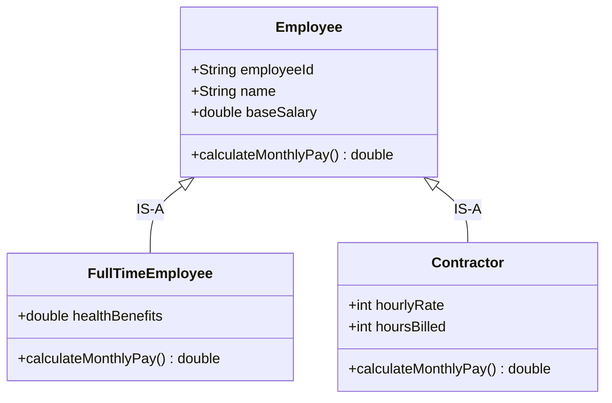
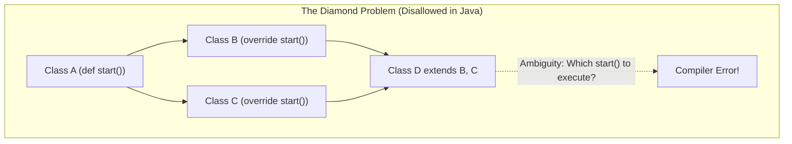
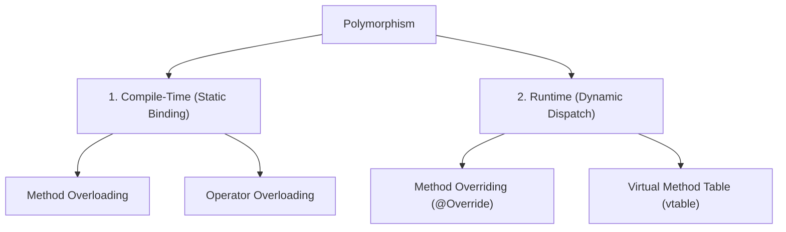
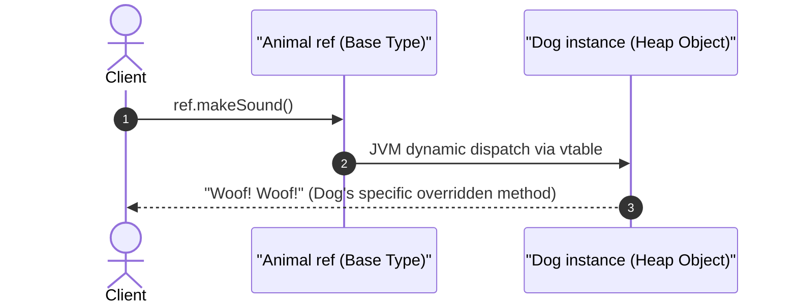
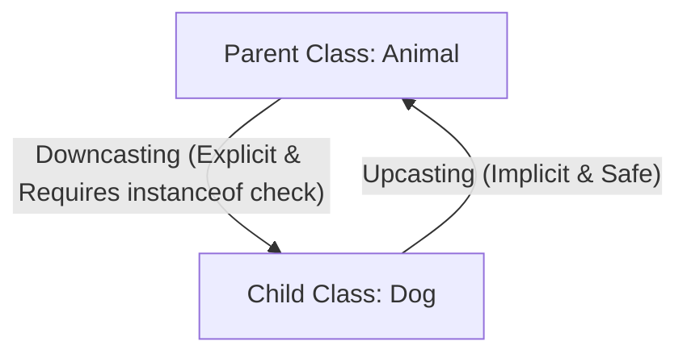

# 03. Inheritance & Polymorphism in OOPs

> 💡 **Quick Revision Anchor**: `IS-A Relationship, Method Overloading (Static) vs Overriding (Dynamic)`

---

## 1. Inheritance: Code Reusability & The "IS-A" Contract

### Definition
**Inheritance** is the mechanism where a new class (subclass/derived class) acquires the properties and behaviors of an existing class (superclass/base class). It establishes an **IS-A** relationship.



### Types of Inheritance
1. **Single Inheritance**: Class B extends Class A.
2. **Multilevel Inheritance**: Class C extends Class B, which extends Class A.
3. **Hierarchical Inheritance**: Multiple child classes (B, C) extend the same parent class (A).
4. **Multiple Inheritance (Interfaces)**: In Java, multiple class inheritance is disallowed to avoid the **Diamond Problem** (ambiguity when two parent classes implement the exact same method signature). Java achieves multiple inheritance through multiple `interface` realization.



---

## 2. Polymorphism: One Interface, Many Implementations

**Polymorphism** (Greek for *"having multiple forms"*) allows entities such as functions, objects, or methods to behave differently depending on the context or the runtime object they operate upon.



---

## 3. Compile-Time Polymorphism (Method Overloading)

### Definition
**Method Overloading** occurs when two or more methods in the same class share the exact same method name, but have **different parameter signatures** (different parameter count, data types, or parameter ordering).

- Resolved entirely at **compile time** by the Java compiler inspecting argument types.
- **Rule**: Changing **only the return type** does NOT overload a method and results in a compilation error.

### Code Example: Search Service
```java
public class ProductSearchService {
    // 1. Search by ID
    public Product search(int productId) {
        return findById(productId);
    }

    // 2. Search by keyword
    public List<Product> search(String keyword) {
        return findByKeyword(keyword);
    }

    // 3. Search by keyword, filtered by category and price range
    public List<Product> search(String keyword, String category, double maxPrice) {
        return findByFilters(keyword, category, maxPrice);
    }
}
```

---

## 4. Runtime Polymorphism (Method Overriding)

### Definition
**Method Overriding** occurs when a subclass provides a specific implementation of a method that is already defined in its parent class.

- Resolved at **runtime** using **Dynamic Method Dispatch**.
- Java maintains an internal **vtable (Virtual Method Table)** for each class. At runtime, the JVM looks up the actual object type in heap memory to invoke the appropriate method version.



### Code Example: Payment Processor
```java
public abstract class PaymentProcessor {
    public abstract void processPayment(double amount);
}

public class UpiPaymentProcessor extends PaymentProcessor {
    @Override
    public void processPayment(double amount) {
        System.out.println("Processing ₹" + amount + " via UPI Virtual Payment Address (VPA).");
    }
}

public class CreditCardPaymentProcessor extends PaymentProcessor {
    @Override
    public void processPayment(double amount) {
        System.out.println("Processing $" + amount + " through Payment Gateway with 3D Secure OTP.");
    }
}

// Client usage (Runtime Polymorphism in action)
public class CheckoutService {
    public void completeOrder(PaymentProcessor processor, double amount) {
        // processor invokes the overridden method of whatever runtime instance was passed
        processor.processPayment(amount);
    }
}
```

---

## 5. Upcasting vs. Downcasting



```java
// Upcasting (Always safe)
Animal myAnimal = new Dog(); // Implicitly treated as Animal

// Downcasting (Dangerous without verification)
if (myAnimal instanceof Dog dog) {
    dog.fetchBall(); // Safe access to Dog-specific methods
}
```

---

## 6. Critical Interview Questions & Traps

| Interview Question | Correct Answer & Technical Rationale |
| :--- | :--- |
| **Can we override `static` methods in Java?** | **No**. Static methods belong to the class, not instances. Re-declaring a static method in a subclass is **Method Hiding**, not overriding. Static binding occurs at compile time. |
| **Can we overload methods by changing only the return type?** | **No**. The compiler cannot distinguish which method to invoke if called without assigning to a variable: e.g., `calculate();`. |
| **Can we override a `private` method?** | **No**. Private methods are not visible outside the class and are bound statically via `invokespecial`. |
| **Why prefer Composition over Inheritance?** | Inheritance creates tight coupling (**fragile base class problem**). Changing the base class can break all subclasses. Composition (**HAS-A**) allows dynamic swapping of behaviors at runtime. |
