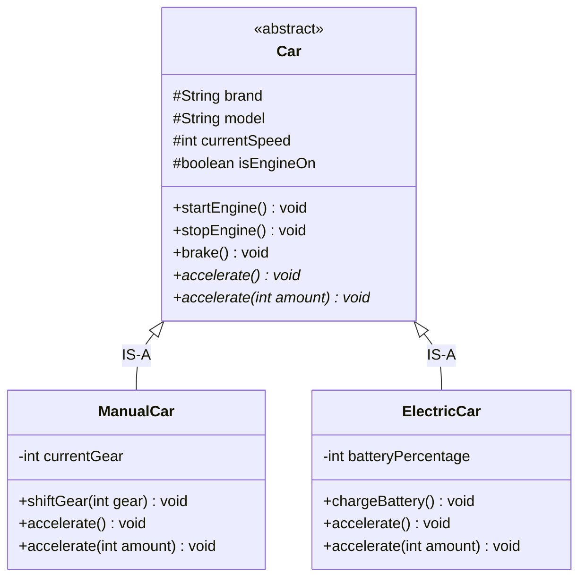

# 03. Inheritance & Polymorphism in OOPs

> 💡 **Quick Revision Anchor**
> - **Inheritance:** An "IS-A" relationship where child classes inherit state and behavior from a parent class to eliminate code duplication, using `protected` to share state safely.
> - **Polymorphism ("Many Forms"):**
>   - **Compile-Time (Static / Overloading):** Same method name with different parameters within the same class; resolved at compile time.
>   - **Runtime (Dynamic / Overriding):** Subclass provides specialized implementation of a parent method with the exact same signature; resolved at runtime via dynamic dispatch.

---

## 1. Pillar 3: Inheritance (Code Reuse & Hierarchical Modeling)

### Problem: Code Duplication Across Car Types
Suppose we need to model a `ManualCar` and an `ElectricCar`. Both vehicles share identical attributes and behaviors:
- **Shared Attributes:** `brand`, `model`, `isEngineOn`, `currentSpeed`.
- **Shared Behaviors:** `startEngine()`, `stopEngine()`, `brake()`.

Without inheritance, we would duplicate these fields and methods across every vehicle class. When a change is made to `brake()`, we would have to manually update every single vehicle class.

### The Solution: Base Class Extraction
Extract common properties into a base `Car` class. Subclasses inherit the shared foundation and add only their specialized features:
- `ManualCar` adds `currentGear` and `shiftGear(int gear)`.
- `ElectricCar` adds `batteryPercentage` and `chargeBattery()`.

```
                  ┌──────────────────────────────┐
                  │             Car              │
                  ├──────────────────────────────┤
                  │ #brand, #model, #speed       │
                  │ +startEngine(), +stopEngine()│
                  └──────────────┬───────────────┘
                                 │ (IS-A)
                 ┌───────────────┴───────────────┐
                 ▼                               ▼
     ┌───────────────────────┐       ┌───────────────────────┐
     │       ManualCar       │       │      ElectricCar      │
     ├───────────────────────┤       ├───────────────────────┤
     │ -currentGear          │       │ -batteryPercentage    │
     │ +shiftGear(gear)      │       │ +chargeBattery()      │
     └───────────────────────┘       └───────────────────────┘
```

---

## 2. Access Specifiers in Inheritance

How visibility modifiers interact with class inheritance:

| Access Modifier | Inside Same Class | In Derived (Child) Class | Outside World / Client |
| :--- | :---: | :---: | :---: |
| **`private`** | Yes | **No** (Hidden completely) | **No** |
| **`protected`** | Yes | **Yes** (Inherited & accessible) | **No** |
| **`public`** | Yes | **Yes** | **Yes** |

> 🔑 **Key Takeaway:** If fields in `Car` are `private`, child classes like `ManualCar` cannot access them directly. Marking them **`protected`** preserves encapsulation from external clients while granting child classes direct access.

---

## 3. Forms of Inheritance & The Diamond Problem

1. **Single Inheritance:** A class inherits from one parent (`Car ➔ ManualCar`).
2. **Multi-Level Inheritance:** A chain of inheritance (`Vehicle ➔ Car ➔ SportsCar`).
3. **Hierarchical Inheritance:** Multiple classes inherit from one base (`Car ➔ ManualCar, ElectricCar`).
4. **Multiple Inheritance:** A class inherits from two or more parent classes.

### The Diamond Problem
```text
        A (Vehicle)
       ┌─────┴─────┐
       ▼           ▼
    B (Car)     C (Boat)
       └─────┬─────┘
             ▼
    D (AmphibiousVehicle)
```
- If Class $B$ and Class $C$ both inherit from $A$ and override a method `turnOn()`, Class $D$ inheriting from both creates ambiguity: *Which version should $D$ execute?*
- **Java's Solution:** Java forbids multiple class inheritance (`class D extends B, C` causes a compile error). Instead, Java supports multiple inheritance of type through **`interfaces`**.

---

## 4. Pillar 4: Polymorphism ("Many Forms")

Originates from Greek: *Poly* (Many) + *Morph* (Form). The ability of an entity or operation to take different forms depending on context.

```text
                              POLYMORPHISM
                                   │
             ┌─────────────────────┴─────────────────────┐
             ▼                                           ▼
  Compile-Time (Static)                       Runtime (Dynamic)
  • Method Overloading                        • Method Overriding
  • Resolved by compiler                      • Resolved by JVM at runtime
  • Same name, different parameters           • Same signature across parent/child
```

### A. Compile-Time Polymorphism (Method Overloading)
Methods in the same class share the **same name** but have **different parameter lists** (different count or types).
- Example: `accelerate()` accelerates by default (+20 km/h), while `accelerate(int speed)` accelerates by a custom amount.
- *Note:* Changing only the return type does **not** constitute valid method overloading.

### B. Runtime Polymorphism (Method Overriding & Dynamic Dispatch)
A child class provides its own specialized implementation of a method declared in the parent class.
- Real-world analogy: Both `Dog` and `Cat` are `Animals`. When `makeSound()` is called, a dog barks while a cat meows.
- Car example: Calling `accelerate()` on a `ManualCar` burns fuel and shifts gears, whereas on an `ElectricCar` it draws battery power.

```java
// Upcasting: Parent reference pointing to child instances
Car car1 = new ManualCar("Suzuki", "WagonR");
Car car2 = new ElectricCar("Tesla", "Model S");

car1.accelerate(); // Executes ManualCar logic
car2.accelerate(); // Executes ElectricCar logic
```

---

## 5. Visual Architecture



---

## 6. Concise Java Implementation

```java
// 1. Abstract Base Class (Inheritance + Encapsulation)
abstract class Car {
    protected final String brand;
    protected final String model;
    protected int currentSpeed;
    protected boolean isEngineOn;

    public Car(String brand, String model) {
        this.brand = brand;
        this.model = model;
        this.currentSpeed = 0;
        this.isEngineOn = false;
    }

    public void startEngine() {
        this.isEngineOn = true;
        System.out.println(brand + " " + model + ": Engine started.");
    }

    public void stopEngine() {
        this.isEngineOn = false;
        this.currentSpeed = 0;
        System.out.println(brand + " " + model + ": Engine stopped.");
    }

    public void brake() {
        this.currentSpeed = Math.max(0, this.currentSpeed - 20);
        System.out.println(brand + " " + model + ": Braking, speed is now " + currentSpeed + " km/h");
    }

    // Abstract methods to be overridden (Runtime Polymorphism)
    public abstract void accelerate();
    public abstract void accelerate(int customSpeed); // Overloaded (Compile-time)
}

// 2. Subclass 1: ManualCar (Suzuki WagonR)
class ManualCar extends Car {
    private int currentGear;

    public ManualCar(String brand, String model) {
        super(brand, model);
        this.currentGear = 1;
    }

    public void shiftGear(int gear) {
        this.currentGear = gear;
        System.out.println(brand + " " + model + ": Shifted to Gear " + gear);
    }

    @Override
    public void accelerate() {
        if (!isEngineOn) return;
        this.currentSpeed += 20;
        System.out.println(brand + " " + model + ": Accelerated with gear pickup to " + currentSpeed + " km/h");
    }

    @Override
    public void accelerate(int customSpeed) {
        if (!isEngineOn) return;
        this.currentSpeed += customSpeed;
        System.out.println(brand + " " + model + ": Accelerated custom +" + customSpeed + " to " + currentSpeed + " km/h");
    }
}

// 3. Subclass 2: ElectricCar (Tesla Model S)
class ElectricCar extends Car {
    private int batteryPercentage;

    public ElectricCar(String brand, String model) {
        super(brand, model);
        this.batteryPercentage = 100;
    }

    public void chargeBattery() {
        this.batteryPercentage = 100;
        System.out.println(brand + " " + model + ": Battery charged to 100%");
    }

    @Override
    public void accelerate() {
        if (!isEngineOn) return;
        this.currentSpeed += 15;
        this.batteryPercentage = Math.max(0, this.batteryPercentage - 2);
        System.out.println(brand + " " + model + ": Silent electric acceleration to " + currentSpeed + " km/h (Battery: " + batteryPercentage + "%)");
    }

    @Override
    public void accelerate(int customSpeed) {
        if (!isEngineOn) return;
        this.currentSpeed += customSpeed;
        this.batteryPercentage = Math.max(0, this.batteryPercentage - 4);
        System.out.println(brand + " " + model + ": Ludicrous mode +" + customSpeed + " to " + currentSpeed + " km/h (Battery: " + batteryPercentage + "%)");
    }
}

// 4. Client Demonstration
public class Main {
    public static void main(String[] args) {
        // Dynamic Method Dispatch: parent reference pointing to child instances
        Car wagonR = new ManualCar("Suzuki", "WagonR");
        Car tesla = new ElectricCar("Tesla", "Model S");

        wagonR.startEngine();
        wagonR.accelerate();    // Runtime overriding (+20 km/h)
        wagonR.accelerate(30);  // Compile-time overloading (+30 km/h)
        wagonR.brake();
        wagonR.stopEngine();

        System.out.println("------------------------------------");

        tesla.startEngine();
        tesla.accelerate();     // Runtime overriding (+15 km/h, -2% battery)
        tesla.accelerate(25);   // Compile-time overloading (+25 km/h, -4% battery)
        tesla.brake();
        tesla.stopEngine();
    }
}
```

---

## 7. Additional Interview Insight: Operator Overloading in Java vs C++

In C++, operators like `+`, `*`, `==` can be overloaded for custom objects (`matrix1 + matrix2`). 

**Why does Java omit user-defined operator overloading?**
1. **Simplicity & Readability:** Overloaded operators can obscure meaning (e.g., an overloaded `+` performing database mutations or subtracting values).
2. **Predictability:** In Java, `+` is overloaded only by the language runtime for `String` concatenation. Eliminating user-defined operator overloading prevents hidden side effects and keeps code transparent.

---

## 8. Interview Questions & Key Discussion Points

1. **What is the difference between Method Overloading and Method Overriding?**
   - *Answer*: Overloading occurs within the same class (same name, different arguments) and is resolved at compile time. Overriding occurs across a parent-child relationship (identical signature) where the child provides specialized behavior, resolved dynamically at runtime via the JVM vtable.
2. **Why does Java not support multiple class inheritance?**
   - *Answer*: To prevent the Diamond Problem (ambiguity when two parent classes provide differing implementations of the same inherited method). Java resolves this by supporting single class inheritance and multiple interface implementation.
3. **What is the role of `protected` in OOP?**
   - *Answer*: `protected` allows derived child classes to inherit and access base members directly, while still keeping those members hidden from outside client code.

---

## 9. Quick Revision

### Core Idea
Inheritance enables code reuse and structural specialization via "IS-A" relationships. Polymorphism allows a single method call to execute different behaviors either via compile-time parameter signatures (overloading) or runtime object types (overriding).

### Remember
- **Lecture Examples:** `Suzuki WagonR` (`ManualCar` with gears) and `Tesla Model S` (`ElectricCar` with battery).
- **The Diamond Problem:** Avoided in Java by disallowing multiple class inheritance and using interfaces instead.
- **Dynamic Dispatch:** `Car c = new ElectricCar(...)` invokes `ElectricCar`'s `accelerate()` at runtime.
