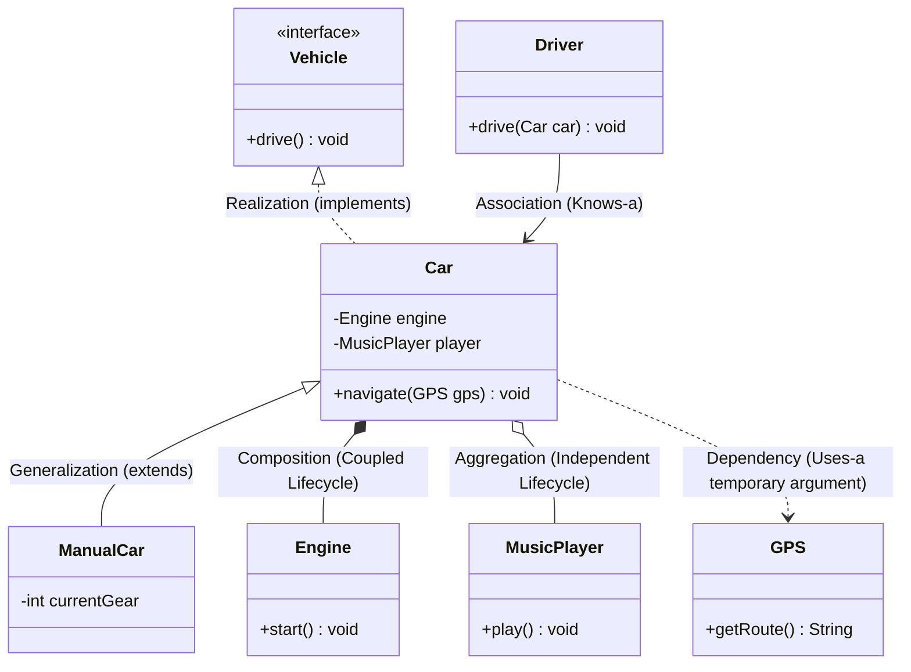
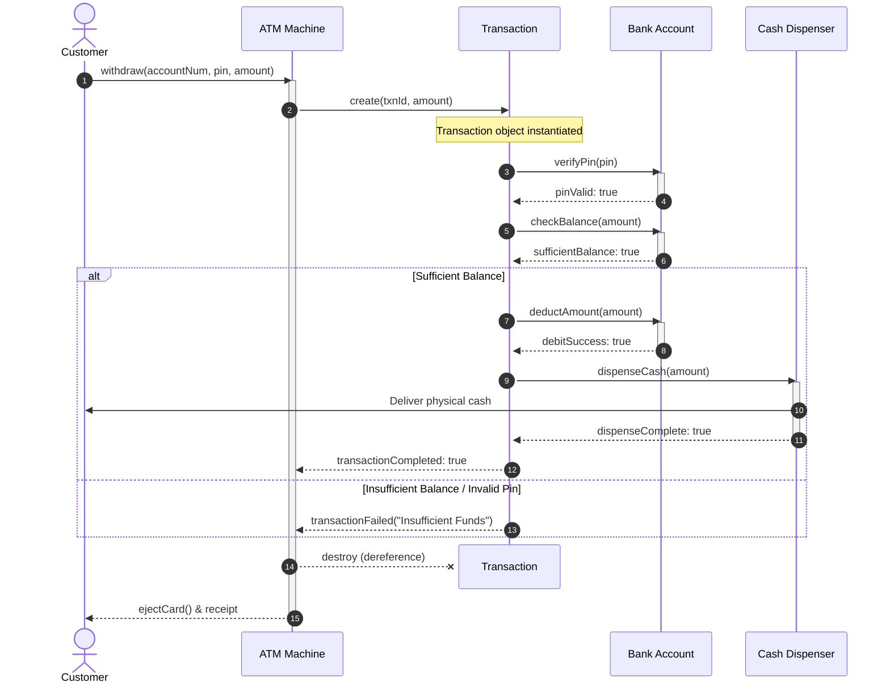

# 04. UML Diagrams: Class & Sequence Diagrams

> 💡 **Quick Revision Anchor**
> - Out of 14 standard UML diagrams, **Class Diagrams** (static structure, attributes, visibility, relationships) and **Sequence Diagrams** (dynamic runtime communication across time) dominate 99% of LLD interviews.
> - **Relationship Hierarchy:** Generalization (inheritance), Realization (interface), Association (knows), Aggregation (weak "has-a", independent lifecycles), Composition (strong "has-a", coupled lifecycles), Dependency (temporary method argument).
> - **Sequence Elements:** Lifelines, Activation bars, Synchronous / Asynchronous calls, Return messages, Create / Destroy (`X`) lifecycles, and Combined Fragments (`alt`, `opt`, `loop`).

---

## 1. What is UML and Why Does It Matter?

**Unified Modeling Language (UML)** is the industry-standard visual language used to visualize, specify, construct, and document software blueprints.

```text
                                  UML DIAGRAMS (14 Total)
                                             │
                   ┌─────────────────────────┴─────────────────────────┐
                   ▼                                                   ▼
     Structural (Static Architecture)                    Behavioral (Dynamic Execution)
     • What classes and components exist                 • How objects communicate over time
     • Top Diagram: ★ Class Diagram                      • Top Diagram: ★ Sequence Diagram
```

### Why Focus on Class & Sequence Diagrams?
In LLD interviews and team design reviews:
1. **Class Diagram:** Visualizes the domain skeleton—classes, fields, visibility modifiers (`+`, `-`, `#`), and structural connections before writing code.
2. **Sequence Diagram:** Visualizes specific runtime workflows step-by-step (e.g., an ATM cash withdrawal, placing an order, or processing a payment) to expose edge cases and concurrency flaws.

---

## 2. Class Diagram Anatomy & Visibility Modifiers

A class rectangle is divided into three distinct compartments:

```text
┌────────────────────────────────────────────────────────┐
│                        Car                             │  <- 1. Class Name (Italic = Abstract)
├────────────────────────────────────────────────────────┤
│ - brand : String                                       │
│ # currentSpeed : int                                   │  <- 2. Attributes: [visibility] name : type
│ - isEngineOn : boolean                                 │
├────────────────────────────────────────────────────────┤
│ + startEngine() : void                                 │
│ + accelerate(amount : int) : void                      │  <- 3. Methods: [visibility] name(args) : return
│ + brake() : void                                       │
└────────────────────────────────────────────────────────┘
```

### Visibility Modifiers:
- **`+` Public:** Accessible everywhere.
- **`-` Private:** Accessible only within this class.
- **`#` Protected:** Accessible within this class and derived subclasses.
- **`~` Package-Private:** Accessible within classes of the same package (Java default).

---

## 3. Relationships in Class Diagrams



### Relationship Types & Lifecycle Semantics:

| Relationship | Type | Definition & Lifecycle Semantics | UML Notation |
| :--- | :--- | :--- | :---: |
| **Generalization** | Class | "IS-A" Class Inheritance (`ManualCar extends Car`). | Solid line, hollow triangle |
| **Realization** | Class | "CAN-DO" Interface Implementation (`Car implements Vehicle`). | Dashed line, hollow triangle |
| **Association** | Object | "KNOWS-A" Peer connection (`Driver` drives a `Car`). | Solid line, open arrow (`-->`) |
| **Aggregation** | Object | **Weak "HAS-A" Ownership**. Lifecycles are independent. If `Car` is scrapped, `MusicPlayer` can be removed and reused. | Solid line, **hollow diamond** (`o--`) |
| **Composition** | Object | **Strong "CONTAINS-A" Ownership**. Lifecycles are tightly coupled. If `Car` is destroyed, its engine ceases to exist as part of the car. | Solid line, **filled diamond** (`*--`) |
| **Dependency** | Object | **"USES-A" Temporary Link**. An object is passed as a temporary method argument (`car.navigate(GPS gps)`). | Dashed line, open arrow (`..>`) |

> 💡 **Design Insight: Aggregation vs Composition**  
> Whether a relationship is Aggregation or Composition often depends on business requirements:
> - In a Food Delivery app: If deleting a Restaurant permanently cascades and purges its menu items from the database $\to$ **Composition**.
> - If menu items belong to a central master catalog reused across restaurant branches $\to$ **Aggregation**.

---

## 4. Sequence Diagrams: Modeling Dynamic Interactions

While Class Diagrams model static structure, Sequence Diagrams model how objects interact chronologically:

### Key Notations:
1. **Lifeline:** Vertical dashed line representing an object's existence over time.
2. **Activation Bar:** Vertical rectangle on the lifeline indicating the object is actively executing code.
3. **Synchronous Call (Solid arrow, filled head):** Caller waits for completion.
4. **Return Message (Dashed arrow, open head):** Returns value/control back to caller.
5. **Asynchronous Call (Solid arrow, open head):** Non-blocking fire-and-forget message.
6. **Create Message:** Arrow pointing directly to a newly instantiated object box.
7. **Destroy Message:** Terminating 'X' marking an object's destruction/dereferencing.
8. **Combined Fragments:**
   - `alt`: Conditional if-else branching.
   - `opt`: Optional step (if condition without else).
   - `loop`: Repetitive execution.

---

## 5. Canonical Lecture Example: ATM Cash Withdrawal Sequence



---

## 6. Concise Java Implementation: ATM Domain

This code demonstrates how UML relationships translate directly into Java:

```java
// 1. Account Entity
class BankAccount {
    private final String pin;
    private double balance;

    public BankAccount(String pin, double initialBalance) {
        this.pin = pin;
        this.balance = initialBalance;
    }

    public boolean verifyPin(String enteredPin) {
        return this.pin.equals(enteredPin);
    }

    public boolean hasSufficientBalance(double amount) {
        return this.balance >= amount;
    }

    public boolean deduct(double amount) {
        if (!hasSufficientBalance(amount)) return false;
        this.balance -= amount;
        return true;
    }

    public double getBalance() { return balance; }
}

// 2. Hardware Component
class CashDispenser {
    public void dispense(double amount) {
        System.out.println("[Dispenser] Dispensing cash: ₹" + amount);
    }
}

// 3. Short-lived Transaction (Created & Destroyed per request)
class Transaction {
    private final String txnId;
    private final double amount;
    private final BankAccount account;
    private final CashDispenser dispenser;

    public Transaction(String txnId, double amount, BankAccount account, CashDispenser dispenser) {
        this.txnId = txnId;
        this.amount = amount;
        this.account = account;
        this.dispenser = dispenser;
    }

    public boolean execute(String pin) {
        if (!account.verifyPin(pin)) {
            System.out.println("[Txn " + txnId + "] Failed: Invalid PIN.");
            return false;
        }
        if (!account.hasSufficientBalance(amount)) {
            System.out.println("[Txn " + txnId + "] Failed: Insufficient funds.");
            return false;
        }

        account.deduct(amount);
        dispenser.dispense(amount);
        System.out.println("[Txn " + txnId + "] Success! Remaining balance: ₹" + account.getBalance());
        return true;
    }
}

// 4. ATM Controller (Orchestrator)
class ATM {
    private final CashDispenser dispenser; // Composition: ATM owns Dispenser
    private int counter = 0;

    public ATM() {
        this.dispenser = new CashDispenser();
    }

    public void withdrawCash(BankAccount account, String pin, double amount) {
        System.out.println("\n--- ATM Withdrawal Request: ₹" + amount + " ---");
        counter++;
        // Lifecycle: Create message in Sequence Diagram
        Transaction txn = new Transaction("TXN-" + counter, amount, account, dispenser);
        
        boolean success = txn.execute(pin);
        if (success) {
            System.out.println("[ATM] Transaction complete. Take your card.");
        } else {
            System.out.println("[ATM] Transaction failed.");
        }
        // Lifecycle: Destroy message ('X') — txn eligible for garbage collection
        txn = null; 
    }
}

// 5. Driver Execution
public class Main {
    public static void main(String[] args) {
        ATM atm = new ATM();
        BankAccount account = new BankAccount("1234", 5000.0);

        atm.withdrawCash(account, "1234", 1500.0); // Success
        atm.withdrawCash(account, "9999", 500.0);  // Invalid PIN
        atm.withdrawCash(account, "1234", 10000.0);// Insufficient funds
    }
}
```

---

## 7. Interview Questions & Key Discussion Points

1. **How do you distinguish Aggregation from Composition in Java code?**
   - *Answer*: In Composition, the child object is instantiated inside the parent class constructor (e.g., `this.dispenser = new CashDispenser()`), meaning child lifecycle is coupled to the parent. In Aggregation, the dependency is created outside and passed via constructor or setter injection (e.g., `new Car(externalMusicPlayer)`), allowing lifecycles to remain independent.
2. **What is the difference between an Association and a Dependency?**
   - *Answer*: Association is a structural relationship where an object maintains a persistent field reference to another object (`private Driver driver`). Dependency is a transient relationship where an object merely uses another object temporarily as a method argument (`void navigate(GPS gps)`).
3. **When should you draw a Sequence Diagram in an LLD interview?**
   - *Answer*: After establishing the static class diagram, draw a sequence diagram for the most complex, multi-step user flow (e.g., payment checkout, ride matching, or order placement). It clarifies message ordering, failure branches (`alt`), and object lifecycles.

---

## 8. Quick Revision

### Core Idea
- **Class Diagram:** Visualizes static structure (Classes, Attributes, Visibility, Relationships).
- **Sequence Diagram:** Visualizes chronological interactions across time (Lifelines, Messages, Branching, Lifecycle events).

### Remember
- Visibility: `+` (public), `-` (private), `#` (protected), `~` (package-private).
- Diamonds: Filled diamond = **Composition** (strong coupling); Hollow diamond = **Aggregation** (weak coupling).
- Lifetimes: If child dies when parent dies $\to$ Composition. If child survives $\to$ Aggregation.
