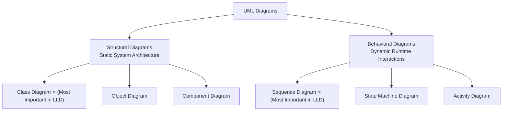
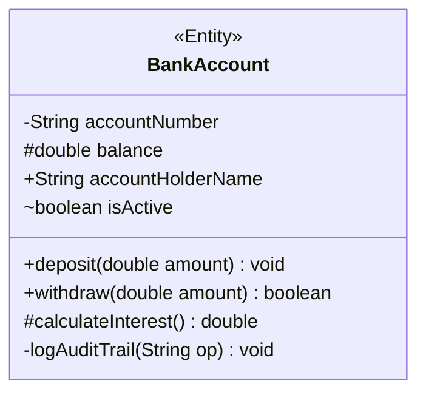
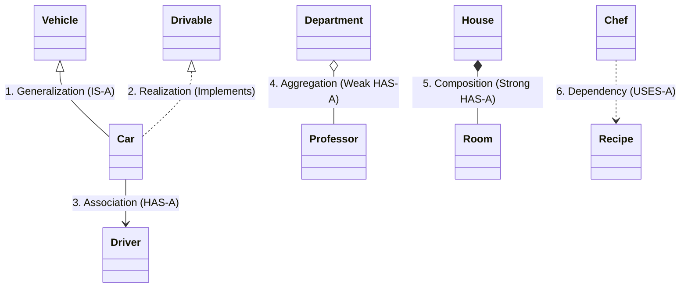
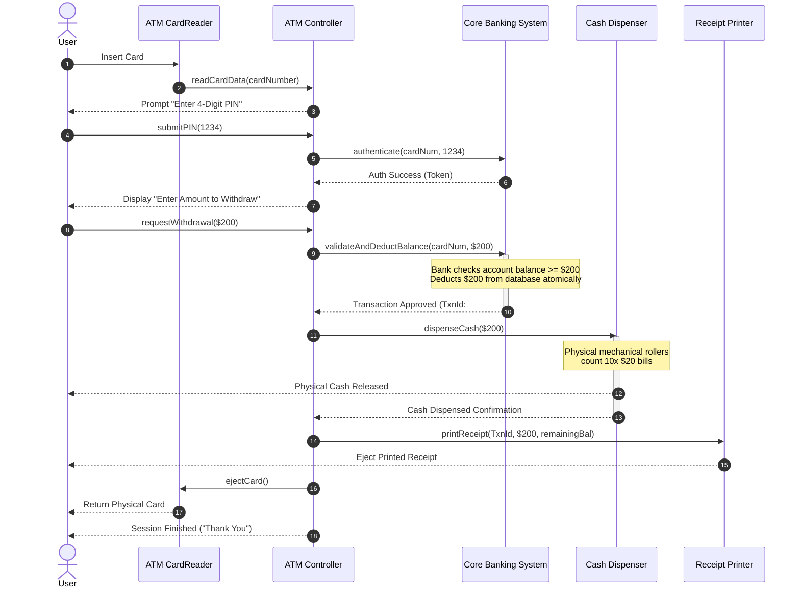

# 04. UML Diagrams — Class & Sequence Diagrams

> 💡 **Quick Revision Anchor**: 
> - **Class Diagram**: Static structural view (Classes, attributes, methods, relationships: Generalization, Realization, Association, Aggregation, Composition, Dependency).
> - **Sequence Diagram**: Dynamic behavioral view over time (Lifelines, activation bars, synchronous/asynchronous messages, return replies).

---

## 1. Why UML in Low-Level Design?

**Unified Modeling Language (UML)** is the international standard architectural blueprint for visualizing, specifying, and documenting software systems before writing a single line of code.



In technical interviews and real-world system design, drawing UML diagrams upfront prevents hundreds of hours of refactoring messy code.

---

## 2. Anatomy of a Class in UML

A UML class is rendered as a rectangle divided into **three compartments**:



### Visibility Modifiers Notation:
| Symbol | Access Modifier | Meaning |
| :---: | :--- | :--- |
| `+` | **Public** | Accessible by any class in any package |
| `-` | **Private** | Accessible only within this declaring class |
| `#` | **Protected** | Accessible within package and by subclasses |
| `~` | **Package / Default** | Accessible only by classes in the same package |

---

## 3. The 6 Core Class Relationships

Understanding these relationships and their exact notations is the single most tested skill in LLD interviews:



### 1. Generalization (Inheritance)
- **Concept**: `IS-A` relationship between child class and parent class.
- **Notation**: Solid line with a hollow triangle pointing to the superclass (`───▷`).
- *Code Example*: `public class Car extends Vehicle { ... }`

### 2. Realization (Implementation)
- **Concept**: A concrete class contracts to implement an interface.
- **Notation**: Dashed line with a hollow triangle pointing to the interface (`- - -▷`).
- *Code Example*: `public class Car implements Drivable { ... }`

### 3. Association
- **Concept**: A loose structural relationship where one class knows about another class.
- **Notation**: Solid line with an open arrow (`───>`). Multiplicity can be labeled (`1`, `*`, `0..1`).
- *Code Example*: `public class Car { private Driver driver; }`

### 4. Aggregation (Weak "HAS-A")
- **Concept**: A **whole-part** relationship where parts can exist **independently** of the whole. If the parent container is deleted, the child objects continue to exist.
- **Notation**: Solid line with a **hollow diamond** at the parent/container end (`◇───`).
- *Real-World Analogy*: A **Room** and **Furniture** (Sofa/Bed). If the room is demolished, the sofa can be moved outside—it does not perish!
- *Code Example*:
  ```java
  public class Department {
      private List<Professor> professors; // Professors exist independently!
      public Department(List<Professor> profs) { this.professors = profs; }
  }
  ```

### 5. Composition (Strong "HAS-A")
- **Concept**: An exclusive **whole-part** relationship where parts **cannot exist** without the whole. The parent manages the lifecycle of the child. When the parent is destroyed, all its composite parts are destroyed.
- **Notation**: Solid line with a **filled diamond** at the parent/container end (`◆───`).
- *Real-World Analogy*: A **Building** and its **Rooms**; or a **Human Body** and its **Heart**. If the body dies, the heart cannot exist on its own in the wild.
- *Code Example*:
  ```java
  public class Order {
      private final List<OrderItem> items = new ArrayList<>(); // Lifecycle strictly bound!
      public void addItem(String prod, int qty) { items.add(new OrderItem(prod, qty)); }
  }
  ```

### 6. Dependency ("USES-A")
- **Concept**: A temporary, transient relationship where one class relies on another class for a specific operation (passed as a method argument, or instantiated locally inside a method).
- **Notation**: Dashed line with an open arrow (`- - ->`).
- *Real-World Analogy*: A **Chef** uses a **Recipe Book** while cooking, but does not retain it as permanent state.
- *Code Example*:
  ```java
  public class OrderProcessor {
      public void process(Order order, PaymentGateway gateway) { // Dependency via argument
          gateway.charge(order.getTotal());
      }
  }
  ```

---

## 4. Aggregation vs. Composition: Interview Cheat Sheet

| Feature | Aggregation (Weak HAS-A) | Composition (Strong HAS-A) |
| :--- | :--- | :--- |
| **UML Symbol** | Hollow Diamond (`◇`) on container | Filled Diamond (`◆`) on container |
| **Lifecycle Dependency** | **Independent**. Part survives if whole is destroyed. | **Dependent**. Part is destroyed when whole is destroyed. |
| **Ownership** | **Shared ownership**. Object can belong to multiple containers. | **Exclusive ownership**. Object belongs to exactly one container. |
| **Code Implementation** | Part is injected from outside (via Constructor/Setter). | Part is instantiated internally inside the container. |
| **Examples** | `School ◇-- Student`, `Department ◇-- Professor` | `Car ◆-- Engine`, `House ◆-- Room`, `Order ◆-- OrderItem` |

---

## 5. Sequence Diagrams: Modeling Dynamic Interactions

While Class Diagrams model static structure, **Sequence Diagrams** model how objects collaborate and send messages over time to accomplish a specific business use case.

### Core Elements of a Sequence Diagram:
1. **Actor / Object**: Depicted at the top as boxes (e.g. `:ATMCardReader`).
2. **Lifeline**: A vertical dashed line extending downward from the object representing its existence over time.
3. **Activation Bar**: A thin vertical rectangle on the lifeline indicating the object is actively executing code.
4. **Message Types**:
   - `->>` **Synchronous Call**: Solid line with filled arrow. Sender blocks until receiver returns.
   - `->` **Asynchronous Call**: Solid line with open stick arrow. Non-blocking fire-and-forget.
   - `-->>` **Return Message**: Dashed line with open arrow. Returning control or value back to caller.
   - `Loopback Arrow`: Self-invocation of private/internal method.

---

## 6. End-to-End Case Study: ATM Cash Withdrawal Sequence Diagram

Let's trace a complete real-world banking scenario: A user inserts their card, authenticates PIN, requests cash withdrawal, and receives dispensed cash.



---

## 7. Common Interview Pitfalls

1. **Confusing Dependency with Association**:
   - Storing an object reference in an instance field (`private Engine engine;`) is **Association/Composition**.
   - Accepting an object as a method parameter (`public void print(Document doc)`) is **Dependency**.
2. **Reverse Arrow Directions**:
   - In UML, inheritance arrows point **from child to parent** (child knows parent, parent does NOT know child).
   - In sequence diagrams, arrows point in the direction of the **request flow**.
3. **Drawing God Objects in Sequence Diagrams**:
   - Avoid creating an "Omnipotent Manager" that makes 50 calls while all other objects sit completely passive. Delegate responsibilities evenly across cohesive domain entities.
