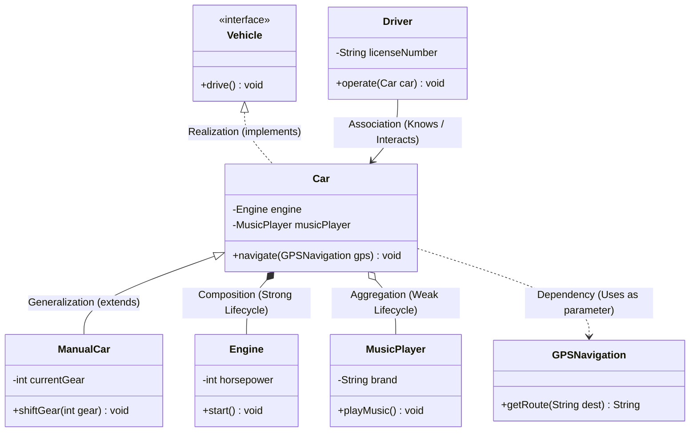

# 04. UML Diagrams: Class & Sequence Diagrams

> 💡 **Quick Revision Anchor**: A comprehensive, interview-focused guide to the Unified Modeling Language (UML). Explains why out of 14 standard UML diagrams, only two dominate 99% of Low-Level Design interviews: **Class Diagrams** (structural blueprints detailing attributes, visibility, and relationship semantics—Inheritance, Realization, Association, Aggregation vs Composition, Dependency) and **Sequence Diagrams** (behavioral interaction timelines with lifelines, activation bars, sync/async calls, create/destroy lifecycle events, and `alt`/`opt`/`loop` fragments). Features the lecture's canonical **Car Hierarchy** and the complete **ATM Cash Withdrawal Sequence Flow**.

---

## 1. What is UML and Why Does It Matter?

**Unified Modeling Language (UML)** is the standardized visual language used by software architects and engineers to specify, visualize, construct, and document software systems.

```text
                                  UML DIAGRAMS (14 Total)
                                             │
                   ┌─────────────────────────┴─────────────────────────┐
                   ▼                                                   ▼
     Structural (Static Architecture)                    Behavioral (Dynamic Execution)
     • Shows what classes exist                          • Shows how objects interact
     • 7 Total diagrams                                  • 7 Total diagrams
     • THE GOLD STANDARD:                                • THE GOLD STANDARD:
       ★ Class Diagram                                     ★ Sequence Diagram
```

### Why Learn Only Class & Sequence Diagrams?
Out of 14 UML diagrams (State machines, Component, Deployment, Activity, Use Case, etc.), 12 are niche or domain-specific. In **99% of Low-Level Design (LLD) interviews** and production engineering reviews, an engineer is required to produce:
1. **Class Diagram**: Before writing code, you draw the classes, attributes, visibility, and relationships.
2. **Sequence Diagram**: To map multi-step business workflows and identify edge cases (e.g., ATM withdrawals, payment checkouts).

---

## 2. Class Diagram Anatomy

A class is represented by a rectangle partitioned into **three compartments**:

```text
┌────────────────────────────────────────────────────────┐
│                      Car Class                         │  <- 1. Class Name (Italic if abstract,
├────────────────────────────────────────────────────────┤     <<interface>> if interface)
│ - brand : String                                       │
│ - model : String                                       │  <- 2. Attributes (Fields)
│ # currentSpeed : int                                   │     [visibility] name : type
│ - isEngineOn : boolean                                 │
├────────────────────────────────────────────────────────┤
│ + startEngine() : void                                 │  <- 3. Methods (Operations)
│ + accelerate(increment : int) : void                   │     [visibility] name(params) : returnType
│ + brake() : void                                       │
└────────────────────────────────────────────────────────┘
```

### Visibility Modifiers

| Symbol | Access Modifier | Accessible Within Class? | Accessible by Child Classes? | Accessible Outside World? |
| :---: | :--- | :---: | :---: | :---: |
| **`+`** | `public` | Yes | Yes | Yes |
| **`-`** | `private` | Yes | No | No |
| **`#`** | `protected` | Yes | Yes | No |
| **`~`** | `package-private` *(default in Java)* | Yes | Yes *(if in same package)* | No |

---

## 3. Relationships in Class Diagrams

Relationships are divided into **Class-Level** (structural inheritance) and **Object-Level** (associations and compositions).



### Detailed Relationship Summary Table

| Relationship | Type | Description & Lifecycle Rule | UML Notation |
| :--- | :--- | :--- | :---: |
| **Generalization** | Class | "IS-A" Class Inheritance (`ManualCar extends Car`). Subclass inherits state and behavior. | Solid line with hollow triangle pointing to parent |
| **Realization** | Class | "CAN-DO" Interface implementation (`Car implements Vehicle`). Class satisfies contract. | Dashed line with hollow triangle pointing to interface |
| **Association** | Object | "KNOWS-A" connection. Two objects communicate as peers (`Driver` operates `Car`). | Solid line with open arrow (`-->`) |
| **Aggregation** | Object | **Weak "HAS-A" Ownership**. Lifetimes are independent! If `Car` is scrapped, `MusicPlayer` can be extracted and reused. | Solid line with **hollow diamond** at parent (`o--`) |
| **Composition** | Object | **Strong "CONTAINS-A" Ownership**. Lifetimes are strictly coupled! If `Car` is destroyed, its chassis-welded `Engine` ceases to exist as a functional unit. | Solid line with **filled diamond** at parent (`*--`) |
| **Dependency** | Object | **"USES-A" Temporary Link**. An object receives another object as a temporary method argument (`car.navigate(gps)`). | Dashed line with open arrow (`..>`) |

### Subjectivity in LLD: Aggregation vs Composition
The instructor emphasizes that in real systems, the boundary between aggregation and composition can be subjective:
- **Example — Zomato / Swiggy Restaurant & Menu**:
  - If your system allows a shared catalog menu to exist independently in the database: $\to$ **Aggregation**.
  - If a restaurant closure completely cascades and purges its menu items from the database: $\to$ **Composition**.

---

## 4. Sequence Diagrams: Modeling Dynamic Workflows

While Class Diagrams model the static skeleton, **Sequence Diagrams** model how objects collaborate chronologically over time.

```text
Elements of a Sequence Diagram:
1. Participants / Lifelines: Vertical dashed lines representing object lifecycles over time.
2. Activation Bar (Focus of Control): Thin vertical rectangle showing when an object is actively executing.
3. Synchronous Call (Solid arrow with filled arrowhead): Caller blocks and waits for execution to complete.
4. Reply / Return Message (Dashed arrow with open arrowhead): Returns control and data back to caller.
5. Asynchronous Call (Solid arrow with open stick arrowhead): Fire-and-forget; caller proceeds without waiting.
6. Create Message: Arrow pointing directly into the creation of a new object box.
7. Destroy Message: Terminating arrow ending in a large bold 'X', signaling garbage collection / destruction.
```

### Combined Fragments in Sequence Diagrams
- **`alt` (Alternative / If-Else)**: Models conditional branching (e.g., PIN is correct vs PIN is invalid).
- **`opt` (Option / If)**: Models optional steps that execute only if a specific condition is met (no `else`).
- **`loop`**: Models repetitive execution (e.g., retrying PIN entry up to 3 times, or counting notes).

---

## 5. Canonical Lecture Example: ATM Cash Withdrawal Sequence

The instructor demonstrates the end-to-end sequence for a user withdrawing money from an ATM:

```mermaid
sequenceDiagram
    autonumber
    actor User as User (Customer)
    participant ATM as ATM Machine
    participant Txn as Transaction
    participant Bank as Bank Account
    participant Dispenser as Cash Dispenser

    User->>ATM: withdraw(accountNum, pin, amount)
    activate ATM
    
    ATM->>Txn: create(txnId, amount)
    activate Txn
    Note over Txn: Transaction object instantiated

    Txn->>Bank: verifyPin(pin)
    activate Bank
    Bank-->>Txn: pinValid: true
    deactivate Bank

    Txn->>Bank: checkBalance(amount)
    activate Bank
    Bank-->>Txn: sufficientBalance: true
    deactivate Bank

    alt Sufficient Balance
        Txn->>Bank: deductAmount(amount)
        activate Bank
        Bank-->>Txn: debitSuccess: true
        deactivate Bank

        Txn->>Dispenser: dispenseCash(amount)
        activate Dispenser
        Dispenser->>User: Physical Cash Delivered
        Dispenser-->>Txn: dispenseComplete: true
        deactivate Dispenser

        Txn-->>ATM: transactionCompleted: true
    else Insufficient Balance / Invalid Pin
        Txn-->>ATM: transactionFailed("Insufficient Funds")
    end

    destroy Txn
    Note over Txn: Transaction destroyed ('X')

    ATM-->>User: ejectCard() & printReceipt()
    deactivate ATM
```

---

## 6. Complete Java Implementation: ATM Domain

Here is the clean Java implementation matching the sequence and class diagram concepts taught in the lecture:

```java
import java.util.*;

// 1. Account Entity
class BankAccount {
    private final String accountNumber;
    private final String correctPin;
    private double balance;

    public BankAccount(String accountNumber, String pin, double initialBalance) {
        this.accountNumber = accountNumber;
        this.correctPin = pin;
        this.balance = initialBalance;
    }

    public boolean verifyPin(String enteredPin) {
        return this.correctPin.equals(enteredPin);
    }

    public boolean hasSufficientBalance(double amount) {
        return this.balance >= amount;
    }

    public boolean deductAmount(double amount) {
        if (!hasSufficientBalance(amount)) return false;
        this.balance -= amount;
        System.out.printf("[Bank] Deducted ₹%.2f. Remaining balance: ₹%.2f\n", amount, balance);
        return true;
    }

    public double getBalance() { return balance; }
}

// 2. Cash Dispenser (Component)
class CashDispenser {
    public boolean dispense(double amount) {
        System.out.printf("[Dispenser] Dispensing ₹%.2f in physical cash...\n", amount);
        return true;
    }
}

// 3. Short-lived Transaction (Created and Destroyed per request)
class Transaction {
    private final String transactionId;
    private final double amount;
    private final BankAccount account;
    private final CashDispenser dispenser;

    public Transaction(String transactionId, double amount, BankAccount account, CashDispenser dispenser) {
        this.transactionId = transactionId;
        this.amount = amount;
        this.account = account;
        this.dispenser = dispenser;
    }

    public boolean execute(String pin) {
        System.out.println("[Transaction " + transactionId + "] Started.");

        // Step 1: Verify PIN
        if (!account.verifyPin(pin)) {
            System.out.println("[Transaction Error] Invalid PIN!");
            return false;
        }

        // Step 2: Check balance
        if (!account.hasSufficientBalance(amount)) {
            System.out.println("[Transaction Error] Insufficient funds!");
            return false;
        }

        // Step 3: Deduct money
        account.deductAmount(amount);

        // Step 4: Dispense physical cash
        dispenser.dispense(amount);

        System.out.println("[Transaction " + transactionId + "] Successfully executed.");
        return true;
    }
}

// 4. ATM Context (Long-lived Orchestrator)
class ATM {
    private final CashDispenser dispenser;
    private int transactionCounter = 0;

    public ATM() {
        this.dispenser = new CashDispenser(); // Composition
    }

    public void withdrawCash(BankAccount account, String pin, double amount) {
        System.out.println("\n--- ATM Withdrawal Request: ₹" + amount + " ---");

        // Dynamic Object Creation matching Sequence Diagram
        transactionCounter++;
        Transaction txn = new Transaction("TXN-" + transactionCounter, amount, account, dispenser);

        boolean success = txn.execute(pin);

        if (success) {
            System.out.println("[ATM] Please collect your cash and receipt.");
        } else {
            System.out.println("[ATM] Transaction could not be completed. Please try again.");
        }

        // Transaction object is dereferenced and garbage-collected (Lifecycle Destroy 'X')
        txn = null;
    }
}

// 5. Test Driver
public class Main {
    public static void main(String[] args) {
        ATM atm = new ATM();
        BankAccount account = new BankAccount("AC-987654", "1234", 5000.0);

        // Test 1: Successful withdrawal
        atm.withdrawCash(account, "1234", 1500.0);

        // Test 2: Invalid PIN
        atm.withdrawCash(account, "9999", 500.0);

        // Test 3: Insufficient Funds
        atm.withdrawCash(account, "1234", 10000.0);
    }
}
```

---

## 7. Execution Trace

```text
--- ATM Withdrawal Request: ₹1500.0 ---
[Transaction TXN-1] Started.
[Bank] Deducted ₹1500.00. Remaining balance: ₹3500.00
[Dispenser] Dispensing ₹1500.00 in physical cash...
[Transaction TXN-1] Successfully executed.
[ATM] Please collect your cash and receipt.

--- ATM Withdrawal Request: ₹500.0 ---
[Transaction TXN-2] Started.
[Transaction Error] Invalid PIN!
[ATM] Transaction could not be completed. Please try again.

--- ATM Withdrawal Request: ₹10000.0 ---
[Transaction TXN-3] Started.
[Transaction Error] Insufficient funds!
[ATM] Transaction could not be completed. Please try again.
```

---

## Quick Revision

### Core Idea
UML provides standardized blueprints for software systems. **Class Diagrams** model static architecture (classes, attributes, visibility, and structural relationships). **Sequence Diagrams** model dynamic behavior (time-ordered interactions between objects, message passing, object lifecycle creation/destruction, and branching).

### Remember
* Visibility symbols: `+` (public), `-` (private), `#` (protected), `~` (package-private).
* Relationship hierarchy:
  * Generalization (Solid line, hollow triangle) = Class Inheritance (`IS-A`).
  * Realization (Dashed line, hollow triangle) = Interface Implementation (`CAN-DO`).
  * Simple Association (Solid arrow `-->`) = Peer interaction (`KNOWS-A`).
  * Aggregation (Hollow diamond `o--`) = Weak ownership; independent lifecycles (`Car` o-- `MusicPlayer`).
  * Composition (Filled diamond `*--`) = Strong ownership; coupled lifecycles (`Car` *-- `Engine`).
  * Dependency (Dashed arrow `..>`) = Method parameter reference (`USES-A`).
* Sequence diagram message types: Synchronous (solid filled arrow), Asynchronous (solid open arrow), Return (dashed open arrow), Create (arrow to new box), Destroy ('X' termination).

### Java Implementation Idea
* Match every UML relationship in Java code:
  * Aggregation: Object injected into constructor or setter from outside.
  * Composition: Object instantiated internally inside parent constructor (`new Engine()`).
  * Dependency: Object passed strictly as a method parameter (`public void navigate(GPS gps)`).

### Most Important Interview Point
* Always explain **Aggregation vs Composition** in terms of **lifecycle coupling**: If the parent container is deleted, do the child parts continue to exist? (Yes $\to$ Aggregation, No $\to$ Composition).
* In LLD interviews, draw the Class Diagram first to agree on entities, then sketch a Sequence Diagram for the most critical user workflow (e.g. `withdrawCash` or `processPayment`).

### Common Trap
* Using a filled diamond for Aggregation or a hollow diamond for Composition. (Remember: Filled diamond = Heavy/Permanent weld = Composition).
* Forgetting to depict activation bars or using solid return arrows instead of dashed arrows in sequence diagrams.
