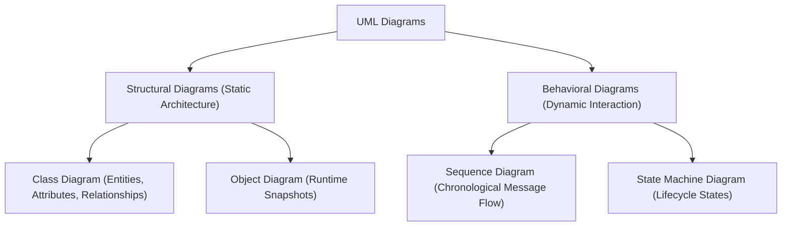
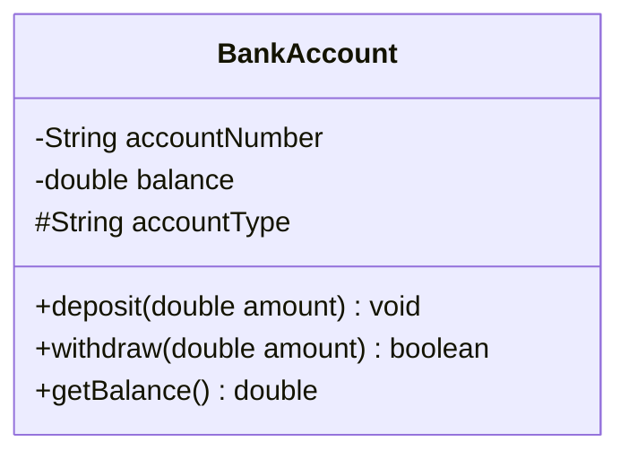
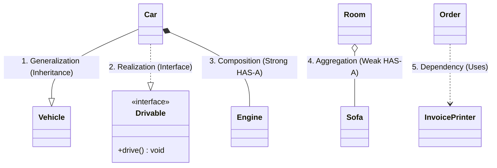
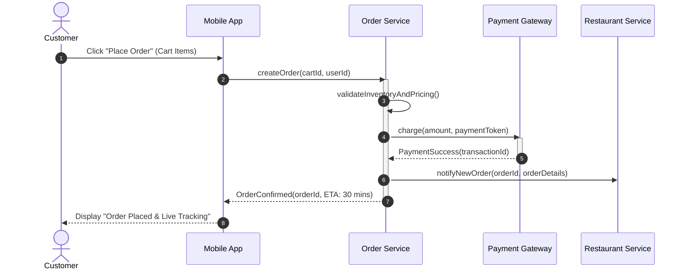

# 04. UML Diagrams: Class & Sequence Diagrams

> 💡 **Quick Revision Anchor**: `Aggregation (Hollow ◇) vs Composition (Filled ◆), Sequence Lifelines`

---

## 1. What is UML and Why is it Essential in LLD?

The **Unified Modeling Language (UML)** is the standardized visual modeling language used in software architecture to specify, visualize, construct, and document the artifacts of a software system.

Before laying down thousands of lines of code, engineers use UML diagrams in **Machine Coding rounds** and system design reviews to:
1. Establish clean domain entities and boundaries.
2. Communicate relationships between classes without ambiguity.
3. Validate requirements before implementation begins.



---

## 2. UML Class Diagram Notation

A class is represented by a rectangular box divided into **three compartments**:



### Access Modifiers in UML
| Symbol | Visibility | Java Equivalent |
| :---: | :--- | :--- |
| `+` | **Public** | Accessible from any class |
| `-` | **Private** | Accessible only within the declaring class |
| `#` | **Protected** | Accessible within package and subclasses |
| `~` | **Package-Private** | Accessible only within declaring package |

---

## 3. The 6 Core Class Relationships

Understanding the exact difference between these 6 relationships is one of the most tested skills in technical interviews:



### 1. Generalization (Inheritance: IS-A)
- Notation: Solid line with a **hollow triangle arrow** pointing to the parent (`──▷`).
- Example: `Car` extends `Vehicle`.

### 2. Realization (Interface Implementation)
- Notation: Dashed line with a **hollow triangle arrow** pointing to the interface (`┄┄▷`).
- Example: `Car` implements `Drivable`.

### 3. Association (Knows-A / Has-Reference)
- Notation: Solid line or solid line with open arrow (`──>`).
- Represents a general structural relationship where one object holds a reference to another.
- Example: `Student` has a `Teacher`.

### 4. Aggregation (Weak HAS-A: Independent Lifecycles)
- Notation: Solid line with a **hollow diamond** (`◇──`) at the owner side.
- **Key Concept**: The child can exist **independently** of the parent.
- Example: `Room` has a `Sofa`. If the room is destroyed or renovated, the sofa can be moved into a garage or another house; its existence is not tied to the room.

### 5. Composition (Strong HAS-A: Dependent Lifecycles)
- Notation: Solid line with a **filled black diamond** (`◆──`) at the owner side.
- **Key Concept**: The child **cannot exist** without the parent. Ownership is non-transferable.
- Example: `House` has `Rooms`, or a `Human` has a `Heart`. If the House is demolished, its rooms cease to exist. In code, the parent class creates and disposes of the child instance.

```java
// Composition in Code: Engine is created and destroyed with the Car
public class Car {
    private final Engine engine; // Dependent lifecycle

    public Car() {
        this.engine = new Engine(); // Strong ownership
    }
}

// Aggregation in Code: Sofa is passed from outside
public class Room {
    private Sofa sofa; // Can exist independently

    public void setSofa(Sofa sofa) {
        this.sofa = sofa; // Weak ownership
    }
}
```

### 6. Dependency (Uses-Temporarily)
- Notation: Dashed line with an open arrow (`┄┄>`).
- An object uses another object temporarily inside a single method, often passed as a parameter or instantiated locally.
- Example: `OrderService` uses `EmailClient` just to send a confirmation email.

---

## 4. Sequence Diagrams: Dynamic Interaction Over Time

While Class Diagrams model static components, **Sequence Diagrams** visualize how objects interact sequentially over a chronological timeline.

### Key Components
- **Actor**: The external entity initiating the flow (User, Mobile App).
- **Lifeline**: Vertical dashed line representing the object's lifetime.
- **Activation Box**: Thin rectangle on the lifeline indicating the period when an object is actively executing a task.
- **Synchronous Message (`──>`)**: Solid line with filled arrow; caller waits for response.
- **Return Message (`- - >`)**: Dashed line with open arrow; data returned to caller.

### Real-World Case Study: Food Delivery Checkout Flow


---

## 5. Summary Cheatsheet

| Relationship | Symbol | UML Indicator | Lifecycle Coupling |
| :--- | :---: | :---: | :--- |
| **Inheritance** | `IS-A` | `──▷` (Hollow Triangle) | Superclass & Subclass |
| **Implementation** | `Implements` | `┄┄▷` (Dashed Hollow Triangle) | Interface & Class |
| **Composition** | `HAS-A` (Strong) | `◆──` (Filled Diamond) | Child dies when Parent dies |
| **Aggregation** | `HAS-A` (Weak) | `◇──` (Hollow Diamond) | Child lives independently |
| **Association** | `Knows-A` | `──>` (Solid Arrow) | Reference held |
| **Dependency** | `Uses-A` | `┄┄>` (Dashed Arrow) | Parameter / Temporary method use |
