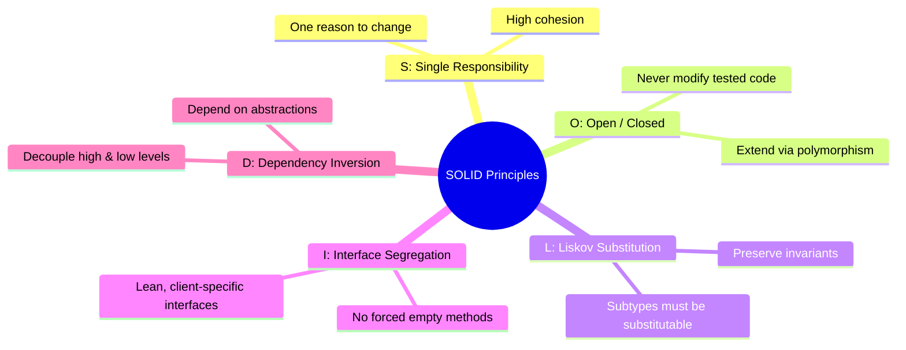
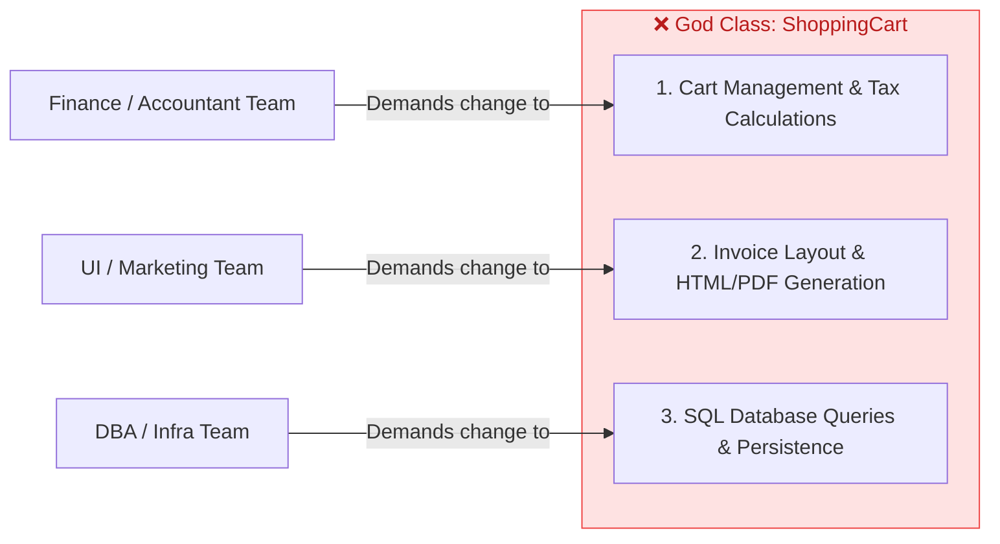
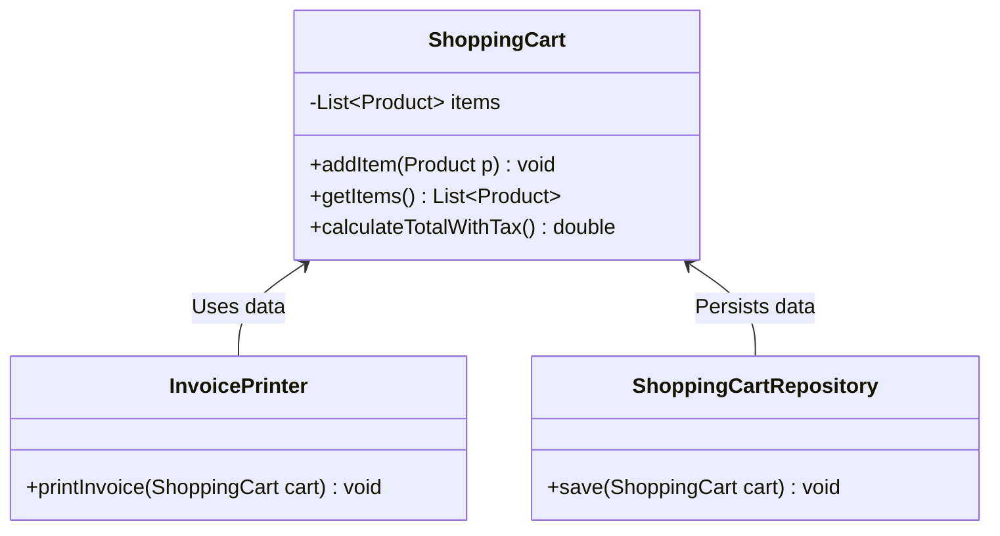
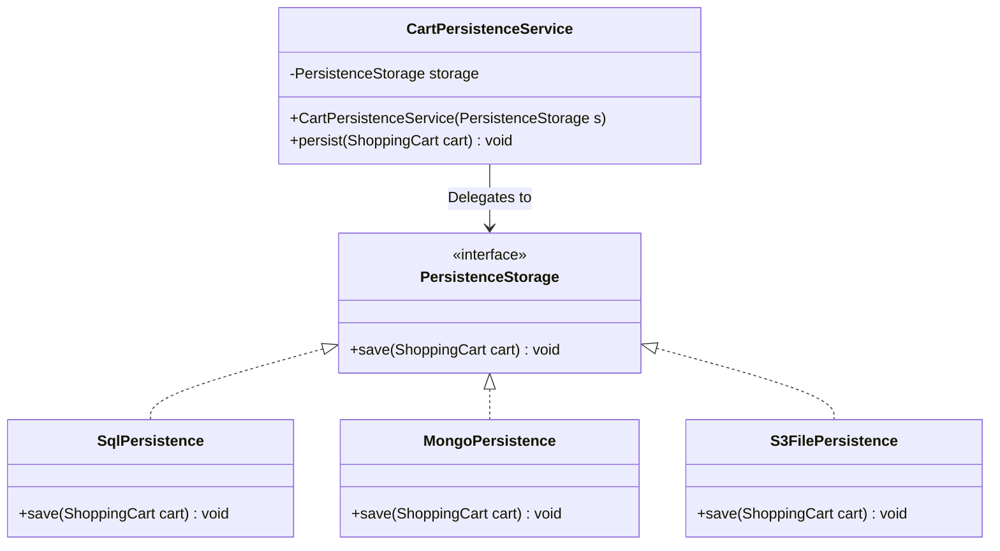

# 05. SOLID Design Principles — Part 1: SRP & OCP

> 💡 **Quick Revision Anchor**: 
> - **S (Single Responsibility Principle)**: A class should have **one, and only one, reason to change** (single actor / stakeholder ownership).
> - **O (Open/Closed Principle)**: Software entities should be **open for extension, but closed for modification** (achieved via interfaces & polymorphism).

---

## 1. What are the SOLID Principles & Why Do They Matter?

Introduced by **Robert C. Martin ("Uncle Bob")**, the **SOLID** principles are the gold standard for writing robust, maintainable, extensible, and clean object-oriented software.



### The 4 Symptoms of Rotten Code (Why Systems Collapse without SOLID):
1. **Rigidity**: A tendency for software to be difficult to change. A single simple modification forces a cascade of changes across multiple dependent modules.
2. **Fragility**: Software breaks in places that have no conceptual relationship to the area that was modified.
3. **Immobility**: Inability to reuse software components in other projects because modules are glued tightly together.
4. **Viscosity**: Designing the system cleanly is so tedious that developers take the "hacky" shortcut, rotting the codebase further.

---

## 2. Single Responsibility Principle (SRP)

> **Formal Definition**: *"A class should have one, and only one, reason to change."*
>
> In practical enterprise engineering, Uncle Bob reformulated this as: *"A module should be responsible to one, and only one, **actor or stakeholder**."*

### The Anti-Pattern: The "God Object" ShoppingCart
Consider an e-commerce checkout flow where a developer puts everything into `ShoppingCart`:



```java
// ❌ VIOLATION OF SRP: 3 completely different stakeholders alter this single file!
public class ShoppingCart {
    private List<Product> items = new ArrayList<>();

    public void addItem(Product product) { items.add(product); }

    // Responsibility 1: Business Logic & Tax Calculation (Finance Actor)
    public double calculateTotalWithTax() {
        double subtotal = items.stream().mapToDouble(Product::getPrice).sum();
        return subtotal + (subtotal * 0.18); // 18% GST
    }

    // Responsibility 2: Presentation & Formatting (Marketing Actor)
    public void printInvoice() {
        System.out.println("====== OFFICIAL INVOICE ======");
        for (Product item : items) {
            System.out.println(item.getName() + " - $" + item.getPrice());
        }
        System.out.println("Total Amount Due: $" + calculateTotalWithTax());
    }

    // Responsibility 3: Database Persistence (DBA Actor)
    public void saveToMySQL() {
        String sql = "INSERT INTO orders (total_price) VALUES (" + calculateTotalWithTax() + ")";
        System.out.println("Executing SQL: " + sql);
    }
}
```

#### Why is this dangerous in production?
- **Merge Conflicts**: If the marketing team changes invoice formatting while the finance team changes tax brackets, both submit pull requests on `ShoppingCart.java`, risking nasty merge errors.
- **Testing Nightmare**: You cannot unit-test pricing formulas without bringing database drivers and printing mock dependencies into the test harness.
- **Cascading Bugs**: A minor bug introduced while tweaking SQL persistence can crash total price calculation for active buyers!

---

### The Clean Solution (Applying SRP)

Decompose `ShoppingCart` into three independent, highly cohesive classes:



```java
// ✅ 1. Pure Domain Entity & Business Rules (Owned by Finance)
public class ShoppingCart {
    private final List<Product> items = new ArrayList<>();

    public void addItem(Product product) { items.add(product); }
    public List<Product> getItems() { return Collections.unmodifiableList(items); }

    public double calculateTotalWithTax() {
        double subtotal = items.stream().mapToDouble(Product::getPrice).sum();
        return subtotal + (subtotal * 0.18);
    }
}

// ✅ 2. Pure Presentation Layer (Owned by Marketing / Frontend)
public class InvoicePrinter {
    public void printInvoice(ShoppingCart cart) {
        System.out.println("====== OFFICIAL TAX INVOICE ======");
        for (Product item : cart.getItems()) {
            System.out.printf("%-20s : $%.2f\n", item.getName(), item.getPrice());
        }
        System.out.println("----------------------------------");
        System.out.printf("Total Amount: $%.2f\n", cart.calculateTotalWithTax());
    }
}

// ✅ 3. Pure Persistence Layer (Owned by Infrastructure / DBAs)
public class ShoppingCartRepository {
    public void saveToDatabase(ShoppingCart cart) {
        System.out.println("Saving cart with " + cart.getItems().size() + " items to SQL DB.");
    }
}
```

---

## 3. Open/Closed Principle (OCP)

> **Formal Definition**: *"Software entities (classes, modules, functions) should be open for extension, but closed for modification."*
>
> - **Open for Extension**: The behavior of the module can be extended to support new business requirements.
> - **Closed for Modification**: Extending the module does **never** require altering its existing, tested, and deployed source code.

### The Anti-Pattern: The `if-else` / `switch` Explosion
Suppose our repository needs to support saving carts to **MySQL**, **MongoDB**, and **AWS S3 File Storage**:

```java
// ❌ VIOLATION OF OCP: Modifying existing tested class for every new storage backend!
public class BadCartStorage {
    public void save(ShoppingCart cart, String storageType) {
        if (storageType.equalsIgnoreCase("SQL")) {
            System.out.println("Persisting cart to MySQL relational database...");
        } else if (storageType.equalsIgnoreCase("MONGO")) {
            System.out.println("Persisting cart JSON BSON document to MongoDB...");
        } else if (storageType.equalsIgnoreCase("S3_FILE")) {
            System.out.println("Writing cart to AWS S3 bucket as JSON file...");
        } else if (storageType.equalsIgnoreCase("REDIS")) {
            // Added 6 months later: Had to modify tested code!
            System.out.println("Writing to Redis cache...");
        } else {
            throw new IllegalArgumentException("Unsupported storage: " + storageType);
        }
    }
}
```

#### Why does this violate OCP?
Every time marketing or infra introduces a new storage medium (e.g. Cassandra, DynamoDB), you must **open** `BadCartStorage.java`, edit the `if-else` chain, and re-test all previous storage paths. A single typo in the SQL block could break relational writes while adding Cassandra support!

---

### The Clean Solution (Applying OCP via Polymorphism)

Extract an interface (`PersistenceStorage`) that establishes a common contract. New storage targets become separate classes that implement this interface:



```java
// 1. Stable Contract (Closed for Modification)
public interface PersistenceStorage {
    void save(ShoppingCart cart);
}

// 2. Concrete Extensions (Open for Extension)
public class SqlPersistence implements PersistenceStorage {
    @Override
    public void save(ShoppingCart cart) {
        System.out.println("Persisting cart to MySQL relational database.");
    }
}

public class MongoPersistence implements PersistenceStorage {
    @Override
    public void save(ShoppingCart cart) {
        System.out.println("Persisting cart BSON to MongoDB.");
    }
}

public class S3FilePersistence implements PersistenceStorage {
    @Override
    public void save(ShoppingCart cart) {
        System.out.println("Persisting cart JSON snapshot to AWS S3 bucket.");
    }
}

// 3. Client Service: Relies purely on the abstraction
public class CartPersistenceService {
    private final PersistenceStorage storage;

    public CartPersistenceService(PersistenceStorage storage) {
        this.storage = storage;
    }

    public void persist(ShoppingCart cart) {
        this.storage.save(cart); // Polymorphic dispatch!
    }
}
```

---

## 4. Key Interview Questions & Trade-offs

1. **"Does SRP mean a class should only have one method?"**
   - *Answer*: **No!** SRP is about *reasons to change*, not method count. A `UserAccount` class can have 10 methods (`changePassword()`, `updateProfile()`, `verifyEmail()`, etc.) as long as all of them serve a single cohesive responsibility: managing user identity.
2. **"How do SRP and OCP complement each other?"**
   - *Answer*: If a class violates SRP (e.g. handles both business logic and database persistence), it is virtually impossible to make it follow OCP. By first separating responsibilities into focused classes (SRP), we can wrap those responsibilities behind polymorphic interfaces (OCP).
3. **"Can a codebase be 100% closed to all modifications?"**
   - *Answer*: No. 100% closure is impossible. If the fundamental requirements change, code must change. OCP aims for **strategic closure**: anticipate the most likely directions of change (e.g. payment options, notification channels, storage formats) and protect against them using abstractions.
