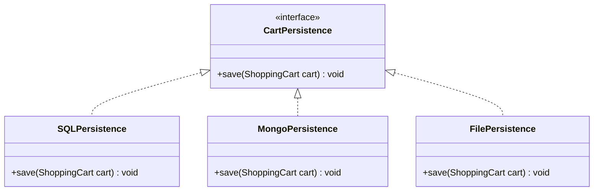
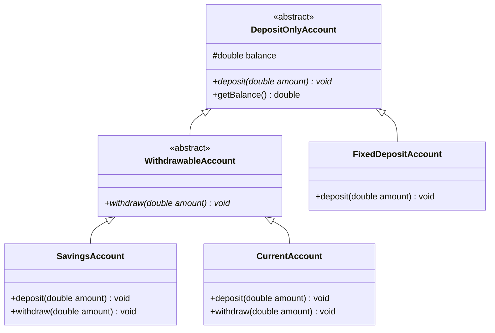

# 05. SOLID Design Principles — Part 1 (SRP, OCP, LSP)

> 💡 **Quick Revision Anchor**
> - **SRP (Single Responsibility Principle):** A class should have one, and only one, reason to change (e.g., separating Cart business logic from Invoice printing and Database persistence).
> - **OCP (Open/Closed Principle):** Classes should be open for extension but closed for modification, achieved by programming to interfaces (e.g., `CartPersistence` with SQL/Mongo/File implementations).
> - **LSP (Liskov Substitution Principle):** Subclasses must be completely substitutable for their base class without breaking client expectations, eliminating client-side `instanceof` checks (e.g., segregating `WithdrawableAccount` from `DepositOnlyAccount`).

---

## 1. Why SOLID Principles?

Without architectural principles, codebases gradually deteriorate into tightly coupled spaghetti code. Adding a minor feature causes regression bugs across unrelated modules.

Introduced by **Robert C. Martin ("Uncle Bob")**, SOLID principles guide object-oriented design toward modularity, maintainability, and extensibility:
- **S:** Single Responsibility Principle (SRP)
- **O:** Open/Closed Principle (OCP)
- **L:** Liskov Substitution Principle (LSP)
- **I:** Interface Segregation Principle (ISP) — *Covered in Part 2*
- **D:** Dependency Inversion Principle (DIP) — *Covered in Part 2*


---

## 2. Principle 1: Single Responsibility Principle (SRP)

> **"A class should have one, and only one, reason to change."**

### Problem: Monolithic ShoppingCart (SRP Violation)
A naive `ShoppingCart` class that handles products, prints invoices, and persists to a database:

```java
// ❌ VIOLATION: 3 reasons to change in one class!
class ShoppingCart {
    private List<Product> products = new ArrayList<>();

    public void addProduct(Product p) { products.add(p); }
    public double calculateTotal() { /* calculation logic */ return 0; }

    // Concern 2: Presentation & Formatting
    public void printInvoice() { System.out.println("Print invoice..."); }

    // Concern 3: Database Persistence
    public void saveToDatabase() { System.out.println("Save to MySQL..."); }
}
```

### Why Does It Become a Problem?
`ShoppingCart` has three completely unrelated reasons to change:
1. **Business rules change:** Tax or discount calculation formulas change.
2. **Formatting changes:** Marketing wants PDF or HTML receipts instead of console prints.
3. **Database technology changes:** Switching from MySQL to MongoDB or PostgreSQL.

### Refactoring to SRP
Decompose the monolithic class into three focused classes, each having exactly one responsibility:

```
┌────────────────────┐       ┌────────────────────┐       ┌────────────────────┐
│    ShoppingCart    │       │ CartInvoicePrinter │       │   CartDBStorage    │
├────────────────────┤       ├────────────────────┤       ├────────────────────┤
│ +addProduct()      │       │ +printInvoice()    │       │ +saveToDatabase()  │
│ +calculateTotal()  │       └─────────┬──────────┘       └─────────┬──────────┘
└─────────▲──────────┘                 │                            │
          └────────────────────────────┴────────────────────────────┘
```

---

## 3. Principle 2: Open/Closed Principle (OCP)

> **"Software entities should be OPEN for extension, but CLOSED for modification."**

### Problem: Modifying Existing Classes for New Features (OCP Violation)
Suppose the team wants to save carts to MongoDB and local files in addition to SQL. The naive developer modifies `CartDBStorage`:

```java
// ❌ VIOLATION: Mutating tested code for every new storage option
class CartDBStorage {
    public void saveToSQL() { /* SQL logic */ }
    public void saveToMongo() { /* Mongo logic */ } // MODIFIED
    public void saveToFile() { /* File logic */ }   // MODIFIED
}
```
Every new storage medium forces modification of existing, tested code, introducing regression risks and tight coupling.

### Refactoring to OCP: Polymorphic Abstraction
Define a stable interface contract (`CartPersistence`). New storage targets simply implement the interface without touching existing classes:



---

## 4. Principle 3: Liskov Substitution Principle (LSP)

> **"Objects of a superclass should be replaceable with objects of a subclass without altering the correctness of the program."**

### Problem: Bank Account Hierarchy (LSP Violation)
Consider a banking system where `Account` defines `deposit()` and `withdraw()`:

```java
// ❌ VIOLATION OF LSP
abstract class Account {
    public abstract void deposit(double amount);
    public abstract void withdraw(double amount);
}

class SavingsAccount extends Account {
    @Override public void deposit(double amount) { balance += amount; }
    @Override public void withdraw(double amount) { balance -= amount; }
}

class FixedDepositAccount extends Account {
    @Override public void deposit(double amount) { balance += amount; }

    @Override
    public void withdraw(double amount) {
        // Fixed deposits lock funds; cannot withdraw on demand!
        throw new UnsupportedOperationException("Withdrawals not allowed on FD!");
    }
}
```

### The Client Crash & The `instanceof` Anti-Pattern
When a client iterates through accounts polymorphically:
```java
for (Account acc : accounts) {
    acc.deposit(5000);
    acc.withdraw(1000); // 💥 CRASH on FixedDepositAccount!
}
```
Developers often "fix" this by adding `instanceof` checks:
```java
// ❌ Anti-pattern: violates OCP and LSP
for (Account acc : accounts) {
    acc.deposit(5000);
    if (!(acc instanceof FixedDepositAccount)) {
        acc.withdraw(1000);
    }
}
```
This breaks encapsulation and requires rewriting client loops whenever a new account type (e.g., `ProvidentFund`) is added.

### Refactoring to LSP: Segregated Hierarchy
The root flaw was forcing `withdraw()` onto accounts that do not support it. We segregate the hierarchy so subclasses never inherit methods they cannot honor:



---

## 5. Concise Java Implementation (All 3 Principles)

```java
import java.util.*;

// ==========================================
// 1. SRP: Domain, Presentation, Persistence
// ==========================================
class Product {
    private final String name;
    private final double price;

    public Product(String name, double price) {
        this.name = name;
        this.price = price;
    }
    public String getName() { return name; }
    public double getPrice() { return price; }
}

class ShoppingCart {
    private final List<Product> products = new ArrayList<>();

    public void addProduct(Product p) { products.add(p); }
    public List<Product> getProducts() { return products; }

    public double calculateTotal() {
        return products.stream().mapToDouble(Product::getPrice).sum();
    }
}

class CartInvoicePrinter {
    public void printInvoice(ShoppingCart cart) {
        System.out.println("--- Invoice ---");
        for (Product p : cart.getProducts()) {
            System.out.println(p.getName() + " : ₹" + p.getPrice());
        }
        System.out.println("Total: ₹" + cart.calculateTotal());
    }
}

// ==========================================
// 2. OCP: Pluggable Persistence Hierarchy
// ==========================================
interface CartPersistence {
    void save(ShoppingCart cart);
}

class SQLPersistence implements CartPersistence {
    @Override public void save(ShoppingCart cart) {
        System.out.println("[SQL] Saved cart with total ₹" + cart.calculateTotal());
    }
}

class MongoPersistence implements CartPersistence {
    @Override public void save(ShoppingCart cart) {
        System.out.println("[MongoDB] Persisted cart document.");
    }
}

// ==========================================
// 3. LSP: Bank Account Hierarchy
// ==========================================
abstract class DepositOnlyAccount {
    protected double balance;
    public DepositOnlyAccount(double initial) { this.balance = initial; }
    public abstract void deposit(double amount);
    public double getBalance() { return balance; }
}

abstract class WithdrawableAccount extends DepositOnlyAccount {
    public WithdrawableAccount(double initial) { super(initial); }
    public abstract void withdraw(double amount);
}

class SavingsAccount extends WithdrawableAccount {
    public SavingsAccount(double initial) { super(initial); }
    @Override public void deposit(double amount) { balance += amount; }
    @Override public void withdraw(double amount) { balance -= amount; }
}

class FixedDepositAccount extends DepositOnlyAccount {
    public FixedDepositAccount(double initial) { super(initial); }
    @Override public void deposit(double amount) { balance += amount; }
}

// ==========================================
// Driver Execution
// ==========================================
public class Main {
    public static void main(String[] args) {
        // SRP & OCP demo
        ShoppingCart cart = new ShoppingCart();
        cart.addProduct(new Product("Keyboard", 2500));
        new CartInvoicePrinter().printInvoice(cart);

        CartPersistence storage = new SQLPersistence();
        storage.save(cart);

        // LSP demo: Zero instanceof checks, zero unsupported operation exceptions
        List<WithdrawableAccount> withdrawable = List.of(new SavingsAccount(10000));
        for (WithdrawableAccount acc : withdrawable) {
            acc.deposit(2000);
            acc.withdraw(1500); // 100% safe
        }

        List<DepositOnlyAccount> depositOnly = List.of(new FixedDepositAccount(50000));
        for (DepositOnlyAccount acc : depositOnly) {
            acc.deposit(5000); // Only deposit exposed
        }
    }
}
```

---

## 6. Interview Questions & Key Discussion Points

1. **What is the code smell that indicates an LSP violation?**
   - *Answer*: Overridden subclass methods that throw `UnsupportedOperationException`, empty dummy method overrides, or client code using `instanceof` checks before invoking methods.
2. **Does SRP mean a class can only have one method?**
   - *Answer*: No. SRP means a class has only one *reason to change* (one responsibility). A `ShoppingCart` can have `addProduct()`, `removeProduct()`, and `calculateTotal()` because all three serve the single responsibility of managing cart contents.
3. **How does OCP relate to polymorphism?**
   - *Answer*: OCP is typically achieved through polymorphic abstractions (interfaces or abstract classes). New features are introduced by creating new subclasses that implement the abstraction, keeping callers unmodified.

---

## 7. Quick Revision

### Core Idea
- **SRP:** One reason to change per class (Separate Cart logic from Printer and DB).
- **OCP:** Open for extension, closed for modification (Use interfaces like `CartPersistence`).
- **LSP:** Subtypes must be substitutable for supertypes without breaking client contracts (Segregate `WithdrawableAccount` from `DepositOnlyAccount`).
