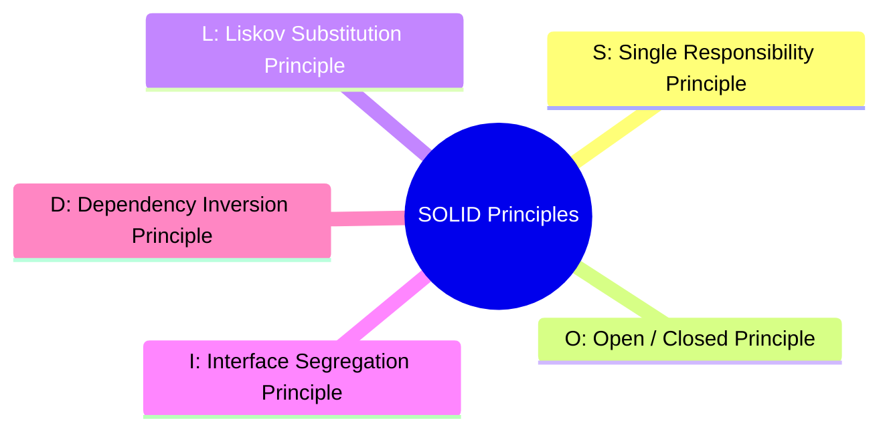
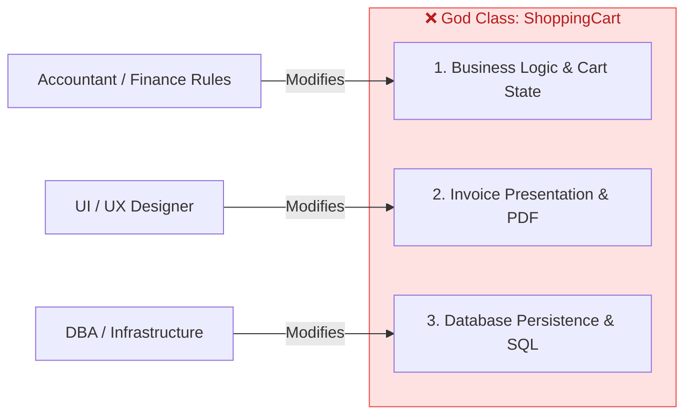
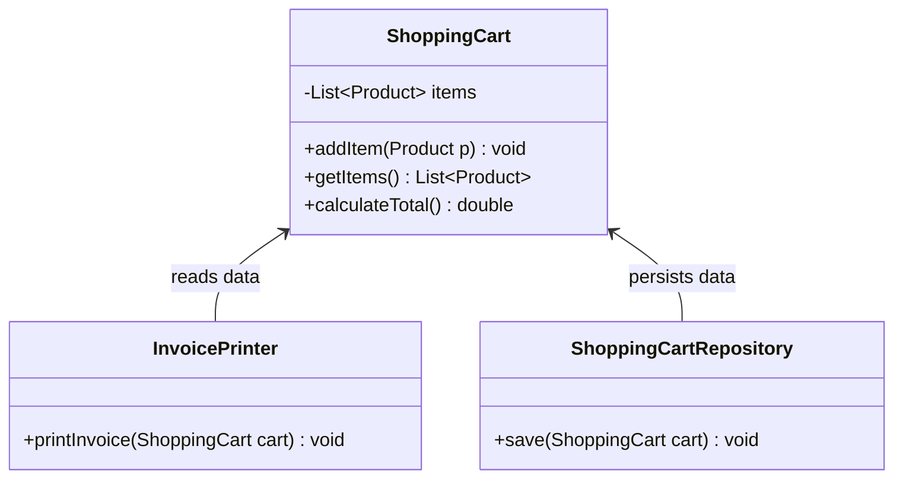
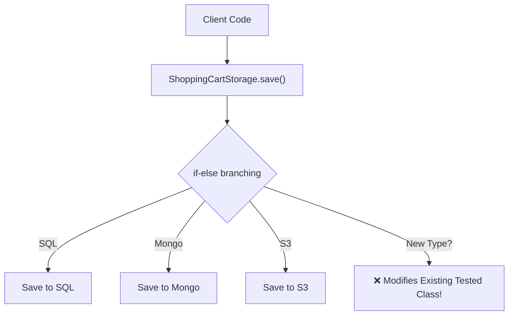
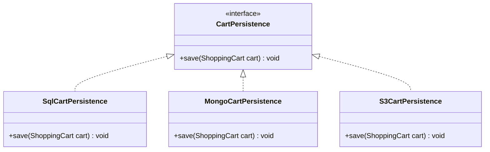

# 05. SOLID Design Principles — Part 1: SRP & OCP

> 💡 **Quick Revision Anchor**: `SRP (Single Reason to Change), OCP (Open for Extension, Closed for Modification)`

---

## 1. What are the SOLID Principles?

Introduced by Robert C. Martin (Uncle Bob), **SOLID** is an acronym for five foundational design principles for writing maintainable, understandable, and flexible software in Object-Oriented Design.



---

## 2. Single Responsibility Principle (SRP)

> **Formal Definition**: *"A class should have one, and only one, reason to change."*

Every software module or class should be responsible for **a single part of the functionality**, and that responsibility should be entirely encapsulated by the class.

### The Anti-Pattern (God Class)
Consider a `ShoppingCart` class:
```java
// ❌ VIOLATION OF SRP: 3 distinct reasons to change!
public class ShoppingCart {
    private List<Product> items = new ArrayList<>();

    public void addItem(Product product) { items.add(product); }
    
    // Reason 1 to change: Pricing logic, taxes, or discounts change
    public double calculateTotal() {
        return items.stream().mapToDouble(Product::getPrice).sum();
    }

    // Reason 2 to change: Invoice layout, HTML/PDF rendering format changes
    public void printInvoice() {
        System.out.println("--- INVOICE ---");
        for (Product item : items) {
            System.out.println(item.getName() + ": $" + item.getPrice());
        }
        System.out.println("Total: $" + calculateTotal());
    }

    // Reason 3 to change: Database schema, switching from MySQL to MongoDB changes
    public void saveToDatabase() {
        System.out.println("Executing SQL INSERT INTO orders ...");
    }
}
```



### The Clean Solution (Applying SRP)
Decompose into three dedicated classes, each having exactly **one reason to change**:



```java
// ✅ 1. Pure Business Entity & State
public class ShoppingCart {
    private final List<Product> items = new ArrayList<>();

    public void addItem(Product product) { items.add(product); }
    public List<Product> getItems() { return Collections.unmodifiableList(items); }

    public double calculateTotal() {
        return items.stream().mapToDouble(Product::getPrice).sum();
    }
}

// ✅ 2. Pure Presentation Layer
public class InvoicePrinter {
    public void printInvoice(ShoppingCart cart) {
        System.out.println("--- OFFICIAL TAX INVOICE ---");
        for (Product item : cart.getItems()) {
            System.out.println(item.getName() + ": $" + item.getPrice());
        }
        System.out.println("Total Amount: $" + cart.calculateTotal());
    }
}

// ✅ 3. Pure Persistence Layer
public class ShoppingCartRepository {
    public void save(ShoppingCart cart) {
        System.out.println("Persisting cart to SQL Database...");
    }
}
```

---

## 3. Open/Closed Principle (OCP)

> **Formal Definition**: *"Software entities (classes, modules, functions) should be open for extension, but closed for modification."*

- **Open for Extension**: You should be able to extend the behavior of a module when requirements change.
- **Closed for Modification**: Extending the module should **never require modifying existing, tested source code**.

### The Anti-Pattern (Modification Madness)
Suppose your application now needs to save carts to **MongoDB** and **Cloud Storage (AWS S3)** in addition to SQL:

```java
// ❌ VIOLATION OF OCP: Modifying existing tested class for every new storage option!
public class ShoppingCartStorage {
    public void save(ShoppingCart cart, String storageType) {
        if (storageType.equalsIgnoreCase("SQL")) {
            System.out.println("Saving to MySQL...");
        } else if (storageType.equalsIgnoreCase("MONGO")) {
            System.out.println("Saving to MongoDB...");
        } else if (storageType.equalsIgnoreCase("S3_FILE")) {
            System.out.println("Saving JSON to AWS S3 bucket...");
        }
        // Adding Redis or DynamoDB requires modifying this file again and re-testing!
    }
}
```



### The Clean Solution (Abstraction & Polymorphism)
Introduce a persistence abstraction. Each storage mechanism implements this contract independently:



```java
// ✅ Step 1: Define the Abstraction
public interface CartPersistence {
    void save(ShoppingCart cart);
}

// ✅ Step 2: Implementations are Open for Extension
public class SqlCartPersistence implements CartPersistence {
    @Override
    public void save(ShoppingCart cart) {
        System.out.println("Saving cart items to PostgreSQL relational tables.");
    }
}

public class MongoCartPersistence implements CartPersistence {
    @Override
    public void save(ShoppingCart cart) {
        System.out.println("Inserting cart BSON document into MongoDB collection.");
    }
}

public class S3CartPersistence implements CartPersistence {
    @Override
    public void save(ShoppingCart cart) {
        System.out.println("Uploading compressed cart JSON payload to AWS S3 bucket.");
    }
}
```

### Adding a new storage engine (e.g., Redis):
```java
// ✅ ZERO modifications to existing classes!
public class RedisCartPersistence implements CartPersistence {
    @Override
    public void save(ShoppingCart cart) {
        System.out.println("Caching cart with TTL in Redis cluster.");
    }
}
```

---

## 4. Summary: SRP & OCP Checklist

| Principle | Core Question | What to Avoid | How to Achieve |
| :--- | :--- | :--- | :--- |
| **SRP** | Does this class do more than one job? | Monolithic classes combining business logic, presentation, and DB persistence. | Split into distinct, single-purpose classes. |
| **OCP** | Do I have to touch existing `.java` files to add a new variant? | Giant `switch` or `if-else` blocks checking types or formats. | Program to interfaces and leverage polymorphism. |
