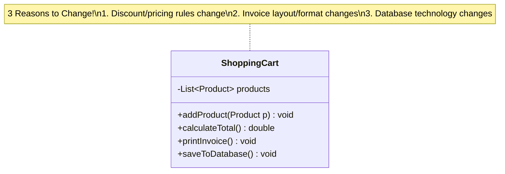
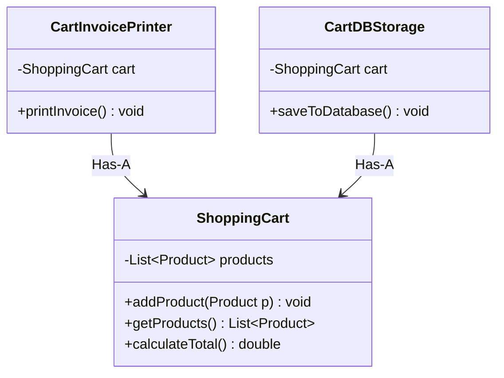
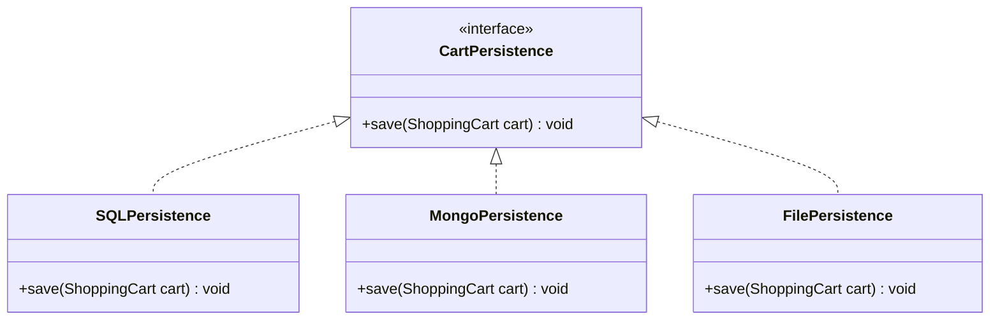
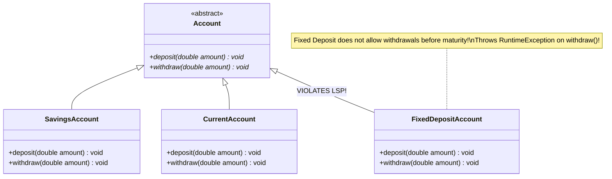
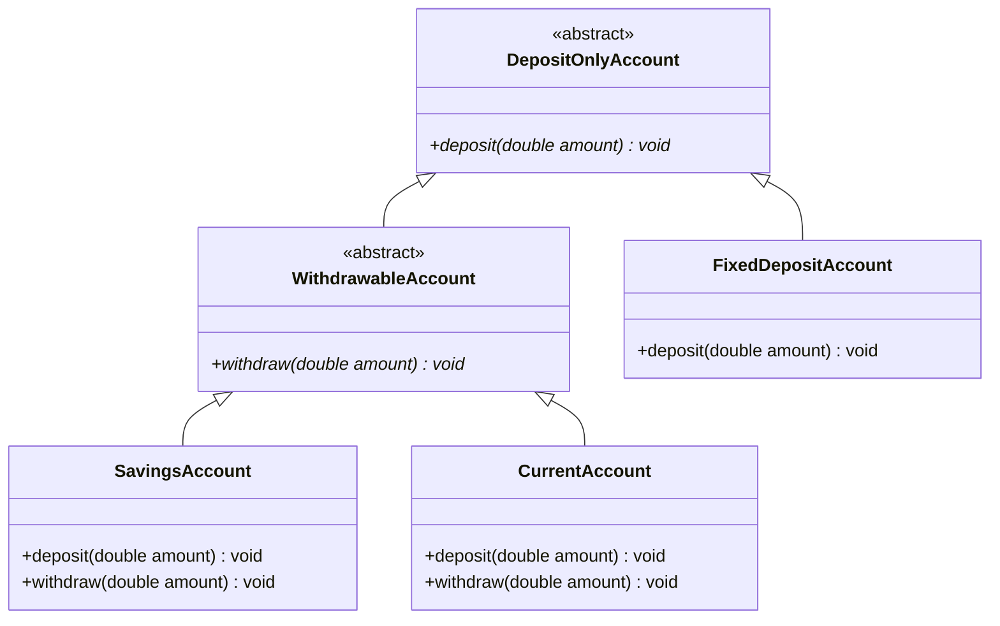

# 05. SOLID Design Principles — Part 1 (SRP, OCP, LSP)

> 💡 **Quick Revision Anchor**: A comprehensive, interview-ready examination of the first three SOLID principles introduced by Robert C. Martin ("Uncle Bob") in 2000, faithfully derived from the complete lecture transcript. Explores **Single Responsibility Principle (SRP)** through the architectural decomposition of a monolithic **ShoppingCart** (separating cart calculations, invoice printing, and persistence), **Open/Closed Principle (OCP)** through interface-driven **CartPersistence (SQL, Mongo, File)**, and **Liskov Substitution Principle (LSP)** through the canonical **Bank Account Hierarchy (Savings, Current, FixedDeposit)**, demonstrating why client-side `instanceof` checks represent catastrophic architectural anti-patterns.

---

## 1. Why SOLID Principles?

Without disciplined architectural guidelines, production codebases deteriorate over time into **spaghetti code** plagued by:
1. **Maintainability Issues**: Adding a simple feature requires modifying dozens of unrelated files, introducing hidden regression bugs.
2. **Readability Collapse**: Complex, tightly coupled classes with high cognitive load that take weeks for new engineers to understand.
3. **Rigidity & Fragility**: A change in the database layer unexpectedly breaks invoice generation or checkout logic.

In 2000, computer scientist **Robert C. Martin ("Uncle Bob")** published the SOLID design principles to eliminate these vulnerabilities.

```text
    S ──> Single Responsibility Principle (SRP)
    O ──> Open/Closed Principle (OCP)
    L ──> Liskov Substitution Principle (LSP)          [Covered in Part 1]
    ──────────────────────────────────────────────────────────────────────
    I ──> Interface Segregation Principle (ISP)        [Covered in Part 2]
    D ──> Dependency Inversion Principle (DIP)
```

---

## 2. Principle 1: Single Responsibility Principle (SRP)

> **"A class should have one, and only one, reason to change."**

A class must focus strictly on a single concern. If a class has multiple reasons to change, it is overloaded with responsibilities and must be broken down.

---

### The Naive Monolithic Design (SRP Violation)

Consider an e-commerce `ShoppingCart` class designed naively:



```java
// VIOLATION OF SRP
class ShoppingCart {
    private List<Product> products = new ArrayList<>();

    public void addProduct(Product p) { products.add(p); }

    // Responsibility 1: Business Logic
    public double calculateTotal() {
        double total = 0;
        for (Product p : products) total += p.getPrice();
        return total;
    }

    // Responsibility 2: Presentation & Formatting Logic
    public void printInvoice() {
        System.out.println("=== Invoice ===");
        for (Product p : products) {
            System.out.println(p.getName() + " : ₹" + p.getPrice());
        }
        System.out.println("Total: ₹" + calculateTotal());
    }

    // Responsibility 3: Database Persistence Logic
    public void saveToDatabase() {
        System.out.println("Connecting to MySQL... INSERT INTO cart_items...");
    }
}
```

### Why This Fails:
`ShoppingCart` has **three distinct reasons to change**:
1. **Business Rules**: Changing how discounts or taxes are computed forces a change in `ShoppingCart`.
2. **Presentation Format**: Marketing wants invoices printed in HTML/PDF rather than console text $\to$ forces a change in `ShoppingCart`.
3. **Storage Engine**: Migration from MySQL to MongoDB or PostgreSQL $\to$ forces a change in `ShoppingCart`.

---

### Refactoring to Adhere to SRP

We decompose the monolithic class into three dedicated, single-responsibility classes:



```java
// 1. Core Domain Entity: Sole reason to change = Cart item management & calculation
class ShoppingCart {
    private final List<Product> products = new ArrayList<>();

    public void addProduct(Product p) { products.add(p); }
    public List<Product> getProducts() { return Collections.unmodifiableList(products); }

    public double calculateTotal() {
        double total = 0;
        for (Product p : products) total += p.getPrice();
        return total;
    }
}

// 2. Presentation Layer: Sole reason to change = Invoice template/format modifications
class CartInvoicePrinter {
    private final ShoppingCart cart;

    public CartInvoicePrinter(ShoppingCart cart) {
        this.cart = cart;
    }

    public void printInvoice() {
        System.out.println("--- OFFICIAL TAX INVOICE ---");
        for (Product p : cart.getProducts()) {
            System.out.printf("• %s : ₹%.2f\n", p.getName(), p.getPrice());
        }
        System.out.printf("Net Total: ₹%.2f\n", cart.calculateTotal());
        System.out.println("----------------------------");
    }
}

// 3. Persistence Layer: Sole reason to change = Storage mechanism changes
class CartDBStorage {
    private final ShoppingCart cart;

    public CartDBStorage(ShoppingCart cart) {
        this.cart = cart;
    }

    public void saveToDatabase() {
        System.out.println("[DB Persistence] Successfully saved Cart with "
                + cart.getProducts().size() + " items to SQL DB.");
    }
}
```

---

## 3. Principle 2: Open/Closed Principle (OCP)

> **"Software entities (classes, modules, functions) should be OPEN for extension, but CLOSED for modification."**

You should be able to introduce new behavior or features by **adding new code**, not by altering existing, tested code.

---

### The Naive Modification Approach (OCP Violation)

Suppose business requirements demand saving cart data not just to SQL, but also to **MongoDB** and to local **Flat Files**.

The naive developer opens `CartDBStorage` and adds new methods:

```java
// VIOLATION OF OCP
class CartDBStorage {
    public void saveToSQL() { /* SQL logic */ }
    public void saveToMongo() { /* Mongo logic */ }   // NEW MODIFICATION!
    public void saveToFile() { /* File logic */ }     // NEW MODIFICATION!
}
```

### Why This Fails:
- Every time a new storage medium (Redis, S3, Cassandra) is introduced, the developer must reopen and mutate `CartDBStorage`.
- Modifying tested production code risks breaking existing SQL persistence.
- Tightly couples the persistence class to every concrete storage technology.

---

### Refactoring to Adhere to OCP: Abstraction & Polymorphism

We define a stable interface contract (`CartPersistence`). New storage targets implement this contract as new, independent classes.



```java
// Stable Interface Contract: Closed for modification
interface CartPersistence {
    void save(ShoppingCart cart);
}

// Extension 1: SQL Storage
class SQLPersistence implements CartPersistence {
    @Override
    public void save(ShoppingCart cart) {
        System.out.printf("[SQL Persistence] Persisted %d items (Total ₹%.2f) to MySQL.\n",
                cart.getProducts().size(), cart.calculateTotal());
    }
}

// Extension 2: MongoDB Storage (Added WITHOUT touching SQLPersistence!)
class MongoPersistence implements CartPersistence {
    @Override
    public void save(ShoppingCart cart) {
        System.out.printf("[MongoDB] Persisted JSON Document for %d items into 'carts' collection.\n",
                cart.getProducts().size());
    }
}

// Extension 3: File Storage
class FilePersistence implements CartPersistence {
    @Override
    public void save(ShoppingCart cart) {
        System.out.printf("[File Storage] Appended cart receipt to /var/log/carts.txt\n");
    }
}
```
If tomorrow the team wants `RedisPersistence`, they simply write a new class `class RedisPersistence implements CartPersistence`. Zero existing classes are modified!

---

## 4. Principle 3: Liskov Substitution Principle (LSP)

> **"If $S$ is a subtype of $T$, then objects of type $T$ may be replaced with objects of type $S$ without altering any of the desirable properties of the program (correctness, task performed, etc.)."**
>
> *In plain English*: **A derived subclass must be completely substitutable for its base class without breaking client expectations or throwing unexpected exceptions.** Subclasses should extend base class capabilities, never contract or violate base class invariants.

---

### The Classic Bank Account Problem (LSP Violation)

Consider a banking system with `SavingsAccount`, `CurrentAccount`, and `FixedDepositAccount`:



```java
// VIOLATION OF LSP
abstract class Account {
    public abstract void deposit(double amount);
    public abstract void withdraw(double amount);
}

class SavingsAccount extends Account {
    private double balance = 0;
    @Override public void deposit(double amount) { balance += amount; }
    @Override public void withdraw(double amount) { balance -= amount; }
}

class FixedDepositAccount extends Account {
    private double balance = 0;
    @Override public void deposit(double amount) { balance += amount; }

    @Override
    public void withdraw(double amount) {
        // Fixed deposits lock funds! Cannot withdraw on demand!
        throw new UnsupportedOperationException("Withdrawals not allowed on Fixed Deposit Account!");
    }
}
```

### The Client Crash:
When a client processes accounts polymorphically:
```java
List<Account> accounts = List.of(new SavingsAccount(), new FixedDepositAccount());
for (Account acc : accounts) {
    acc.deposit(5000);
    acc.withdraw(1000); // CRASH! Throws UnsupportedOperationException on FixedDeposit!
}
```

---

### The Bad Fix: Client-Side Type Checking (Anti-Pattern)

Developers often attempt to patch this by adding `instanceof` checks:

```java
// ANTI-PATTERN: Client now tightly coupled to concrete account types!
for (Account acc : accounts) {
    acc.deposit(5000);
    if (!(acc instanceof FixedDepositAccount)) { // VIOLATES OCP & LSP!
        acc.withdraw(1000);
    }
}
```
This is an architectural failure. The client now needs to know the exact internal constraints of every subclass. If tomorrow we add `PublicProvidentFundAccount`, we must update every `if-else` block in the client!

---

### The Proper Refactoring to Adhere to LSP: Hierarchy Segregation

The root flaw was forcing `withdraw()` into the base class when not all accounts support withdrawals. We segregate the hierarchy:



```java
// 1. Base abstraction for any account that accepts deposits
abstract class DepositOnlyAccount {
    protected double balance;

    public DepositOnlyAccount(double initialBalance) {
        this.balance = initialBalance;
    }

    public abstract void deposit(double amount);
    public double getBalance() { return balance; }
}

// 2. Sub-abstraction specifically for accounts supporting withdrawals
abstract class WithdrawableAccount extends DepositOnlyAccount {
    public WithdrawableAccount(double initialBalance) {
        super(initialBalance);
    }

    public abstract void withdraw(double amount);
}

// 3. Savings Account inherits Withdrawable
class SavingsAccount extends WithdrawableAccount {
    public SavingsAccount(double initialBalance) { super(initialBalance); }

    @Override
    public void deposit(double amount) {
        balance += amount;
        System.out.printf("[Savings] Deposited ₹%.2f. New Balance: ₹%.2f\n", amount, balance);
    }

    @Override
    public void withdraw(double amount) {
        if (balance >= amount) {
            balance -= amount;
            System.out.printf("[Savings] Withdrew ₹%.2f. Remaining: ₹%.2f\n", amount, balance);
        } else {
            System.out.println("[Savings] Insufficient funds!");
        }
    }
}

// 4. Current Account inherits Withdrawable
class CurrentAccount extends WithdrawableAccount {
    public CurrentAccount(double initialBalance) { super(initialBalance); }

    @Override
    public void deposit(double amount) {
        balance += amount;
        System.out.printf("[Current] Deposited ₹%.2f. New Balance: ₹%.2f\n", amount, balance);
    }

    @Override
    public void withdraw(double amount) {
        balance -= amount; // Current accounts may allow overdraft
        System.out.printf("[Current] Withdrew ₹%.2f. Balance: ₹%.2f\n", amount, balance);
    }
}

// 5. Fixed Deposit inherits directly from DepositOnlyAccount!
class FixedDepositAccount extends DepositOnlyAccount {
    public FixedDepositAccount(double initialBalance) { super(initialBalance); }

    @Override
    public void deposit(double amount) {
        balance += amount;
        System.out.printf("[Fixed Deposit] Deposited ₹%.2f into lock-in. Total: ₹%.2f\n", amount, balance);
    }
}
```

### The Clean Client Execution (100% LSP Compliant)
Clients that require withdrawals accept `WithdrawableAccount`. Clients that only need deposits accept `DepositOnlyAccount`. **Zero runtime exceptions, zero `instanceof` checks!**

```java
class BankingClient {
    public static void processWithdrawable(List<WithdrawableAccount> accounts, double depAmount, double withAmount) {
        for (WithdrawableAccount acc : accounts) {
            acc.deposit(depAmount);
            acc.withdraw(withAmount); // Guaranteed to succeed on all subtypes!
        }
    }

    public static void processDepositOnly(List<DepositOnlyAccount> accounts, double depAmount) {
        for (DepositOnlyAccount acc : accounts) {
            acc.deposit(depAmount);
        }
    }
}
```

---

## 5. Complete Java Driver & Verification

```java
class Product {
    private final String name;
    private final double price;

    public Product(String name, double price) {
        this.name = name;
        this.price = price;
    }

    public String getName() { return name; }
    public double getPrice() { return price; }
}

public class Main {
    public static void main(String[] args) {
        System.out.println("=== 1. SRP & OCP Verification ===");
        ShoppingCart cart = new ShoppingCart();
        cart.addProduct(new Product("Mechanical Keyboard", 4500.0));
        cart.addProduct(new Product("Wireless Mouse", 1800.0));

        // SRP: Invoice generation
        CartInvoicePrinter printer = new CartInvoicePrinter(cart);
        printer.printInvoice();

        // OCP: Storage extension via polymorphic persistence
        CartPersistence sqlStorage = new SQLPersistence();
        CartPersistence mongoStorage = new MongoPersistence();
        sqlStorage.save(cart);
        mongoStorage.save(cart);

        System.out.println("\n=== 2. LSP Verification ===");
        List<WithdrawableAccount> withdrawableAccounts = List.of(
                new SavingsAccount(10000.0),
                new CurrentAccount(25000.0)
        );
        List<DepositOnlyAccount> depositOnlyAccounts = List.of(
                new FixedDepositAccount(50000.0)
        );

        System.out.println("Processing Withdrawable Accounts:");
        BankingClient.processWithdrawable(withdrawableAccounts, 2000.0, 5000.0);

        System.out.println("\nProcessing Deposit-Only Accounts:");
        BankingClient.processDepositOnly(depositOnlyAccounts, 10000.0);
    }
}
```

---

## 6. Execution Trace

```text
=== 1. SRP & OCP Verification ===
--- OFFICIAL TAX INVOICE ---
• Mechanical Keyboard : ₹4500.00
• Wireless Mouse : ₹1800.00
Net Total: ₹6300.00
----------------------------
[SQL Persistence] Persisted 2 items (Total ₹6300.00) to MySQL.
[MongoDB] Persisted JSON Document for 2 items into 'carts' collection.

=== 2. LSP Verification ===
Processing Withdrawable Accounts:
[Savings] Deposited ₹2000.00. New Balance: ₹12000.00
[Savings] Withdrew ₹5000.00. Remaining: ₹7000.00
[Current] Deposited ₹2000.00. New Balance: ₹27000.00
[Current] Withdrew ₹5000.00. Balance: ₹22000.00

Processing Deposit-Only Accounts:
[Fixed Deposit] Deposited ₹10000.00 into lock-in. Total: ₹60000.00
```

---

## Quick Revision

### Core Idea
SOLID principles prevent code rot. **SRP** mandates that a class has only one reason to change, isolating business logic, presentation, and persistence. **OCP** enforces that software entities be open for extension via interfaces but closed for modification. **LSP** guarantees that derived subclasses are seamlessly substitutable for their parent classes without throwing unexpected exceptions or forcing client-side `instanceof` checks.

### Remember
* Historical context: Introduced by Robert C. Martin ("Uncle Bob") in 2000.
* Canonical SRP Example: `ShoppingCart` was split into `ShoppingCart` (items/total), `CartInvoicePrinter` (invoice formatting), and `CartDBStorage` (database persistence).
* Canonical OCP Example: Instead of adding `saveToMongo()` and `saveToFile()` inside `CartDBStorage`, an interface `CartPersistence` was created with polymorphic implementations.
* Canonical LSP Example: `FixedDepositAccount` cannot support `withdraw()`. Forcing it to throw an exception breaks LSP. Segregating into `DepositOnlyAccount` and `WithdrawableAccount` preserves substitutability.

### Java Implementation Idea
* Identify methods that serve different actors/concerns in a class and extract them into separate classes (SRP).
* Program to interfaces (`CartPersistence persistence`) rather than concrete classes (`SQLPersistence`) to allow runtime extension without modifying callers (OCP).
* Never throw `UnsupportedOperationException` in an overridden method; segregate the base class hierarchy instead (LSP).

### Most Important Interview Point
* Whenever you see `instanceof` checks in client code (`if (account instanceof FixedDepositAccount)`), call it out immediately as a dual violation of **OCP** (client must be modified for new types) and **LSP** (subtypes cannot be substituted transparently).

### Common Trap
* Thinking SRP means "a class should have only one method". (SRP means a class has only one *responsibility/reason to change*; a shopping cart can have multiple methods like `add`, `remove`, `calculateTotal` as long as they all serve cart management).
* Believing LSP is just about compiler-level inheritance. (LSP is about **behavioral compatibility**; code that compiles fine can still catastrophically violate LSP at runtime if a child breaks base class contracts).
