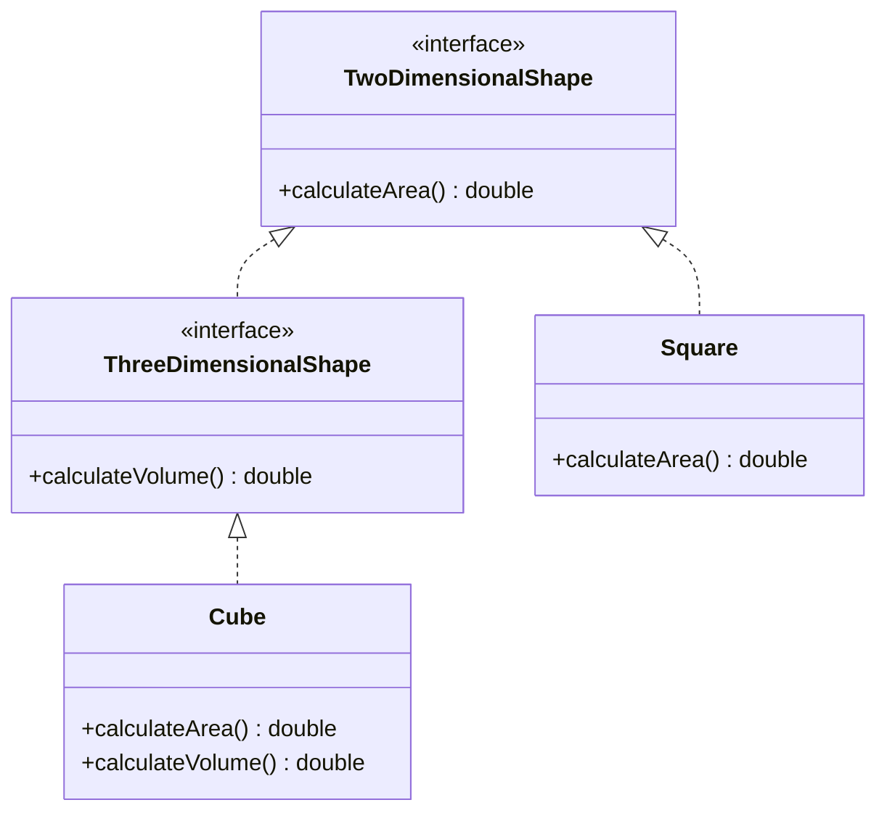

# 06. SOLID Design Principles — Part 2: LSP Deep Dive, ISP & DIP

> 💡 **Quick Revision Anchor**
> - **LSP Deep Dive:** Formal rules ensuring subclasses are true substitutes: Signature Rules (covariant return, narrower exceptions), Property Rules (preserve class invariants & history constraints), and Method Rules (never strengthen preconditions, never weaken postconditions).
> - **ISP (Interface Segregation Principle):** "Many client-specific interfaces are better than one general-purpose interface" — avoid forcing classes to implement dummy methods (e.g., 2D Shapes vs 3D Shapes).
> - **DIP (Dependency Inversion Principle):** High-level modules (`UserService`) and low-level modules (`MySQL`, `MongoDB`) should both depend on abstractions (`DatabasePersistence`), resolved via Dependency Injection.

---

## 1. Liskov Substitution Principle (LSP): The 3 Rule Sets

Barbara Liskov and Jeannette Wing established formal subtyping rules to prevent subtle runtime bugs where code compiles but breaks at runtime.

```text
               ┌─────────────────────────────────────────────────────┐
               │              LSP Subtyping Guidelines               │
               └──────────────────────────┬──────────────────────────┘
                                          │
         ┌────────────────────────────────┼────────────────────────────────┐
         ▼                                ▼                                ▼
┌─────────────────┐              ┌─────────────────┐              ┌─────────────────┐
│ Signature Rules │              │ Property Rules  │              │  Method Rules   │
├─────────────────┤              ├─────────────────┤              ├─────────────────┤
│ • Arguments     │              │ • Class         │              │ • Preconditions │
│ • Return Types  │              │   Invariants    │              │   (Cannot       │
│ • Exceptions    │              │ • History       │              │    strengthen)  │
│                 │              │   Constraints   │              │ • Postconditions│
│                 │              │                 │              │   (Cannot       │
│                 │              │                 │              │    weaken)      │
└─────────────────┘              └─────────────────┘              └─────────────────┘
```

### A. Signature Rules
1. **Argument Rule:** Subclass method parameters must be identical or broader (contravariant).
2. **Return Type Rule (Covariance):** Subclass return types can be narrower (more specific) than parent return types (e.g., parent returns `Animal`, child returns `Dog`).
3. **Exception Rule:** Subclasses cannot throw new, broader, or unrelated checked exceptions that the caller cannot catch.

### B. Property Rules
1. **Class Invariant Rule:** Conditions that must remain unconditionally true for all valid object states must not be broken by the child (e.g., bank balance must never be negative).
2. **History Constraint Rule:** Subclasses cannot mutate or revoke capabilities that parent contracts guaranteed as permanently valid (e.g., an account that promised instant withdrawal cannot later disable it).

### C. Method Rules
1. **Precondition Rule:** Conditions required *before* method execution. A subclass **cannot strengthen** preconditions (e.g., if parent requires password length $\ge 8$, child cannot reject passwords under 12). Subclasses may weaken preconditions.
2. **Postcondition Rule:** Guarantees that hold *after* method execution. A subclass **cannot weaken** postconditions (e.g., if parent `brake()` guarantees speed reduction, child cannot fail to reduce speed).

---

## 2. Principle 4: Interface Segregation Principle (ISP)

> **"Clients should never be forced to depend upon interfaces that they do not use."**

### Problem: The Fat Shape Interface (ISP Violation)
```java
// ❌ VIOLATION: 2D shapes forced to implement 3D volume
interface Shape {
    double calculateArea();
    double calculateVolume(); // Makes no sense for Square or Rectangle!
}

class Square implements Shape {
    private double side;
    @Override public double calculateArea() { return side * side; }
    @Override public double calculateVolume() {
        throw new UnsupportedOperationException("Square has no volume!"); // Code smell!
    }
}
```

### Refactoring to ISP
Segregate into focused, role-specific interfaces:


---

## 3. Principle 5: Dependency Inversion Principle (DIP)

> **"1. High-level modules should not depend on low-level modules. Both should depend on abstractions."**  
> **"2. Abstractions should not depend on details. Details should depend on abstractions."**

### Problem: Direct Coupling to Storage Drivers (DIP Violation)
```java
// ❌ VIOLATION: High-level UserService directly instantiates concrete low-level drivers
class UserService {
    private MySQLDatabase mySQL = new MySQLDatabase(); // Tight coupling!

    public void saveUser(String user) {
        mySQL.insert(user);
    }
}
```
If we switch to MongoDB, `UserService` must be modified, breaking the Open/Closed Principle.

### The Real-World Analogy: CEO, Manager, and Developers
In a company:
- The **CEO** (High-Level Policy) does not directly manage individual **Developers** (Low-Level Execution).
- Instead, both interact through a common abstraction: **Engineering Management**.
- If developer team members rotate or change technologies, the CEO's interface remains stable.

```text
High-Level Module (UserService) ──▶ Depends on Abstraction (DatabasePersistence)
                                                   ▲
                                                   │
Low-Level Modules (MySQL, MongoDB) ────────────────┘ (Implement Abstraction)
```

---

## 4. Concise Java Implementation (ISP & DIP)

```java
// ==========================================
// 1. ISP: Segregated Interfaces
// ==========================================
interface TwoDimensionalShape {
    double calculateArea();
}

interface ThreeDimensionalShape extends TwoDimensionalShape {
    double calculateVolume();
}

class Square implements TwoDimensionalShape {
    private final double side;
    public Square(double side) { this.side = side; }
    @Override public double calculateArea() { return side * side; }
}

class Cube implements ThreeDimensionalShape {
    private final double side;
    public Cube(double side) { this.side = side; }
    @Override public double calculateArea() { return 6 * side * side; }
    @Override public double calculateVolume() { return side * side * side; }
}

// ==========================================
// 2. DIP: Decoupled High & Low-Level Modules
// ==========================================

// Abstraction
interface DatabasePersistence {
    void save(String data);
}

// Low-Level Driver 1: MySQL
class MySQLPersistence implements DatabasePersistence {
    @Override public void save(String data) {
        System.out.println("[MySQL] Saved: " + data);
    }
}

// Low-Level Driver 2: MongoDB
class MongoPersistence implements DatabasePersistence {
    @Override public void save(String data) {
        System.out.println("[MongoDB] Saved: " + data);
    }
}

// High-Level Business Module
class UserService {
    private final DatabasePersistence persistence;

    // Constructor Dependency Injection (DIP)
    public UserService(DatabasePersistence persistence) {
        this.persistence = persistence;
    }

    public void registerUser(String username) {
        System.out.println("Processing user registration: " + username);
        persistence.save(username); // Delegated polymorphically
    }
}

// Driver Execution
public class Main {
    public static void main(String[] args) {
        // ISP Demo
        TwoDimensionalShape square = new Square(4);
        ThreeDimensionalShape cube = new Cube(3);
        System.out.println("Square Area: " + square.calculateArea());
        System.out.println("Cube Volume: " + cube.calculateVolume());

        // DIP Demo: Inject different storage drivers without modifying UserService
        UserService serviceWithMySQL = new UserService(new MySQLPersistence());
        serviceWithMySQL.registerUser("alice");

        UserService serviceWithMongo = new UserService(new MongoPersistence());
        serviceWithMongo.registerUser("bob");
    }
}
```

---

## 5. Engineering Pragmatism: Principles vs Laws

An essential takeaway from the lecture:
- **Principles are not immutable laws:** In DSA, you trade time complexity for space complexity. In LLD, adhering strictly to 100% of SOLID principles everywhere can cause over-engineering (dozens of tiny interfaces and wrapper classes).
- **Contextual Modeling (Ola vs Swiggy):** An entity model that fits a ride-hailing app (e.g., driver location tracking every second) may be completely inappropriate for food delivery or e-commerce. Always model according to domain context.
- **The Golden Rule:** Follow SOLID to ensure maintainability, testability, and decoupling, but balance design purity with project deadlines and architectural simplicity.

---

## 6. Interview Questions & Key Discussion Points

1. **How does DIP differ from Dependency Injection (DI) and Inversion of Control (IoC)?**
   - *Answer*: DIP is the high-level design principle stating that high-level modules should depend on abstractions. IoC is the broader design pattern where framework code controls execution flow. DI is the specific implementation mechanism (e.g., constructor injection) used to deliver dependencies to a class.
2. **What is the connection between OCP and DIP?**
   - *Answer*: *"If OCP is the target, DIP is the solution."* To keep a class open for extension without modification, high-level code must depend on an abstraction rather than concrete implementations.
3. **What are the three categories of LSP rules?**
   - *Answer*: Signature Rules (arguments, covariance in return types, narrower exceptions), Property Rules (preserving class invariants and history constraints), and Method Rules (cannot strengthen preconditions, cannot weaken postconditions).

---

## 7. Quick Revision

### Core Idea
- **LSP:** Subclasses must be true substitutes without breaking parent contracts or class invariants.
- **ISP:** Keep interfaces focused on specific client needs; avoid forcing classes to implement dummy methods.
- **DIP:** Invert dependencies so high-level business logic and low-level storage drivers both depend on abstractions.
