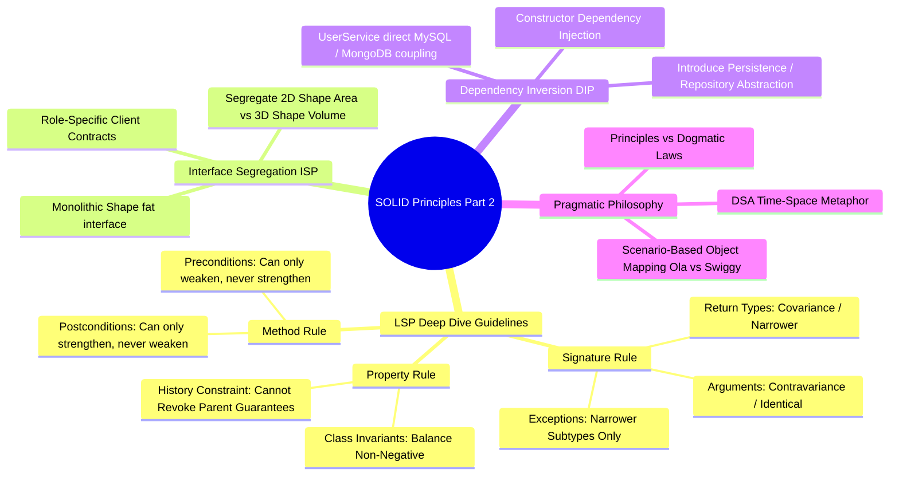
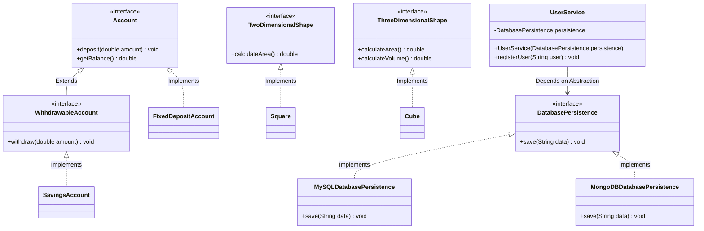

# 06. SOLID Design Principles — Part 2: LSP Deep Dive, ISP & DIP

## 1. Overview

Part 2 of the SOLID design principles completes the foundation of object-oriented design:
- **Liskov Substitution Principle (LSP) Deep Dive**: Exploring the 3 foundational rule sets (Signature Rules, Property Rules, and Method Rules) that ensure child classes remain true, crash-free substitutes for their parent abstractions.
- **Interface Segregation Principle (ISP)**: Why many client-specific interfaces are vastly superior to one monolithic general-purpose interface.
- **Dependency Inversion Principle (DIP)**: Inverting direct structural coupling so high-level business policies and low-level storage drivers both depend on abstractions.
- **Pragmatic Engineering Reality**: Why SOLID guidelines are *design principles* rather than dogmatic *laws*, balancing code purity against business deadlines and system trade-offs.



---

## 2. What Problem Are We Solving?

1. **Hidden Liskov Landmines**: Subtypes compile without errors, but at runtime throw unhandled exceptions (`RuntimeError`, `UnsupportedOperationException`), violate class invariants (negative bank balance), or reject valid inputs because child preconditions were tightened.
2. **Fat / Polluted Interfaces (ISP Violation)**: Forcing 2D geometric shapes (Square, Rectangle) to implement 3D operations (`getVolume()`), polluting client code with dummy implementations or dummy exceptions.
3. **Hard-Coded Infrastructure Coupling (DIP Violation)**: High-level business logic (`UserService`, `Application`) instantiating concrete low-level database drivers (`MySQLDatabase`, `MongoDBDatabase`), making database swapping impossible without modifying business classes.

---

## 3. Core Concepts & Definitions

### 1. Broad vs. Narrow Types
To master subtyping rules, define hierarchy directions clearly:
- **Broader Class (Supertype / Ancestor)**: Higher up in the inheritance tree (e.g., `Organism` is broader than `Animal`, and `Animal` is broader than `Dog`).
- **Narrower Class (Subtype / Descendant)**: Lower down in the inheritance tree (e.g., `Dog` is narrower than `Animal`).

---

### 2. The 3 LSP Operational Guidelines

To make Liskov Substitution concrete and actionable in day-to-day coding, Barbara Liskov and Jeannette Wing categorized subtyping requirements into 3 rule sets:

```text
               ┌─────────────────────────────────────────────────────┐
               │         LSP Verification Guidelines                 │
               └──────────────────────────┬──────────────────────────┘
                                          │
         ┌────────────────────────────────┼────────────────────────────────┐
         │                                │                                │
         ▼                                ▼                                ▼
┌─────────────────┐              ┌─────────────────┐              ┌─────────────────┐
│ Signature Rules │              │ Property Rules  │              │  Method Rules   │
├─────────────────┤              ├─────────────────┤              ├─────────────────┤
│ • Arguments     │              │ • Class         │              │ • Preconditions │
│   (Contravariant│              │   Invariants    │              │   (Must NOT be  │
│    or Identical)│              │ • History       │              │    strengthened)│
│ • Return Types  │              │   Constraints   │              │ • Postconditions│
│   (Covariant /  │              └─────────────────┘              │   (Must NOT be  │
│    Narrower)    │                                               │    weakened)    │
│ • Exceptions    │                                               └─────────────────┘
│   (Narrower /   │
│    Subclasses)  │
└─────────────────┘
```

#### A. Signature Rules
1. **Argument Rule**: Subclass method argument types must either be identical or broader (contravariant) than parent method arguments. If a parent accepts any `String`, a child cannot abruptly restrict the argument to an incompatible type.
2. **Return Type Rule (Covariance)**: Subclass method return types must be identical to or narrower (covariant) than the parent return type. If parent method `getRandomAnimal()` returns `Animal`, child method can safely return `Dog` (since every `Dog` is an `Animal`), but it cannot return a broader `Organism` that the caller cannot handle.
3. **Exception Rule**: Subclass methods cannot throw new, broader, or unrelated checked exceptions. If parent declares `throws LogicException`, child can throw a narrower subtype (`IndexOutOfBoundsException`), but never an unrelated sibling like `RuntimeException` that the parent caller's `catch (LogicException e)` block will miss.

#### B. Property Rules
1. **Class Invariant Rule**: Any invariant condition that is guaranteed by the parent class must remain unconditionally true in all derived child classes.
   - *Example*: In `BankAccount`, `balance >= 0` is a class invariant. A `CheatAccount` that bypasses validation and permits negative balances violates the invariant.
2. **History Constraint Rule**: Subclasses cannot mutate properties or revoke state guarantees that the parent declared as immutable or permanently allowed.
   - *Example*: If `BankAccount` historically promises that funds can be withdrawn at any time, a `FixedDepositAccount` that completely disables `withdraw()` violates the history constraint.

#### C. Method Rules
1. **Precondition Rule**: Conditions that must be satisfied *before* a method executes. A subclass **cannot strengthen** preconditions (cannot make input requirements stricter than the parent). Subclasses may weaken preconditions (accept a wider range of valid inputs).
   - *Example*: If base class `User.setPassword()` requires `length >= 8`, child class `AdminUser` can accept `length >= 6` (weakened), but cannot demand `length >= 12` (strengthened), because existing clients passing 9-character passwords would break.
2. **Postcondition Rule**: Guarantees that must hold true *after* a method completes execution. A subclass **cannot weaken** postconditions. It may strengthen them (guarantee additional outcomes).
   - *Example*: If base class `Car.applyBrake()` guarantees `speed decreases`, child class `ElectricCar` can guarantee `speed decreases AND battery charges via regenerative braking` (strengthened postcondition), but it can never fail to decrease speed (weakened postcondition).

---

### 3. Interface Segregation Principle (ISP)
> *"Many client-specific interfaces are better than one general-purpose interface."*
- Clients should never be forced to depend on methods they do not use.
- Avoid fat, monolithic interfaces. Instead, decompose them into focused, cohesive role-based interfaces.

---

### 4. Dependency Inversion Principle (DIP)
> *"High-level modules should not depend on low-level modules. Both should depend on abstractions."*
> *"Abstractions should not depend on details. Details should depend on abstractions."*
- **High-Level Module**: Business logic, orchestrators, core application services (e.g. `UserService`, `OrderProcessor`).
- **Low-Level Module**: Storage drivers, networking protocols, disk access (e.g. `MySQLDatabase`, `MongoDBDatabase`, `CassandraDB`).
- **The Solution**: Place an interface abstraction between high-level and low-level modules. Both depend on the abstraction, and low-level implementations are injected dynamically via Constructor Dependency Injection.

---

## 4. Important Terminology

- **Covariance**: Allowing a child method to return a narrower (more specific) type than the parent method.
- **Contravariance**: Allowing a child method to accept broader (more generic) argument types than the parent method.
- **Class Invariant**: A condition that must remain `true` for all valid states of an object throughout its entire lifecycle.
- **History Constraint**: The guarantee that state mutations possible in the child do not violate the immutable properties or operational guarantees established by the parent.
- **High-Level Module**: Classes that encapsulate core domain policy and user journeys.
- **Low-Level Module**: Classes that handle I/O details, databases, caches, hardware, and external APIs.
- **Dependency Injection (DI)**: Supplying an external collaborator to an object (typically via constructor) rather than letting the object instantiate it with `new`.

---

## 5. Real-World Analogies

### 1. Car Braking & Regenerative Braking (LSP Postconditions)
- In a standard gasoline car, pressing the brake pedal guarantees the car slows down (postcondition).
- In an electric vehicle (Tesla, Nexon EV), pressing the brake pedal slows down the car **and** charges the battery through regenerative braking.
- The electric car strengthens the postcondition (more benefits delivered to the driver), which is 100% compliant with LSP. But if a car subclass failed to slow down, it would violate LSP and cause a catastrophe.

### 2. 2D vs. 3D Geometric Shapes (ISP)
- A `Shape` interface with `calculateArea()` and `calculateVolume()`.
- A 2D `Square` or `Rectangle` has no physical height or depth. Forcing them to implement `calculateVolume()` makes no geometric sense and forces dummy exception stubs.
- Segregate into `TwoDimensionalShape` (area) and `ThreeDimensionalShape` (area + volume).

### 3. CEO, Managers, and Developers (DIP)
- A company's CEO (high-level module) does not directly micromanage individual junior developers or track which compiler version they run (low-level module).
- If the company swaps developers or hires contractors, the CEO does not rewrite company strategy.
- The CEO communicates through an abstraction: the **Engineering Manager interface**. The manager delegates execution to developers. High-level policy remains completely decoupled from low-level personnel details.

### 4. Human Roles: Swiggy vs. Ola (The Contextual Object Metaphor)
- A single real-world `Human` (User) object is vastly complex: they eat, sleep, sing, walk, work, and commute.
- In pure OOP modeling, does that mean our `User` class should have 500 methods? **No.**
- In the **Ola / Uber** app scenario, the user role only invokes mobility behaviors: `bookRide()`, `cancelRide()`.
- In the **Swiggy / Zomato** app scenario, the same human role invokes food ordering behaviors: `orderFood()`, `cancelOrder()`.
- Software maps real-world entities *specifically within the boundary of an application scenario*. Interface segregation reflects how real objects present different facets in different contexts.

---

## 6. Naive / Bad Design: Violating SOLID Part 2

### 1. LSP Violation: The Invariant & History Breaker
```java
// ❌ LSP Violation: Invariant and History Constraint broken
public class BankAccount {
    protected double balance;

    public BankAccount(double initialBalance) {
        if (initialBalance < 0) {
            throw new IllegalArgumentException("Balance cannot be negative!");
        }
        this.balance = initialBalance;
    }

    // Invariant: balance >= 0
    // History Constraint: withdrawal is an allowed lifecycle operation
    public void withdraw(double amount) {
        if (balance - amount < 0) {
            throw new RuntimeException("Insufficient funds!");
        }
        this.balance -= amount;
        System.out.println("Withdrawn: " + amount + ", Remaining: " + balance);
    }
}

// ❌ Violates Invariant: CheatAccount permits balance < 0
public class CheatAccount extends BankAccount {
    public CheatAccount(double initialBalance) {
        super(initialBalance);
    }

    @Override
    public void withdraw(double amount) {
        // Skips parent balance >= 0 check! Breaks class invariant!
        this.balance -= amount;
        System.out.println("Cheat withdrawal allowed! Balance is now: " + balance);
    }
}

// ❌ Violates History Constraint: FixedDeposit revokes withdraw()
public class FixedDepositAccount extends BankAccount {
    public FixedDepositAccount(double initialBalance) {
        super(initialBalance);
    }

    @Override
    public void withdraw(double amount) {
        // Revokes parent guarantee that money can be withdrawn!
        throw new UnsupportedOperationException("Withdrawals not allowed on Fixed Deposit before maturity!");
    }
}
```

---

### 2. ISP Violation: The Bloated Shape Interface
```java
// ❌ ISP Violation: General-purpose interface forces 2D shapes to define 3D methods
public interface Shape {
    double calculateArea();
    double calculateVolume(); // 2D shapes do not have volume!
}

public class Square implements Shape {
    private final double side;

    public Square(double side) { this.side = side; }

    @Override
    public double calculateArea() {
        return side * side;
    }

    @Override
    public double calculateVolume() {
        // Forced dummy exception stub!
        throw new UnsupportedOperationException("Square is 2D; volume is not applicable!");
    }
}
```

---

### 3. DIP Violation: Direct Concrete Storage Coupling
```java
// ❌ Low-Level Module 1
public class MySQLDatabase {
    public void executeQuery(String query) {
        System.out.println("Executing SQL: " + query);
    }
}

// ❌ Low-Level Module 2
public class MongoDBDatabase {
    public void insertDocument(String doc) {
        System.out.println("Inserting Mongo Document: " + doc);
    }
}

// ❌ DIP Violation: High-level UserService directly instantiates and depends on concrete databases
public class UserService {
    private MySQLDatabase sqlDb;
    private MongoDBDatabase mongoDb;

    public UserService() {
        // Direct hard-coded coupling!
        this.sqlDb = new MySQLDatabase();
        this.mongoDb = new MongoDBDatabase();
    }

    public void storeUserToSql(String user) {
        sqlDb.executeQuery("INSERT INTO users VALUES ('" + user + "')");
    }

    public void storeUserToMongo(String user) {
        mongoDb.insertDocument("{ user: '" + user + "' }");
    }
    // If Cassandra DB is introduced, UserService MUST be modified -> Breaks OCP and DIP!
}
```

---

## 7. Refactoring Step-by-Step

```text
Step 1: Fix LSP Hierarchy
  Separate Account contracts:
  Base Account (deposit, getBalance) 
  --> WithdrawableAccount extends Account (withdraw)
  --> FixedDepositAccount implements Account (no withdrawal method exposed)

Step 2: Segregate Interfaces (ISP)
  Split fat Shape interface into role interfaces:
  TwoDimensionalShape (calculateArea)
  ThreeDimensionalShape extends TwoDimensionalShape (calculateVolume)
  Square implements TwoDimensionalShape
  Cube implements ThreeDimensionalShape

Step 3: Invert Dependencies (DIP)
  Introduce DatabasePersistence abstraction:
  interface DatabasePersistence { void save(String data); }
  High-level UserService depends on DatabasePersistence
  Low-level MySQLDatabase & MongoDBDatabase implement DatabasePersistence
  Inject dependency via UserService constructor
```

---

## 8. Final Design & Architecture

### Class Diagram


---

## 9. Complete Java Implementation

```java
import java.util.*;

// ============================================================================
// 1. LSP GUIDELINES IMPLEMENTATION
// ============================================================================

// --- A. Property Rule & History Constraint Clean Hierarchy ---
public interface Account {
    void deposit(double amount);
    double getBalance();
}

public interface WithdrawableAccount extends Account {
    void withdraw(double amount);
}

public class SavingsAccount implements WithdrawableAccount {
    private double balance;

    public SavingsAccount(double initialBalance) {
        if (initialBalance < 0) throw new IllegalArgumentException("Initial balance cannot be negative");
        this.balance = initialBalance;
    }

    @Override
    public void deposit(double amount) {
        if (amount <= 0) throw new IllegalArgumentException("Deposit amount must be positive");
        this.balance += amount;
    }

    @Override
    public void withdraw(double amount) {
        // Enforces Invariant: balance >= 0
        if (balance - amount < 0) throw new IllegalStateException("Insufficient funds");
        this.balance -= amount;
        System.out.println("[SavingsAccount] Withdrawn: " + amount + ", Remaining: " + balance);
    }

    @Override
    public double getBalance() { return balance; }
}

public class FixedDepositAccount implements Account {
    private double balance;

    public FixedDepositAccount(double initialBalance) {
        if (initialBalance < 0) throw new IllegalArgumentException("Initial balance cannot be negative");
        this.balance = initialBalance;
    }

    @Override
    public void deposit(double amount) {
        this.balance += amount;
    }

    @Override
    public double getBalance() { return balance; }
    // Clean design: Does NOT implement WithdrawableAccount -> withdraw() is never exposed!
}

// --- B. Method Rules: Preconditions & Postconditions ---
public class User {
    protected String password;

    // Precondition: password length must be >= 8
    public void setPassword(String password) {
        if (password == null || password.length() < 8) {
            throw new IllegalArgumentException("Password must be at least 8 characters long");
        }
        this.password = password;
        System.out.println("[User] Password set successfully");
    }
}

public class FlexibleUser extends User {
    // Weakened Precondition: Accepts length >= 6 (Permitted by LSP!)
    @Override
    public void setPassword(String password) {
        if (password == null || password.length() < 6) {
            throw new IllegalArgumentException("Password must be at least 6 characters long");
        }
        this.password = password;
        System.out.println("[FlexibleUser] Weakened precondition accepted: Password set successfully");
    }
}

// ============================================================================
// 2. INTERFACE SEGREGATION PRINCIPLE (ISP)
// ============================================================================

public interface TwoDimensionalShape {
    double calculateArea();
}

public interface ThreeDimensionalShape {
    double calculateArea();
    double calculateVolume();
}

public class Square implements TwoDimensionalShape {
    private final double side;

    public Square(double side) { this.side = side; }

    @Override
    public double calculateArea() {
        return side * side;
    }
}

public class Cube implements ThreeDimensionalShape {
    private final double side;

    public Cube(double side) { this.side = side; }

    @Override
    public double calculateArea() {
        return 6 * side * side;
    }

    @Override
    public double calculateVolume() {
        return side * side * side;
    }
}

// ============================================================================
// 3. DEPENDENCY INVERSION PRINCIPLE (DIP)
// ============================================================================

// Abstraction layer between High-Level and Low-Level modules
public interface DatabasePersistence {
    void save(String data);
}

// Low-Level Module A
public class MySQLDatabasePersistence implements DatabasePersistence {
    @Override
    public void save(String data) {
        System.out.println("💾 [MySQL Driver] Executing INSERT INTO records VALUES ('" + data + "')");
    }
}

// Low-Level Module B
public class MongoDBDatabasePersistence implements DatabasePersistence {
    @Override
    public void save(String data) {
        System.out.println("🍃 [MongoDB Driver] Executing db.records.insertOne({ payload: '" + data + "' })");
    }
}

// Low-Level Module C (Added later without changing UserService - OCP + DIP!)
public class CassandraDatabasePersistence implements DatabasePersistence {
    @Override
    public void save(String data) {
        System.out.println("⚡ [Cassandra Driver] Executing INSERT INTO cluster_keyspace ('" + data + "')");
    }
}

// High-Level Business Service: Depends ONLY on DatabasePersistence abstraction
public class UserService {
    private final DatabasePersistence persistence;

    // Constructor Dependency Injection
    public UserService(DatabasePersistence persistence) {
        this.persistence = Objects.requireNonNull(persistence, "Persistence driver cannot be null");
    }

    public void registerUser(String username) {
        System.out.println("🔒 [UserService] Validating business rules for user: " + username);
        persistence.save(username); // Delegated polymorphically!
    }
}

// ============================================================================
// DEMONSTRATION / DRIVER
// ============================================================================
public class SolidPart2Demo {
    public static void main(String[] args) {
        System.out.println("--- 1. LSP Clean Demonstration ---");
        WithdrawableAccount savings = new SavingsAccount(1000);
        savings.withdraw(400);

        Account fd = new FixedDepositAccount(50000);
        System.out.println("FD Balance: " + fd.getBalance());

        System.out.println("\n--- 2. ISP Shapes Demonstration ---");
        TwoDimensionalShape square = new Square(5);
        ThreeDimensionalShape cube = new Cube(3);
        System.out.println("Square Area: " + square.calculateArea());
        System.out.println("Cube Area: " + cube.calculateArea() + ", Volume: " + cube.calculateVolume());

        System.out.println("\n--- 3. DIP Dependency Injection Demonstration ---");
        // Swap low-level storage drivers seamlessly at runtime:
        UserService mysqlService = new UserService(new MySQLDatabasePersistence());
        mysqlService.registerUser("rohit_dev");

        UserService mongoService = new UserService(new MongoDBDatabasePersistence());
        mongoService.registerUser("anurag_tech");

        UserService cassandraService = new UserService(new CassandraDatabasePersistence());
        cassandraService.registerUser("cloud_cluster_node");
    }
}
```

---

## 10. Engineering Philosophy: Principles vs. Laws

An essential insight emphasized in software engineering interviews:

```text
       Engineering Law (Immutable)            Design Principle (Guideline)
  ┌─────────────────────────────────────┐   ┌─────────────────────────────────────┐
  │ Cannot be violated without runtime  │   │ An ideal target for clean, scalable │
  │ failure or compiler errors.         │   │ and maintainable architecture.      │
  │ Example: Type safety, syntax.       │   │ Trade-offs are evaluated against    │
  │                                     │   │ business needs & performance.       │
  └─────────────────────────────────────┘   └─────────────────────────────────────┘
```

1. **The DSA Space-Time Trade-off Metaphor**:
   - In DSA, an algorithm designer rarely achieves $O(1)$ time and $O(1)$ space simultaneously. You trade memory (e.g., using a `HashMap`) to gain faster runtime lookup.
   - Similarly, in Low-Level Design, achieving 100% adherence to all SOLID principles simultaneously can introduce extreme indirection (hundreds of tiny interfaces and wrapper classes).
2. **Business Reality vs. Code Purity**:
   - Real-world production code sometimes tolerates controlled violations of SOLID when strict business deadlines, extreme performance constraints, or legacy frameworks demand pragmatic trade-offs.
   - Strive to follow SOLID as closely as possible—it keeps systems extensible, debuggable, and testable—but remember that delivering real customer business value is the ultimate goal.

---

## 11. Important Design Decisions

1. **Why `FixedDepositAccount` does not extend `WithdrawableAccount`**: By segregating account contracts at compile-time, callers expecting a `WithdrawableAccount` can never be passed a `FixedDepositAccount`. Compiler type-safety prevents runtime crashes.
2. **Constructor Injection over Setter / Field Injection**: Constructor injection guarantees that `UserService` cannot be instantiated in an invalid, half-initialized state without a persistence engine.
3. **Segregated Shapes over Default Methods**: Default interface methods that throw `UnsupportedOperationException` defeat static typing; dedicated role interfaces maintain compile-time safety.

---

## 12. Edge Cases

- **Covariant Returns in Java**: Java natively supports covariant return types. If `Parent.get()` returns `Number`, `Child.get()` can return `Integer`.
- **Precondition Strengthening Trap**: Adding `@NotNull` or checking `arg > 10` in a subclass when the parent allowed `null` or `arg > 0` is an invisible LSP trap that breaks client code.
- **Null Injections**: Guarding constructors against `null` dependencies using `Objects.requireNonNull()`.

---

## 13. Comparison Summary

| Metric | LSP (Liskov Substitution) | ISP (Interface Segregation) | DIP (Dependency Inversion) |
| :--- | :--- | :--- | :--- |
| **Primary Focus** | Subtyping correctness & contract fidelity | Interface granularity & client role focus | Structural coupling & architectural dependency flow |
| **Target Element** | Classes, subclasses, and overridden methods | Interfaces and client contracts | High-level business vs low-level I/O classes |
| **Key Warning Sign** | Subclasses throwing `UnsupportedOperationException` | Classes implementing dummy/empty method bodies | Classes writing `new ConcreteDriver()` directly in logic |
| **Resolution Tool** | Formal subtyping rules (Signature, Property, Method) | Splitting fat interfaces into role interfaces | Interfaces + Constructor Dependency Injection |

---

## 14. Quick Revision

### Core Idea
LSP guarantees subtypes satisfy parent contracts without breaking client behavior; ISP keeps interfaces small and client-focused; DIP prevents business policy from depending directly on infrastructure drivers.

### Remember
- **LSP Guidelines**: Signature rules (identical args, covariant return, narrower exceptions), Property rules (class invariants & history constraints), and Method rules (cannot strengthen preconditions, cannot weaken postconditions).
- **ISP**: Split monolithic interfaces into client-specific role interfaces (e.g. 2D vs 3D shapes).
- **DIP**: High-level modules (`UserService`) and low-level modules (`MySQL`, `MongoDB`) must both depend on abstractions (`DatabasePersistence`).

### Java Implementation Idea
Define fine-grained interfaces (`WithdrawableAccount`, `TwoDimensionalShape`, `DatabasePersistence`), implement only applicable interfaces on concrete classes, and inject dependencies through constructors (`new UserService(new MySQLDatabasePersistence())`).

### Most Important Interview Point
DIP is the architectural principle (*"depend on abstractions"*); Inversion of Control (IoC) is the overarching framework pattern (*"framework calls you"*); Dependency Injection (DI) is the specific technique used to pass the dependency into the class.

### Common Trap
Assuming SOLID principles are rigid legal statutes rather than guidelines. Never hesitate to explain the trade-offs: pure SOLID prevents bugs and enhances maintainability, but engineering pragmatism dictates balancing design purity with business complexity.
