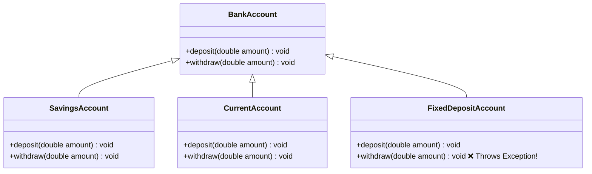
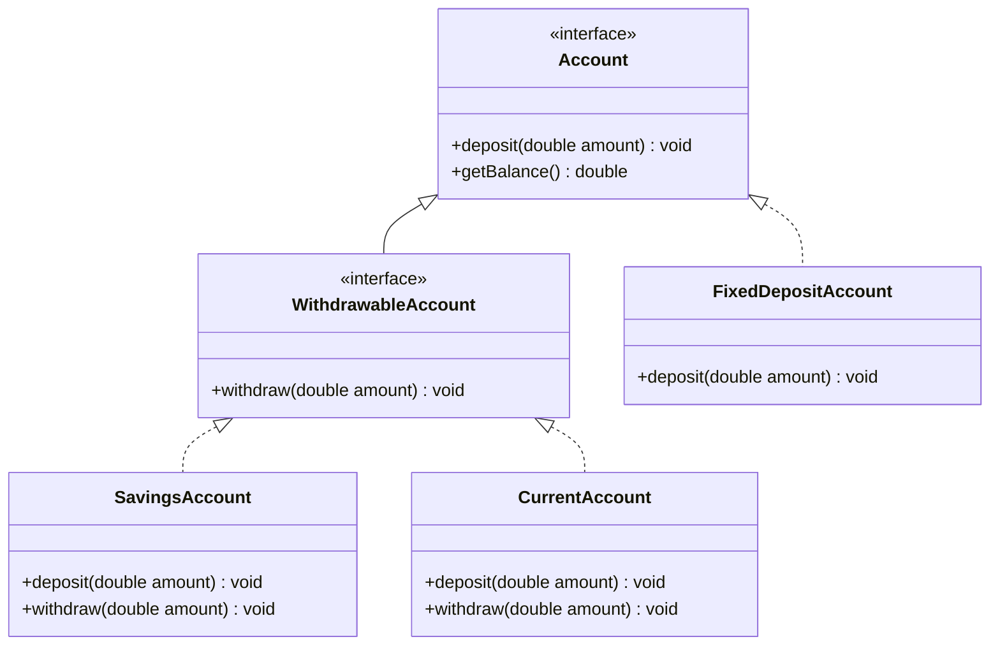
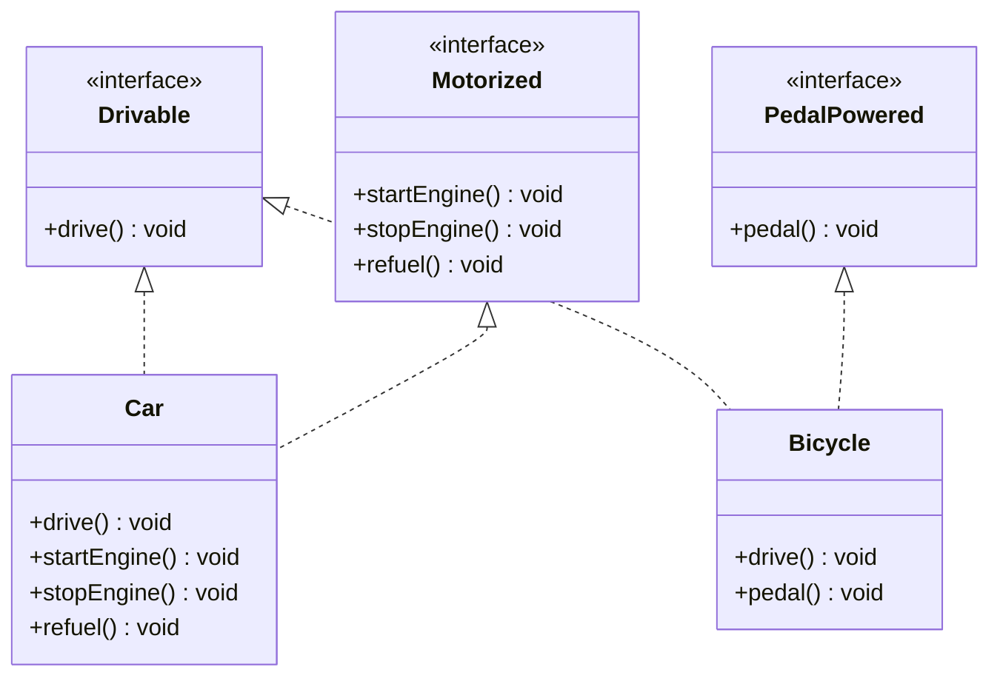

# 06. SOLID Design Principles — Part 2: LSP, ISP & DIP

> 💡 **Quick Revision Anchor**: 
> - **L (Liskov Substitution Principle)**: Subtypes must be substitutable for their base types without altering program correctness (Preserve behavioral contracts).
> - **I (Interface Segregation Principle)**: Prefer many small, client-specific role interfaces over a single bloated "fat" interface.
> - **D (Dependency Inversion Principle)**: Depend on **abstractions**, not on concrete low-level implementations (Decouple High-level policy from Low-level details).

---

## 1. Liskov Substitution Principle (LSP)

> **Formal Definition (Barbara Liskov, 1987)**:
> *"If for each object $o_1$ of type $S$ there is an object $o_2$ of type $T$ such that for all programs $P$ defined in terms of $T$, the behavior of $P$ is unchanged when $o_1$ is substituted for $o_2$, then $S$ is a subtype of $T$."*

In simple terms: **A derived child class must extend the base class's behavior, NEVER break or restrict it.** If code works with a superclass `Base`, it must work seamlessly with `Subclass` without needing type checking (`instanceof`) or throwing unexpected `UnsupportedOperationException`.

---

### The Anti-Pattern: The Fixed Deposit Account Trap
Consider a banking system with different account types:



```java
// ❌ VIOLATION OF LSP: FixedDeposit breaks the base class contract!
public class BankAccount {
    protected double balance;

    public void deposit(double amount) { this.balance += amount; }
    public void withdraw(double amount) {
        if (balance >= amount) {
            this.balance -= amount;
        } else {
            throw new IllegalArgumentException("Insufficient funds");
        }
    }
}

public class FixedDepositAccount extends BankAccount {
    @Override
    public void withdraw(double amount) {
        // In a Fixed Deposit, money is locked until maturity!
        throw new UnsupportedOperationException("❌ Cannot withdraw from a Fixed Deposit before maturity!");
    }
}
```

#### What goes wrong at runtime?
```java
public class BankingService {
    public void processMonthlyDeductions(List<BankAccount> accounts, double fee) {
        for (BankAccount acc : accounts) {
            acc.withdraw(fee); // 💥 CRASHES with UnsupportedOperationException when encountering FixedDepositAccount!
        }
    }
}
```
The client assumed every `BankAccount` could withdraw. Because `FixedDepositAccount` couldn't fulfill the parent's contract, program correctness was violated.

---

### The Clean Solution (Applying LSP)
Segregate account hierarchies so that non-withdrawable accounts do not inherit withdraw capabilities:



```java
// 1. Base abstraction for all accounts
public interface Account {
    void deposit(double amount);
    double getBalance();
}

// 2. Specialized abstraction for accounts supporting withdrawal
public interface WithdrawableAccount extends Account {
    void withdraw(double amount);
}

// 3. Regular accounts implement WithdrawableAccount
public class SavingsAccount implements WithdrawableAccount {
    private double balance;
    @Override public void deposit(double amt) { balance += amt; }
    @Override public void withdraw(double amt) { balance -= amt; }
    @Override public double getBalance() { return balance; }
}

// 4. Fixed deposit only implements Account!
public class FixedDepositAccount implements Account {
    private double balance;
    @Override public void deposit(double amt) { balance += amt; }
    @Override public double getBalance() { return balance; }
}
```
Now, `processMonthlyDeductions(List<WithdrawableAccount> accounts)` is completely type-safe and **impossible to crash!**

---

### The 4 Formal Subtyping Rules of LSP (Interview Favorite)
1. **Preconditions cannot be strengthened in a subtype**: If parent method accepts any integer, child cannot restrict it to only positive numbers.
2. **Postconditions cannot be weakened in a subtype**: If parent guarantees returning balance $\ge 0$, child cannot allow balance to become negative.
3. **Invariants must be preserved**: Core integrity rules of parent must remain true in all subtypes.
4. **Exception Rule**: Subclass methods cannot throw new or broader checked exceptions than the superclass method.

---

## 2. Interface Segregation Principle (ISP)

> **Formal Definition**: *"Clients should not be forced to depend upon interfaces that they do not use."*

In short: **Keep interfaces small, highly focused, and role-based.** Large, bloated ("fat") interfaces force implementers to write empty dummy methods or throw `UnsupportedOperationException`.

### The Anti-Pattern: The "Fat" Vehicle Interface
```java
// ❌ VIOLATION OF ISP: Bloated interface forcing irrelevant methods
public interface VehicleOperations {
    void drive();
    void startEngine();
    void stopEngine();
    void refuel();
    void pedal();
}

public class Bicycle implements VehicleOperations {
    @Override public void pedal() { System.out.println("Pedaling bicycle..."); }
    @Override public void drive() { System.out.println("Riding bicycle..."); }
    
    // Forced dummy implementations!
    @Override public void startEngine() { /* No engine! Dummy empty body */ }
    @Override public void stopEngine()  { /* No engine! Dummy empty body */ }
    @Override public void refuel()      { throw new UnsupportedOperationException("No fuel tank!"); }
}
```

### The Clean Solution (Applying ISP)
Break the monolithic interface into discrete, cohesive role interfaces:



```java
public interface Drivable { void drive(); }
public interface Motorized { void startEngine(); void stopEngine(); void refuel(); }
public interface PedalPowered { void pedal(); }

// Car implements only what it needs
public class Car implements Drivable, Motorized {
    @Override public void drive() { System.out.println("Driving car."); }
    @Override public void startEngine() { System.out.println("Engine started."); }
    @Override public void stopEngine() { System.out.println("Engine stopped."); }
    @Override public void refuel() { System.out.println("Refueling petrol."); }
}

// Bicycle implements only what it needs
public class Bicycle implements Drivable, PedalPowered {
    @Override public void drive() { System.out.println("Riding bicycle."); }
    @Override public void pedal() { System.out.println("Pedaling pedals."); }
}
```

---

## 3. Dependency Inversion Principle (DIP)

> **Formal Definition**:
> 1. *"High-level modules should not depend on low-level modules. Both should depend on abstractions."*
> 2. *"Abstractions should not depend on details. Details should depend on abstractions."*

- **High-level module**: Core business logic / policy decisions (e.g., `UserService`, `OrderCheckoutService`).
- **Low-level module**: Implementation details / infrastructure mechanisms (e.g., `MySQLDatabase`, `SendGridEmailService`, `StripeAPI`).

### The Anti-Pattern: Direct Concrete Coupling
```java
// Low-level module
public class MySQLDatabase {
    public void saveUser(String email) {
        System.out.println("Writing user " + email + " to MySQL tables.");
    }
}

// ❌ VIOLATION OF DIP: High-level business service directly instantiates low-level driver!
public class UserService {
    private MySQLDatabase database; // Tightly coupled to MySQL!

    public UserService() {
        this.database = new MySQLDatabase(); // Cannot mock for unit testing!
    }

    public void registerUser(String email) {
        // Business logic
        database.saveUser(email);
    }
}
```

#### Why is this bad?
1. You cannot swap MySQL for PostgreSQL or MongoDB without modifying `UserService.java`.
2. You cannot write isolated unit tests without having a live MySQL database running!

---

### The Clean Solution (Applying DIP via Dependency Injection)

Invert the dependency arrow: both `UserService` and database implementations depend on a common abstraction (`UserRepository`):

```mermaid
flowchart TD
    subgraph "Before DIP (Tightly Coupled)"
        US1[UserService - High Level] -->|Direct Dependency| DB1[MySQLDatabase - Low Level]
    end

    subgraph "After DIP (Decoupled via Abstraction)"
        US2[UserService - High Level] -->|Depends on| Interface["<<interface>><br/>UserRepository"]
        DB2[MySQLRepository] ..|>|Implements| Interface
        Mongo[MongoRepository] ..|>|Implements| Interface
        Mock[MockUserRepository] ..|>|Implements| Interface
    end

    style Interface fill:#dbeafe,stroke:#3b82f6,color:#1e40af
```

```java
// 1. Abstraction (Contract owned by domain)
public interface UserRepository {
    void save(String email);
    User findByEmail(String email);
}

// 2. Low-level implementation 1: MySQL
public class MySQLUserRepository implements UserRepository {
    @Override
    public void save(String email) {
        System.out.println("Executing INSERT INTO users VALUES ('" + email + "') in MySQL");
    }
    @Override public User findByEmail(String email) { return null; }
}

// 3. Low-level implementation 2: MongoDB
public class MongoUserRepository implements UserRepository {
    @Override
    public void save(String email) {
        System.out.println("Saving BSON document { email: '" + email + "' } in MongoDB");
    }
    @Override public User findByEmail(String email) { return null; }
}

// 4. High-level service: Inversion of Control via Constructor Injection!
public class UserService {
    private final UserRepository userRepository;

    // Dependency Injection: Abstraction is supplied from the outside
    public UserService(UserRepository userRepository) {
        this.userRepository = userRepository;
    }

    public void register(String email) {
        System.out.println("Validating email syntax...");
        userRepository.save(email); // Relies on abstraction!
    }
}
```

---

## 4. Summary: The Complete SOLID Quick-Check Guide

| Principle | Primary Problem it Solves | Core Refactoring Tool |
| :--- | :--- | :--- |
| **S - Single Responsibility** | God Classes, merge conflicts, high coupling | Break class into focused, single-stakeholder modules |
| **O - Open / Closed** | Fragile `if-else` / `switch` statements modifying legacy code | Interfaces, Polymorphism, Strategy / Factory patterns |
| **L - Liskov Substitution** | Unexpected runtime errors, broken subclass contracts | Hierarchy segregation, honoring preconditions & postconditions |
| **I - Interface Segregation** | Dummy empty methods, fat interface pollution | Break into small, cohesive, role-based interfaces |
| **D - Dependency Inversion** | Hard-coded low-level dependencies, untestable code | Inversion of Control (IoC), Dependency Injection (DI) |
