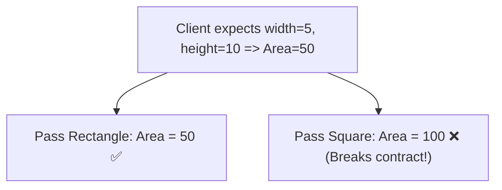
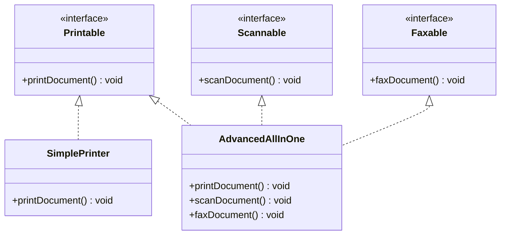
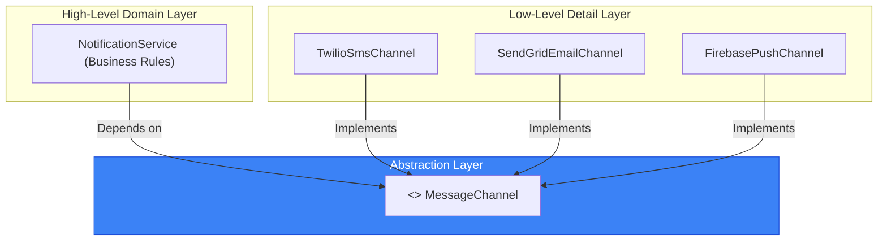

# 06. SOLID Design Principles — Part 2: LSP, ISP & DIP

> 💡 **Quick Revision Anchor**: `LSP (True Substitutability), ISP (Lean Interfaces), DIP (Invert Dependencies to Abstractions)`

---

## 1. Liskov Substitution Principle (LSP)

> **Formal Definition**: *"If $S$ is a subtype of $T$, then objects of type $T$ may be replaced with objects of type $S$ without altering any of the desirable properties of the program (correctness, task performed, etc.)."*

In simple terms: A child class must be able to completely substitute its parent class **without breaking client expectations or throwing unexpected exceptions**.

---

### The Classic Violation: The Rectangle-Square Dilemma
Mathematically, a Square is a Rectangle. But in Object-Oriented Design, **modeling Square as a subclass of Rectangle violates LSP**:

```java
// ❌ VIOLATION OF LSP
public class Rectangle {
    protected int width;
    protected int height;

    public void setWidth(int width) { this.width = width; }
    public void setHeight(int height) { this.height = height; }
    public int getArea() { return width * height; }
}

public class Square extends Rectangle {
    @Override
    public void setWidth(int width) {
        this.width = width;
        this.height = width; // Forces square geometry
    }

    @Override
    public void setHeight(int height) {
        this.width = height;
        this.height = height; // Forces square geometry
    }
}
```

#### Why it fails the substitution test:
```java
public void testRectangleArea(Rectangle rect) {
    rect.setWidth(5);
    rect.setHeight(10);
    // Client reasonably expects area to be 5 * 10 = 50.
    // But if rect is a Square, area will be 10 * 10 = 100!
    assert rect.getArea() == 50 : "LSP Violation! Unexpected Area: " + rect.getArea();
}
```



### The 3 Formal Subtyping Rules of LSP
1. **Signature Rule**:
   - Return types can be **covariant** (subtype return type).
   - Method arguments cannot be more restrictive.
   - Child methods **must not throw new or broader checked exceptions** than the parent method.
2. **Property Rule (History Constraint)**:
   - Invariants of the superclass must be preserved by the subclass. If the superclass states that an attribute is immutable after creation, the subclass cannot provide methods to mutate it.
3. **Method Rules**:
   - **Preconditions cannot be strengthened**: Subclass cannot demand stricter input conditions than its parent (e.g., if parent accepts all integers, child cannot reject negative integers).
   - **Postconditions cannot be weakened**: Subclass must guarantee at least as much as the parent guaranteed.

---

## 2. Interface Segregation Principle (ISP)

> **Formal Definition**: *"Clients should not be forced to depend upon interfaces that they do not use."*

Prefer **many small, client-specific interfaces** over a single, bloated, "fat" general-purpose interface.

### The Anti-Pattern: Fat Interface
```java
// ❌ VIOLATION OF ISP: Fat interface forcing unnecessary implementations
public interface SmartDevice {
    void printDocument();
    void scanDocument();
    void faxDocument();
    void staplePages();
}

public class BasicOfficePrinter implements SmartDevice {
    public void printDocument() { System.out.println("Printing..."); }

    // Forced to write dummy code or throw UnsupportedOperationException!
    public void scanDocument() { throw new UnsupportedOperationException("No scanner!"); }
    public void faxDocument() { throw new UnsupportedOperationException("No fax!"); }
    public void staplePages() { throw new UnsupportedOperationException("No stapler!"); }
}
```

### The Clean Solution: Role-Based Segregated Interfaces


```java
// ✅ Clean segregated interfaces
public interface Printable { void printDocument(); }
public interface Scannable { void scanDocument(); }
public interface Faxable   { void faxDocument(); }

public class BasicOfficePrinter implements Printable {
    @Override
    public void printDocument() {
        System.out.println("Printing document cleanly.");
    }
}
```

---

## 3. Dependency Inversion Principle (DIP)

> **Formal Definition**:
> 1. *"High-level modules should not depend on low-level modules. Both should depend on abstractions."*
> 2. *"Abstractions should not depend on details. Details should depend on abstractions."*

High-level policy (Business Logic) should never be tightly coupled to low-level details (SQL database, third-party SMS vendor, specific disk file).

### The Anti-Pattern: Direct Concrete Coupling
```java
// ❌ VIOLATION OF DIP: High-level NotificationService tightly coupled to concrete TwilioSmsSender
public class NotificationService {
    private TwilioSmsSender smsSender = new TwilioSmsSender(); // Hardcoded low-level dependency!

    public void alertUser(String message) {
        smsSender.sendSms(message);
    }
}
```
*If company switches from Twilio to AWS SNS or SendGrid, `NotificationService` must be rewritten!*

### The Clean Solution: Dependency Injection via Abstraction


```java
// ✅ Step 1: Define the Abstraction
public interface MessageChannel {
    void sendMessage(String recipient, String message);
}

// ✅ Step 2: Implement Low-Level Details
public class TwilioSmsChannel implements MessageChannel {
    @Override
    public void sendMessage(String recipient, String message) {
        System.out.println("Sending SMS via Twilio to " + recipient);
    }
}

public class FirebasePushChannel implements MessageChannel {
    @Override
    public void sendMessage(String recipient, String message) {
        System.out.println("Sending Push Notification via FCM to " + recipient);
    }
}

// ✅ Step 3: High-Level Module Depends Exclusively on the Abstraction
public class NotificationService {
    private final MessageChannel channel;

    // Dependency Injection via constructor
    public NotificationService(MessageChannel channel) {
        this.channel = channel;
    }

    public void alertUser(String user, String alert) {
        channel.sendMessage(user, alert);
    }
}
```

---

## 4. The Complete SOLID Summary Matrix

| Principle | Full Name | Guiding Motto | Common Indicator of Violation |
| :---: | :--- | :--- | :--- |
| **S** | **Single Responsibility** | "One class, one reason to change." | God classes containing business logic, DB queries, and formatting. |
| **O** | **Open / Closed** | "Open for extension, closed for modification." | Cascading `if-else` or `switch` statements checking object types. |
| **L** | **Liskov Substitution** | "Subtypes must be truly substitutable." | Subclasses throwing `UnsupportedOperationException` or changing parent invariants. |
| **I** | **Interface Segregation** | "Keep interfaces lean and focused." | Classes forced to implement empty or stub methods they don't need. |
| **D** | **Dependency Inversion** | "Depend on abstractions, not concretions." | Calling `new ConcreteService()` directly inside high-level business classes. |
