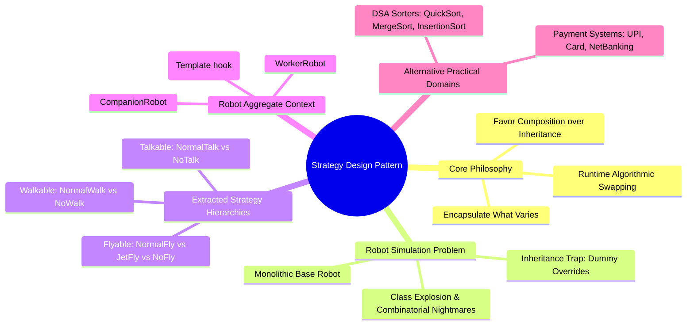
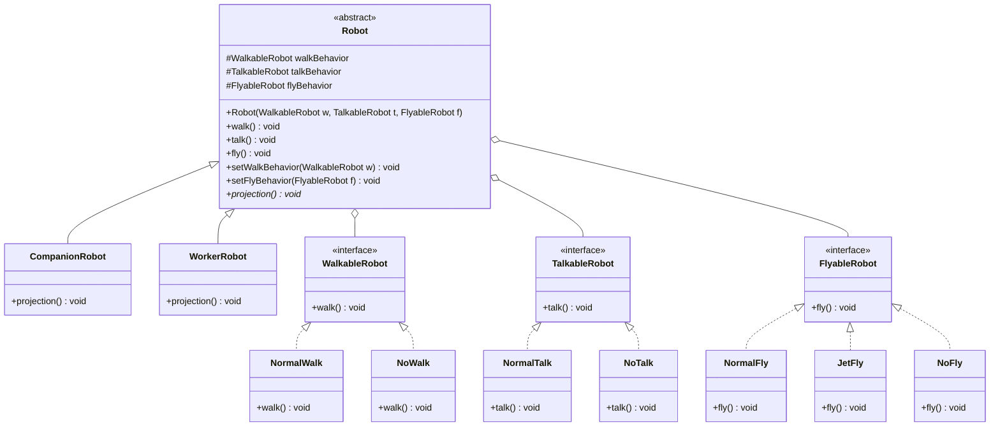

# 08. Strategy Design Pattern

## 1. Overview

The **Strategy Design Pattern** is a behavioral design pattern that defines a family of algorithms, encapsulates each one inside a separate class, and makes them interchangeable at runtime. It operationalizes the core object-oriented architecture principle: **"Favor Composition over Inheritance"**.

In this lecture, the pattern is introduced through the classical **Robot Simulation System** problem:
- As new robot types are introduced (e.g. Companion Robots, Worker Robots), behaviors such as walking, talking, and flying begin varying independently.
- Using simple inheritance creates severe code duplication, bloated dummy overrides, and violates both the Open/Closed Principle and Liskov Substitution Principle.
- Strategy extracts the varying behaviors into separate strategy hierarchies (`WalkableRobot`, `TalkableRobot`, `FlyableRobot`), allowing dynamic runtime composition.
- Real-world and DSA extensions include **Multi-Channel Payment Gateways** (UPI, Credit/Debit Card, NetBanking) and **Pluggable Sorting Algorithms** (QuickSort, MergeSort, InsertionSort).



---

## 2. What Problem Are We Solving?

### The Inherent Flaws of Pure Inheritance
When an application evolves, changes are inevitable (*"Change is the only constant"*). Suppose you are building a simulation containing various robots:
1. Initially, all robots walk and talk. You place `walk()` and `talk()` in a base `Robot` class.
2. A new requirement introduces flying robots. You add `fly()` to base `Robot`.
3. Suddenly, ground-only robots (like a vacuum cleaning robot or a standard companion robot) inherit `fly()`. To prevent them from flying, you are forced to override `fly()` in child classes and write empty dummy bodies or throw exceptions.
4. If some robots share the exact same complex walking algorithm while others share a different one, inheritance forces you to choose between:
   - Duplicating identical walking code across sibling subclasses, or
   - Creating sprawling, multi-tier intermediate inheritance trees (e.g., `FlyingWalkingRobot`, `NonFlyingWalkingRobot`, `FlyingNonWalkingRobot`), causing a combinatorial class explosion.

---

## 3. Core Concepts

- **Separate the Varying from the Static**: Look at your class. Identify parts that change frequently (dynamic behaviors like walking, talking, flying) and separate them from parts that remain constant (like physical display/projection).
- **Family of Algorithms**: A set of interchangeable implementations adhering to a common interface contract.
- **Context**: The class that requires the behavior (`Robot`). Instead of implementing the behavior directly, it maintains references to strategy interfaces and delegates execution to them.
- **Composition over Inheritance**: Acquiring behavior through **HAS-A** relationships (references to strategy objects) rather than **IS-A** inheritance.

---

## 4. Architectural Evolution: Naive Inheritance to Strategy Pattern

```text
❌ Naive Inheritance Approach:
                   ┌───────────────────────────┐
                   │           Robot           │
                   ├───────────────────────────┤
                   │ +walk()                   │
                   │ +talk()                   │
                   │ +fly()                    │
                   │ +projection()             │
                   └─────────────┬─────────────┘
                                 │
         ┌───────────────────────┴───────────────────────┐
         ▼                                               ▼
┌───────────────────────────┐               ┌───────────────────────────┐
│      CompanionRobot       │               │        WorkerRobot        │
├───────────────────────────┤               ├───────────────────────────┤
│ +fly() { /* CANNOT FLY!   │               │ +fly() { /* CANNOT FLY!   │
│   Dummy empty body */ }   │               │   Dummy empty body */ }   │
└───────────────────────────┘               └───────────────────────────┘
```

```text
✅ Strategy Pattern Composition:
┌──────────────────────────────────────┐          ┌───────────────────────┐
│                Robot                 │───────◇  │     WalkableRobot     │
├──────────────────────────────────────┤          ├───────────────────────┤
│ -WalkableRobot walkBehavior          │          │ +walk()               │
│ -TalkableRobot talkBehavior          │          └───────────┬───────────┘
│ -FlyableRobot flyBehavior            │                      │
│                                      │           ┌──────────┴──────────┐
│ +walk() -> walkBehavior.walk()       │           ▼                     ▼
│ +talk() -> talkBehavior.talk()       │    ┌──────────────┐      ┌──────────────┐
│ +fly()  -> flyBehavior.fly()         │    │  NormalWalk  │      │    NoWalk    │
│ +projection()*                       │    └──────────────┘      └──────────────┘
└──────────────────────────────────────┘
```

---

## 5. Architecture & Class Diagram



---

## 6. Complete Java Implementation

```java
import java.util.*;

// ============================================================================
// 1. STRATEGY INTERFACES & CONCRETE ALGORITHMS
// ============================================================================

// --- Walking Behavior Family ---
public interface WalkableRobot {
    void walk();
}

public class NormalWalk implements WalkableRobot {
    @Override
    public void walk() {
        System.out.println("🚶 Walking normally with bipedal motion.");
    }
}

public class NoWalk implements WalkableRobot {
    @Override
    public void walk() {
        System.out.println("🛑 Cannot walk (stationary base / wheels).");
    }
}

// --- Talking Behavior Family ---
public interface TalkableRobot {
    void talk();
}

public class NormalTalk implements TalkableRobot {
    @Override
    public void talk() {
        System.out.println("🗣️ Speaking with synthesized audio voice.");
    }
}

public class NoTalk implements TalkableRobot {
    @Override
    public void talk() {
        System.out.println("🤐 Silent mode (cannot talk).");
    }
}

// --- Flying Behavior Family ---
public interface FlyableRobot {
    void fly();
}

public class NormalFly implements FlyableRobot {
    @Override
    public void fly() {
        System.out.println("🦅 Flying through the air with mechanical propellers.");
    }
}

public class JetFly implements FlyableRobot {
    @Override
    public void fly() {
        System.out.println("🚀 Soaring at supersonic speed with jet boosters!");
    }
}

public class NoFly implements FlyableRobot {
    @Override
    public void fly() {
        System.out.println("🚫 Ground unit (cannot fly).");
    }
}

// ============================================================================
// 2. CONTEXT HIERARCHY: ROBOT AGGREGATE
// ============================================================================

/**
 * Base Robot context holding strategy delegates.
 */
public abstract class Robot {
    protected WalkableRobot walkBehavior;
    protected TalkableRobot talkBehavior;
    protected FlyableRobot flyBehavior;

    public Robot(WalkableRobot walkBehavior, TalkableRobot talkBehavior, FlyableRobot flyBehavior) {
        this.walkBehavior = Objects.requireNonNull(walkBehavior, "Walk behavior cannot be null");
        this.talkBehavior = Objects.requireNonNull(talkBehavior, "Talk behavior cannot be null");
        this.flyBehavior = Objects.requireNonNull(flyBehavior, "Fly behavior cannot be null");
    }

    // Delegated actions
    public void walk() {
        walkBehavior.walk();
    }

    public void talk() {
        talkBehavior.talk();
    }

    public void fly() {
        flyBehavior.fly();
    }

    // Dynamic runtime algorithm switching (Mutators)
    public void setWalkBehavior(WalkableRobot walkBehavior) {
        this.walkBehavior = Objects.requireNonNull(walkBehavior);
    }

    public void setFlyBehavior(FlyableRobot flyBehavior) {
        this.flyBehavior = Objects.requireNonNull(flyBehavior);
    }

    // Hook for unique visual projection
    public abstract void projection();
}

/**
 * Concrete Robot 1: Companion Robot
 */
public class CompanionRobot extends Robot {
    public CompanionRobot(WalkableRobot w, TalkableRobot t, FlyableRobot f) {
        super(w, t, f);
    }

    @Override
    public void projection() {
        System.out.println("🤖 [Companion Robot]: Projecting a friendly holographic assistant avatar.");
    }
}

/**
 * Concrete Robot 2: Worker Robot
 */
public class WorkerRobot extends Robot {
    public WorkerRobot(WalkableRobot w, TalkableRobot t, FlyableRobot f) {
        super(w, t, f);
    }

    @Override
    public void projection() {
        System.out.println("🦾 [Worker Robot]: Projecting industrial warehouse operational statistics.");
    }
}

// ============================================================================
// 3. OTHER REAL-WORLD DOMAIN EXAMPLES (INSTRUCTOR LECTURE)
// ============================================================================

// --- Example A: Multi-Channel Payment System ---
public interface PaymentStrategy {
    void pay(double amount);
}

public class UpiPaymentStrategy implements PaymentStrategy {
    private final String upiId;
    public UpiPaymentStrategy(String upiId) { this.upiId = upiId; }
    @Override public void pay(double amount) {
        System.out.println("📱 Paid ₹" + amount + " via UPI ID: " + upiId);
    }
}

public class CardPaymentStrategy implements PaymentStrategy {
    private final String cardNumber;
    public CardPaymentStrategy(String cardNumber) { this.cardNumber = cardNumber; }
    @Override public void pay(double amount) {
        System.out.println("💳 Paid ₹" + amount + " via Card: ending in " + cardNumber.substring(cardNumber.length() - 4));
    }
}

public class NetBankingPaymentStrategy implements PaymentStrategy {
    private final String bankName;
    public NetBankingPaymentStrategy(String bankName) { this.bankName = bankName; }
    @Override public void pay(double amount) {
        System.out.println("🏦 Paid ₹" + amount + " via " + bankName + " NetBanking portal.");
    }
}

public class PaymentSystem {
    private PaymentStrategy paymentStrategy;

    public PaymentSystem(PaymentStrategy paymentStrategy) {
        this.paymentStrategy = Objects.requireNonNull(paymentStrategy);
    }

    public void setPaymentStrategy(PaymentStrategy paymentStrategy) {
        this.paymentStrategy = Objects.requireNonNull(paymentStrategy);
    }

    public void checkout(double amount) {
        paymentStrategy.pay(amount);
    }
}

// --- Example B: DSA Pluggable Sorting Engine ---
public interface SortingStrategy {
    void sort(int[] array);
}

public class QuickSortStrategy implements SortingStrategy {
    @Override public void sort(int[] array) {
        System.out.println("⚡ Sorting array using QuickSort [O(N log N) average].");
    }
}

public class MergeSortStrategy implements SortingStrategy {
    @Override public void sort(int[] array) {
        System.out.println("🔄 Sorting array using MergeSort [O(N log N) guaranteed stable].");
    }
}

public class InsertionSortStrategy implements SortingStrategy {
    @Override public void sort(int[] array) {
        System.out.println("🐢 Sorting array using InsertionSort [O(N^2), fast on small/nearly-sorted arrays].");
    }
}

public class SorterContext {
    private SortingStrategy strategy;

    public SorterContext(SortingStrategy strategy) {
        this.strategy = Objects.requireNonNull(strategy);
    }

    public void setStrategy(SortingStrategy strategy) {
        this.strategy = Objects.requireNonNull(strategy);
    }

    public void executeSort(int[] array) {
        strategy.sort(array);
    }
}

// ============================================================================
// 4. DRIVER DEMONSTRATION
// ============================================================================
public class StrategyPatternDemo {
    public static void main(String[] args) {
        System.out.println("=== 1. ROBOT SIMULATION DEMO ===");
        // Companion Robot: Walks, Talks, Does NOT fly
        Robot companion = new CompanionRobot(new NormalWalk(), new NormalTalk(), new NoFly());
        companion.projection();
        companion.walk();
        companion.talk();
        companion.fly();

        System.out.println("\n--- Upgrading Companion Robot with Jet Boosters at runtime! ---");
        companion.setFlyBehavior(new JetFly());
        companion.fly();

        System.out.println("\n=== 2. PAYMENT SYSTEM DEMO ===");
        PaymentSystem payment = new PaymentSystem(new UpiPaymentStrategy("rohit@okaxis"));
        payment.checkout(1500.0);

        System.out.println("Switching payment method to Card at runtime:");
        payment.setPaymentStrategy(new CardPaymentStrategy("4111222233334567"));
        payment.checkout(3200.0);

        System.out.println("\n=== 3. PLUGGABLE SORTING DEMO ===");
        int[] numbers = {5, 2, 9, 1, 3};
        SorterContext sorter = new SorterContext(new QuickSortStrategy());
        sorter.executeSort(numbers);

        System.out.println("Dataset is small/nearly-sorted, switching strategy to InsertionSort:");
        sorter.setStrategy(new InsertionSortStrategy());
        sorter.executeSort(numbers);
    }
}
```

---

## 7. Deep Dive: Strategy vs. Other Patterns

| Dimension | Strategy Pattern | State Pattern | Template Method |
| :--- | :--- | :--- | :--- |
| **Primary Intent** | Swap entire interchangeable algorithms behind an interface | Change behavior automatically as internal object state transitions | Define the skeletal invariant steps of an algorithm, letting subclasses override steps |
| **Relationship Mechanism** | **Composition** (HAS-A strategy reference) | **Composition** (HAS-A state reference) | **Inheritance** (IS-A base template class) |
| **Who initiates the change?** | The external client or caller configures/injects the strategy | The internal state transitions automatically based on context events | Decided statically at compile time through class derivation |
| **Granularity** | Entire algorithm replaced at once | Complete behavior of object changes across states | Specific lifecycle hook methods overridden, invariant skeleton stays fixed |

---

## 8. Interview Questions & Key Discussion Points

1. **Why does Strategy favor composition over inheritance?**
   - *Answer*: Inheritance fixes behavior at compile time and propagates base class methods to subclasses that cannot use them (breaking LSP). Composition allows assembling independent behaviors like Lego bricks and swapping them dynamically at runtime via setter methods.
2. **How does Strategy eliminate conditional logic (`if-else` / `switch`)?**
   - *Answer*: Instead of a monolithic `switch(paymentMode)` block that grows indefinitely, each payment mode becomes an isolated class implementing `PaymentStrategy`. Dynamic polymorphic dispatch eliminates the conditional branch entirely.
3. **Can strategies be shared across multiple context instances?**
   - *Answer*: Yes, as long as the concrete strategy is **stateless**. A stateless strategy (e.g. `QuickSortStrategy` or `NoFly`) can be a shared Singleton instantiated once and reused across millions of context objects, saving memory.

---

## 9. Quick Revision

### Core Idea
Strategy defines a family of interchangeable algorithms, encapsulates each inside its own class, and makes them swappable at runtime via composition rather than inheritance.

### Remember
- **Identify and separate what varies**: In `Robot`, behaviors (`walk`, `talk`, `fly`) vary, while `projection` remains constant.
- **Composition over Inheritance**: Context has a strategy reference; delegation replaces inheritance.
- **Runtime Swappability**: Algorithms can be changed during execution using setter injection (`setFlyBehavior(new JetFly())`).

### Java Implementation Idea
Define behavioral interfaces (`WalkableRobot`, `PaymentStrategy`, `SortingStrategy`), implement concrete algorithmic classes (`NormalWalk`, `UpiPaymentStrategy`), and pass them into the context via constructors or setters.

### Most Important Interview Point
Contrast Strategy (**composition** swapping the *entire algorithm*) with Template Method (**inheritance** overriding *individual steps* within a fixed skeleton).

### Common Trap
Making strategy classes stateful. Keep strategies stateless so they can be safely shared across threads and reused as singletons without concurrency hazards.
