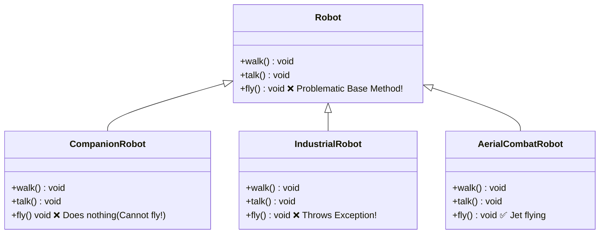
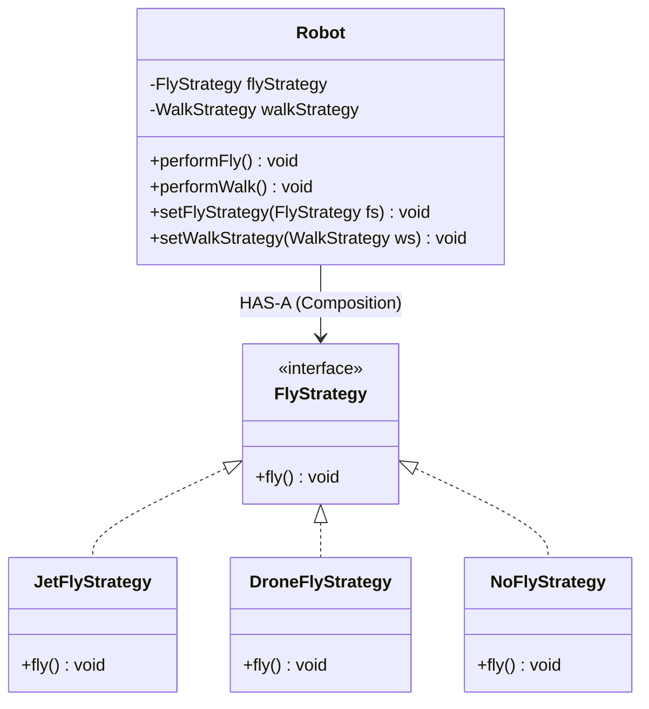

# 08. Strategy Design Pattern

> 💡 **Quick Revision Anchor**: 
> - **Type**: Behavioral Design Pattern.
> - **Core Principle**: Defines a family of interchangeable algorithms, encapsulates each one inside a separate class, and makes them swappable at runtime without altering the context class.
> - **Rule of Thumb**: Favor **Composition over Inheritance** whenever behaviors vary independently across class hierarchies.

---

## 1. Context & The Inheritance Anti-Pattern

Imagine you are designing a **Robotics Simulator** containing multiple types of robots: `CompanionRobot`, `IndustrialRobot`, and `AerialCombatRobot`.



### Why Inheritance Fails Here:
1. **Liskov Substitution Violation**: Non-flying robots are forced to inherit `fly()` and override it with dummy empty bodies or throw `UnsupportedOperationException`.
2. **Code Duplication**: If 5 distinct robot subclasses share the exact same `JetFly` algorithm, putting the logic in child classes causes copy-pasted code across branches.
3. **Static & Inflexible**: You cannot change a robot's flying or walking behavior dynamically at runtime (e.g., when a robot's jetpack runs out of fuel and switches to emergency walking).

---

## 2. The Strategy Pattern Architecture

Instead of inheriting behavior, we **extract the variable behavior into independent strategy interfaces**:



### The 3 Key Participants:
1. **Strategy Interface (`FlyStrategy`)**: Declares the contract common to all supported algorithmic variations.
2. **Concrete Strategies (`JetFlyStrategy`, `NoFlyStrategy`)**: Implement the algorithm using the Strategy interface.
3. **Context (`Robot`)**: Maintains a reference to a Strategy object and communicates with it solely via the interface.

---

## 3. Production Java Implementation: Navigation System

Let's model an enterprise **Google Maps Route Calculation Engine**:

```java
// Step 1: The Strategy Interface
public interface RouteStrategy {
    void calculateRoute(String origin, String destination);
}

// Step 2: Concrete Strategy 1 - Fastest Driving Route
public class FastestDrivingStrategy implements RouteStrategy {
    @Override
    public void calculateRoute(String origin, String destination) {
        System.out.println("🚗 Route calculated via Highway: " + origin + " -> " + destination + " [Time: 32 mins, Distance: 28 km]");
    }
}

// Concrete Strategy 2 - Scenic Route Avoiding Tolls
public class AvoidTollsStrategy implements RouteStrategy {
    @Override
    public void calculateRoute(String origin, String destination) {
        System.out.println("🛣️ Route calculated avoiding tolls: " + origin + " -> " + destination + " [Time: 48 mins, Distance: 35 km]");
    }
}

// Concrete Strategy 3 - Walking Pedestrian Route
public class WalkingStrategy implements RouteStrategy {
    @Override
    public void calculateRoute(String origin, String destination) {
        System.out.println("🚶 Pedestrian walking path: " + origin + " -> " + destination + " [Time: 2 hrs 10 mins, Distance: 11 km]");
    }
}

// Step 3: Context Class
public class NavigatorContext {
    private RouteStrategy routeStrategy;

    public NavigatorContext(RouteStrategy initialStrategy) {
        this.routeStrategy = initialStrategy;
    }

    // Dynamic runtime algorithm swapping!
    public void setRouteStrategy(RouteStrategy routeStrategy) {
        this.routeStrategy = routeStrategy;
    }

    public void buildRoute(String origin, String destination) {
        if (routeStrategy == null) {
            throw new IllegalStateException("No route strategy selected!");
        }
        routeStrategy.calculateRoute(origin, destination);
    }
}
```

### Runtime Usage Demonstration:
```java
public class StrategyDemo {
    public static void main(String[] args) {
        // Start with fastest driving route
        NavigatorContext navigator = new NavigatorContext(new FastestDrivingStrategy());
        navigator.buildRoute("Airport", "Downtown Hotel");

        // User toggles "Avoid Tolls" button in settings
        System.out.println("\n[User switches setting to Avoid Tolls]");
        navigator.setRouteStrategy(new AvoidTollsStrategy());
        navigator.buildRoute("Airport", "Downtown Hotel");

        // User decides to walk
        System.out.println("\n[User selects Pedestrian Mode]");
        navigator.setRouteStrategy(new WalkingStrategy());
        navigator.buildRoute("Airport", "Downtown Hotel");
    }
}
```

---

## 4. Real-World Applications

1. **Payment Gateways in E-Commerce**:
   `PaymentStrategy` with `CreditCardPayment`, `PayPalPayment`, `UPIPayment`, and `CryptoPayment`.
2. **Java Collections Sorting**:
   `Collections.sort(List, Comparator)`: The `Comparator<T>` is a textbook Strategy pattern. You pass different comparison strategies without modifying the collection!
3. **Data Compression & Archiving**:
   `CompressionStrategy` with `ZipCompression`, `RarCompression`, and `GzipCompression`.

---

## 5. Strategy vs. State vs. Template Method

| Pattern | Primary Intent | Coupling & Mechanism |
| :--- | :--- | :--- |
| **Strategy** | Swapping interchangeable algorithms from the outside | Context delegates to a Strategy instance via composition. Client usually selects the initial strategy. |
| **State** | Allowing an object to alter its behavior when its internal state changes | States transition automatically into other states based on context events. |
| **Template Method** | Fixing algorithm skeleton in superclass while deferring specific steps to subclasses | Uses inheritance (`extends`); algorithms cannot be swapped at runtime. |
