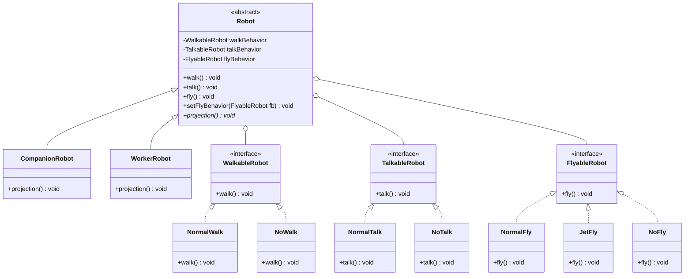

# 08. Strategy Design Pattern

> 💡 **Quick Revision Anchor**
> - The **Strategy Pattern** defines a family of algorithms, encapsulates each one inside a separate class, and makes them interchangeable at runtime.
> - Key Philosophy: **"Favor Composition over Inheritance"** and **"Encapsulate what varies"**.
> - Primary lecture example: **Robot Simulation System** where walking, talking, and flying vary independently, eliminating dummy overrides and combinatorial class explosion. Real-world extensions include **Payment Gateways** (UPI, Card, NetBanking) and **Sorting Algorithms**.

---

## 1. What Problem Are We Solving?

Suppose you are building a simulation containing various robots:
1. Initially, all robots can walk and talk, so you place `walk()` and `talk()` in a base `Robot` class.
2. A new requirement introduces flying robots, so you add `fly()` to base `Robot`.
3. Suddenly, ground-only robots (like a vacuum cleaning robot or standard companion robot) inherit `fly()`. To prevent them from flying, you must override `fly()` in subclasses with empty dummy bodies or throw exceptions (violating LSP).
4. If some robots share the exact same complex walking algorithm while others need a different one, inheritance forces you to choose between:
   - Duplicating code across sibling subclasses.
   - Creating an explosive, rigid multi-tier inheritance tree (`FlyingWalkingRobot`, `NonFlyingWalkingRobot`), causing a combinatorial nightmare.

---

## 2. Initial / Naive Approach: The Pure Inheritance Trap

```text
❌ Naive Inheritance Approach:
                   ┌───────────────────────────┐
                   │           Robot           │
                   ├───────────────────────────┤
                   │ +walk()                   │
                   │ +talk()                   │
                   │ +fly()                    │
                   │ +projection()             │
                   └─────────────┬─────────────┘
                                 │
         ┌───────────────────────┴───────────────────────┐
         ▼                                               ▼
┌───────────────────────────┐               ┌───────────────────────────┐
│      CompanionRobot       │               │        WorkerRobot        │
├───────────────────────────┤               ├───────────────────────────┤
│ +fly() { /* CANNOT FLY!   │               │ +fly() { /* CANNOT FLY!   │
│   Dummy empty body */ }   │               │   Dummy empty body */ }   │
└───────────────────────────┘               └───────────────────────────┘
```

### Why Does It Become a Problem?
- **Dummy Overrides:** Subclasses inherit behaviors they cannot perform, forcing developers to leave empty methods or throw `UnsupportedOperationException`.
- **Code Duplication:** Robots sharing identical behaviors cannot share implementations across different branches of an inheritance tree.
- **Rigidity:** Behaviors cannot be swapped dynamically at runtime (e.g., giving a walking robot jet boosters mid-simulation).

---

## 3. Key Design Idea: Strategy Pattern

1. **Identify What Varies:** In `Robot`, behaviors (`walk`, `talk`, `fly`) vary across models, whereas physical display/projection remains constant.
2. **Encapsulate Behaviors as Strategy Interfaces:** Extract each varying behavior into its own interface hierarchy (`WalkableRobot`, `TalkableRobot`, `FlyableRobot`).
3. **Favor Composition over Inheritance:** `Robot` contains references to strategy interfaces (**HAS-A**) and delegates execution to them.

---

## 4. Visual Architecture




---

## 5. Concise Java Implementation (Primary Lecture Example)

```java
import java.util.*;

// ==========================================
// 1. STRATEGY INTERFACES & IMPLEMENTATIONS
// ==========================================
interface WalkableRobot { void walk(); }
class NormalWalk implements WalkableRobot {
    @Override public void walk() { System.out.println("🚶 Walking with bipedal motion."); }
}
class NoWalk implements WalkableRobot {
    @Override public void walk() { System.out.println("🛑 Cannot walk (stationary unit)."); }
}

interface TalkableRobot { void talk(); }
class NormalTalk implements TalkableRobot {
    @Override public void talk() { System.out.println("🗣️ Speaking with audio voice."); }
}
class NoTalk implements TalkableRobot {
    @Override public void talk() { System.out.println("🤐 Silent mode (cannot talk)."); }
}

interface FlyableRobot { void fly(); }
class NormalFly implements FlyableRobot {
    @Override public void fly() { System.out.println("🦅 Flying with propellers."); }
}
class JetFly implements FlyableRobot {
    @Override public void fly() { System.out.println("🚀 Flying with supersonic jet boosters!"); }
}
class NoFly implements FlyableRobot {
    @Override public void fly() { System.out.println("🚫 Ground unit (cannot fly)."); }
}

// ==========================================
// 2. CONTEXT: ROBOT BASE & SUBCLASSES
// ==========================================
abstract class Robot {
    protected WalkableRobot walkBehavior;
    protected TalkableRobot talkBehavior;
    protected FlyableRobot flyBehavior;

    public Robot(WalkableRobot w, TalkableRobot t, FlyableRobot f) {
        this.walkBehavior = w;
        this.talkBehavior = t;
        this.flyBehavior = f;
    }

    // Delegating behavior to strategies
    public void walk() { walkBehavior.walk(); }
    public void talk() { talkBehavior.talk(); }
    public void fly() { flyBehavior.fly(); }

    // Dynamic runtime algorithm switching
    public void setFlyBehavior(FlyableRobot f) { this.flyBehavior = f; }
    public void setWalkBehavior(WalkableRobot w) { this.walkBehavior = w; }

    public abstract void projection();
}

class CompanionRobot extends Robot {
    public CompanionRobot(WalkableRobot w, TalkableRobot t, FlyableRobot f) {
        super(w, t, f);
    }
    @Override public void projection() { System.out.println("🤖 Projecting friendly companion UI."); }
}

class WorkerRobot extends Robot {
    public WorkerRobot(WalkableRobot w, TalkableRobot t, FlyableRobot f) {
        super(w, t, f);
    }
    @Override public void projection() { System.out.println("🏗️ Projecting industrial diagnostic UI."); }
}

// ==========================================
// 3. CLIENT DEMONSTRATION
// ==========================================
public class StrategyPatternDemo {
    public static void main(String[] args) {
        // Companion Robot: Walks, Talks, Does NOT fly
        Robot companion = new CompanionRobot(new NormalWalk(), new NormalTalk(), new NoFly());
        companion.projection();
        companion.walk();
        companion.talk();
        companion.fly(); // Outputs: Ground unit (cannot fly)

        // Runtime Strategy Switch: Upgrade with jet boosters!
        System.out.println("\n--- Upgrading Companion Robot with Jet Boosters at runtime ---");
        companion.setFlyBehavior(new JetFly());
        companion.fly(); // Outputs: Flying with supersonic jet boosters!
    }
}
```

---

## 6. Additional Common Examples Mentioned in Lecture

### A. Multi-Channel Payment System
```java
interface PaymentStrategy { void pay(double amount); }
class UpiPayment implements PaymentStrategy {
    @Override public void pay(double amount) { System.out.println("Paid ₹" + amount + " via UPI."); }
}
class CardPayment implements PaymentStrategy {
    @Override public void pay(double amount) { System.out.println("Paid ₹" + amount + " via Credit/Debit Card."); }
}
```

### B. Pluggable Sorting Algorithms (DSA Analogy)
```java
interface SortingStrategy { void sort(int[] arr); }
class QuickSort implements SortingStrategy { @Override public void sort(int[] arr) { /* QuickSort */ } }
class MergeSort implements SortingStrategy { @Override public void sort(int[] arr) { /* MergeSort */ } }
```

---

## 7. Strategy vs. Template Method vs. State

| Dimension | Strategy Pattern | State Pattern | Template Method |
| :--- | :--- | :--- | :--- |
| **Primary Intent** | Swap entire interchangeable algorithms behind an interface | Change behavior automatically as internal state transitions | Define fixed algorithm steps in base class, subclasses override specific steps |
| **Mechanism** | **Composition** (HAS-A strategy reference) | **Composition** (HAS-A state reference) | **Inheritance** (IS-A base class) |
| **Trigger** | Injected/swapped by caller or client | Transitions internally based on object events | Fixed at compile-time via class derivation |

---

## 8. Interview Questions & Key Discussion Points

1. **Why does the Strategy Pattern favor composition over inheritance?**
   - *Answer*: Inheritance is static at compile time and forces base class methods onto subclasses that cannot use them (breaking LSP). Composition allows assembling behaviors like Lego bricks and swapping them dynamically at runtime via setters.
2. **How does Strategy eliminate large `if-else` or `switch` blocks?**
   - *Answer*: Instead of a monolithic `switch(type)` checking algorithm types, each algorithm is encapsulated in a class implementing the strategy interface. Dynamic polymorphic dispatch eliminates the conditional branch entirely.
3. **Can strategies be shared across multiple context objects?**
   - *Answer*: Yes, as long as concrete strategies are **stateless** (e.g., `QuickSort` or `NoFly`), a single instance can be safely shared across thousands of context objects without thread-safety hazards.

---

## 9. Quick Revision

### Core Idea
Strategy encapsulates a family of algorithms behind common interfaces and uses composition instead of inheritance, making algorithms swappable at runtime without altering client classes.

### Remember
- **Lecture Example:** `Robot` delegates `walk()`, `talk()`, and `fly()` to strategy interfaces (`WalkableRobot`, `TalkableRobot`, `FlyableRobot`).
- **Dynamic Swapping:** `robot.setFlyBehavior(new JetFly())` allows runtime algorithm changes.
- **Rule of Thumb:** Identify what varies, separate it from what stays static, and program to interfaces.
