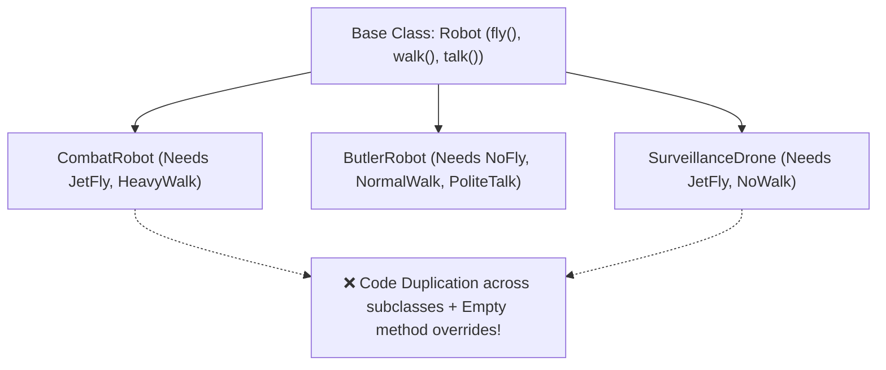
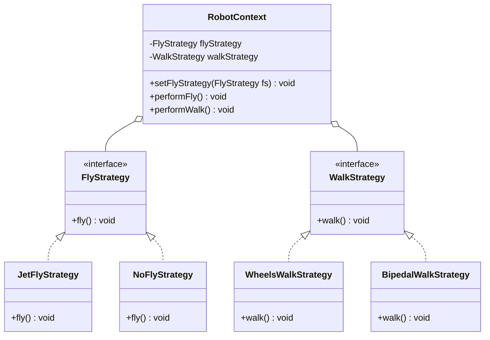

# 08. Strategy Design Pattern

> 💡 **Quick Revision Anchor**: `Interchangeable Algorithms, Favor Composition over Inheritance`

---

## 1. Intent & Problem Motivation

The **Strategy Design Pattern** is a **Behavioral Design Pattern** that defines a family of algorithms, encapsulates each one into a separate class, and makes them **interchangeable at runtime**.

### The Inheritance Trap
Imagine designing a simulation system with different types of Robots (Combat Robot, Domestic Butler Robot, Surveillance Drone Robot).
- If you place `fly()`, `walk()`, and `talk()` in a base `Robot` class:
  - Not all robots can fly (domestic robots can't fly; they're forced to implement empty or throwing methods).
  - Robots with the same flying mechanism (e.g., Drone and Combat both use Jet Engines) end up **duplicating code** because they cannot share code across separate branches of an inheritance tree without multiple inheritance.



---

## 2. The Strategy Pattern Architecture

Instead of inheriting behavior, we extract what varies into dedicated **Strategy Interfaces** and inject them via composition (**HAS-A**):



---

## 3. Java Implementation Walkthrough

### 1. Strategy Interfaces & Concrete Implementations
```java
// Strategy Interface for Flying
public interface FlyStrategy {
    void fly();
}

public class JetFlyStrategy implements FlyStrategy {
    @Override
    public void fly() {
        System.out.println("Igniting twin turbofan jet thrusters. Flying at Mach 2!");
    }
}

public class NoFlyStrategy implements FlyStrategy {
    @Override
    public void fly() {
        System.out.println("Cannot fly. Grounded vehicle.");
    }
}

// Strategy Interface for Walking
public interface WalkStrategy {
    void walk();
}

public class WheelsWalkStrategy implements WalkStrategy {
    @Override
    public void walk() {
        System.out.println("Rolling smoothly on high-traction motorized wheels.");
    }
}
```

### 2. Context Class (Robot)
```java
public class Robot {
    private final String name;
    private FlyStrategy flyStrategy;
    private WalkStrategy walkStrategy;

    public Robot(String name, FlyStrategy flyStrategy, WalkStrategy walkStrategy) {
        this.name = name;
        this.flyStrategy = flyStrategy;
        this.walkStrategy = walkStrategy;
    }

    // Dynamic runtime strategy mutator
    public void setFlyStrategy(FlyStrategy flyStrategy) {
        this.flyStrategy = flyStrategy;
    }

    public void performFly() {
        System.out.print(name + ": ");
        flyStrategy.fly();
    }

    public void performWalk() {
        System.out.print(name + ": ");
        walkStrategy.walk();
    }
}
```

### 3. Client Simulation (Dynamic Strategy Swap)
```java
public class Main {
    public static void main(String[] args) {
        // Create an assault robot that initially cannot fly
        Robot assaultBot = new Robot("T-800", new NoFlyStrategy(), new WheelsWalkStrategy());
        assaultBot.performWalk();
        assaultBot.performFly();

        System.out.println("\n--- Upgrading Robot with Jet Pack at Runtime ---");
        assaultBot.setFlyStrategy(new JetFlyStrategy());
        assaultBot.performFly(); // Behavior changes dynamically without modifying class!
    }
}
```

---

## 4. Real-World Applications

1. **Payment Gateways**: `PaymentContext` switches between `CreditCardStrategy`, `UpiStrategy`, `PayPalStrategy`, and `CryptoStrategy`.
2. **Sorting Algorithms**: Standard Java Collections `Collections.sort(list, comparator)` where `Comparator` is a Strategy pattern.
3. **Compression Utilities**: Switching compression algorithms (`ZipCompression`, `GzipCompression`, `Bzip2Compression`) based on file size or bandwidth.
4. **Navigation Route Planners**: Google Maps choosing between `WalkingStrategy`, `DrivingStrategy`, `TransitStrategy`, and `BicycleStrategy`.

---

## 5. Pros, Cons & Trade-offs

| Advantages | Trade-offs / Considerations |
| :--- | :--- |
| **Open/Closed Principle**: Add new strategies without altering context code. | **Increased Object Count**: Every new strategy requires an additional class. |
| **Eliminates Conditional Sprawl**: Replaces giant `switch` and `if-else` blocks. | **Client Awareness**: Client code must understand differences between strategies to select the right one. |
| **Runtime Swapping**: Behaviors can be changed on the fly. | |
