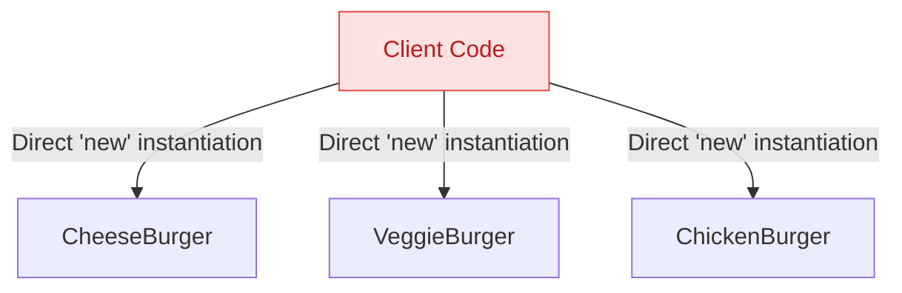
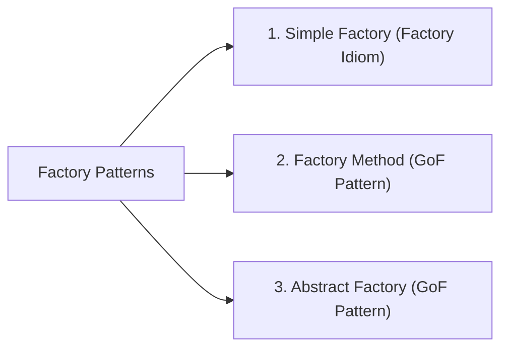
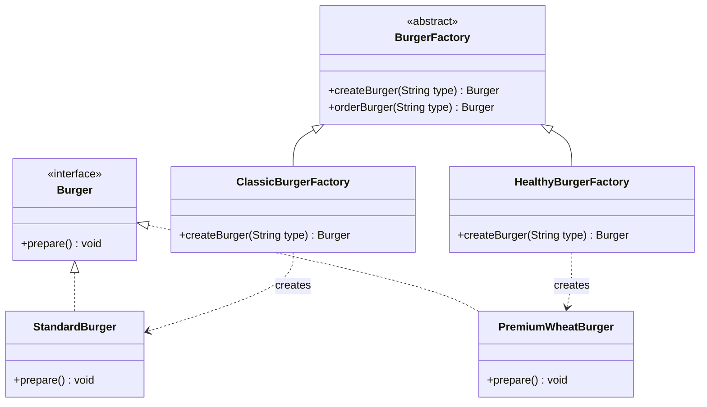

# 09. Factory Design Pattern

> 💡 **Quick Revision Anchor**: `Encapsulate Object Creation, Program to Interfaces`

---

## 1. Intent & Problem Motivation

The **Factory Design Pattern** is a **Creational Design Pattern** that abstracts and centralizes the instantiation logic of objects. Instead of the client creating objects directly using the `new` operator, the client delegates creation to a dedicated Factory.

### The Problem: Tight Coupling with `new`
```java
// ❌ Client directly tightly coupled to concrete classes
public void orderMeal(String type) {
    Burger burger;
    if (type.equals("CHEESE")) {
        burger = new CheeseBurger();
    } else if (type.equals("VEGGIE")) {
        burger = new VeggieBurger();
    } // Adding ChickenBurger requires modifying every client method!
    burger.prepare();
}
```



---

## 2. Factory Pattern Variants



1. **Simple Factory**: A single class with a creation method encapsulating `if-else` / `switch` logic.
2. **Factory Method**: Defines an abstract creation method in an interface or base class; subclasses decide which concrete product class to instantiate.
3. **Abstract Factory**: Provides an interface for creating **families of related or dependent objects** without specifying their concrete classes (e.g., LightThemeFactory creating LightButton, LightMenu; DarkThemeFactory creating DarkButton, DarkMenu).

---

## 3. Factory Method Pattern Architecture



---

## 4. Java Implementation Walkthrough

### 1. Product Hierarchy
```java
public interface Burger {
    void prepare();
}

public class StandardBurger implements Burger {
    @Override
    public void prepare() {
        System.out.println("Preparing Classic Beef Burger with Sesame Bun & Mayo.");
    }
}

public class PremiumWheatBurger implements Burger {
    @Override
    public void prepare() {
        System.out.println("Preparing Organic Whole Wheat Burger with Avocado & Olive Oil.");
    }
}
```

### 2. Creator Hierarchy (Factory Method)
```java
public abstract class BurgerFactory {
    // The Factory Method
    public abstract Burger createBurger(String type);

    // Common template workflow
    public Burger orderBurger(String type) {
        Burger burger = createBurger(type);
        burger.prepare();
        System.out.println("Boxing and dispatching order...\n");
        return burger;
    }
}

public class ClassicBurgerFactory extends BurgerFactory {
    @Override
    public Burger createBurger(String type) {
        if ("STANDARD".equalsIgnoreCase(type)) {
            return new StandardBurger();
        }
        throw new IllegalArgumentException("Unknown classic burger: " + type);
    }
}

public class HealthyBurgerFactory extends BurgerFactory {
    @Override
    public Burger createBurger(String type) {
        if ("WHEAT".equalsIgnoreCase(type)) {
            return new PremiumWheatBurger();
        }
        throw new IllegalArgumentException("Unknown healthy burger: " + type);
    }
}
```

### 3. Client Code
```java
public class Main {
    public static void main(String[] args) {
        BurgerFactory classicKitchen = new ClassicBurgerFactory();
        classicKitchen.orderBurger("STANDARD");

        BurgerFactory healthyKitchen = new HealthyBurgerFactory();
        healthyKitchen.orderBurger("WHEAT");
    }
}
```

---

## 5. Summary & When to Use

| Use Factory Pattern When: | Avoid Factory Pattern When: |
| :--- | :--- |
| You don't know ahead of time the exact types and dependencies of the objects your code should work with. | You are instantiating simple, fixed classes that will never have polymorphic variants. |
| You want to decouple object creation logic from business logic. | Adding factories introduces unnecessary indirection and complexity for trivial objects. |
| You want to provide a library/framework where users can extend internal components. | |
