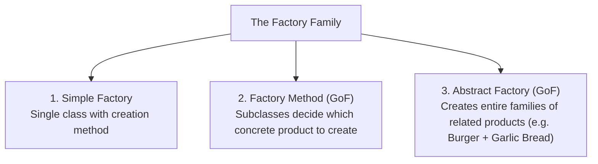
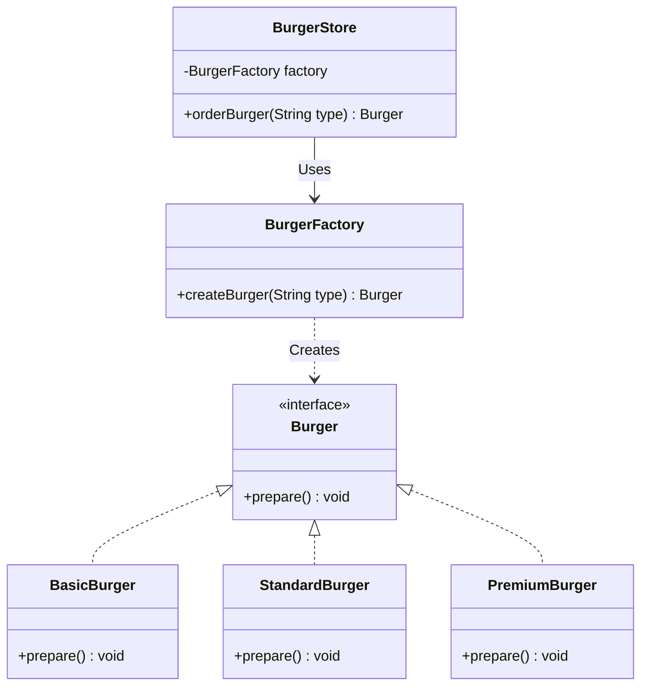
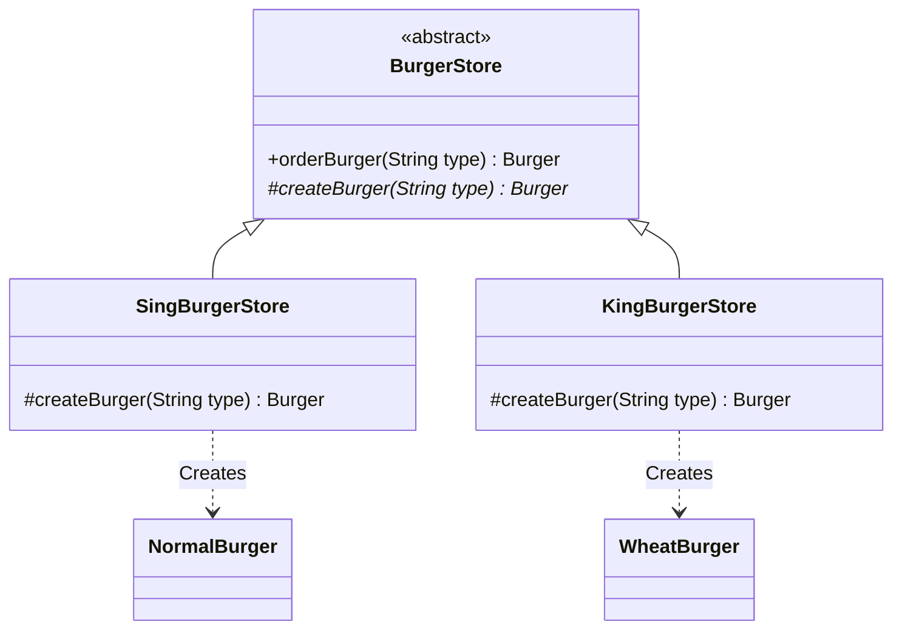
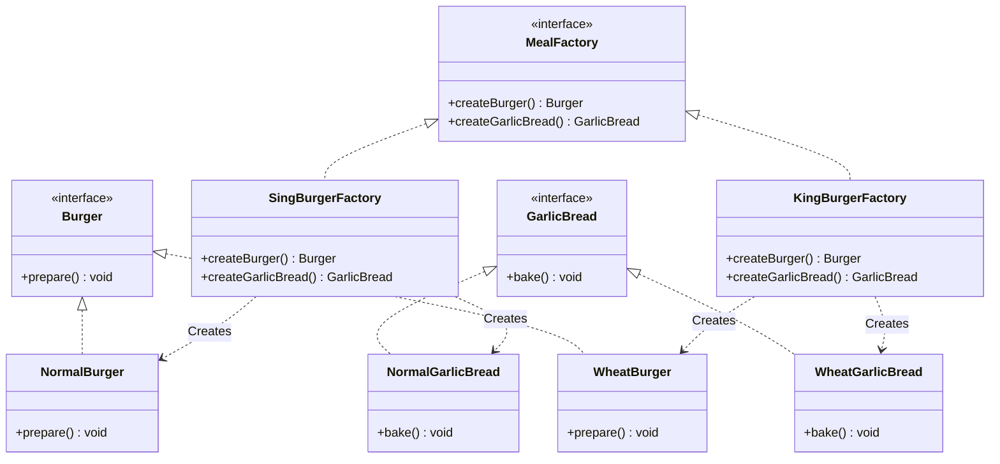
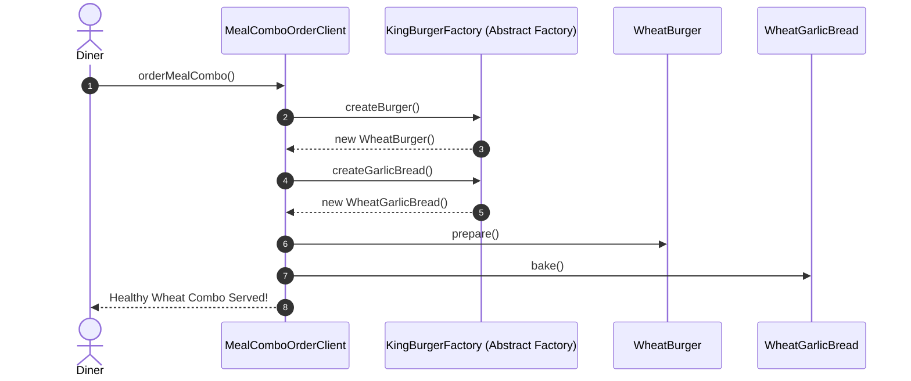

# 09. Factory Design Pattern

> 💡 **Quick Revision Anchor**: A comprehensive, interview-focused guide to the Creational Factory patterns faithfully derived from the complete lecture transcript. Systematically clarifies the 3 variants: **Simple Factory** (a single creation utility isolating `if-else` instantiation), **Factory Method** (GoF pattern using polymorphic inheritance where creator subclasses decide product instantiation, e.g. `SingBurgerStore` vs `KingBurgerStore`), and **Abstract Factory** (GoF pattern producing cohesive families of related products, e.g. Burger + Garlic Bread). Explains why Factory is the essential companion to the Strategy Pattern, separating business execution from dependency creation.

---

## 1. Overview

The **Factory Design Pattern** is a creational design pattern dedicated to **separating object creation logic from core business logic**. Rather than scattering the `new` operator directly across client classes, object instantiation is encapsulated inside dedicated factories.



---

## 2. What Problem Are We Solving?

### The Missing Link in the Strategy Pattern
In the Strategy Pattern, a context class (e.g. `Robot`) receives its behavior (e.g. `TalkStrategy`) via **Dependency Injection**:
```java
public class Robot {
    private TalkStrategy talkStrategy;
    public Robot(TalkStrategy talkStrategy) {
        this.talkStrategy = talkStrategy;
    }
}
```
**The Critical Question**: *Who creates the `TalkStrategy` object in the first place?*
Somewhere in the application, an entity must write:
```java
new NormalTalk(); // or new RoboticTalk();
```
If the client or calling controller handles this creation directly using conditional logic:
1. **Mixing Responsibilities**: The client now handles both **Core Business Logic** AND **Object Instantiation Logic** (violating the Single Responsibility Principle).
2. **Scattered Conditionals**: Every place in the application that needs a strategy or product duplicates the exact same `if-else` or `switch` creation block.
3. **Rigid Coupling**: Adding a new subtype forces modifications across all client classes (violating the Open/Closed Principle).

The **Factory Pattern** solves this by establishing a dedicated class whose **sole responsibility** is object creation.

---

## 3. Core Concepts

1. **Separation of Concerns**: Business services consume products through interfaces; factories own the responsibility of instantiation.
2. **Simple Factory (Idiom)**: A single class with a parameterized method (`createBurger(type)`) returning concrete subtypes.
3. **Factory Method (GoF Pattern)**: An abstract creator class defines an abstract creation method (`createBurger()`), letting specialized creator subclasses decide which concrete product class to instantiate.
4. **Abstract Factory (GoF Pattern)**: An interface providing factory methods to create **entire families of related or dependent products** (e.g., matching Burgers and Garlic Breads) without specifying their concrete classes.

---

## 4. Important Terminology

- **Creational Pattern**: A design pattern focused on object creation mechanisms.
- **Product**: The base interface or class representing the object created by the factory.
- **Creator**: The class or interface declaring the factory method.
- **Product Family**: A suite of complementary products designed to be used together (e.g., Normal Burger + Normal Garlic Bread vs. Wheat Burger + Wheat Garlic Bread).

---

## 5. Real-World Analogy (From the Lecture)

### 1. The Burger Shop (Sing Burger vs. King Burger)
- A customer ordering a burger does not enter the kitchen to assemble buns, cook patties, and slice cheese. The customer interacts with the front counter (Client), and the kitchen (**BurgerFactory**) creates the requested burger.
- **Sing Burger Franchise**: Specializes in traditional refined flour (maida) **Normal Burgers**.
- **King Burger Franchise**: Specializes in health-focused **Wheat-Based Burgers**.
- When you order a **Burger + Garlic Bread Combo**, you want the bread types to match: King Burger ensures you receive a Wheat Burger *and* Wheat Garlic Bread together as a coherent product family.

---

## 6. Naive / Bad Design

### Java Example (Mixing Creation with Business Logic)
```java
// ❌ Naive Anti-Pattern: Client mixes ordering logic with concrete object creation
public class BurgerStore {
    public Burger orderBurger(String type) {
        Burger burger;

        // 💥 Direct instantiation inside business service violates SRP and OCP
        if (type.equalsIgnoreCase("BASIC")) {
            burger = new BasicBurger();
        } else if (type.equalsIgnoreCase("STANDARD")) {
            burger = new StandardBurger();
        } else if (type.equalsIgnoreCase("PREMIUM")) {
            burger = new PremiumBurger();
        } else {
            throw new IllegalArgumentException("Unknown burger type: " + type);
        }

        burger.prepare();
        return burger;
    }
}
```

### Problems
- If multiple stores, delivery services, or kiosks order burgers, the creation `if-else` tree is duplicated everywhere.
- Adding a new burger requires editing and re-testing all store classes.

---

## 7. Design Evolution (The 3 Factory Tiers)

### Tier 1: Simple Factory
Extract the conditional instantiation logic into a dedicated `BurgerFactory`:



```java
// Simple Factory
public class SimpleBurgerFactory {
    public Burger createBurger(String type) {
        if (type.equalsIgnoreCase("BASIC")) return new BasicBurger();
        else if (type.equalsIgnoreCase("STANDARD")) return new StandardBurger();
        else if (type.equalsIgnoreCase("PREMIUM")) return new PremiumBurger();
        throw new IllegalArgumentException("Unknown type: " + type);
    }
}
```
*Note*: Simple Factory is a widely used design idiom, though not one of the official 23 Gang of Four (GoF) patterns.

---

### Tier 2: Factory Method (Why One Factory Isn't Enough)
What happens when different franchises prepare burgers differently?
- **Sing Burger Store**: Prepares **Normal Burgers** (Regular buns).
- **King Burger Store**: Prepares **Wheat Burgers** (Whole wheat buns).
A single `SimpleBurgerFactory` would need nested conditionals checking both franchise brand and burger type, violating OCP.

**The Solution**: Make the store an abstract creator with an abstract `createBurger()` factory method:



---

### Tier 3: Abstract Factory (Burger + Garlic Bread Families)
What happens when franchises sell multiple product types?
- **Sing Burger Franchise**: Produces `NormalBurger` AND `NormalGarlicBread`.
- **King Burger Franchise**: Produces `WheatBurger` AND `WheatGarlicBread`.

An **Abstract Factory** declares factory methods for **all related products in the family**, ensuring that clients never accidentally mix incompatible products (e.g. receiving a Wheat Burger with a Normal Garlic Bread).

---

## 8. Final Design: Abstract Factory Architecture

### Architecture (Class Diagram)


### Mermaid Sequence Diagram


---

## 9. Java Implementation

```java
import java.util.Objects;

// ==========================================
// 1. PRODUCT INTERFACES & CONCRETE PRODUCTS
// ==========================================
public interface Burger {
    void prepare();
}

public class NormalBurger implements Burger {
    @Override
    public void prepare() {
        System.out.println("🍔 [Sing Burger] Preparing classic Normal Burger with regular bun.");
    }
}

public class WheatBurger implements Burger {
    @Override
    public void prepare() {
        System.out.println("🍔 [King Burger] Preparing healthy Wheat Burger with 100% whole wheat bun.");
    }
}

public interface GarlicBread {
    void bake();
}

public class NormalGarlicBread implements GarlicBread {
    @Override
    public void bake() {
        System.out.println("🥖 [Sing Bakery] Baking classic Garlic Bread with standard butter.");
    }
}

public class WheatGarlicBread implements GarlicBread {
    @Override
    public void bake() {
        System.out.println("🥖 [King Bakery] Baking healthy Whole-Wheat Garlic Bread with olive oil.");
    }
}

// ==========================================
// 2. ABSTRACT FACTORY CONTRACT
// ==========================================
public interface MealFactory {
    Burger createBurger();
    GarlicBread createGarlicBread();
}

// Concrete Factory 1: Sing Burger (Normal Product Family)
public class SingBurgerFactory implements MealFactory {
    @Override
    public Burger createBurger() {
        return new NormalBurger();
    }

    @Override
    public GarlicBread createGarlicBread() {
        return new NormalGarlicBread();
    }
}

// Concrete Factory 2: King Burger (Wheat Product Family)
public class KingBurgerFactory implements MealFactory {
    @Override
    public Burger createBurger() {
        return new WheatBurger();
    }

    @Override
    public GarlicBread createGarlicBread() {
        return new WheatGarlicBread();
    }
}

// ==========================================
// 3. CLIENT CONSUMER
// ==========================================
public class MealComboClient {
    private final Burger burger;
    private final GarlicBread garlicBread;

    // Client depends entirely on the Abstract Factory interface!
    public MealComboClient(MealFactory factory) {
        Objects.requireNonNull(factory, "Factory cannot be null");
        this.burger = factory.createBurger();
        this.garlicBread = factory.createGarlicBread();
    }

    public void serveMeal() {
        System.out.println("\n🍽️ Serving Meal Combo:");
        burger.prepare();
        garlicBread.bake();
        System.out.println("✅ Meal combo served to table.\n");
    }
}
```

---

## 10. Code Walkthrough

1. `Burger` and `GarlicBread`: Product interfaces defining the two complementary categories.
2. `SingBurgerFactory`: Specializes in the "Normal" product family, returning `NormalBurger` and `NormalGarlicBread`.
3. `KingBurgerFactory`: Specializes in the "Wheat" product family, returning `WheatBurger` and `WheatGarlicBread`.
4. `MealComboClient`: Decoupled from concrete product classes; it receives a `MealFactory` and executes `serveMeal()` consistently across any brand.

---

## 11. Important Design Decisions: Factory vs. Strategy

A major point emphasized in the lecture is the conceptual relationship between **Factory** and **Strategy**:

| Dimension | Strategy Pattern | Factory Pattern |
| :--- | :--- | :--- |
| **Core Question Answered** | *"Which **behavior or algorithm** should execute?"* | *"Which **concrete object** should be created?"* |
| **Lifecycle Phase** | **Execution / Runtime Behavior** | **Instantiation / Object Creation** |
| **Assumption** | Assumes the dependency object already exists. | Solves the problem of creating the dependency object cleanly. |
| **Synergy** | A **Factory** is frequently used to instantiate the appropriate **Strategy**! | |

> **Key Lecture Takeaway**: Multiple design patterns can solve similar structural problems. The appropriate choice depends entirely on **design intent** (Are you varying behavioral algorithms or centralizing object creation?).

---

## 12. Edge Cases

- **Mismatched Product Families**: Without Abstract Factory, a developer might write `new NormalBurger()` with `new WheatGarlicBread()`. Abstract Factory guarantees that all products created by a factory instance belong to the same compatible family.
- **Unknown Product Types in Simple Factory**: Handled by throwing an explicit `IllegalArgumentException`.

---

## 13. Production Considerations

- **Notification Engine Example (From Lecture)**:
  - `NotificationFactory` creating `SMSNotification`, `EmailNotification`, or `PushNotification` based on recipient channel preferences.
- **Spring Framework `@Bean`**: In enterprise Java, Spring configuration classes with `@Bean` methods act as managed Factory Methods.

---

## 14. Advantages

- **Eliminates Code Duplication**: Object creation logic is written in one place.
- **Strict Compliance with SRP & OCP**: Isolates instantiation from usage; new product variants are added by creating new factory classes.
- **Enforces Product Consistency**: Abstract Factory guarantees complementary products are never mixed incorrectly.

---

## 15. Disadvantages / Trade-offs

- **Class Proliferation**: Introducing factories adds multiple interface and class files.
- **Rigid Abstract Factory Interface**: Adding a new product type (e.g. `createDrink()`) forces updating the `MealFactory` interface and all concrete factory implementations.

---

## 16. Related Patterns / Alternatives

- **Builder Pattern**: Best for constructing a single complex object step-by-step with many optional parameters.
- **Prototype Pattern**: Creates new objects by cloning an existing prototype instance.

---

## 17. SOLID / OOP Connections

- **Single Responsibility Principle (SRP)**: Separates creation responsibility from business logic.
- **Open/Closed Principle (OCP)**: Adding new franchises or product families requires adding new classes without editing client code.
- **Dependency Inversion Principle (DIP)**: `MealComboClient` depends on `MealFactory`, not concrete factory classes.

---

## 18. Common Mistakes

- **Confusing Factory Method and Abstract Factory**: Factory Method uses inheritance to create one product; Abstract Factory uses composition to create entire families of related products.
- **Using Abstract Factory for a Single Product**: If there is only one product type, Factory Method is sufficient.

---

## 19. Interview Questions

1. **How do the Strategy and Factory patterns complement each other?**
   - *Answer*: Strategy encapsulates interchangeable behaviors (algorithms), but assumes the strategy object has already been created. Factory solves the problem of instantiating the appropriate strategy object based on configuration or runtime conditions, keeping the client free of creation logic.
2. **What is the difference between Simple Factory, Factory Method, and Abstract Factory?**
   - *Answer*: Simple Factory is a single class with a conditional creation method (idiom). Factory Method uses inheritance where subclasses override a creation method to instantiate a single product. Abstract Factory uses composition where an interface creates families of related products.
3. **What is the primary danger of violating the Factory Pattern?**
   - *Answer*: Scattering `new` operators and conditional creation logic across business classes tightly couples the application to concrete implementations, duplicating creation code and violating SRP and OCP.

---

## 20. Quick Revision

### Core Idea
> Factory patterns separate object creation from business logic: Simple Factory uses a static method, Factory Method defers creation to subclasses, and Abstract Factory creates entire families of related products.

### Remember
- Solves the question: *"Who creates the Strategy dependency?"*
- Sing Burger = Normal products; King Burger = Wheat products.
- Abstract Factory creates matching pairs (Burger + Garlic Bread).

### Java Implementation Idea
> Define `MealFactory` with `createBurger()` and `createGarlicBread()`, implement in `SingBurgerFactory` and `KingBurgerFactory`, and pass to client via constructor injection.

### Most Important Interview Point
> Strategy decides *which algorithm executes*; Factory decides *which concrete object is created*. A Factory is often used to instantiate a Strategy.

### Common Trap
> Do not use Abstract Factory when there is only a single product category; Abstract Factory is specifically intended for families of related products.
