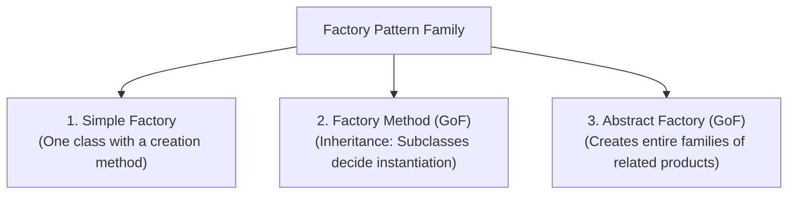
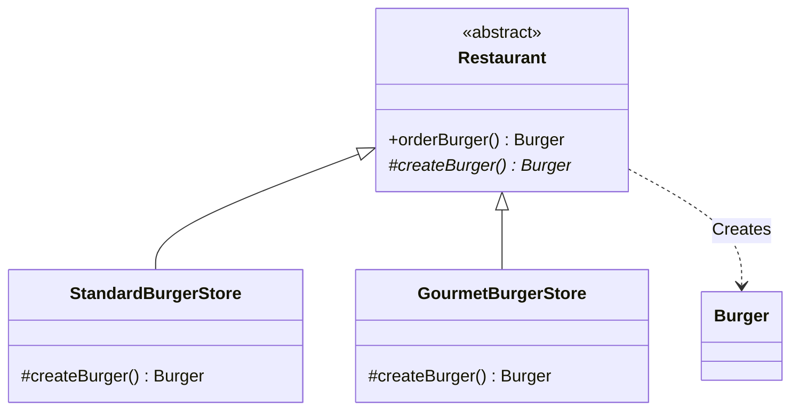
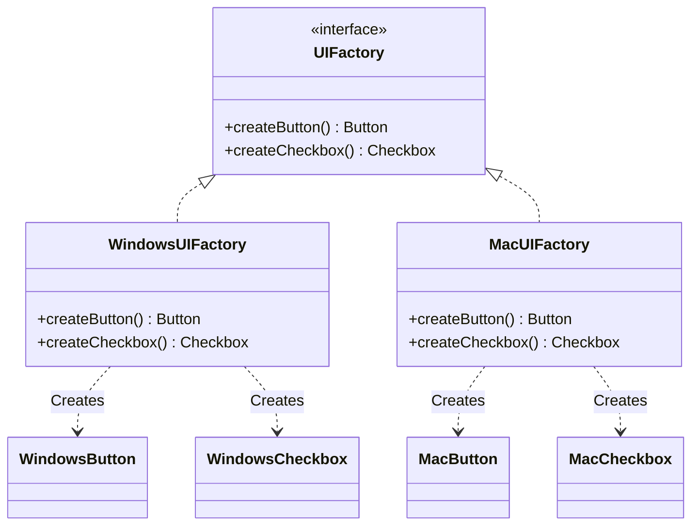

# 09. Factory Design Pattern

> 💡 **Quick Revision Anchor**: 
> - **Type**: Creational Design Pattern.
> - **Core Intent**: Decouples the client from direct object instantiation (`new` operator), delegating object creation to specialized factory classes or subclasses.
> - **Hierarchy**: **Simple Factory** (conditional instantiation method) $\rightarrow$ **Factory Method** (subclasses decide concrete class) $\rightarrow$ **Abstract Factory** (families of related products).

---

## 1. Context & The Problem with the `new` Operator

In object-oriented code, directly scattering the `new` operator across your business logic creates severe architectural tight coupling:

```java
// ❌ Tight Coupling: Direct instantiation scattered everywhere
public void orderFood(String type) {
    Burger burger;
    if (type.equals("CHEESE")) {
        burger = new CheeseBurger();
    } else if (type.equals("VEGGIE")) {
        burger = new VeggieBurger();
    } else {
        burger = new StandardBurger();
    }
    burger.prepare();
}
```

### Why is this problematic?
1. **OCP Violation**: Every time a new product type is created (e.g., `ChickenBurger`), you must modify existing business classes.
2. **Duplicate Creation Logic**: If multiple controllers, services, or background jobs instantiate burgers, creation logic (and constructor parameters) gets duplicated everywhere.
3. **Impedes Unit Testing**: Hard-coded `new` calls prevent injecting mock instances during testing.

---

## 2. The 3 Tiers of the Factory Pattern Family



---

## 3. Tier 1: Simple Factory

A dedicated factory class encapsulates the conditional instantiation logic:

```java
// Product Interface
public interface Burger {
    void prepare();
}

public class CheeseBurger implements Burger {
    @Override public void prepare() { System.out.println("Preparing Cheese Burger with cheddar."); }
}

public class VeggieBurger implements Burger {
    @Override public void prepare() { System.out.println("Preparing Veggie Burger with lettuce."); }
}

// Simple Factory Class
public class SimpleBurgerFactory {
    public static Burger createBurger(String type) {
        if ("CHEESE".equalsIgnoreCase(type)) {
            return new CheeseBurger();
        } else if ("VEGGIE".equalsIgnoreCase(type)) {
            return new VeggieBurger();
        }
        throw new IllegalArgumentException("Unknown burger type: " + type);
    }
}
```

---

## 4. Tier 2: Factory Method (GoF)

> **Definition**: Define an interface or abstract class for creating an object, but let subclasses decide which class to instantiate. Factory Method lets a class defer instantiation to subclasses.



```java
// Creator Abstraction
public abstract class Restaurant {
    // Template workflow
    public Burger orderBurger() {
        Burger burger = createBurger(); // Factory Method call
        burger.prepare();
        return burger;
    }

    // The Factory Method to be overridden by franchise branches
    protected abstract Burger createBurger();
}

// Concrete Creator 1
public class StandardBurgerStore extends Restaurant {
    @Override
    protected Burger createBurger() {
        return new VeggieBurger();
    }
}

// Concrete Creator 2
public class GourmetBurgerStore extends Restaurant {
    @Override
    protected Burger createBurger() {
        return new CheeseBurger();
    }
}
```

---

## 5. Tier 3: Abstract Factory (GoF)

> **Definition**: Provide an interface for creating **families of related or dependent objects** without specifying their concrete classes.

### Real-World Use Case: Cross-Platform UI Kit
Consider an application that must render native UI components on both **Windows** and **MacOS**:



```java
// Abstract Products
public interface Button { void render(); }
public interface Checkbox { void render(); }

// Concrete Products: Windows Family
public class WindowsButton implements Button {
    @Override public void render() { System.out.println("[Windows] Flat square button rendered."); }
}
public class WindowsCheckbox implements Checkbox {
    @Override public void render() { System.out.println("[Windows] Square checkbox rendered."); }
}

// Concrete Products: Mac Family
public class MacButton implements Button {
    @Override public void render() { System.out.println("[MacOS] Rounded glassmorphic button rendered."); }
}
public class MacCheckbox implements Checkbox {
    @Override public void render() { System.out.println("[MacOS] Smooth rounded checkbox rendered."); }
}

// Abstract Factory
public interface UIFactory {
    Button createButton();
    Checkbox createCheckbox();
}

// Concrete Factory 1: Windows
public class WindowsUIFactory implements UIFactory {
    @Override public Button createButton() { return new WindowsButton(); }
    @Override public Checkbox createCheckbox() { return new WindowsCheckbox(); }
}

// Concrete Factory 2: Mac
public class MacUIFactory implements UIFactory {
    @Override public Button createButton() { return new MacButton(); }
    @Override public Checkbox createCheckbox() { return new MacCheckbox(); }
}
```

### Client Application Using Abstract Factory:
```java
public class Application {
    private final Button button;
    private final Checkbox checkbox;

    public Application(UIFactory factory) {
        // Application code is 100% decoupled from OS-specific implementations!
        this.button = factory.createButton();
        this.checkbox = factory.createCheckbox();
    }

    public void paint() {
        button.render();
        checkbox.render();
    }

    public static void main(String[] args) {
        String currentOS = System.getProperty("os.name").toLowerCase();
        UIFactory factory = currentOS.contains("mac") ? new MacUIFactory() : new WindowsUIFactory();
        
        Application app = new Application(factory);
        app.paint();
    }
}
```

---

## 6. Factory Method vs. Abstract Factory Comparison

| Parameter | Simple Factory | Factory Method | Abstract Factory |
| :--- | :--- | :--- | :--- |
| **Complexity** | Low | Medium | High |
| **GoF Pattern?** | No (Design idiom) | Yes | Yes |
| **Mechanism** | Single class with static method | Inheritance (Subclasses override creation method) | Composition (Factory object injected into client) |
| **Product Scope** | Creates a single product | Creates a single product | Creates a **family of related products** |
| **Extension Point** | Modify existing factory class | Add new creator subclass | Add new concrete factory class |
