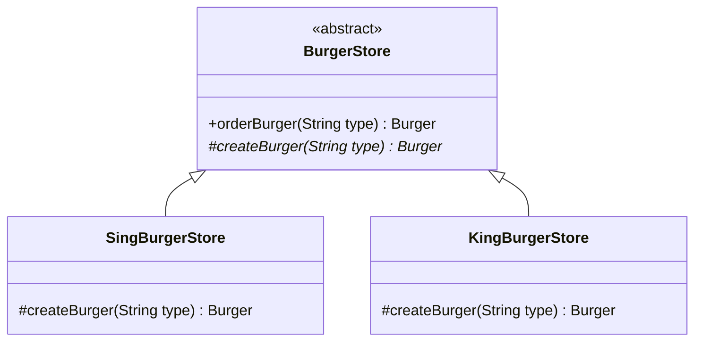
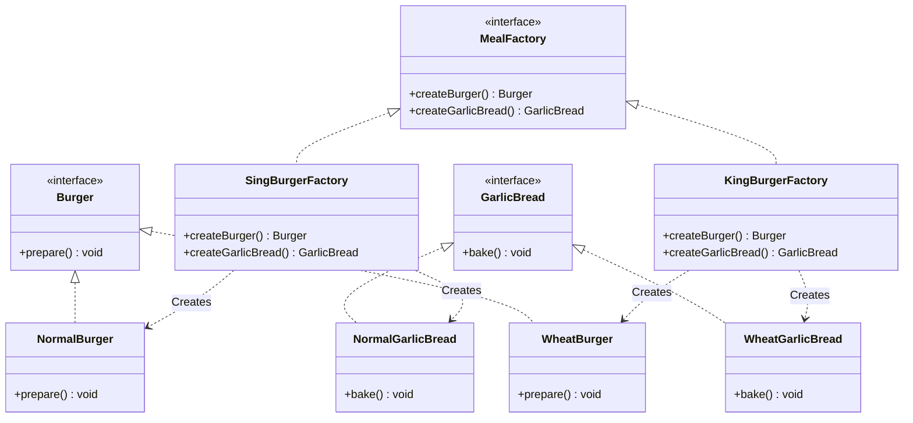

# 09. Factory Design Pattern

> 💡 **Quick Revision Anchor**
> - The **Factory Pattern** separates object instantiation from business logic. Rather than scattering `new` operators and `if-else` blocks across business classes, object creation is isolated inside factories.
> - The 3 Tiers:
>   1. **Simple Factory:** A single class with a parameterized method isolating `if-else` instantiation (design idiom).
>   2. **Factory Method (GoF):** Uses inheritance where creator subclasses decide which product subclass to instantiate (`SingBurgerStore` vs `KingBurgerStore`).
>   3. **Abstract Factory (GoF):** Defines an interface to create entire **families of related products** (e.g., Burger + Garlic Bread) without specifying concrete classes.

---

## 1. What Problem Are We Solving?

In the Strategy Pattern, a client receives its dependency (e.g., `TalkStrategy` or `PaymentStrategy`) via constructor injection:
```java
public class Robot {
    private TalkStrategy talk;
    public Robot(TalkStrategy talk) { this.talk = talk; }
}
```
**The Missing Question:** *Who creates the concrete `TalkStrategy` in the first place?*

If client code creates concrete objects directly using conditionals:
```java
// ❌ Problem: Client mixes business logic with instantiation logic
if (type.equals("BASIC")) {
    burger = new BasicBurger();
} else if (type.equals("PREMIUM")) {
    burger = new PremiumBurger();
}
```
- **Violates SRP:** Business classes become cluttered with instantiation rules.
- **Violates OCP:** Introducing a new product forces modification of every class that instantiates products.
- **Duplication:** Instantiation conditionals are duplicated across multiple callers.

---

## 2. Design Evolution: The 3 Factory Tiers

The lecture models a real-world burger business across 3 progressive tiers:

### Tier 1: Simple Factory
Extract instantiation into a standalone factory class.
```java
class SimpleBurgerFactory {
    public Burger createBurger(String type) {
        if (type.equalsIgnoreCase("BASIC")) return new BasicBurger();
        if (type.equalsIgnoreCase("PREMIUM")) return new PremiumBurger();
        throw new IllegalArgumentException("Unknown type: " + type);
    }
}
```
*Limitation:* If franchises prepare burgers differently, a single class still accumulates franchise-specific conditional logic.

### Tier 2: Factory Method (GoF Pattern)
When franchises have distinct recipes:
- **Sing Burger Store:** Uses standard flour (Normal Burger).
- **King Burger Store:** Uses 100% whole wheat (Wheat Burger).

The base `BurgerStore` defines an abstract `createBurger()` method, and franchise subclasses decide which concrete burger to instantiate:




### Tier 3: Abstract Factory (GoF Pattern — Families of Related Products)
When franchises offer complementary product combos (e.g., **Burger + Garlic Bread**):
- **Sing Burger Franchise:** Produces `NormalBurger` and `NormalGarlicBread`.
- **King Burger Franchise:** Produces `WheatBurger` and `WheatGarlicBread`.

An **Abstract Factory** declares methods to create the entire family of related products, guaranteeing compatible products are never mixed.

---

## 3. Visual Architecture (Abstract Factory)




---

## 4. Concise Java Implementation (Primary Lecture Example)

```java
// ==========================================
// 1. PRODUCT FAMILIES
// ==========================================
interface Burger { void prepare(); }
class NormalBurger implements Burger {
    @Override public void prepare() { System.out.println("🍔 [Sing Burger] Preparing classic Normal Burger."); }
}
class WheatBurger implements Burger {
    @Override public void prepare() { System.out.println("🍔 [King Burger] Preparing healthy Wheat Burger."); }
}

interface GarlicBread { void bake(); }
class NormalGarlicBread implements GarlicBread {
    @Override public void bake() { System.out.println("🥖 [Sing Bakery] Baking standard Garlic Bread."); }
}
class WheatGarlicBread implements GarlicBread {
    @Override public void bake() { System.out.println("🥖 [King Bakery] Baking whole-wheat Garlic Bread."); }
}

// ==========================================
// 2. ABSTRACT FACTORY
// ==========================================
interface MealFactory {
    Burger createBurger();
    GarlicBread createGarlicBread();
}

class SingBurgerFactory implements MealFactory {
    @Override public Burger createBurger() { return new NormalBurger(); }
    @Override public GarlicBread createGarlicBread() { return new NormalGarlicBread(); }
}

class KingBurgerFactory implements MealFactory {
    @Override public Burger createBurger() { return new WheatBurger(); }
    @Override public GarlicBread createGarlicBread() { return new WheatGarlicBread(); }
}

// ==========================================
// 3. CLIENT CONSUMER
// ==========================================
class MealComboClient {
    private final Burger burger;
    private final GarlicBread garlicBread;

    // Receives abstract factory, completely decoupled from concrete classes
    public MealComboClient(MealFactory factory) {
        this.burger = factory.createBurger();
        this.garlicBread = factory.createGarlicBread();
    }

    public void serve() {
        burger.prepare();
        garlicBread.bake();
        System.out.println("✅ Meal combo served successfully!\n");
    }
}

// ==========================================
// Driver Execution
// ==========================================
public class Main {
    public static void main(String[] args) {
        System.out.println("--- Ordering from Sing Burger (Normal Family) ---");
        MealComboClient regularMeal = new MealComboClient(new SingBurgerFactory());
        regularMeal.serve();

        System.out.println("--- Ordering from King Burger (Wheat Family) ---");
        MealComboClient wheatMeal = new MealComboClient(new KingBurgerFactory());
        wheatMeal.serve();
    }
}
```

---

## 5. Factory vs. Strategy (The Conceptual Connection)

A crucial discussion from the lecture: *Could a Notification System (SMS, Push, Email) be solved by Strategy or Factory?*

| Dimension | Strategy Pattern | Factory Pattern |
| :--- | :--- | :--- |
| **Core Question** | *"Which **behavior / algorithm** should execute?"* | *"Which **concrete object** should be created?"* |
| **Lifecycle Phase** | **Execution / Runtime Behavior** | **Instantiation / Creation** |
| **Assumption** | Assumes the dependency object already exists. | Solves how to instantiate the dependency cleanly. |
| **Synergy** | A **Factory** is frequently used to instantiate the appropriate **Strategy**! | |

---

## 6. Interview Questions & Key Discussion Points

1. **What is the difference between Factory Method and Abstract Factory?**
   - *Answer*: Factory Method uses class inheritance—a creator class defines an abstract creation method and subclasses decide which single product to instantiate. Abstract Factory uses composition—an interface declares methods to create whole *families of related products* (e.g., Burger + Garlic Bread) without binding to concrete classes.
2. **Is Simple Factory one of the official 23 GoF design patterns?**
   - *Answer*: No. Simple Factory is an object-oriented programming idiom/utility. Factory Method and Abstract Factory are the two official GoF creational patterns.
3. **When would you choose Abstract Factory over Factory Method?**
   - *Answer*: When your system needs to ensure that multiple related products belong to the same product family (e.g., Wheat Burger must always pair with Wheat Garlic Bread, or dark-theme buttons must always pair with dark-theme scrollbars).

---

## 7. Quick Revision

### Core Idea
Factory encapsulates object creation, eliminating `new` and conditional instantiation logic from business classes.

### Remember
- **Sing Burger:** Normal products; **King Burger:** Wheat products.
- **Factory Method:** Defer creation of a single product to subclasses via inheritance.
- **Abstract Factory:** Create coordinated families of related products via composition.
- **Strategy vs Factory:** Strategy executes algorithms; Factory creates objects.
