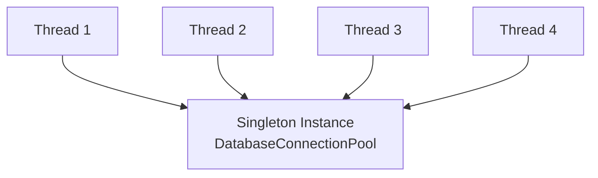

# 10. Singleton Design Pattern

> 💡 **Quick Revision Anchor**: 
> - **Type**: Creational Design Pattern.
> - **Core Intent**: Guarantees that a class has **strictly one instance** in JVM memory and provides a single global access point to it.
> - **Interview Gold**: Always be ready to code **Double-Checked Locking with `volatile`**, explain the **CPU instruction reordering hazard**, and detail the **Bill Pugh / Enum** approaches.

---

## 1. Context & Use Cases

In enterprise software engineering, certain resources must have **exactly one coordinator** across the entire application lifecycle:
- **Database Connection Pools**: Managing socket connections to Postgres/MySQL.
- **Application Configuration Managers**: Reading environment variables and JSON config files once.
- **Loggers**: Writing sequential log lines to a centralized file or ELK buffer without file lock collisions.
- **Hardware Drivers**: Printer spooler, audio card output buffer.



---

## 2. Evolution of the 6 Singleton Implementations

### Approach 1: Eager Initialization
The instance is created at the time of class loading by the JVM classloader.

```java
public class EagerSingleton {
    // Created immediately upon class loading
    private static final EagerSingleton instance = new EagerSingleton();

    private EagerSingleton() {} // Private constructor prevents external 'new'

    public static EagerSingleton getInstance() {
        return instance;
    }
}
```
- **Pros**: Thread-safe without explicit synchronization; simple.
- **Cons**: **Wastes memory** if the application never actually invokes `getInstance()` during runtime.

---

### Approach 2: Classic Lazy Initialization (Thread-Unsafe)
Creates the instance only when `getInstance()` is first invoked.

```java
public class LazyUnsafeSingleton {
    private static LazyUnsafeSingleton instance;

    private LazyUnsafeSingleton() {}

    public static LazyUnsafeSingleton getInstance() {
        if (instance == null) { // ❌ Race Condition: Two threads can enter simultaneously!
            instance = new LazyUnsafeSingleton();
        }
        return instance;
    }
}
```
- **Cons**: In a multithreaded environment, if Thread A and Thread B reach `if (instance == null)` at the same time, two distinct instances are created, violating the pattern.

---

### Approach 3: Synchronized Method (Thread-Safe but Slow)
```java
public class SynchronizedSingleton {
    private static SynchronizedSingleton instance;

    private SynchronizedSingleton() {}

    public static synchronized SynchronizedSingleton getInstance() {
        if (instance == null) {
            instance = new SynchronizedSingleton();
        }
        return instance;
    }
}
```
- **Pros**: 100% thread-safe.
- **Cons**: `synchronized` introduces major performance overhead on **every single call**, even after the instance is already created.

---

### Approach 4: Double-Checked Locking (DCL) with `volatile` ⭐

Double-Checked Locking checks for initialization twice, acquiring a lock only once during initial creation.

```java
public class DclSingleton {
    // ⚠️ CRITICAL: 'volatile' is MANDATORY to prevent instruction reordering!
    private static volatile DclSingleton instance;

    private DclSingleton() {}

    public static DclSingleton getInstance() {
        if (instance == null) { // 1st Check (No locking overhead)
            synchronized (DclSingleton.class) {
                if (instance == null) { // 2nd Check (Guards race condition)
                    instance = new DclSingleton();
                }
            }
        }
        return instance;
    }
}
```

#### Why is the `volatile` Keyword Mandatory? (The Instruction Reordering Hazard)
When the JVM executes `instance = new DclSingleton();`, it involves **3 distinct operations**:
1. `allocateMemory()`: Allocate raw memory space for the object on the Heap.
2. `ctorSingleton()`: Call constructor to initialize object fields.
3. `instance = memoryAddress`: Point the `instance` reference variable to the allocated memory.

The JVM JIT compiler or CPU architecture is free to **reorder** instructions for optimization:
$$\text{Reordered execution}: (1) \rightarrow (3) \rightarrow (2)$$
If Thread A executes steps (1) and (3) but has **not yet executed (2)**, the reference is non-null. If Thread B calls `getInstance()`, it passes the first check (`instance != null`), returns the reference, and attempts to read its fields—**resulting in an unexpected NullPointerException or corrupted state!**
The `volatile` keyword guarantees a **happens-before** memory barrier, preventing instruction reordering.

---

### Approach 5: Bill Pugh Static Inner Helper Class (Recommended)

Leverages the Java Language Specification (JLS) class loader guarantee: an inner static class is **not** loaded into memory until it is referenced for the first time.

```java
public class BillPughSingleton {
    private BillPughSingleton() {}

    // Static nested class: Loaded ONLY when getInstance() is called!
    private static class SingletonHelper {
        private static final BillPughSingleton INSTANCE = new BillPughSingleton();
    }

    public static BillPughSingleton getInstance() {
        return SingletonHelper.INSTANCE;
    }
}
```
- **Pros**: Lazy loaded, 100% thread-safe, zero synchronization penalty, clean and concise.

---

### Approach 6: Enum Singleton (Joshua Bloch - Effective Java) ⭐

```java
public enum EnumSingleton {
    INSTANCE;

    public void executeQuery(String sql) {
        System.out.println("Executing SQL: " + sql);
    }
}
```
- **Why is Enum Singleton the most robust?**
  The JVM guarantees that any enum value is instantiated only once in a Java program. It is **100% immune to Reflection attacks, Serialization attacks, and Cloning attacks!**

---

## 3. How to Defend Singleton Against Attacks

| Attack Vector | How It Breaks Singleton | The Defense Mechanism |
| :--- | :--- | :--- |
| **Reflection API** | `constructor.setAccessible(true)` invokes private constructor | Throw an exception inside constructor if instance already exists: `if (instance != null) throw new RuntimeException("Cannot instantiate via reflection!");` |
| **Serialization** | Serializing to file and deserializing back creates a new instance | Implement `protected Object readResolve() { return getInstance(); }` to enforce returning the existing instance |
| **Cloning** | Calling `clone()` creates a shallow bitwise copy | Override `clone()` and throw `new CloneNotSupportedException("Singleton cannot be cloned!")` |

---

## 4. Summary Matrix

| Implementation | Lazy Loaded? | Thread-Safe? | Performance Overhead | Immune to Reflection? |
| :--- | :---: | :---: | :---: | :---: |
| **Eager** | ❌ No | ✅ Yes | None | ❌ No |
| **Lazy (Unsafe)** | ✅ Yes | ❌ No | None | ❌ No |
| **Synchronized Method** | ✅ Yes | ✅ Yes | High | ❌ No |
| **Double-Checked Locking** | ✅ Yes | ✅ Yes | Low (only once) | ❌ No |
| **Bill Pugh Inner Class** | ✅ Yes | ✅ Yes | None | ❌ No |
| **Enum** | ❌ No | ✅ Yes | None | ✅ **Yes** |
