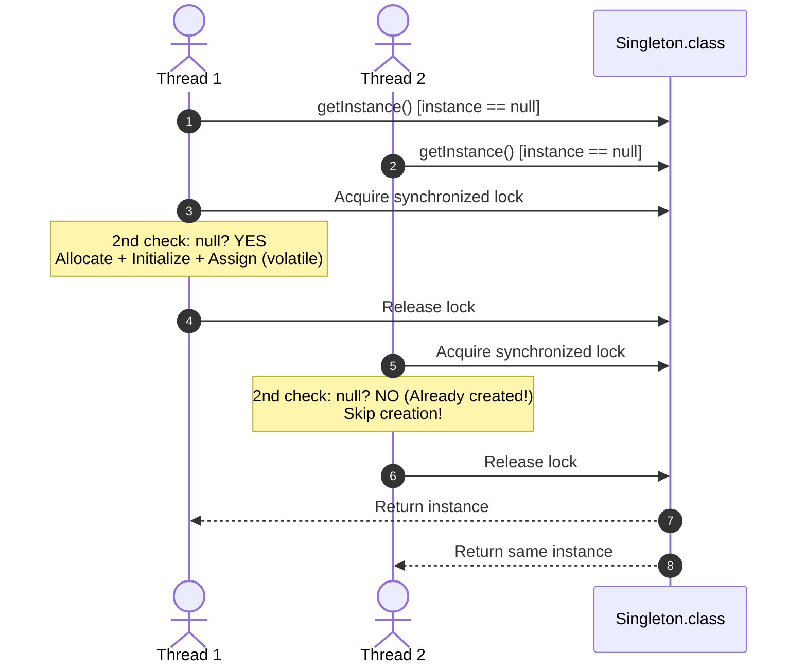

# 10. Singleton Design Pattern

> 💡 **Quick Revision Anchor**
> - The **Singleton Pattern** ensures a class has strictly **one instance** in memory and provides a single, global point of access.
> - Evolutionary path: Eager initialization $\rightarrow$ Thread-unsafe Lazy $\rightarrow$ Synchronized Method (performance bottleneck) $\rightarrow$ **Double-Checked Locking (DCL) with `volatile`** $\rightarrow$ **Bill Pugh (Static Inner Class)** $\rightarrow$ **Enum Singleton**.
> - Primary practical use cases: **Logging System**, **Database Connection Pool**, and **Configuration Manager** (Single Source of Truth).

---

## 1. What Problem Are We Solving?

Certain resources must have exactly one coordinating instance across the entire application:
1. **Database Connections:** Having every service spin up uncoordinated database connection objects exhausts connection limits and leaks memory.
2. **Logging System:** Multiple uncoordinated logger instances writing to the same disk file cause interleaved, corrupt log entries.
3. **Configuration Manager:** Application configuration (API keys, environment settings) must act as a single source of truth; having multiple config objects risks inconsistent state.

---

## 2. Naive Approaches & Their Failures

### 1. Thread-Unsafe Lazy Initialization
```java
// ❌ FAILS: Race condition in multithreaded environments
class UnsafeSingleton {
    private static UnsafeSingleton instance;
    private UnsafeSingleton() {}

    public static UnsafeSingleton getInstance() {
        if (instance == null) { // 💥 Two threads can check this simultaneously!
            instance = new UnsafeSingleton();
        }
        return instance;
    }
}
```

### 2. Synchronized Method (Severe Bottleneck)
```java
// ❌ FAILS: Unnecessary synchronization on EVERY read
public static synchronized SlowSingleton getInstance() {
    if (instance == null) {
        instance = new SlowSingleton();
    }
    return instance;
}
```
Synchronizing the entire method incurs a 10x–100x performance penalty on every invocation, even though synchronization is only needed during initial creation.

---

## 3. Design Evolution: Toward Thread-Safe Efficiency

### A. Eager Initialization
Create the instance when the class is loaded by the JVM:
```java
class EagerSingleton {
    private static final EagerSingleton instance = new EagerSingleton();
    private EagerSingleton() {}
    public static EagerSingleton getInstance() { return instance; }
}
```
- **Advantage:** Simple and inherently thread-safe.
- **Disadvantage:** Wastes memory if the object is expensive to instantiate and is never used by the client.

### B. Double-Checked Locking (DCL) with `volatile`
Check `if (instance == null)` twice, synchronizing only during the initial creation:
```java
class DclSingleton {
    private static volatile DclSingleton instance; // volatile prevents instruction reordering
    private DclSingleton() {}

    public static DclSingleton getInstance() {
        if (instance == null) { // 1st Check (No locking)
            synchronized (DclSingleton.class) {
                if (instance == null) { // 2nd Check (Guarded)
                    instance = new DclSingleton();
                }
            }
        }
        return instance;
    }
}
```

> ⚠️ **Why `volatile` is mandatory in DCL:**  
> `instance = new DclSingleton();` executes in 3 steps:  
> 1. Allocate memory space.  
> 2. Initialize constructor fields.  
> 3. Assign memory address to `instance`.  
> Without `volatile`, the CPU/compiler can reorder steps to $1 \rightarrow 3 \rightarrow 2$. Another thread seeing `instance != null` at Check 1 might receive a **partially initialized object** and crash!

---

## 4. Visual Architecture (DCL Flow)



---

## 5. Concise Java Implementations

```java
// ==========================================
// 1. Double-Checked Locking (DCL)
// ==========================================
public class DatabaseConnection {
    private static volatile DatabaseConnection instance;

    private DatabaseConnection() {
        System.out.println("🔌 Database connection pool initialized.");
    }

    public static DatabaseConnection getInstance() {
        if (instance == null) {
            synchronized (DatabaseConnection.class) {
                if (instance == null) {
                    instance = new DatabaseConnection();
                }
            }
        }
        return instance;
    }

    public void executeQuery(String query) {
        System.out.println("Executing: " + query);
    }
}

// ==========================================
// 2. Bill Pugh Static Inner Class (Recommended Clean Java)
// ==========================================
class ConfigurationManager {
    private ConfigurationManager() {
        System.out.println("⚙️ Configuration settings loaded.");
    }

    // JVM loads inner class only when getInstance() is referenced
    private static class Holder {
        private static final ConfigurationManager INSTANCE = new ConfigurationManager();
    }

    public static ConfigurationManager getInstance() {
        return Holder.INSTANCE;
    }
}

// ==========================================
// 3. Enum Singleton (Joshua Bloch - Immune to Reflection/Serialization)
// ==========================================
enum AppLogger {
    INSTANCE;
    public void log(String message) {
        System.out.println("[LOG] " + message);
    }
}

// ==========================================
// Driver Demonstration
// ==========================================
class Main {
    public static void main(String[] args) {
        DatabaseConnection db1 = DatabaseConnection.getInstance();
        DatabaseConnection db2 = DatabaseConnection.getInstance();
        System.out.println("Same DB instance? " + (db1 == db2)); // true

        ConfigurationManager cfg1 = ConfigurationManager.getInstance();
        ConfigurationManager cfg2 = ConfigurationManager.getInstance();
        System.out.println("Same Config instance? " + (cfg1 == cfg2)); // true

        AppLogger.INSTANCE.log("System initialized successfully.");
    }
}
```

---

## 6. Defending Singleton Against Attack Vectors

| Attack Vector | How It Breaks Singleton | Defense Mechanism |
| :--- | :--- | :--- |
| **Reflection API** | `constructor.setAccessible(true)` | Throw exception inside constructor if `instance != null`. |
| **Serialization** | Deserializing from a byte stream creates a new instance | Implement `readResolve()` returning `getInstance()`. |
| **Cloning** | Calling `clone()` creates a shallow copy | Override `clone()` to throw `CloneNotSupportedException`. |
| **Enum Singleton** | Enums are fundamentally protected by the JVM | JVM internally guarantees enum constants are instantiated only once. |

---

## 7. Interview Questions & Key Discussion Points

1. **Why is the `volatile` keyword essential in Double-Checked Locking?**
   - *Answer*: It creates a memory barrier that prevents instruction reordering by the compiler/CPU, guaranteeing that memory allocation and constructor initialization finish before the reference address is assigned to `instance`.
2. **What is the Bill Pugh Singleton approach and why is it preferred?**
   - *Answer*: It wraps the singleton instance in a private static inner helper class. Because the JVM does not load the inner class into memory until `getInstance()` is called, it achieves lazy initialization and thread safety with zero synchronization overhead.
3. **What are the primary real-world use cases for Singleton?**
   - *Answer*: Logging engines, Database connection pools, Hardware device spoolers, and Configuration managers (where application-wide single source of truth is required).

---

## 8. Quick Revision

### Core Idea
Singleton enforces strictly one instance of a class across the application and provides a global access point.

### Remember
- **3 Pillars of Singleton:** Private constructor, private static variable, public static getter.
- **Double-Checked Locking:** First check avoids locking overhead; second check prevents race condition under the lock; `volatile` prevents instruction reordering.
- **Bill Pugh Solution:** Uses a static nested class for lock-free lazy loading.
- **Enum Singleton:** Simplest and most robust defense against reflection and serialization attacks.
