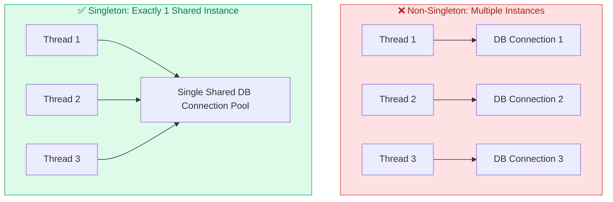
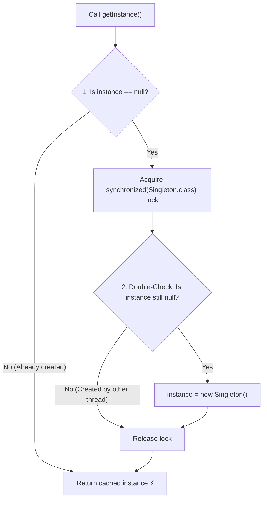

# 10. Singleton Design Pattern

> 💡 **Quick Revision Anchor**: `One Instance, Global Access Point, Double-Checked Locking & Volatile`

---

## 1. Intent & Problem Motivation

The **Singleton Design Pattern** is a **Creational Design Pattern** that ensures a class has **only one instance throughout the entire lifecycle of the application**, while providing a global access point to that instance.

### When is Singleton Required?
- Shared resources where multiple instances cause race conditions, data inconsistency, or memory bloat:
  - **Database Connection Pools** (e.g., HikariCP)
  - **Configuration Managers** (loading `application.properties` once)
  - **Application Loggers** (e.g., Log4j writing to a single log file)
  - **Cache Managers** (In-memory application cache)



---

## 2. Core Implementation Requirements

To convert any class into a Singleton:
1. **Private Constructor**: Prevents other classes from using the `new` operator.
2. **Private Static Field**: Holds the unique single instance.
3. **Public Static Method (`getInstance()`)**: Serves as the global gateway to return the instance.

---

## 3. Implementations & Evolution

### 1. Eager Initialization (Simple, but memory-wasteful)
```java
public class EagerSingleton {
    // Created immediately upon class loading by JVM
    private static final EagerSingleton INSTANCE = new EagerSingleton();

    private EagerSingleton() {}

    public static EagerSingleton getInstance() {
        return INSTANCE;
    }
}
```
*Drawback*: If the class is heavy and never used by the client, memory is allocated unnecessarily.

---

### 2. Classic Lazy Initialization (Thread-Unsafe)
```java
// ❌ DANGEROUS IN MULTI-THREADED APPS
public class UnsafeLazySingleton {
    private static UnsafeLazySingleton instance;

    private UnsafeLazySingleton() {}

    public static UnsafeLazySingleton getInstance() {
        if (instance == null) {
            // Race condition: Thread 1 and Thread 2 both see instance == null!
            instance = new UnsafeLazySingleton();
        }
        return instance;
    }
}
```

---

### 3. Thread-Safe Double-Checked Locking (Industry Standard)
To avoid synchronizing every call (which creates a huge performance bottleneck), we check `instance == null` **twice**:



```java
public class DoubleCheckedSingleton {
    // volatile is CRUCIAL to prevent instruction reordering!
    private static volatile DoubleCheckedSingleton instance;

    private DoubleCheckedSingleton() {
        System.out.println("Singleton instance created.");
    }

    public static DoubleCheckedSingleton getInstance() {
        if (instance == null) { // First check (no lock penalty)
            synchronized (DoubleCheckedSingleton.class) {
                if (instance == null) { // Second check (safe inside lock)
                    instance = new DoubleCheckedSingleton();
                }
            }
        }
        return instance;
    }
}
```

> [!IMPORTANT]
> ### Why is `volatile` Mandatory in Double-Checked Locking?
> Creating an object `new Singleton()` is **not an atomic operation** in JVM bytecode. It involves 3 distinct steps:
> 1. `memory = allocate();` (Allocate heap memory)
> 2. `ctorSingleton(memory);` (Invoke constructor to initialize fields)
> 3. `instance = memory;` (Assign memory address to reference)
>
> Without `volatile`, JVM or CPU may reorder step 3 before step 2. Another thread checking the outer `instance == null` would see a non-null reference pointing to a **half-initialized, corrupted object**! The `volatile` keyword guarantees memory visibility and establishes a **happens-before** barrier preventing reordering.

---

### 4. Bill Pugh Singleton (Static Inner Helper Class)
Leverages the JVM's class-loading mechanism to achieve thread-safe, lazy initialization with zero synchronization overhead:

```java
public class BillPughSingleton {
    private BillPughSingleton() {}

    // Static inner class is loaded ONLY when getInstance() is called
    private static class SingletonHelper {
        private static final BillPughSingleton INSTANCE = new BillPughSingleton();
    }

    public static BillPughSingleton getInstance() {
        return SingletonHelper.INSTANCE;
    }
}
```

---

### 5. Enum Singleton (Effective Java Recommendation)
```java
public enum EnumSingleton {
    INSTANCE;

    public void executeQuery(String sql) {
        System.out.println("Executing: " + sql);
    }
}
```
*Benefits*: Automatically handles serialization, thread safety, and guarantees immunity against **Reflection attacks** (`Constructor.setAccessible(true)` cannot instantiate enums).

---

## 4. How to Break a Singleton (and How to Defend)

| Attack Vector | How It Breaks | How to Defend |
| :--- | :--- | :--- |
| **Reflection** | `AccessibleObject.setAccessible(true)` invokes private constructor. | Throw an exception inside constructor if `instance != null`. |
| **Serialization** | Deserializing a singleton creates a brand new instance. | Implement the `protected Object readResolve()` method to return `getInstance()`. |
| **Cloning** | Calling `clone()` creates a duplicate object. | Override `clone()` and throw `CloneNotSupportedException`. |
