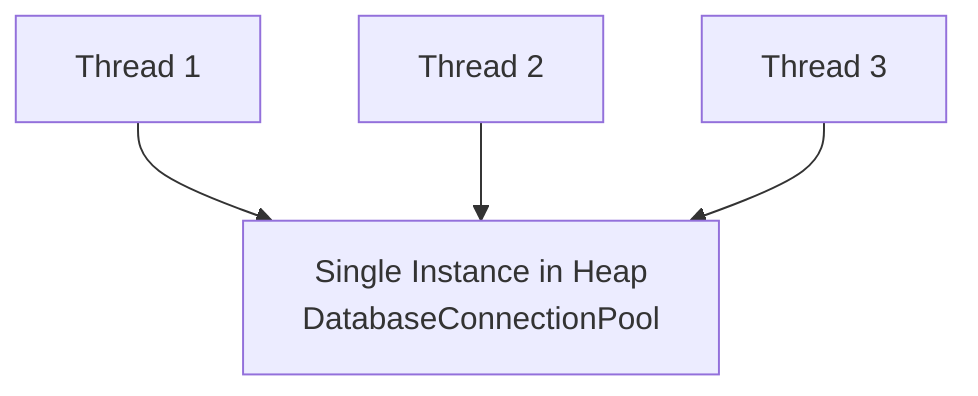
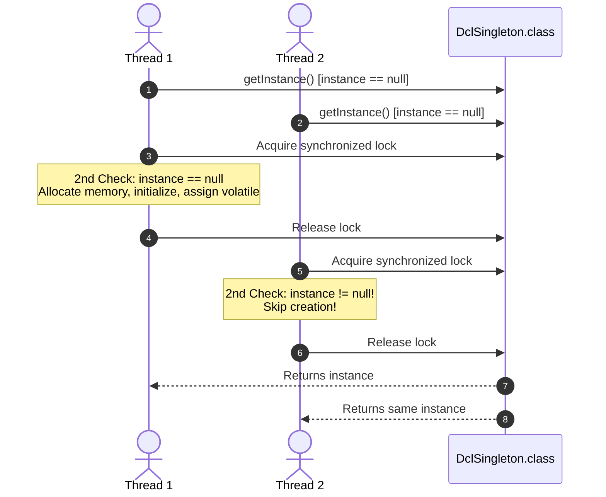

# 10. Singleton Design Pattern

> 💡 **Quick Revision Anchor**: A comprehensive, interview-focused examination of the Singleton Design Pattern faithfully derived from the complete lecture transcript. Traces the complete evolutionary path: **Eager Initialization** vs **Thread-Unsafe Lazy Initialization**, the performance bottlenecks of **Synchronized Method**, the mechanics and memory-barrier intricacies of **Double-Checked Locking (DCL)** with `volatile`, the elegant **Bill Pugh Static Inner Class Holder**, and the production-standard **Enum Singleton**. Thoroughly analyzes attack vectors (Reflection, Serialization, Cloning) and how to protect against them in interview discussions.

---

## 1. Overview

The **Singleton Design Pattern** is a creational design pattern that guarantees a class has **strictly one instance** in JVM memory throughout the application lifecycle and provides a single, global access point to that instance.



---

## 2. What Problem Are We Solving?

Certain physical or logical resources must be managed by a single coordinator:
1. **Shared Resource Contention**: Having multiple instances of a `DatabaseConnectionPool` creates connection limits exhaustion, memory leaks, and inconsistent transaction isolation.
2. **Conflicting File Locks**: Multiple loggers writing concurrently to the same disk file without coordination cause corrupt, interleaved log files.
3. **Expensive Initialization**: Loading large configuration files or machine learning weights repeatedly wastes CPU and heap space.

---

## 3. Core Concepts

To enforce a Singleton in Java, a class must have:
1. **Private Constructor**: Prevents external instantiation via the `new` operator.
2. **Private Static Variable**: Holds the single instance of the class.
3. **Public Static Getter (`getInstance()`)**: Provides the global access point, implementing lazy or eager initialization.

---

## 4. Important Terminology

- **Eager Initialization**: Instantiating the object at JVM class-loading time.
- **Lazy Initialization**: Deferring object instantiation until the first time `getInstance()` is called.
- **Double-Checked Locking (DCL)**: Checking if an instance is null twice, synchronizing only once during initial creation.
- **Memory Barrier / Happens-Before**: A CPU instruction barrier enforced by the `volatile` keyword that prevents instruction reordering.
- **Bill Pugh Singleton**: An implementation using a static nested helper class loaded on-demand by the JVM.

---

## 5. Real-World Analogy

### 1. President of a Country / Prime Minister
- A nation has multiple ministers, governors, and citizens, but exactly **one** Commander-in-Chief / President at any given time. All executive orders funnel through this single office.

### 2. Office Shared Printer Spooler
- In an office of 100 employees, everyone sends documents to a single shared printer. If every employee had their own printer spooler running on the same machine, documents would print interleaved on the same physical sheets. A single Spooler Singleton queues and prints jobs sequentially.

---

## 6. Naive / Bad Design

### 1. Classic Lazy Initialization (Thread-Unsafe)
```java
// ❌ Naive Anti-Pattern: Race condition in multithreaded environments
public class UnsafeSingleton {
    private static UnsafeSingleton instance;

    private UnsafeSingleton() {}

    public static UnsafeSingleton getInstance() {
        if (instance == null) { // 💥 Two threads can evaluate this to true simultaneously!
            instance = new UnsafeSingleton();
        }
        return instance;
    }
}
```

### 2. Synchronized Method (Severe Performance Bottleneck)
```java
// ❌ Naive Anti-Pattern: Synchronizing every single read call
public class SlowSingleton {
    private static SlowSingleton instance;
    private SlowSingleton() {}

    public static synchronized SlowSingleton getInstance() { // 💥 Synchronization overhead on EVERY call!
        if (instance == null) {
            instance = new SlowSingleton();
        }
        return instance;
    }
}
```
Synchronizing the entire method causes a massive 10x–100x performance drop under high concurrent traffic, even though locking is only needed during initial creation.

---

## 7. Design Evolution

1. **Step 1 (Eager)**: Simple, but creates the object even if the application never uses it.
2. **Step 2 (Synchronized Method)**: Thread-safe, but severe performance penalty.
3. **Step 3 (Double-Checked Locking with `volatile`)**: Checks twice, locks only once, and uses `volatile` to stop CPU instruction reordering.
4. **Step 4 (Bill Pugh Holder)**: Zero synchronization, lazy-loaded via JVM classloader guarantees.
5. **Step 5 (Enum Singleton)**: Complete protection against Reflection, Serialization, and Cloning.

---

## 8. Final Design

### Architecture
```mermaid
classDiagram
    class DclSingleton {
        -DclSingleton instance$
        -DclSingleton()
        +getInstance()$ DclSingleton
    }

    class BillPughSingleton {
        -BillPughSingleton()
        +getInstance()$ BillPughSingleton
    }
    class SingletonHelper {
        -BillPughSingleton INSTANCE$
    }

    class EnumSingleton {
        <<enumeration>>
        INSTANCE
        +executeQuery(String sql) void
    }

    BillPughSingleton +-- SingletonHelper : Inner Static Class
```

### Mermaid Sequence Diagram (Double-Checked Locking Flow)


---

## 9. Java Implementation

```java
import java.io.Serializable;

// ==========================================
// 1. DOUBLE-CHECKED LOCKING (DCL) WITH VOLATILE
// ==========================================
public class DclSingleton implements Serializable, Cloneable {
    // ⚠️ CRITICAL: volatile prevents CPU instruction reordering!
    private static volatile DclSingleton instance;

    // Defense against Reflection attack
    private DclSingleton() {
        if (instance != null) {
            throw new RuntimeException("Reflection attack blocked: Singleton already exists!");
        }
    }

    public static DclSingleton getInstance() {
        if (instance == null) { // 1st Check: Avoids synchronization penalty once initialized
            synchronized (DclSingleton.class) {
                if (instance == null) { // 2nd Check: Guards race condition
                    instance = new DclSingleton();
                }
            }
        }
        return instance;
    }

    // Defense against Serialization attack
    protected Object readResolve() {
        return getInstance();
    }

    // Defense against Cloning attack
    @Override
    protected Object clone() throws CloneNotSupportedException {
        throw new CloneNotSupportedException("Singleton cannot be cloned!");
    }
}

// ==========================================
// 2. BILL PUGH SINGLETON (Recommended Clean Approach)
// ==========================================
public class BillPughSingleton {
    private BillPughSingleton() {}

    // Inner static class: Loaded by JVM ONLY when getInstance() is invoked!
    private static class SingletonHelper {
        private static final BillPughSingleton INSTANCE = new BillPughSingleton();
    }

    public static BillPughSingleton getInstance() {
        return SingletonHelper.INSTANCE;
    }
}

// ==========================================
// 3. ENUM SINGLETON (Joshua Bloch - Most Robust)
// ==========================================
public enum EnumSingleton {
    INSTANCE;

    public void executeQuery(String sql) {
        System.out.println("💾 [Database] Executing: " + sql);
    }
}
```

---

## 10. Code Walkthrough

1. **Why `volatile` is Mandatory in DCL**:
   `instance = new DclSingleton();` involves 3 operations:
   - (1) Allocate memory space.
   - (2) Initialize object fields via constructor.
   - (3) Assign the memory address to the `instance` variable.
   Without `volatile`, the CPU/JIT compiler can reorder execution to: $(1) \rightarrow (3) \rightarrow (2)$. A concurrent thread checking `if (instance == null)` sees a non-null address, accesses the object before step (2) completes, and crashes on partially initialized state!
2. **Bill Pugh Pattern**: Leverages the Java Language Specification guarantee that a nested static class is not loaded until explicitly referenced.

---

## 11. Important Design Decisions

### Defending Singleton Against Attacks
| Attack Vector | How It Breaks Singleton | Defense Mechanism |
| :--- | :--- | :--- |
| **Reflection API** | `constructor.setAccessible(true)` | Check `if (instance != null) throw new RuntimeException();` in constructor. |
| **Serialization** | Deserializing from byte stream creates a new instance | Implement `protected Object readResolve() { return getInstance(); }`. |
| **Cloning** | Calling `clone()` creates a shallow copy | Override `clone()` to throw `CloneNotSupportedException`. |
| **Enum Approach** | Enums are fundamentally protected by the JVM | The JVM internally guarantees enum constants are instantiated only once. |

---

## 12. Edge Cases

- **Multiple Classloaders**: If an enterprise application uses multiple custom classloaders, each classloader may load its own version of the class, creating multiple singletons. Solution: Bind the singleton to a root classloader or use JNDI.
- **Garbage Collection of Singletons**: In modern JVMs (Java 1.2+), classes referenced by static variables are not collected unless their classloader itself is collected.

---

## 13. Production Considerations

- **Testing Difficulties**: Singletons introduce global state, making it difficult to isolate unit tests or substitute mocks.
- **Dependency Injection Preferred**: In modern frameworks (Spring Boot), beans are singletons by default within the Spring `ApplicationContext` without requiring the anti-pattern of private constructors and static getters.

---

## 14. Advantages

- **Controlled Memory Footprint**: Strictly one instance exists in memory.
- **Global Coordination**: Provides a single point of truth for shared locks, hardware buffers, and connection pools.

---

## 15. Disadvantages / Trade-offs

- **Hidden Dependencies**: Classes querying `Singleton.getInstance()` obscure their dependencies rather than declaring them explicitly in constructors.
- **Concurrency Bottlenecks**: If multiple threads invoke synchronized methods on a single instance, it creates thread contention.

---

## 16. Related Patterns / Alternatives

- **Monostate Pattern**: Allows multiple instances to be created, but all instances share static state behind the scenes.
- **Factory Pattern**: Often implemented as a Singleton.

---

## 17. SOLID / OOP Connections

- **Single Responsibility Violation**: A singleton class often manages both its business domain responsibility AND its own lifecycle instantiation.
- **Dependency Inversion Violation**: Direct calls to `MySingleton.getInstance()` couple callers to a concrete implementation.

---

## 18. Common Mistakes

- **Forgetting `volatile` in Double-Checked Locking**: Leading to intermittent, hard-to-reproduce instruction reordering race conditions.
- **Not Protecting Against Serialization**: Assuming `Serializable` preserves single-instance semantics.

---

## 19. Interview Questions

1. **Why is the `volatile` keyword mandatory in Double-Checked Locking?**
   - *Answer*: Without `volatile`, compiler/CPU instruction reordering can assign the memory address to the reference variable before the constructor finishes execution. Another thread reading the non-null reference would access a partially constructed object.
2. **How do you break a Singleton in Java and how do you prevent it?**
   - *Answer*: Break via Reflection (defend by throwing an exception in constructor), Serialization (defend by implementing `readResolve()`), and Cloning (defend by throwing `CloneNotSupportedException`). Alternatively, use an Enum Singleton which is immune to all three.
3. **What is the Bill Pugh Singleton implementation?**
   - *Answer*: It utilizes a private static inner helper class that holds the singleton instance. The inner class is only loaded when `getInstance()` is called, achieving lazy loading and thread safety without any synchronized blocks.

---

## 20. Quick Revision

### Core Idea
> Singleton guarantees a class has strictly one instance in JVM heap memory and provides a single global access point.

### Remember
- Double-Checked Locking requires `volatile` to stop instruction reordering.
- Bill Pugh inner static class is the recommended clean Java approach.
- Enum Singleton provides JVM-level immunity to Reflection, Serialization, and Cloning.

### Java Implementation Idea
> Use Double-Checked Locking with `private static volatile ClassName instance` and a synchronized block, or an `enum` with a single `INSTANCE` value.

### Most Important Interview Point
> Be ready to explain the 3 operations of `new Object()` and how CPU instruction reordering $(1 \rightarrow 3 \rightarrow 2)$ breaks DCL without `volatile`.

### Common Trap
> Do not synchronize the entire `getInstance()` method; synchronize only the inner block during the first initialization check.
