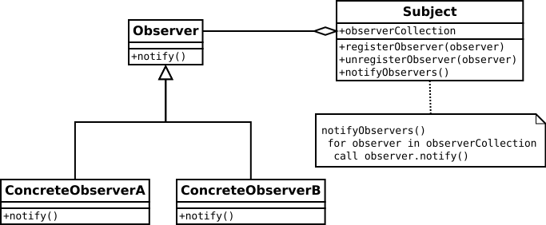
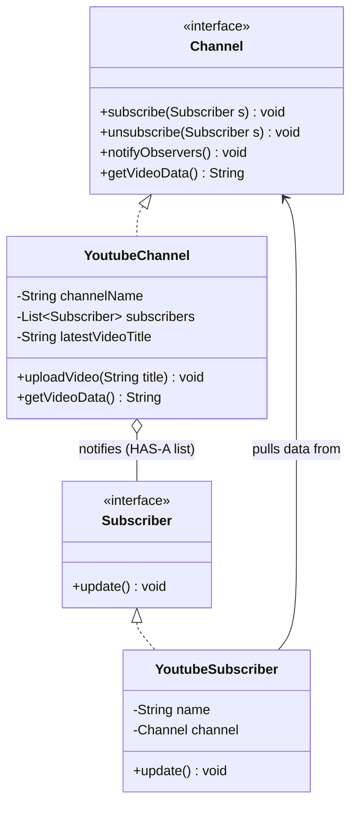

# 12. Observer Design Pattern

> 💡 **Quick Revision Anchor**
> - The **Observer Pattern** defines a one-to-many dependency between objects so that when one object (the **Subject / Observable**) changes state, all its dependents (**Observers / Subscribers**) are notified and updated automatically.
> - Key Philosophy: Inverts the wasteful **Polling Anti-Pattern** into an event-driven **Push Architecture**.
> - Primary lecture example: **YouTube Channel ("Coder Army")** broadcasting new video alerts to registered **Subscribers ("Varun", "Tarun")** with dynamic subscription and unsubscription. Real-world applications include UI event listeners, order tracking updates, and social media feeds.

---

## 1. What Problem Are We Solving?

Suppose you are building a video publishing platform like YouTube:
- A creator runs a channel (**Coder Army**) and publishes tutorials intermittently.
- Multiple viewers (**Varun**, **Tarun**) want to watch new videos the moment they are released.
- How do viewers know when a new video is uploaded?

---

## 2. Initial / Naive Approach: The Polling Anti-Pattern

In a naive implementation, each viewer continuously checks the channel:

```text
❌ Naive Polling Approach:
[Varun] ──── "Any new video?" ────▶ [Coder Army Channel] ──▶ "No"
[Tarun] ──── "Any new video?" ────▶ [Coder Army Channel] ──▶ "No"
... 5 minutes later ...
[Varun] ──── "Any new video?" ────▶ [Coder Army Channel] ──▶ "No"
```

### Why Does Polling Fail?
- **Massive Resource Waste:** Millions of subscribers bombarding servers with redundant requests burns network bandwidth, CPU cycles, and mobile battery.
- **Latency Dilemma:** If clients poll every 15 minutes to save bandwidth, they can experience up to a 15-minute delay after video release. If they poll every second, servers crash.
- **Tightly Coupled Queries:** Subscribers must actively inspect the internal status of the channel.

---

## 3. Key Design Idea: Push over Poll (Inversion of Control)

Invert the responsibility:
1. **Subscribe Once:** Viewers express interest by registering their reference with the channel.
2. **Silent Subject:** The channel performs zero notification work while idle.
3. **Broadcast on State Change:** The instant `uploadVideo()` is called, the channel iterates through its subscriber list and invokes `update()` on each one.

### Push Model vs. Pull Model
- **Push Model:** The Subject sends all modified data inside the notification: `update(String videoTitle)`. Simpler, but couples the payload to all observers.
- **Pull Model (Instructor's Design):** The Subject passes a minimal ping `update()`, and the observer queries the subject's getter `channel.getVideoData()` to pull what it needs.

---

## 4. Visual Architecture





---

## 5. Concise Java Implementation (Primary Lecture Example)

```java
import java.util.ArrayList;
import java.util.List;

// ==========================================
// 1. OBSERVER & SUBJECT INTERFACES
// ==========================================
interface Subscriber {
    void update();
}

interface Channel {
    void subscribe(Subscriber s);
    void unsubscribe(Subscriber s);
    void notifyObservers();
    String getVideoData();
}

// ==========================================
// 2. CONCRETE SUBJECT: YOUTUBE CHANNEL
// ==========================================
class YoutubeChannel implements Channel {
    private final String channelName;
    private final List<Subscriber> subscribers = new ArrayList<>();
    private String latestVideoTitle;

    public YoutubeChannel(String channelName) {
        this.channelName = channelName;
    }

    @Override
    public void subscribe(Subscriber s) {
        if (s != null && !subscribers.contains(s)) {
            subscribers.add(s);
        }
    }

    @Override
    public void unsubscribe(Subscriber s) {
        subscribers.remove(s);
    }

    @Override
    public void notifyObservers() {
        // Defensive copy avoids ConcurrentModificationException if an observer unsubscribes during callback
        List<Subscriber> snapshot = new ArrayList<>(this.subscribers);
        for (Subscriber s : snapshot) {
            s.update();
        }
    }

    public void uploadVideo(String videoTitle) {
        this.latestVideoTitle = videoTitle;
        System.out.println("\n🎬 [" + channelName + "] Uploaded new video: \"" + videoTitle + "\"");
        notifyObservers();
    }

    @Override
    public String getVideoData() {
        return "Check out new video on " + channelName + ": \"" + latestVideoTitle + "\"";
    }
}

// ==========================================
// 3. CONCRETE OBSERVER: YOUTUBE SUBSCRIBER
// ==========================================
class YoutubeSubscriber implements Subscriber {
    private final String name;
    private final Channel channel;

    public YoutubeSubscriber(String name, Channel channel) {
        this.name = name;
        this.channel = channel;
    }

    @Override
    public void update() {
        // Pull model: Observer pulls formatted payload from channel reference
        System.out.println("🔔 [Notification to " + name + "] " + channel.getVideoData());
    }
}

// ==========================================
// 4. CLIENT DEMONSTRATION
// ==========================================
public class ObserverPatternDemo {
    public static void main(String[] args) {
        YoutubeChannel coderArmy = new YoutubeChannel("Coder Army");

        Subscriber varun = new YoutubeSubscriber("Varun", coderArmy);
        Subscriber tarun = new YoutubeSubscriber("Tarun", coderArmy);

        // Step 1: Both subscribe
        coderArmy.subscribe(varun);
        coderArmy.subscribe(tarun);

        // Step 2: Upload 1st Video -> Both receive notification
        coderArmy.uploadVideo("Observer Design Pattern Tutorial");

        // Step 3: Varun unsubscribes
        coderArmy.unsubscribe(varun);
        System.out.println("\n--- Varun unsubscribed ---");

        // Step 4: Upload 2nd Video -> Only Tarun receives notification
        coderArmy.uploadVideo("Decorator Design Pattern Tutorial");
    }
}
```

### Execution Output:
```text
🎬 [Coder Army] Uploaded new video: "Observer Design Pattern Tutorial"
🔔 [Notification to Varun] Check out new video on Coder Army: "Observer Design Pattern Tutorial"
🔔 [Notification to Tarun] Check out new video on Coder Army: "Observer Design Pattern Tutorial"

--- Varun unsubscribed ---

🎬 [Coder Army] Uploaded new video: "Decorator Design Pattern Tutorial"
🔔 [Notification to Tarun] Check out new video on Coder Army: "Decorator Design Pattern Tutorial"
```

---

## 6. Architectural Deep-Dive: The SRP Tension

An insightful question discussed in the lecture:
> *Does `YoutubeChannel` violate the Single Responsibility Principle (SRP) by mixing subscription management with video publishing logic?*

- **The Purist Concern:** `YoutubeChannel` has two reasons to change: if notification mechanics change, or if business video publishing logic changes.
- **The Pragmatic Instructor Take:**
  - In real-world systems, subscriber list management (`subscribe`, `unsubscribe`, `notify`) is **invariant infrastructure code** that rarely changes.
  - Video upload, transcoding, and monetization are what actually evolve.
  - Adding an intermediate `SubscriptionManager` delegate adds indirection and boilerplate without practical gain for typical OOP services.
  - Standard GoF designs intentionally bundle this into the Subject for clarity.

---

## 7. Real-World Applications Mentioned in Lecture

1. **YouTube / Social Media Feeds:** New posts broadcast updates to followers' inboxes or feeds.
2. **Notification Engines:** Order status updates dispatching SMS, Email, and Push alerts (as seen in Tomato App).
3. **UI Event Listeners:** GUI frameworks (`button.addActionListener(listener)`) where button clicks notify event handlers.

---

## 8. Interview Questions & Key Discussion Points

1. **Push vs. Pull: Which is better?**
   - *Push*: Passes data directly into `update(data)`. Best when all observers need the exact same payload.
   - *Pull*: Observer receives a bare `update()` and calls getters on the Subject. Best when different observers require different subsets of subject state.
2. **How do you prevent `ConcurrentModificationException` during notification?**
   - *Answer*: Iterate over a **defensive shallow copy** (`new ArrayList<>(subscribers)`). If an observer calls `unsubscribe()` inside its `update()` method, modifying the original list won't crash the loop.
3. **What is the Lapsed Listener Problem?**
   - *Answer*: If an observer forgets to unsubscribe from a long-lived subject, the subject holds a strong reference to it, preventing Java garbage collection and causing memory leaks.

---

## 9. Quick Revision

```text
Problem: Polling wastes CPU, network bandwidth, and causes high update latency.
Solution: Subject maintains a List of Observers and broadcasts update() upon state change.
Lecture Canonical Example: YoutubeChannel ("Coder Army") -> Subscribers ("Varun", "Tarun").
Key Invariant: Program to interfaces (Channel and Subscriber). Use defensive copy during notification loop.
```
