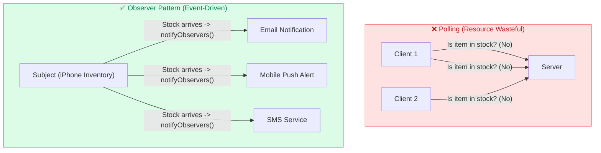
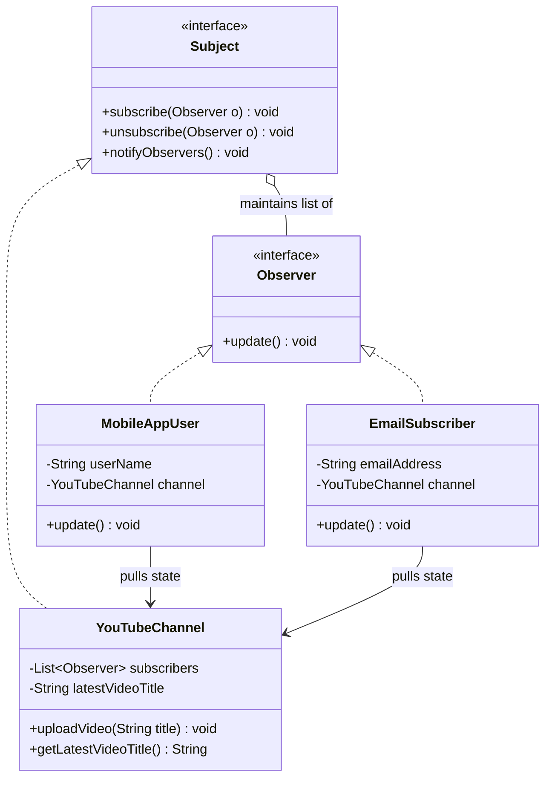

# 12. Observer Design Pattern

> 💡 **Quick Revision Anchor**: `Pub-Sub, Event-Driven State Notification, Push vs Pull`

---

## 1. Intent & Problem Motivation

The **Observer Design Pattern** is a **Behavioral Design Pattern** that defines a **one-to-many dependency** between objects. When the state of one object (the **Subject / Observable**) changes, all its registered dependents (**Observers / Subscribers**) are notified and updated automatically.

### Polling vs. Push Notifications
Imagine a customer waiting for the latest iPhone to come back in stock on Amazon:
- **The Polling Anti-Pattern (Pulling repeatedly)**: The customer checks Amazon every 3 minutes. Hundreds of thousands of users refreshing every minute exhausts server CPU, consumes bandwidth, and wastes client battery.
- **The Observer Pattern (Event-Driven Notification)**: The customer clicks *"Notify Me When in Stock"*. The product maintains a list of subscribers. When inventory is replenished, the system loops through subscribers once and sends an alert.



---

## 2. Observer Architecture (UML Diagram)



---

## 3. Java Implementation Walkthrough

### 1. Subject and Observer Interfaces
```java
public interface Observer {
    void update();
}

public interface Subject {
    void subscribe(Observer observer);
    void unsubscribe(Observer observer);
    void notifyObservers();
}
```

### 2. Concrete Subject (YouTube Channel)
```java
public class YouTubeChannel implements Subject {
    private final String channelName;
    // CopyOnWriteArrayList ensures thread-safe iteration while subscribing/unsubscribing
    private final List<Observer> subscribers = new CopyOnWriteArrayList<>();
    private String latestVideoTitle;

    public YouTubeChannel(String channelName) {
        this.channelName = channelName;
    }

    @Override
    public void subscribe(Observer observer) {
        subscribers.add(observer);
    }

    @Override
    public void unsubscribe(Observer observer) {
        subscribers.remove(observer);
    }

    @Override
    public void notifyObservers() {
        for (Observer observer : subscribers) {
            observer.update();
        }
    }

    public void uploadVideo(String title) {
        this.latestVideoTitle = title;
        System.out.println("\n[" + channelName + "] Uploaded new video: \"" + title + "\"");
        notifyObservers(); // Trigger notification wave
    }

    public String getLatestVideoTitle() {
        return latestVideoTitle;
    }

    public String getChannelName() {
        return channelName;
    }
}
```

### 3. Concrete Observers (Subscribers)
```java
public class MobileAppSubscriber implements Observer {
    private final String userHandle;
    private final YouTubeChannel channel;

    public MobileAppSubscriber(String userHandle, YouTubeChannel channel) {
        this.userHandle = userHandle;
        this.channel = channel;
    }

    @Override
    public void update() {
        // Pull Model: queries only what it needs
        String video = channel.getLatestVideoTitle();
        System.out.println("🔔 Push Alert to [" + userHandle + "]: " + channel.getChannelName() + " posted \"" + video + "\"!");
    }
}

public class EmailSubscriber implements Observer {
    private final String email;
    private final YouTubeChannel channel;

    public EmailSubscriber(String email, YouTubeChannel channel) {
        this.email = email;
        this.channel = channel;
    }

    @Override
    public void update() {
        System.out.println("📧 Email dispatched to " + email + ": New video on " + channel.getChannelName());
    }
}
```

### 4. Client Simulation
```java
public class Main {
    public static void main(String[] args) {
        YouTubeChannel codeArmy = new YouTubeChannel("Code Army - LLD");

        Observer user1 = new MobileAppSubscriber("@rohit", codeArmy);
        Observer user2 = new EmailSubscriber("tech_fan@gmail.com", codeArmy);

        codeArmy.subscribe(user1);
        codeArmy.subscribe(user2);

        codeArmy.uploadVideo("Observer Pattern Explained in 20 Minutes");

        // User 2 unsubscribes
        codeArmy.unsubscribe(user2);

        codeArmy.uploadVideo("Decorator Pattern vs Proxy Pattern");
    }
}
```

---

## 4. Push vs. Pull Model

| Feature | Push Model | Pull Model |
| :--- | :--- | :--- |
| **How Data Flows** | Subject passes data arguments directly: `update(Video video)` | Subject calls `update()`, Observer queries `subject.getData()` |
| **Coupling** | Low Subject coupling, but assumptions made on what observers need. | Observer requires a reference to ConcreteSubject. |
| **Flexibility** | High if all observers need the exact same payload. | High if different observers need entirely different subsets of state. |

---

## 5. Real-World Applications

1. **GUI Event Listeners**: Java Swing / Android `button.setOnClickListener(new OnClickListener() {...})`.
2. **Reactive Programming**: RxJava, Project Reactor (`Flux`, `Mono`), WebSockets.
3. **Message Brokers**: Kafka / RabbitMQ consumer group notifications.
4. **Spring Framework**: `ApplicationEventPublisher` and `@EventListener`.
