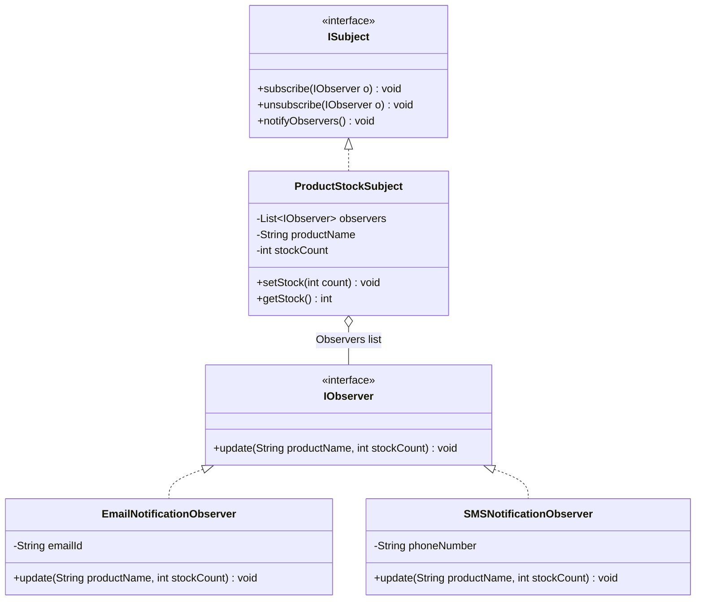

# 12. Observer Design Pattern

> 💡 **Quick Revision Anchor**: 
> - **Type**: Behavioral Design Pattern (Publish-Subscribe foundation).
> - **Core Intent**: Defines a **one-to-many** dependency between objects so that when the subject changes state, all registered observers are automatically notified and updated.
> - **Key Models**: **Push Model** (Subject broadcasts data payload) vs. **Pull Model** (Subject notifies; Observer fetches specific state).

---

## 1. Context & Problem Statement

Imagine you are building an **E-Commerce Product Inventory Alert** (e.g., Amazon "Notify Me When in Stock" for iPhone 16):
- 50,000 users want an alert the instant the product is restocked.
- **Polling Anti-Pattern**: If each user's client app polls `GET /product/stock` every 5 seconds, millions of wasted HTTP requests hit your servers, degrading database performance while users still suffer latency between poll intervals.
- **Observer Solution**: Invert the communication. Clients **subscribe** once. The inventory system (**Subject / Observable**) automatically pushes an event to all registered **Observers** only when stock becomes greater than 0.

```mermaid
flowchart TD
    Subject["Subject / Observable<br/>(ProductStockChannel)"]
    
    Sub1["EmailObserver<br/>(User 1)"]
    Sub2["SMSObserver<br/>(User 2)"]
    Sub3["PushNotificationObserver<br/>(User 3)"]

    Subject -->|1. notifyObservers()| Sub1
    Subject -->|2. notifyObservers()| Sub2
    Subject -->|3. notifyObservers()| Sub3
```

---

## 2. Observer Architecture & Actors



### Key Participants:
1. **Subject / Observable**: Maintains a collection of observers and provides methods to attach, detach, and broadcast state changes.
2. **Observer Interface**: Defines the contract callback method (e.g. `update()`) invoked when the subject changes state.
3. **Concrete Observers**: React to notifications by executing domain logic (sending an email, dispatching an SMS, updating a UI dashboard).

---

## 3. Push vs. Pull Communication Models

| Aspect | Push Model | Pull Model |
| :--- | :--- | :--- |
| **How it works** | Subject sends the complete data payload directly as method arguments: `update(data1, data2)` | Subject calls `update()`; Observer queries the subject via getters: `subject.getStock()` |
| **Coupling** | Low coupling to subject interface, but subject assumes what data observers need. | Observer holds a reference to the Subject, but fetches only relevant fields. |
| **Flexibility** | Rigid: Adding new state fields requires changing the observer interface signature. | Highly flexible: Observer queries new getters without breaking interface signatures. |

---

## 4. Production Java Implementation

```java
import java.util.ArrayList;
import java.util.List;

// 1. Observer Interface (Push Model)
public interface StockObserver {
    void onStockUpdate(String productName, int newStockCount);
}

// 2. Observable Subject Interface
public interface StockObservable {
    void addObserver(StockObserver observer);
    void removeObserver(StockObserver observer);
    void notifyObservers();
    void setStockCount(int newStock);
}

// 3. Concrete Observable (Thread-safe list iteration)
public class ProductStockSubject implements StockObservable {
    private final List<StockObserver> observers = new ArrayList<>();
    private final String productName;
    private int currentStock = 0;

    public ProductStockSubject(String productName) {
        this.productName = productName;
    }

    @Override
    public synchronized void addObserver(StockObserver observer) {
        if (observer != null && !observers.contains(observer)) {
            observers.add(observer);
        }
    }

    @Override
    public synchronized void removeObserver(StockObserver observer) {
        observers.remove(observer);
    }

    @Override
    public void notifyObservers() {
        // Create defensive copy to avoid ConcurrentModificationException
        List<StockObserver> snapshot;
        synchronized (this) {
            snapshot = new ArrayList<>(this.observers);
        }
        for (StockObserver observer : snapshot) {
            observer.onStockUpdate(productName, currentStock);
        }
    }

    @Override
    public void setStockCount(int newStock) {
        int previousStock = this.currentStock;
        this.currentStock = newStock;
        // Trigger notification only on transition from 0 to > 0
        if (previousStock == 0 && newStock > 0) {
            System.out.println("📢 [ProductStockSubject] " + productName + " back in stock! Stock: " + newStock);
            notifyObservers();
        }
    }
}

// 4. Concrete Observer 1: Email Alert
public class EmailNotificationObserver implements StockObserver {
    private final String userEmail;

    public EmailNotificationObserver(String email) {
        this.userEmail = email;
    }

    @Override
    public void onStockUpdate(String productName, int newStockCount) {
        System.out.println("📧 [Email to " + userEmail + "] Hurry! " + productName + " is now in stock (" + newStockCount + " items remaining).");
    }
}

// Concrete Observer 2: SMS Alert
public class SMSNotificationObserver implements StockObserver {
    private final String phone;

    public SMSNotificationObserver(String phone) {
        this.phone = phone;
    }

    @Override
    public void onStockUpdate(String productName, int newStockCount) {
        System.out.println("📱 [SMS to " + phone + "] Product restocked: " + productName + ". Buy now!");
    }
}
```

### Driver / Client Demonstration:
```java
public class ObserverDemo {
    public static void main(String[] args) {
        StockObservable iphoneSubject = new ProductStockSubject("iPhone 16 Pro");

        StockObserver emailUser = new EmailNotificationObserver("alex@example.com");
        StockObserver smsUser = new SMSNotificationObserver("+1-555-0199");

        // Users subscribe to stock alerts
        iphoneSubject.addObserver(emailUser);
        iphoneSubject.addObserver(smsUser);

        // Product is restocked
        iphoneSubject.setStockCount(15);

        // One user unsubscribes
        iphoneSubject.removeObserver(smsUser);

        // Another restock occurs: only emailUser receives the notification!
        iphoneSubject.setStockCount(0);
        iphoneSubject.setStockCount(50);
    }
}
```

---

## 5. Critical Interview Trap: The Lapsed Listener Problem (Memory Leaks)

In Java, if an observer object registers with a long-lived subject (like a Spring singleton bean) but forgets to call `removeObserver()`, the subject holds a **strong reference** to the observer.
- Even if the observer is no longer used by the rest of the application, the **JVM Garbage Collector cannot collect it**, resulting in a silent memory leak!
- **Solution**: Use explicit lifecycle cleanup methods, or store observers inside a `WeakHashMap` or list of `WeakReference<Observer>` so the GC can reclaim orphaned listeners.
